## 第一章 用Three.js创建你的第一个三维场景

现在浏览器的功能集合里又有了一个新成员，即支持WebGL。通过WebGL，你可以直接使用显卡的计算资源，创建高性能的二维和三维计算及图形，然后再JS里直接使用WebGL编程，创建三维场景并生成动画。

但这个过程非常复杂，而且容易出错。Three.js库可以简化这个过程。Three.js可以帮助我们的地方如下：
- 创建简单的和复杂的三维图形
- 在三维场景中国生成动画、移动物体
- 在物体上应用纹理和材质
- 从三维建模软件中加载图形
- 创建基于样条曲线的二维图形

<p align="center">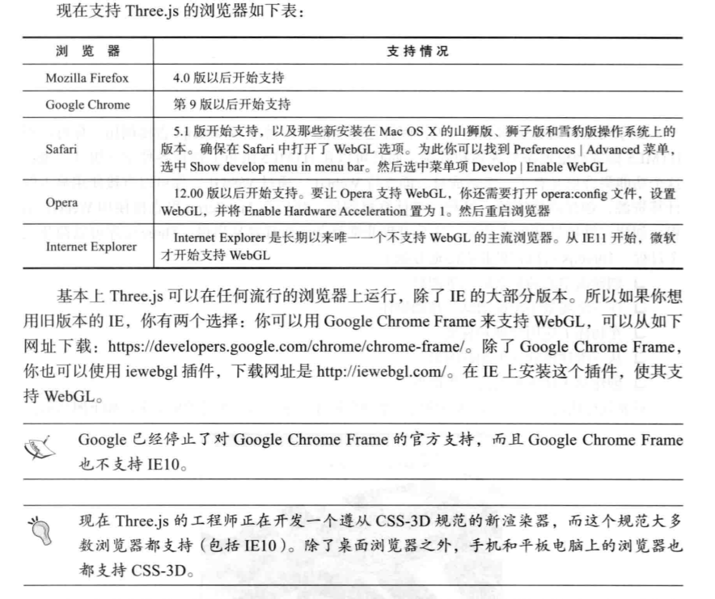</p>

在第一章中我们会直接开始探究Three.js，通过创建几个例子来展示Three.js是如何工作。但我们并不会深入探究所有的技术细节，这些细节我们将会在后面的章节中讲解。本章会探讨下面几方面的内容：

### 1.1 使用Three.js的前提条件
### 1.2 获取[源代码](https://github.com/josdirksen/learning-threejs)

获取源代码的两个途径：
- 用git克隆代码仓库
- 下载代码压缩包，然后解压

建立本地的web服务器：
- 用python——适合大多数UNIX/Mac系统
- 用npm——如果你已经安装了Node.js
- 用Mongoose——在Mac/Windows上可以移植

```js
// 建立本地的web服务器的方式
// 方式1
> python -m SimpleHTTPServer
Serving HTTP on 0.0.0.0 port 8000...

// 方式2
npm install -g http-server
> http-server
Starting up http-server, serving ./ on port: 8080
Hit CTRL-C to stop the server

// 或者simple HTTP Server，但是这个有个缺点，它不能自动地列出文件夹里的东西
> npm install -g simple-http-server
> nserver
simple-http-server Now Serving: /Users/jos/git/Physijs at http://localhost:8000/

// 方式3
```

### 1.3 创建HTML页面框架
### 1.4 渲染并展示三维对象
<blockquote>
若你看过Three.js的源代码和文档，你会发现除了基于WebGL的渲染器外，还有一些其他的渲染器。有基于Canvas的渲染器，甚至还有基于SVG的渲染器。尽管它们可以工作，也能渲染简单地场景，但我并不推荐，因为它们十分耗费CPU资源，也缺乏某些功能，例如支持复杂材质和阴影。
</blockquote>

### 1.5 添加材质、灯光和阴影
### 1.6 用动画扩展你的首个场景
在HTML5和相应的JS API（应用开发接口）出来之前，我们是使用setInterval(function, interval)方法，使得场景可以以一定的时间间隔进行渲染。这个方法的问题是它并不考虑浏览器中发生的事。如果你正在浏览其他页面，这个函数仍然会每隔几毫秒就会被调一次。除此之外，setInerval()方法并没有跟显示器的重画同步。这可能会导致较高的CPU使用率，降低系统效率。

幸运的是，现在的浏览器已经有了解决setInerval()函数问题的方法，即requestAnimationFrame()函数。通过requestAnimationFrame()你可以指定一个函数，按照浏览器定义的时间间隔调用。你可以在这个指定的函数里执行所有必要的绘画操作，而浏览器则会尽可能保证绘画过程平滑、高效。

### 1.7 使用dat.GUI库简化试验
Google的几个人创建了一个名为dat.GUI的库，在它的帮助下，你很容易就可以创建出一个简单的界面组件，用以修改代码中的变量。

### 1.8 使用ASCII效果 
### 1.9 总结

本章中应当记住的内容如下所示：
- 你可以从网上找到本章和其他章实例的源代码。最好的学习方法就是摆弄一下这些示例，做些试验。
- 在Three.js项目里，你创建了一个场景，添加了一些需要渲染的物体（带有材质的图形）。
- 你所用的材质定义了物体的样子。每种材质对光源的反应都不一样。
- 渲染阴影的开销非常大，并且需要在渲染器、每一个物体，以及每一个光源上打开。
- 通过修改场景中物体的position属性和rotation属性，你就可以很容易地做出动画。
- 使用两个辅助库（dat.GUI、stats）和几行js代码，可以很容易地添加统计控件和定制控件。

 
## 第二章 使用构建Three.js场景的基本组件
本章我们将稍微深入以下Three.js库，讲解一些构成Three.js场景的基础组件。通过本章你将探索以下主题：
- Three.js场景中使用某些组件
- 你能用THREE.Scene()对象做什么
- 几何图形和网络是如何关联的
- 正投影相机和透视相机的区别

### 2.1 创建场景
一个场景要想显示任何东西需要三种类型的组件：
|  组件   | 描述  |
|  ----  | ----  |
| 相机 | 决定哪些东西将要在屏幕上渲染 |
| 光源 | 它们会对材质如何显示，以及生成阴影时材质如何使用（细节部分在第3章讨论）产生影响  |
| 物体 | 它们是在相机透视图例主要的渲染对象：方块、球体等 |

THREE.Scene()对象就像是所有这些对象的容器。这个对象本身并没有太多可选项和函数。

有关场景我们要记住的最重要的是：它基本上是渲染过程中你想用的所有物体、光源和相机的容器。下表是场景对象中最重要的函数和属性：

|  函数/属性   | 描述  |
|  ----  | ----  |
|  add(object)  | 在场景中添加对象  |
|  children  | 返回一个场景中所有对象的列表，包括相机和光源  |
|  getChildByName(name)  | 创建对象时，可以通过name属性为它指定一个独一无二的名字。场景对象提供了一个方法，你可以使用该方法根据名字直接返回这个对象  |
|  remove(object)  | 如果你在场景中引用了一个对象，那么你也可以用这个函数从场景中删除它  |
|  traverse(function)  | children属性返回场景中所有子对象的列表。通过traverse()函数，我们同样可以传入一个回调函数访问这些子对象  |
|  fog  | 通过该属性可以设置场景的雾化效果。它可以渲染出一层雾气，隐藏远处的物体  |
|  overrideMaterial  | 通过这个属性，你可以强制场景的所有物体都使用相同的材质  |


#### 2.1.1 场景的基本功能

场景渲染的时候THREE.Camera对象会自动添加进来，但是如果你喜欢，也可以手工添加。见[示例](https://xsometimes.github.io/learning-threejs/chapter-01/01-basic-skeleton.html)


场景启动的时候场景中就已经有4个物体了，就是基本的地面、环境光、点光源和相机。

在下面的代码片段里，我们将会逐一介绍控件区里的每个功能。

```js
// 这段代码实现的是：当你点击addCube按钮时，一个新的THREE.CubeGeometry实例就会创建出来
this.addCube = function () {
  var cubeSize = Math.ceil((Math.random() * 3)); // 方块尺寸是0-3之间的一个随机数
  var cubeGeometry = new THREE.CubeGeometry(cubeSize, cubeSize, cubeSize);
  var cubeMaterial = new THREE.MeshLamberMaterial({
    color: Math.random() * 0xffffff // 方块颜色随机
  })
  var cube = new THREE.Mesh(cubeGeometry, cubeMaterial);
  cube.castShadow = true;
  cube.name = 'cube-' + scene.children.length; // 指定方块的名字是在cube-后面加上当前场景中对象的数量（即，显示的scene.children.length属性。名字在调试的时候很有用，也可以直接用来在场景中查找对象Scene.getChildByName）
  cube.position.x = -30 + Math.round(Math.random() * planeGeometry.width); // 方块位置随机
  cube.position.y = Math.round(Math.random() * 5);
  cube.position.z = -20 + Math.round((Math.random() * planeGeometry.height));
  scene.add(cube);
  this.numberOfObjects = scene.children.length; // 用于dat.GUI显示场景中国的对象数量
}
```

```js
// 这段代码实现的是：点击removeCube按钮就可以把最后添加的方块从场景中移除
this.removeCube = function () {
  var allChildren = scene.children;
  var lastObject = allChildren[allChildren.length - 1];
  if (lastObject instanceof THREE.Mesh) { // 检查一下这个对象是不是Mesh对象，以防移除相机和光源
    scene.remove(lastObject);
    this.numberOfObjects = scene.children.length;
  }
}
```

```js
function render () {
  stats.update();
  scene.traverse(functionr(e) { // 将一个函数作为参数传递给traverser()函数，这个传进来的参数函数将会在场景的每个子对象上调用一次 <=> 也可以使用for循环遍历children这个属性数组来达到同样的目的。
    if (e instanceof THREE.Mesh && e!= plane) { // 忽略表示地面的plane对象
      e.rotation.x += controls.rotationSpeed; // 更新每个方块的旋转弧度
      e.rotation.y += controls.rotationSpeed;
      e.rotation.z += controls.rotationSpeed;
    }
  });
  requestAnimationFrame(render);
  renderer.render(scene, camera);
}
```

#### 2.1.2 在场景中添加雾化效果

通过fog属性可以为整个场景添加一种雾化效果。一个物体离得越远，就越模糊。见[示例](https://xsometimes.github.io/learning-threejs/chapter-02/02-foggy-scene.html)


在Three.js库里打开雾化效果很简单，只需在定义完场景后加上一行代码：

```js
scene.fog = new THREE.Fog(0xffffff, 0.015, 100); // 这里定义了一白色的雾化效果（0xffffff）。0.015是近处near属性的值，100设置的是远处far属性的值，这两个属性可以决定雾从什么地方开始，以及浓度加深的程度。
// near=0.015可以理解为近处白色的雾极少，看得清；far=100远处白色的雾很多
```

还有另外一个方法可以设置场景中雾的浓度，

```js
scene.fog = new THREE.FogExp2(0xffffff, 0.015); // 这次我们不指定near属性和far属性，只给出颜色和浓度
```

#### 2.1.3 使用材质覆盖属性
场景的overrideMaterial属性，是用来设置所有物体的材质。

```js
// 当使用这个属性，所有添加到场景中的物体都会使用同样的材质，都是用同样的材质和颜色渲染的。
scene.overrideMaterial = new THREE.MeshLambertMaterial({ color: 0xffffff });
```

使用MeshLambertMaterial对象作为材质，可以创建一些不发光的物体，而且这些物体可以对你添加到场景中的光源做出反应。[示例](https://xsometimes.github.io/learning-threejs/chapter-02/03-forced-materials.html)

### 2.2 使用几何和网络对象
迄今为止，在前面的每个示例你都可以看到我们使用了几何对象和网格对象。如，要在场景中添加一个球体，我们是这么做的：
```js
// 我们定义了该对象的形状、几何结构、外观、材质，并把所有这些跟一个可以添加到场景中的网格对象结合在一起。
var shareGeometry = new THREE.SphereGeometry(4, 20, 20);
var shareMaterial = new THREE.MeshBasicMaterial({ color: 0x7777ff });
var sphere = new THREE.Mesh(shareGeometry, shareMaterial);
```

#### 2.2.1 几何对象的属性和函数

什么是geometry变量？

Three.js库中geometry，基本是三维空间中的点集，以及一些将这些点连接起来的面。举例来说，一个方块：
- 一个方块有8个角。每个角都可以定义为x、y和z坐标的一个组合。所以每个方块都是三维空间中的8个点。在Three.js库中，这些点称为顶点（vertice）。
- 一个方块有6个侧面，每个角有一个顶点。在Three.js库里，每个侧面称为面（face）.

当你使用Three.js库提供的几何体时，不必定义所有的顶点和面。对于一个方块来讲，只要定义长宽高即可。Three.js库会利用这些信息，在正确的位置创建一个拥有8个顶点的几何体，并用正确的面连接起来，自动生成。除此之外，你仍然可以通过定义顶点和面，手动创建几何体。创建方法可以参考下面的代码片段：
```js
/**
 * 这段代码展示的是如何创建一个简单的方块。
 */
var vertices = [ // 构成方块的顶点
  new THREE.Vector3(1, 3, 1),
  new THREE.Vector3(1, 3, -1),
  new THREE.Vector3(1, -1, 1),
  new THREE.Vector3(1, -1, -1),
  new THREE.Vector3(-1, 3, -1),
  new THREE.Vector3(-1, 3, 1),
  new THREE.Vector3(-1, -1, -1),
  new THREE.Vector3(-1, -1, 1)
];
// 把上述顶点连接起来，创建三角面片，并保存在faces数组里
var faces = [ 
  new THREE.Face3(0, 2, 1), // 就是用vertices数组里的点0、2和1创建的一个三角面片
  new THREE.Face3(2, 3, 1),
  new THREE.Face3(4, 6, 5),
  new THREE.Face3(6, 7, 5),

  new THREE.Face3(4, 5, 1),
  new THREE.Face3(5, 0, 1),
  new THREE.Face3(7, 6, 2),
  new THREE.Face3(6, 3, 2),

  new THREE.Face3(5, 7, 0),
  new THREE.Face3(7, 2, 0),
  new THREE.Face3(1, 3, 4),
  new THREE.Face3(3, 6, 4)
]

var geom = new THREE.Geometry();
geom.vertices = vertices;
geom.faces = faces;
geom.computeCentroids();
geom.mergeVertices();
```

<blockquote>
在这个示例中，我们用THREE.Face3元素来定义方块的6个侧面，也就是说一个面由两个三角面片构成。在Three.js库以前的版本里，你也可以用四边形而不是三角形。定义一个侧面时四边形使用4个顶点而不是3个。在三维建模领域里，到底是使用四边形好还是三角形好存在比较大的争论。基本上，在建模的时候使用四边形是大家经常采用的方式，因为它比三角形更容易增强和平滑。但是对于渲染和游戏引擎来讲，使用三角形更容易，因为任意一个形状都可以渲染成多个三角形。
</blockquote>

<p align="center">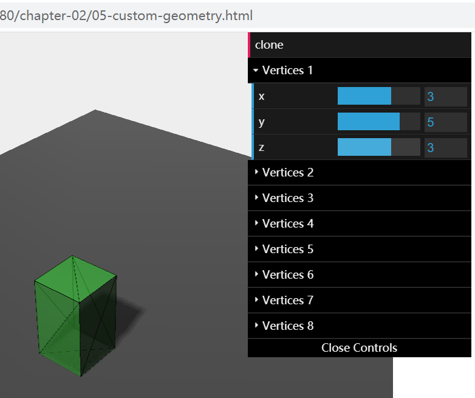</p>

```js
// once everything is loaded, we run our Three.js stuff.
function init() {

    // create a scene, that will hold all our elements such as objects, cameras and lights.
    var scene = new THREE.Scene();

    // create a camera, which defines where we're looking at.
    var camera = new THREE.PerspectiveCamera(45, window.innerWidth / window.innerHeight, 0.1, 1000);

    // create a render and set the size
    var renderer = new THREE.WebGLRenderer();

    renderer.setClearColor(new THREE.Color(0xEEEEEE, 1.0));
    renderer.setSize(window.innerWidth, window.innerHeight);
    renderer.shadowMapEnabled = true;

    // create the ground plane
    var planeGeometry = new THREE.PlaneGeometry(60, 40, 1, 1);
    var planeMaterial = new THREE.MeshLambertMaterial({color: 0xffffff});
    var plane = new THREE.Mesh(planeGeometry, planeMaterial);
    plane.receiveShadow = true;

    // rotate and position the plane
    plane.rotation.x = -0.5 * Math.PI;
    plane.position.x = 0;
    plane.position.y = 0;
    plane.position.z = 0;

    // add the plane to the scene
    scene.add(plane);

    // position and point the camera to the center of the scene
    camera.position.x = -20;
    camera.position.y = 25;
    camera.position.z = 20;
    camera.lookAt(new THREE.Vector3(5, 0, 0));

    // add spotlight for the shadows
    var spotLight = new THREE.SpotLight(0xffffff);
    spotLight.position.set(-40, 60, 10);
    spotLight.castShadow = true;
    scene.add(spotLight);

    // add the output of the renderer to the html element
    document.getElementById("WebGL-output").appendChild(renderer.domElement);

    var vertices = [
        new THREE.Vector3(1, 3, 1),
        new THREE.Vector3(1, 3, -1),
        new THREE.Vector3(1, -1, 1),
        new THREE.Vector3(1, -1, -1),
        new THREE.Vector3(-1, 3, -1),
        new THREE.Vector3(-1, 3, 1),
        new THREE.Vector3(-1, -1, -1),
        new THREE.Vector3(-1, -1, 1)
    ];

    var faces = [
        new THREE.Face3(0, 2, 1),
        new THREE.Face3(2, 3, 1),
        new THREE.Face3(4, 6, 5),
        new THREE.Face3(6, 7, 5),
        new THREE.Face3(4, 5, 1),
        new THREE.Face3(5, 0, 1),
        new THREE.Face3(7, 6, 2),
        new THREE.Face3(6, 3, 2),
        new THREE.Face3(5, 7, 0),
        new THREE.Face3(7, 2, 0),
        new THREE.Face3(1, 3, 4),
        new THREE.Face3(3, 6, 4),
    ];

    var geom = new THREE.Geometry();
    geom.vertices = vertices;
    geom.faces = faces;
    geom.computeFaceNormals();

    var materials = [
        new THREE.MeshLambertMaterial({opacity: 0.6, color: 0x44ff44, transparent: true}),
        new THREE.MeshBasicMaterial({color: 0x000000, wireframe: true})
    ];

    var mesh = THREE.SceneUtils.createMultiMaterialObject(geom, materials);
    mesh.children.forEach(function (e) {
        e.castShadow = true
    });

    scene.add(mesh);

    function addControl(x, y, z) {
        var controls = new function () {
            this.x = x;
            this.y = y;
            this.z = z;
        };

        return controls;
    }

    var controlPoints = [];
    controlPoints.push(addControl(3, 5, 3));
    controlPoints.push(addControl(3, 5, 0));
    controlPoints.push(addControl(3, 0, 3));
    controlPoints.push(addControl(3, 0, 0));
    controlPoints.push(addControl(0, 5, 0));
    controlPoints.push(addControl(0, 5, 3));
    controlPoints.push(addControl(0, 0, 0));
    controlPoints.push(addControl(0, 0, 3));

    var gui = new dat.GUI();
    gui.add(new function () {
      /**
       * clone()函数：克隆、复制出一个geometry对象的副本。赋予不同的材质后，我们就可以用这个副本创建出一个不同的网络对象
      */
        this.clone = function () {

            var clonedGeometry = mesh.children[0].geometry.clone();
            var materials = [
                new THREE.MeshLambertMaterial({opacity: 0.6, color: 0xff44ff, transparent: true}),
                new THREE.MeshBasicMaterial({color: 0x000000, wireframe: true})

            ];
            // 此处使用的不是一个单一的材质，而是有两个元素的材质数组。
            // 原因：除了显示一个绿色透明的方块之外，我还想显示一个线框
            // 因为使用线框的话，更容易找出顶点和面的位置。
            var mesh2 = THREE.SceneUtils.createMultiMaterialObject(clonedGeometry, materials);
            mesh2.children.forEach(function (e) {
                e.castShadow = true
            });

            mesh2.translateX(5);
            mesh2.translateZ(5);
            mesh2.name = "clone";
            scene.remove(scene.getChildByName("clone"));
            scene.add(mesh2);

        }
    }, 'clone');

    for (var i = 0; i < 8; i++) {
        f1 = gui.addFolder('Vertices ' + (i + 1));
        f1.add(controlPoints[i], 'x', -10, 10);
        f1.add(controlPoints[i], 'y', -10, 10);
        f1.add(controlPoints[i], 'z', -10, 10);
    }

    render();

    function render() {

        var vertices = [];
        for (var i = 0; i < 8; i++) {
            vertices.push(new THREE.Vector3(controlPoints[i].x, controlPoints[i].y, controlPoints[i].z));
        }

        mesh.children.forEach(function (e) {
            e.geometry.vertices = vertices; // 将界面上这个mesh的vertices属性指向一个更新后的顶点数组，无需重新配置侧面，因为它们跟以前一样连接到那些点
            e.geometry.verticesNeedUpdate = true; // 设置好更新的顶点之后，告诉geometry对象，这些顶点需要更新
            e.geometry.computeFaceNormals(); // 重新计算侧面，从而完成整个模型的更新
        });

        // render using requestAnimationFrame
        requestAnimationFrame(render);
        renderer.render(scene, camera);
    }
}
window.onload = init
```

#### 2.2.2 网络对象的函数和属性
我们已经知道，创建一个网格需要一个几何体，以及一个或多个材质。网格创建好之后，我们就可以把它添加到场景中，它就可以被渲染了。你可以利用网格的几个属性来改变它在场景中的位置，及其显示效果。

|  函数/属性   | 描述  |
|  ----  | ----  |
|  position（位置）  | 决定该对象相对其父对象的位置。多数情况下，一个对象的父对象是THREE.Scene()对象  |
|  rotation（旋转）  | 通过这个属性你可以设置对象绕任何一个轴的旋转弧度  |
|  scale（比例）  | 通过这个属性你可以沿着x、y和z轴缩放对象  |
|  translateX（amount）x轴平移  | 沿x轴将对象平移指定的距离  |
|  translateY（amount）Y轴平移  | 沿y轴将对象平移指定的距离  |
|  translateZ（amount）z轴平移  | 沿z轴将对象平移指定的距离  |

1. position
```js
// 我们可以用三种方式来设置对象的位置
// 第一种方式：
cube.position.x = 10;
cube.position.y = 3;
cube.position.z = 1;

// 第二种方式：
cube.position.set(10, , 1);

// 第三种方式：position属性是一个THREE.Vector3对象
cube.position = new THREE.Vector3(10, 3, 1)
```

另外，**设置对象的位置是相对于其父对象的位置设置的。**THREE.SceneUtils.createMultiMaterialObject函数创建了一个多材质对象，返回一个网络对象组，其中每个网络的几何体都是一样的，但材质不一样。上个例子中，它包含两个网络。若我们改变其中一个网络的位置，你会清楚地看到两个独立的对象；若我们移动这个对象组，那么他们的偏移量就是一样的。我们将在第8章中深入讨论这种父子关系，以及对象组是如何硬性变换（例如缩放、旋转和平移的）

2. rotation 设置对象绕轴旋转的弧度
```js
cube.rotation.x = 0.5 * Math.PI;
cube.rotation.set(0.5 * Math.PI);
cube.rotation = new THREE.Vector3(0.5 * Math.PI, 0, 0);
```

3. scale 缩放，沿着指定轴缩放对象

4. translate函数：定义**相对当前位置对象移动的量**
假设你已经在场景中添加了一个球体，位置是(1,2,3)。下一步我们想让这个对象沿着x轴平移translateX(4)，它的位置就是(5,2,3)。如果我们想让这个对象恢复到它原来的位置，可以用translateX(-4)。

### 2.3 选择合适的相机
Three.js库里有两种不同的相机：正投影相机和透视相机（我们将在第3章仔细看一下如何使用这些相机）。

#### 2.3.1 正投影相机和透视相机

1. 透视视图，也是最自然的视图。距离相机越远的方块，被渲染得越小。[示例](https://xsometimes.github.io/learning-threejs/chapter-02/07-both-cameras.html)

THREE.PersepectiveCamera将接受这些参数：
|  参数   | 描述  |
|  ----  | ----  |
|  fov（现场）  | fov表示现场（field of view）。这是从相机位置能够看到的部分场景。例如，人类有差不多180度的现场，而一些鸟类差不多会有一个完整的360度。<br />但是由于普通的计算机显示器不能完全显示我们看到的景象，所以一般会选择一块儿较小的区域。对于游戏来讲，大多数情况下会用60度到90度左右的现场。<br />推荐默认值：45
|  aspect（长宽比） | 这是渲染结果输出区的横向长度和纵向长度。在我们的例子中，由于我们会使用整个窗口作为输出界面，所以会使用这个窗口的长宽比。这个长宽比决定了水平市场和垂直市场之间的比例关系。<br />推荐默认值：window.innerWidth/window.innerHeight  |
|  near（近面）  | near属性定义的是Three.js库从距离相机多近的地方开始渲染场景。通常情况下我们会为这个属性设一个很小的值，从而可以渲染从相机位置可以看到的所有物体。<br />推荐默认值：0.1  |
|  far（远面）  | far属性定义的是相机可以从它所处的位置看所远。如果我们将这个值设得太低，那么场景中的一部分可能不会被渲染；如果设得太高，在某些情况下会影响渲染的效率。<br />默认值：1000  |

下图很好地展示了这些属性是如何结合在一起，从而决定你能看到什么。
<p align="center">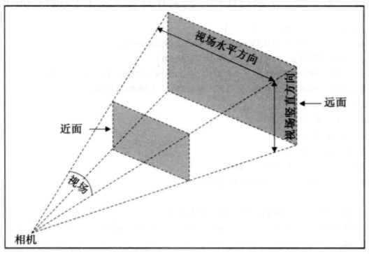</p>

2. 正投影相机，所有方块渲染出来的尺寸都一样；对象和相机之间的距离不会影响渲染结果。这个相机通常用在二维游戏中，例如《模拟城市4》和早期版本的《文明》，如下图：
<p align="center">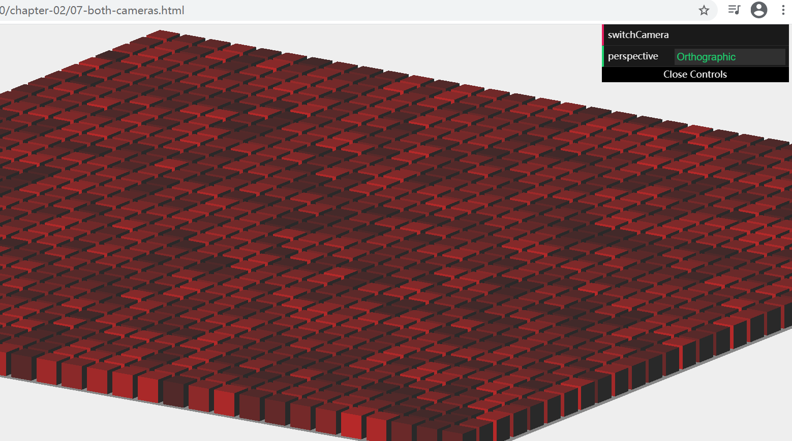</p>
<p align="center">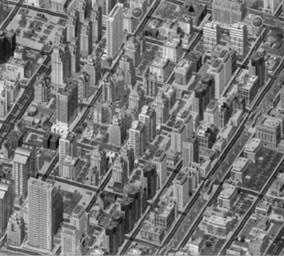</p>

```js
// 下面的代码片段会在你每次点击switchCamera按钮时调用
this.switchCamera = function () {
  if (carema instanceof THREE.PerspectiveCarema) {
    carema = new THREE.OrthographicCamera(window.innerWidth / -16, window.innerWidth / 16, window.innerHeight / 16, window.innerHeight / -16 -200, 500);
    camera.position.x = 2;
    camera.position.y = 1;
    camera.position.z = 3;
    camera.lookAt(scene.position);
    this.perspective = 'Orthographic';
  } else {
    camera = new THREE.PerspectiveCamera(45, window.innerWidth / window.innerHeight, 0.1, 1000);
    camera.position.x = 120;
    camera.position.y = 60;
    camera.position.z = 180;
    camera.lookAt(scene.position);
    this.perspective = 'Perspective';
  }
}
```
对于一个正投影相机来说，你需要定义一个需要渲染的方块。
|  参数   | 描述  |
|  ----  | ----  |
|  left（左边界）  | 在Three.js文档里该属性是可视范围的左平面。你可以将它当做可渲染部分的左侧边界。如果我们把这个值设为-100，那么你就不会看到任何比这个左侧边界更远的对象 |
|  right（右边界）  | 跟left属性一样，不过这次是界面的另外一侧。比这个右侧边界更远的对象不会被渲染  |
|  top（上边界）  | 可渲染空间的最上面  |
|  bottom（下边界）  | 可渲染空间的最下面  |
|  near（近面）  | 基于相机所在的位置，从这一点开始渲染场景  |
|  far（远面）  | 基于相机所在的位置，一直渲染到场景中的这一点  |
<p align="center">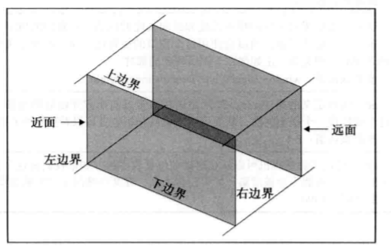</p>

#### 2.3.2 让相机在指定点上聚焦
一般来讲，相机会指向场景的中心，用坐标来表示就是position(0,0,0)。但是我们也可以轻松改变相机所看的位置。
```js
camera.lookAt(new THREE.Vector3(x, y, z))
```

### 2.4 总结
本章我们讨论了很多东西。而这应该会让你对什么是场景，以及场景中最重要的组成部分有所了解。
- 场景是Three.js库中的主要容器。你可以将你想要的对象添加到场景中。
- 场景并没有很多特殊的选项和属性。它最重要的功能是允许你添加对象、移除对象，以及处理场景的children属性。
- 你可以通过配置Fog对象为场景添加fog属性。
- 几何体和网络关系紧密。几何体定义对象的外观，赋予材质后你可以用它来创建网格。Three.js库可以渲染网络
- Three.js库提供了很多标准几何体。但是你也可以自己创建一些。但是如果不使用算法的话，这需要完成很多工作。
- 你也可以编程控制mesh的position、rotation和scale属性。
- 通过translate属性，你可以相对当前位置移动网络。
- 渲染场景需要一个相机。在Three.js里有两种相机：透视相机和正投影相机。
- 正投影相机以相同的尺寸渲染所有对象，而且不考虑对象与相机之间的距离，使用正投影相机可以达到类似《模拟城市》的效果。

## 第三章 使用Three.js里的各种光源
如果没有光源，我们就不可能看到任何渲染结果。由于Three.js库提供了很多种光源，每一种都有特殊的用途，因此我们将会用整整一章来讲解各种光源的细节，并为下一章使用材质做好准备。在本章中，你将会学到下列主题：
- Three.js库里有哪些可用的光源
- 什么时候用什么样的光源
- 如何调整和配置各种光源的行为
- 如何创建镜头炫光

### 3.1 探索Three.js库提供的光源
|  光源名称   | 描述  |
|  ----  | ----  |
|  AmbientLight（环境光）  | 这是一种基础光源，它的颜色会添加到整个场景和所有对象的当前颜色上  |
|  PointLight（点光源）  | 空间中的一点，朝所有的方向发射光线  |
|  SpotLight（聚光灯光源）  | 这种光源有聚光的效果，类似台灯、天花板上的吊灯，或者手电筒  |
|  DirectionalLight（方向灯）  | 也称作是无线光。从这种光源发出的光线可以看做是平行的。例如，太阳光  |
|  HemisphereLight（半球光）  | 这是一种特殊光源，可以用来创建更加自然的室外光线，抹蜜反面光和光线微弱的天空  |
|  AreaLight（面光源）  | 使用这种光源可以指定散发光线的平面，而不是空间中的一个点  |
|  LensFlare（镜头炫光）  | 这不是一种光源，但是通过LensFlare可以为场景中的光源添加炫光效果  |

基础光源：AmbientLight（环境光）、PointLight（点光源）、SpotLight（聚光灯光源）和DirectionalLight（方向灯），这些光源比较简单，只需要很少的设置。

几个用于特殊目的地光源和效果：HemisphereLight（半球光）、AreaLight（面光源）和LensFlare（镜头炫光）。

讲述光源之前，我们先来快速看一下THREE.Color()对象的使用方法。当构造Three.js库中的对象时，可以（通常情况下）用十六进制字符串（#0c0c0c）或者十六进制数值指定颜色。然而，在对象构造好之后如果要更改颜色，你就不得不构建一个新的THREE.Color()对象，或者修改当前THREE.Color()对象的内部属性。

<p align="center">
  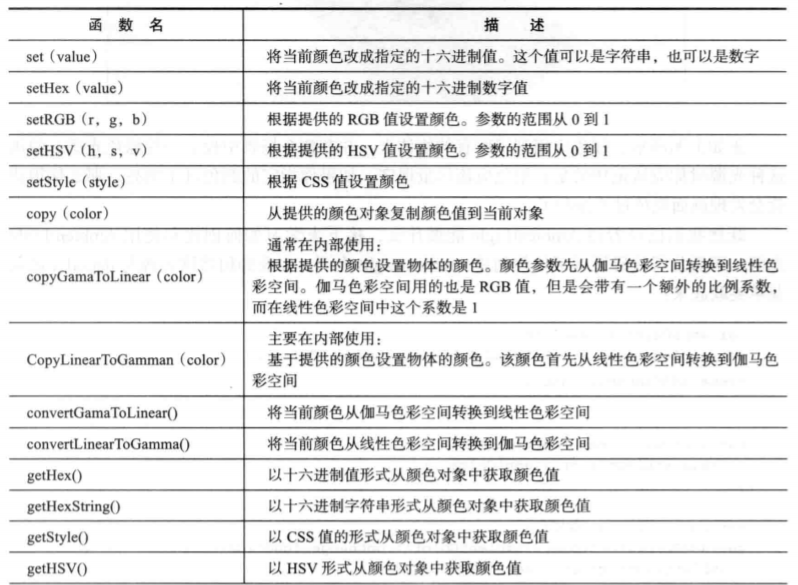
  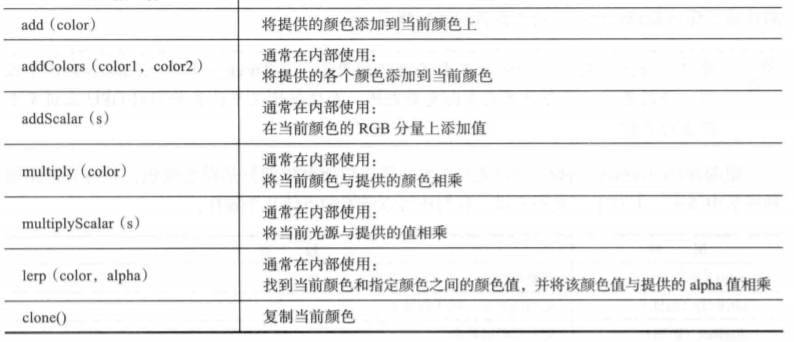
</p>


### 3.2 学习基础光源
#### 3.2.1 AmbientLLight——影响整个场景的光源
AmbientLight光源的颜色会影响整个场景。AmbientLight的光线没有特定的光源，而且这个光源也不会影响阴影的生成。你不能将AmbientLight作为场景中的唯一光源。在使用其他光源（例如SpotLight和DirectionalLight）的同时使用AmbientLight，目的是弱化阴影或添加一些颜色。

使用这种光源时你应该记住的是：用色应该尽量保守。如果你指定的颜色过于明亮，那么你很快就会发现画面颜色过于饱和了。

```js
var ambiColor = '#0c0c0c';
var ambientLight = new THREE.AmbientLight(ambiColor)
scene.add(ambientLight);
// ...
var controls = new function () {
  this.ambientColor = ambiColor;
}
var gui = new dat.GUI();
gui.addColor(controls, 'ambientColor').onChange(function(e) {
  ambientLight.color = new THREE.Color(e);
})
```

创建AmbientLight光源非常简单。由于AmbientLight光源不需要指定位置，因此只需要使用new THREE.AmbientLight(ambiColor)指定颜色（十六进制）。然后将该光源添加到场景中即可。

#### 3.2.2 PointLight——照射所有方向的光源
Three.js库中的PointLight（点光源）是一种单点发光，照射所有方向的光源。夜空中的照明弹就是一个很好的点光源例子。
<p align="center">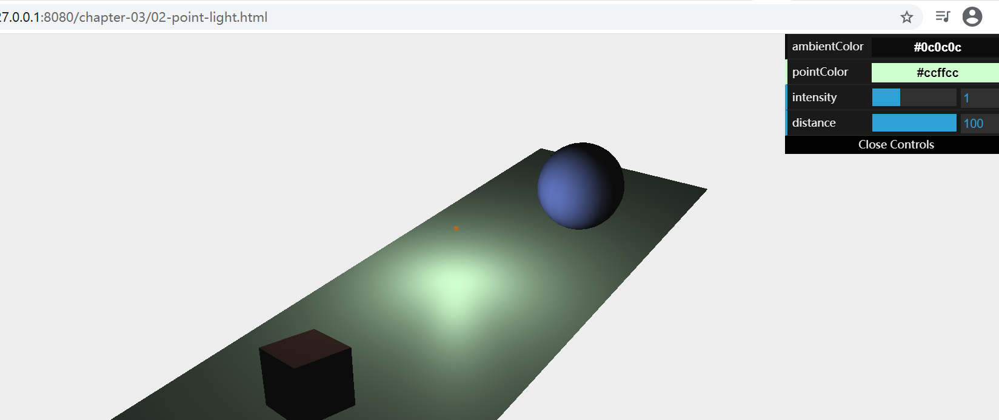</p>

<blockquote>
你可能会注意到在这个例子中看不到任何阴影。在Three.js库中点光源不会产生投影。原因是点光源会朝所有方向发射光线，在这种情况下计算阴影对GPU来讲是个沉重的负担。
</blockquote>

对于点光源来说，我们还可以设置如下的几个属性：
|  属性   | 描述  |
|  ----  | ----  |
|  color（颜色）  | 光源颜色  |
|  intensity（强度）  | 光照的强度。默认值是1  |
|  distance（距离）  | 光源照射的距离  |
|  position（位置）  | 光源所在的位置  |
|  visible（是否可见）  | 如果设为true（真），该光源就会打开；如果设为false（假），该光源就会关闭  |

```js
var pointColor = '#ccffcc';
var pointLight = new THREE.PointLight(pointColor);
pointLight.distance = 100; // 决定的是光线可以照射多远
pointLight.intensity = 2.4; // 设置光线的亮度，若设成0，那么你将什么都看不到；设成1，你得到的将是默认的亮度
scene.add(pointLight);
```

```js
// 可以参考如下代码，使用dat.CUI监听器
var controls = new function () {
  this.intensity = 1;
}
var gui = new dat.GUI();
gui.add(controls, 'intensity', 0, 3).onChange(function(e) {
  pointLight.intensity = e;
})
```

#### 3.2.3 SpotLight——具有锥形效果的光源
SpotLight（聚光灯光源）大概会是你最常用到的光源（特别是当你想要生成阴影时）。SpotLight光源有一种锥形效果。你可以对比一下手电筒或灯笼。我们刚看过的点光源的属性也可以应用到聚光灯光源。聚光灯光源也有几个额外的属性：
|  属性   | 描述  |
|  ----  | ----  |
|  castShadow（投影）  | 如果设为true，这个光源就会生成阴影  |
|  shadowCameraNear（投影近点）  | 从距离光源的哪一点开始可以生成阴影  |
|  shadowCameraFar（投影远点）  | 到距离光源的哪一点为止可以生成阴影  |
|  target（目标）  | 决定光照的方向  |
|  shadowBias（阴影偏移）  | 用来偏置阴影的位置  |
|  angle（角度）  | 光源射出的光柱有多宽。单位是弧度，默认值是Math.PI/3  |
|  exponent（光强衰减指数）  | 光照指向特定目标。在这个方向上距离光源越远，则光照强度递减得越快。这个值决定光照强度递减得有多快  |
|  onlyShadow（仅阴影）  | 如果设为true，那么这个光源只会生成阴影，而不会在场景中添加任何光照  |
|  shadowCameraVisible（投影方式可见）  | 如果设为true，你就可以看到光源在哪里以及如何生成阴影  |
|  shadowDarkness（阴影暗度）  | 默认值是0.5。定义渲染的阴影有多黑。场景渲染之后不能修改  |
|  shadowMapWidth（阴影映射宽度）  | 决定有多少像素用来生成阴影。如果阴影的边缘参差不齐或看上去不那么平滑，可以增加这个值。场景渲染后不能修改  |
|  shadowMapHeight（阴影映射高度）  | 决定有多少像素用来生成阴影。如果阴影的边缘岑岑不齐或看上去不那么平滑，可以增加这个值。场景渲染后不能修改。  |

创建聚光灯光源非常简单。跟点光源没什么大差别，唯一的差别是我们会将castShadow属性设为true（因为我们想要阴影），以及设置聚光灯光源的target属性。该属性决定光源照射的地方。

```js
var pointColor = '#ffffff';
var spotLight = new THREE.SpotLight(pointColor);
spotLight.position.set(-40, 60, -10);
spotLight.castShadow = true;
spotLight.target = plane;
scene.add(spotLight);
```

若不想让光源瞄准某个特定的对象，而是让它指向空间中任一一点该怎么办？要达到这个目的，可以创建一个空的THREE.Object3D()实例，如下：
```js
var target = new THREE.Object3D();
target.position = new THREE.Vector3(5, 0, 0);
spotlight.target = target;
```

本节前面的那张表列出了几个可以用来控制光线如何从光源发散出来的属性。distance属性和angle属性决定了光锥（cone）的形状。angle属性定义了光锥的宽度；distance属性定义的是光锥的长度。在Three.js的源代码中，是这么定义的：

<p align="center">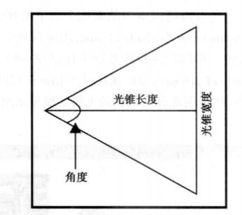</p>

```js
var coneLength = light.distance ? light.distance : 10000;
var coneWidth = coneLength * Math.tan(light.angle * 0.5) * 2
```

一般情况下不必设置这些值，因为它们的默认值都比较合适。但是也可以用这些属性来创建（例如）一个光柱很窄或光强递减很快的聚光灯光源。还剩最后一个可以用来改变聚光灯渲染方式的属性exponent。这个属性可以指定光强以多快的速度从中心开始衰减。

下面快速看下聚光灯光源提供的几个跟阴影相关的属性。要生成阴影可以将spotlight的castShadow属性设为true。Three.js库也允许你微调阴影渲染的方法。通过shadowCameraNear、shadowCameraFar和shadowCameraFov属性，可以控制光线如何投影、在哪里投影。其工作原理跟前一章讲的透视相机的工作原理一致。要看看这些是如何发生的，最简单的方法就是将shadowCameraVisable属性设为true；可以通过构造菜单上的debug（调试）复选框来设置。这样可以把用来计算阴影的光照区域显示出来，正如在下图看到的：
<p align="center">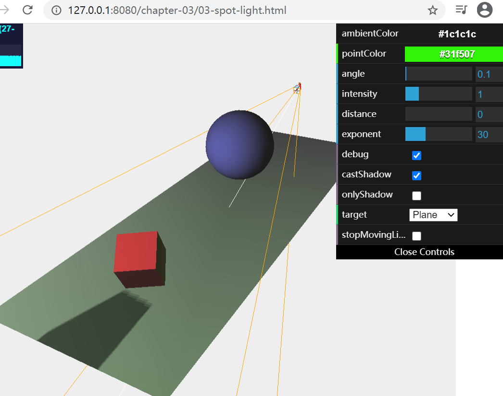</p>

下面对使用阴影你可能会遇到的几个问题列出了几个提示：
- 启用shadowCameraVisible属性。这样会把受光源影响、生成阴影的区域显示出来。
- 如果阴影看上去有点儿模糊，可以增加shadowMapWidth、shadowMapHeight属性的值，或者保证用于生成阴影的区域紧密包围着对象。可以使用shadowCameraNear、shadowCameraFar和shadowCameraFov属性来配置这个区域。
- 记住，你不仅要告诉光源生成阴影，你还要通过castShadow和receiveShadow属性告诉每个几何体是否接收和（或）投射阴影


```js
renderer.shadowMapEnabled = true;
renderer.shadowMapType = THREE.PCFShadowMap;
```

#### 3.2.4 DirectionalLight——模拟远处类似太阳的光源
方向光源可以看做是距离很远的光源，这个光源发出的所有光线都是相互平行的。方向光源的一个范例是太阳。太阳是如此遥远，以至于到达地球的光线都成了平行光。方向光光源和我们之前看过的聚光灯光源之间主要的差别是：方向光不像聚焦光那样离目标越远越暗淡。被方向光光源照亮的整个区域接收到的光强是一样的。

在这种光例只用direction（方向）、color（颜色）和indensity（强度）属性计算颜色和阴影。

方向光光源和聚光灯光源有很多属性是相同的，下面几段只讨论方向光光源特有的属性。

如果你研究一下聚光灯光源的例子，你会发现我们不得不定义生成的光锥。然而，对于方向光光源，由于所有光线都是相互平行的，所以不会有光锥；取而代之的是方块，如下图所示：
<p align="center">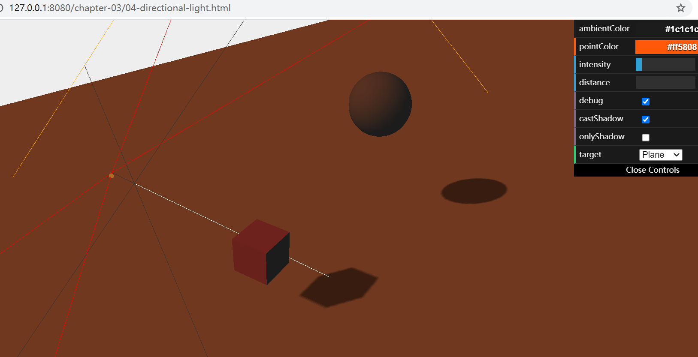</p>
在这个方块范围内的所有对象都可以投影或接收投影。跟聚光灯光源一样，包围对象的空间定义得越紧密，投影的效果越好。可以使用下面几个属性定义这个方块：

```js
directionalLight.shadowCameraNear = 2;
directionalLight.shadowCameraFar = 200;
directionalLight.shadowCameraLeft = -50;
directionalLight.shadowCameraRight = 50;
directionalLight.shadowCameraTop = 50;
directionalLight.shadowCameraBottom = -50;
```

#### 3.2.5 使用特殊光源生成高级光照效果
##### 3.2.5.1 半球光光源
半球光光源THREE.HemisphereLight可以为室外场景创建更加自然的光照效果。如果不使用这种光源，要模拟室外光源，可以添加一个方向光光源来模拟太阳，或者再添加一个环境光光源，为场景提供基础色。但是，这样看上去不怎么自然。当你在室外的时候，并不是所有的光照都来自上方；很多是来自空气的散射、地面的反射，以及其他物体的反射。THREE.HemisphereLight就是为这种情形创建的。它提供了一种简单的方法，用以获取比较自然的光照效果。

你只要指定来自上方（光线）的颜色（接收自天空的颜色）、接收自地面的颜色，以及它们的光照强度。之后如果想修改这些属性，可以使用如下属性：
|  属性   | 描述  |
|  ----  | ----  |
|  groundColor   | 从地面发出的光线的颜色  |
|  Color  | 从天空发出的光线的颜色  |
|  intensity  | 光照照射的强度  |

<p align="center">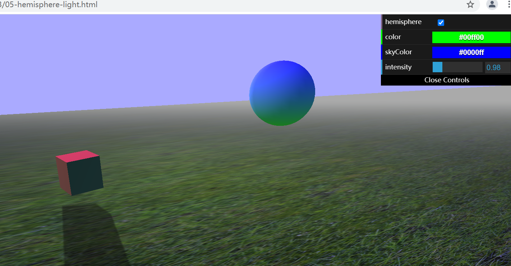</p>

在这个例子中，可以打开或关闭半球光光源，设置颜色（color）和光强（intensity）。创建半球光光源非常简单，如以下代码片段所示：
```js
var hemiLight = new THREE.HemisphereLight(0x0000ff, 0x00ff00, 0.6);
hemiLight.position.set(0, 500, 0);
scene.add(hemiLight);
```

##### 3.2.5.2 平面光光源
平面光光源THREE.AreaLight，它可以从一个很大的平面发射光线，而不是从单个点。AreaLight并不在标准Three.js库纵，而是在它的拓展库中，所以在使用之前我们要完成几个额外的节奏。

如果你要使用THREE.AreaLight，那么就不能再用之前我们一直在示例中使用的THREE.WebGLRenderer对象了。因为平面光光源是一种非常复杂的光源；它会对THREE.WebGLRenderer对象造成非常严重的性能损失。而THREE.WebGLDefferedRenderer（WebGL的延迟渲染器，第10章会深入讲解）对象在渲染场景时使用了一种不同的方法，可以处理复杂的光照（或者光源很多的情况）。

要使用THREE.WebGLDeferedRenderer对象，必须引入Three.js提供的额外的几段JS源代码。在HTML页面框架的头部，加上如下这些`<script />`源代码：

```js
<script type="text/javascript" src="../libs/WebGLDeferredRenderer.js"></script>
<script type="text/javascript" src="../libs/ShaderDeferred.js"></script>
<script type="text/javascript" src="../libs/RenderPass.js"></script>
<script type="text/javascript" src="../libs/EffectComposer.js"></script>
<script type="text/javascript" src="../libs/CopyShader.js"></script>
<script type="text/javascript" src="../libs/ShaderPass.js"></script>
<script type="text/javascript" src="../libs/FXAAShader.js"></script>
<script type="text/javascript" src="../libs/MaskPass.js"></script>
```

引入了这些库之后，就可以使用THREE.WebGLDeferredRenderer对象了：

```js
var renderer = new THREE.WebGLDeferredRenderer({
  width: window.innerWidth,
  height: window.innerHeight,
  scale: 1,
  antialias: true,
  tonemapping: THREE.FilmicOperator,
  brightness: 2.5
})
```

在添加正确的JS库和不同的渲染器之后，就可以开始添加THREE.AreaLight对象，并修改它的属性：

```js
var areaLight = new THREE.AreaLight(0xff0000, 3);
areaLight.position.set(-10, 10, -35);
areaLight.rotation.set(-Math.PI / 2, 0, 0);
areaLight.width = 4;
areaLight.height = 9.9;
scene.add(areaLight);
```

在这个示例里，创建了一个THREE.AreaLight实例。这个光源的颜色为0xff0000，光强是3。跟其他光源一样，可以使用position属性设置该光源在场景中的位置。在创建THREE.AreaLight实例的同时也会创建出来一个水平面。在这个例子例，创建出来的平面光光源时竖立的，因此要绕x轴将这个光源旋转-Math.PI  / 2。最后，使用width和height属性设置平面光光源的尺寸，并把它添加到场景中。

当你自己第一次尝试该光源的时候，你可能会觉得奇怪为什么在你放置光源的地方什么都看不到呢？这是因为你不能看到光源本身，而只能看到它发出的光，而且只有当这些光照射到某个物体上时才能看到。如果你想复制出例子中所展示的场景，你可以在相同的位置（由position属性指定）处放置一个平面或方块，用来模拟平面光光源。

<p align="center">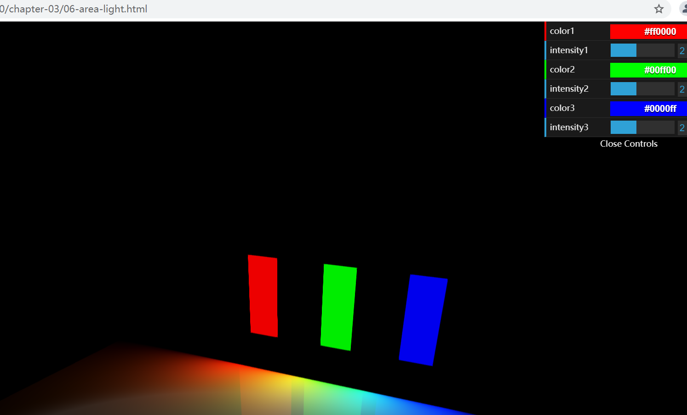</p>

##### 3.2.5.3 镜头炫光
例如，当你直接朝着太阳拍照时，就会出现镜头炫光，大多数情况下需要避免这种情形，但是对于游戏和三维图片来说，它提供了一种很好的效果，让场景看上去更加真实。

Three.js库也支持镜头炫光，而且在场景中添加炫光很简单。

<p align="center">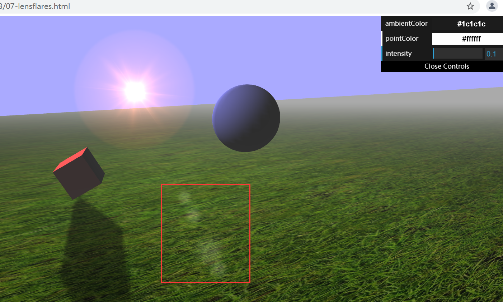</p>

THREE.LensFlare对象接收如下参数：

```js
THREE.LensFlare = function (texture, size, distance, blending, color);
```

|  参数   | 描述  |
|  ----  | ----  |
|  texture（纹理）  | 参数texture用作炫光的材质。决定炫光的样子  |
|  size（尺寸）  | 可以指定炫光应该多大。这个尺寸的单位是像素。如果指定的值是-1，那就使用纹理本身的尺寸  |
|  distance（距离）  | 光源（0）到相机（1）的距离  |
|  blending（融合）  | 我们可以为炫光提供多种材质。融合模式决定它们将如何融合在一起。默认的融合模式是THREE.AdditiveBlending，它可以提供一种半透明的炫光。  |
| color（颜色） |  炫光的颜色 |

```js
var textureFlare0 = THREE.ImageUtils.loadTexture('../assets/textures/lensflare/lensflare0.png');
var flareColor = new THREE.Color(0xffaacc);
var lensFlare = new THREE.LensFlare(textureFlare0, 350, 0.0, THREE.AdditiveBlending, flareColor);
lensFlare.position = spotLight.position;
scene.add(lensFlare)
```

我们需要先加载一个纹理，它定义的是炫光的样子。接下来，要使用THREE.Color(0xffaacc)定义炫光的颜色。这将使炫光泛着红色，有了这两个对象后，就可以创建THREE.LensFlare对象了。在这个示例里，把炫光的尺寸size设为350，距离distance设为0.0（就在光源处）。纹理如下：
<p align="center">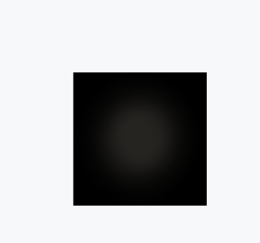</p>

为了模拟更真实的效果（见示例红色方框中那些小的圆形失真图形），我们使用创建炫光的方法来创建它们：

```js
var lensFlare = new THREE.LensFlare(textureFlare0, 350, 0.0, THREE.AdditiveBlending, flareColor);

lensFlare.add(textureFlare3, 60, 0.6, THREE.AdditiveBlending);
lensFlare.add(textureFlare3, 70, 0.7, THREE.AdditiveBlending);
lensFlare.add(textureFlare3, 120, 0.9, THREE.AdditiveBlending);
lensFlare.add(textureFlare3, 70, 1.0, THREE.AdditiveBlending);
```

这次并没有创建一个新的THREE.LensFlare对象，而是用了刚创建的THREE.LensFlare对象的add()函数。为生成这些玄黄使用的纹理是一个颜色很浅的圆，如下所示：
<p align="center"></p>

### 3.3 总结
本章讲述的是Three.js库提供的各种光源：
- 配置光源、颜色和阴影不是严谨的科学。需要不断试验；使用dat.GUI控件可以微调配置。
- 环境光光源（AmbientLight）的颜色可以附加到场景中的每一种颜色上。它没有位置的概念。通常用这种光源来柔化那些硬生生的颜色和阴影。
- 点光源（PointLight）并不生成阴影，而且可以朝所有方向发射光线。可以把它跟夜空中的照明弹相比对。
- 聚光灯灯源（SpotLight）类似手电筒。发射出的光线是一个锥形，而且可以配置它随着距离的增大而逐渐变弱。聚光灯光源可以设定为生成阴影。
- 聚光灯光源跟方向光光源一样，都有一个debug（微调）开关，可以用来为调阴影相机的配置。
- 方向光光源（DirectionalLight）可以跟很远地方的光源（例如太阳）相对比。由于距离很远，所以其光线都是相互平行的。光线离指定的目标越远，则光强衰减得越多。
- 如果你想要一个更加自然的室外效果，可以使用半球光光源（HemisphereLight）。它可以将天空的光照和来自地面的反射光计算在内。
- 如果你想用平面光光源（AreaLight），你要记住用WebGL延迟渲染器（WebGLDefferedRenderer）对象。如果你有大量的光源，而且性能也有问题，你就应该考虑使用WebGLDefferedRenderer对象，而不是WebGLRenderer。
- 要实现模拟照片中的炫光效果，可以使用Three.js库中的LensFlare组件，以便在场景中的光源上添加炫光效果。

## 第四章 使用Three.js的材质
材质结合几何体可以构成网络。材质就像是物体的皮肤，决定几何体外表的样子。例如，皮肤可以决定一个几何体看起来是否像金属、透明与否，以及是否显示成线框。然后这个网络才可以添加到场景中，并由Three.js库来渲染。

本章将要探讨的材质列在下表中：

|  名称   | 描述  |
|  ----  | ----  |
|  MeshBasicMeterial（网络基础材质）  | 基础材质，可以用它赋予几何体一种简单的颜色，或者显示几何体的线框  |
|  MeshDepthMaterial（网络深度材质）  | 根据网络到相机的距离，这种材质决定如何给网络染色  |
|  MeshNormalMaterial（网络法向材质）  | 这是一种简单的材质，根据物体表面的法向向量计算颜色  |
|  MeshFaceMaterial（网络面材质）  | 这是一个容器，可以在这个容器里为物体的各个表面指定不同的颜色  |
|  MeshLambertMaterial（网格朗伯材质）  | 这种材质会考虑光照的影响，可以用来创建颜色暗淡的、 不光亮的物体  |
|  MeshPhonegMaterial（网络Phong式材质）  | 这种材质也会考虑光照的影响，而且可以用来创建光亮的物体  |
|  ShaderMaterial（着色器材质）  | 这种材质允许使用自定义的着色器程序，直接控制顶点的放置方式，以及像素的着色方式  |
| LineBasicMaterial（直线基础材质） | 这种材质可以用于THREE.Line（直线）几何体，从而创建着色的直线 |
| LineDashedMaterial（虚线材质） | 这种材质跟直线基础材质一样，不过可以用来创建出一种虚线效果 |


> Lambert，朗伯，一种亮度单位。以德国数学家、天文学家和物理学家 John Heinrich Lambert（1728-1777年）的名字命名。 <br>
> Phong，一种着色方式，由美国越南裔学者裴祥风发明，于1973年的博士论文中首度发表。

这些材质有一些共同的属性，介绍材质之前，让我们先来看一下所有材质都具有的属性。


### 4.1 理解共有属性
Three.js提供了一个材质基类，THREE.Material，这个类列出了所有共有属性。我们已经把这些共有属性分成了三类，如下所示：
- 基础属性：这些属性是最常用到的。通过这些属性可以控制物体的透明度、是否可见或如何引用物体（通过ID或自定义名称）
- 融合属性：每个物体都有一系列的融合属性。这些属性决定物体如何与背景融合
- 高级属性：有一些高级属性可以控制底层WebGL上下文渲染物体的方法。大多数情况下，不会用到这些属性。

#### 4.1.1 基础属性
THREE.Material类的基础属性列在下表中。
| 属性 | 描述 |
|  ----  | ----  |
|  ID（标识符）  | 用来标识材质，在创建时赋值  |
|  name（名称）  | 可以通过这个属性赋予材质名称  |
|  opacity（透明度）  | 定义物体有多透明。与属性transparent一起使用。该属性的取值范围是0~1  |
|  transparent（是否透明）  | 如果设为true，Three.js库就会根据opacity的值来渲染物体。如果是false，这个问题就不透明，只是着色明亮一些  |
|  overdraw（过度描绘）  | 如果你用THREE.CanvasRender（画布渲染器）对象，多边形会被渲染得稍微大一点儿。当你用这个渲染器画出来的物体有缝隙时，可以将这个属性设为true  |
|  visible（是否可见）  | 定义该材质是否可见。如果将它设为false，那么在场景中就看不到该物体  |
|  side（侧面）  | 通过这个属性，可以决定在几何体的哪一面应用这个材质。默认值是THREE.FrontSide（前面），这可以将材质应用到物体的前（外）面。也可以将它设为THREE.BackSide（后面），这可以将材质应用到物体的后（内）侧。或者也可以将它设为THREE.DoubleSide（双侧），这样就可以将材质应用到物体的内外两侧  |
|  needsUpdate（是否刷新）  | 对于材质的某些修改，你需要告诉Three.js库材质已经改变了。如果这个属性设为true,Three.js就会使用新的材质属性刷新它的缓存  |

#### 4.1.2 融合属性
材质有几个跟融合相关的一般属性。

|  名称  | 描述  |
|  ----  | ----  |
|  blending（融合）  | 决定物质上的材质如何跟背景融合。融合模式一般是NormalBlending，在这种模式下只显示材质的上层  |
|  blendsrc（融合源）  | 除了使用标准融合模式之外，还可以通过指定blendsrc、blenddst和blendequation属性来创建自定义的融合模式。该属性指定物体（源）如何跟背景（目标）相融合。默认值是SrcAlphaFactor，即使用alpha（透明度）通道进行融合  |
|  blenddst（融合目标）  | 该属性定义融合时如何使用背景（目标），默认值是OneMinusSrcAlphaFactor，其含义是：目标也使用源的alpha通道进行融合，只是用的值是1（源的alpha通道值）  |
|  blendingequation（融合公式）  | 指定如何使用blendSrc和blenddst的值。默认方法是addEquation，即将两个颜色值相加。使用这三个属性，就可以创建自定义的融合模式  |

#### 4.1.3 高级属性
这一组属性大多在内部使用，用来控制WebGL渲染场景时的细节。我们不会深入探讨这些属性的细节。它们跟WebGL内部如何工作相关。如果你想更多地了解这些属性，那么OpenGL规范是个很好地起点。可以在[这个网址](http://www.khronos.org/registry/gles/specs/2.0/es_full_spec_2.0.25.pdf)找到此规范

|  名称  | 描述  |
|  ----  | ----  |
|  depthTest（深度测试） | 这是一个高级WebGL属性。使用这个属性可以打开或关闭GL_DEPTH_TEST参数。该参数决定像素深度是否用来计算新的像素值。通常情况下不必修改这个属性。  |
|  depthWrite  | 这是另外一个内部属性。可以用来决定这个材质是否影响WebGL的深度缓存。如果你将一个物体用作二维贴图时（例如一个套子），你应该将这个属性设为false。但是一般来讲，你不应该修改这个属性。  |
|  polygonOffset、polygonOffsetFactor和polygonOffsetUnits  | 通过这些属性，可以控制WebGL的POLYGON_OFFSET_FILL功能。一般不需要使用他们。  |
|  alphaTest  | 可以给这个属性指定一个值（从0到1）。如果某个像素的alpha值小于这个值，那么该像素就不会显示出来  |

现在让我们来看看所有可用的材质，你会看到这些属性对渲染结果的影响。

### 4.2 从简单的网络材质（基础、深度和面）开始
本节介绍几种简单的网络材质：MeshBasicMaterial、MeshDepthMaterial、MeshNormalMaterial和MeshFaceMaterial。

#### 4.2.1 简单表面的MeshBasicMaterial

MeshBasicMaterial是一种非常简单的材质。这种材质不考虑光照的影响。使用这种材质的网格会被渲染成一些简单的平面多边形，而且你也有机会显示几何体。除了上一节提及的那些共有属性之外，还可以设置下面这些属性：
|  名称  | 描述  |
|  ----  | ----  |
|  color  | 设置材质的颜色  |
|  wireframe  | 设置这个属性可以将材质渲染成线框。对调试非常有利  |
|  wrieframeLinewidth （线框线宽） | 如果已经打开了wireframe，这个属性可以定义线框中线的宽度  |
|  wireframeLinecap（线框线端点）  | 这个属性定义线框模式下顶点间线段的端点如何显示。可选值包括butt（平）、round（圆）和square（方）。默认值是round。在实际使用中，这个属性的修改结果很难看出来，WebGLRender对象不支持该属性  |
|  wireframeLinejoin（线框线段连接点）  | 定义线段的连接点如何显示。可选的值包括round、bevel（斜角）和miter（尖角）。默认值是round。如果你在一个使用低透明度和很大wireframeLinewidth值的例子里靠近观察，你就可以看到这个属性的效果。WebGLRenderer不支持该属性  |
|  shading（着色）  | 该属性定义如何着色。可选的值是THREE.SmoothShading和THREE.FlatShading。  |
| vertexColors（顶点颜色） | 可以通过这个属性为每一个顶点定义不同的颜色。该属性在使用CanvasRenderer时不起作用，但可以在使用WebGLRenderer时起作用 |
| fog（雾化） | 该属性指定当前材质是否会受全局雾化效果设置的影响 |

```js
var meshMaterial = new THREE.MeshBasicMaterial({ color: 0x7777ff }); // 创建一种新的材质，并将其颜色属性初始化为0x7777ff。所有属性即可以在像上面这样在构造函数里传递，也可以在材质创建好之后设置
meshMaterial.visible = false;
```

<p align="center">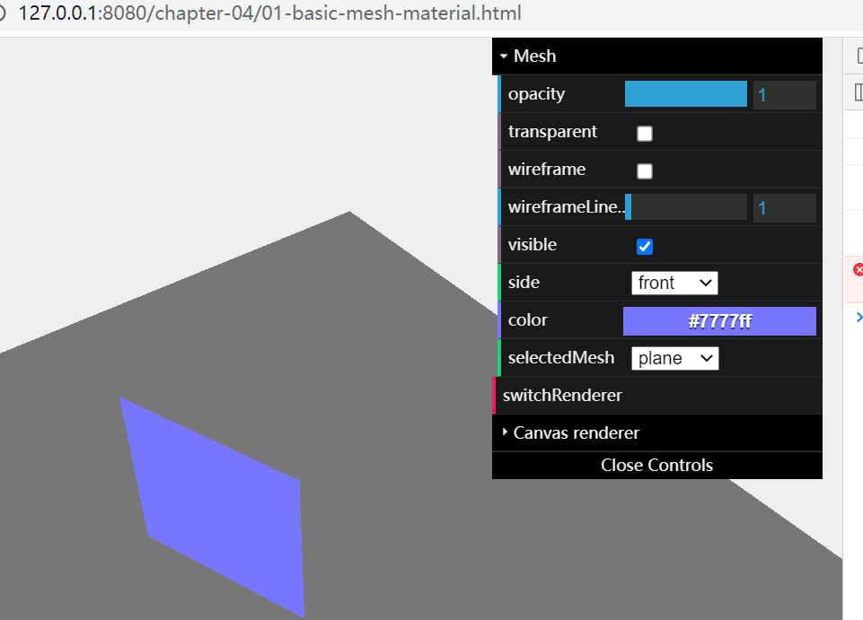</p>

在这个例子里有一个可以设置的属性是side。通过这个属性可以指定在几何体的哪一面上应用材质。如果选择的是plane（平面）网络，就可以检验该属性是如何起作用的。由于材质往往是应用在物体前面的面上，所以在平面旋转时会有一半的时间看不到它（其实显示的是它的背面）。如果你把side属性设为double，那么由于几何体的两面都有材质，所以这个平面始终都可以看见。

#### 4.2.2 基于深度着色的MeshDepthMaterial
使用这种材质的物体，其外观不是由光照或某个材质属性决定的；而是由物体到相机的距离决定的。可以将这种材质与其他材质相结合，从而很容易地创建出逐渐消失的效果。这种材质只有两个控制线框的属性：wireframe、wireframeLineWidth

<p align="center">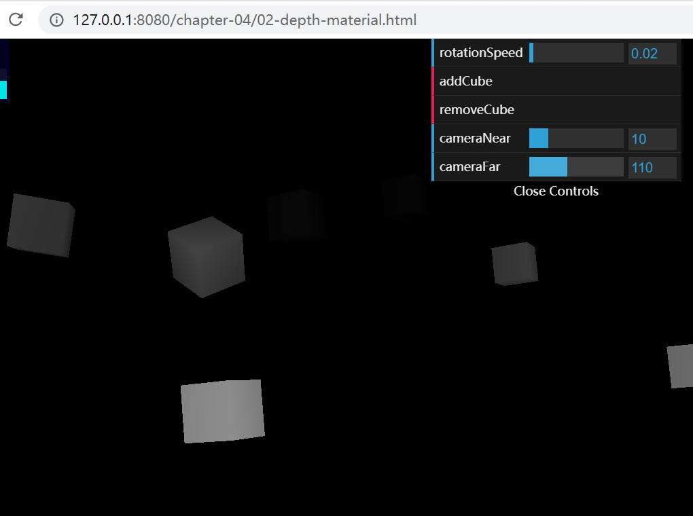</p>

尽管材质没有多少睡醒可以控制物体的渲染效果，但我们依然可以控制物体消失的速度。在这个例子里，将相机的near属性和far属性暴露出来。我们通过这两个属性控制相机可见的区域。所有跟相机距离小于near属性的物体不会显示出来，而所有跟相机距离大于far属性的物体也都落在相机的可见范围之外。

**相机near属性和far属性之间的差距决定场景的亮度和物体消失的速度。如果这个差距非常大，那么当物体远离相机时，只会稍微消失一点。如果这个差距非常小，那么物体消失的效果将会非常明显**。

#### 4.2.3 联合材质
本节要讨论的不是一种真正的材质，而是将各种材质联合在一起的一种方法。

如果回头看看MeshDepthMaterial，你会发现没有选项可以用来设置方块的颜色。一切都是由材质的默认属性决定的。但是，Three.js库可以通过联合材质创建出新效果（这也是材质融合起作用的地方）。

```js
var cubeMaterial = new THREE.MeshDeptMaterial();
var colorMaterial = new THREE.MeshBasixMaterial({
  color: 0x00ff00,
  transparent: true,
  blending: THREE.MultiplyBlending
});
var cube = new THREE.SceneUtils.createMultiMaterialObject(cubeGeometry, [colorMaterial, cubeMaterial]);
cube.children[1].scale.set(0.99, 0.99, 0.99); // cube.childen[1]是cubeMaterial
// 然后就可以获得下图所示的绿色方块，这些方块可以从MeshDepthMaterial对象获得渐变效果，从MeshBasicMaterial对象获得颜色
```

<p align="center">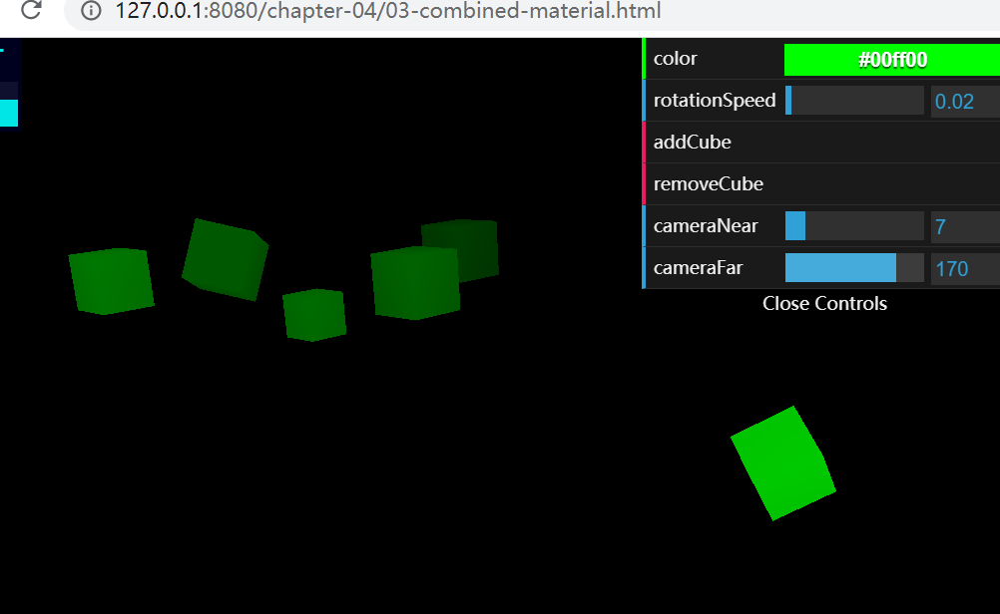</p>

让我们来看看要达到这种效果需要采取的步骤。首先要创建两种材质。对于MeshDepthMaterial没有什么特别要做的；但是对于MeshBasicMaterial，要把transparent属性设为true，并指定融合模式。如果不把transparent属性设为true，就只会得到一些纯绿色的物体，因为Three.js库不会执行任何融合操作。如果将transparent属性设为true，Three.js就会检查blending属性，来看看这个绿色的MeshBasicMaterial材质如何跟背景相互作用。这里所说的背景是用MeshDepthMaterial渲染的方块。

（第9章会详细讨论各种可以选用的融合模式。）在这个例子里用的是THREE.MultiplyBlending对象。这种模式会把前景的颜色跟背景的颜色相乘，给你想要的结果。

上述代码片段的最后一行也很重要。当调用createMultiMaterialObject()函数创建一个网络的时候，几何体会被赋值，返回一个网络组，里面两个网格完全相同。如果没有最后一行，那么在渲染的时候画面会有闪烁，因为它们会直接在彼此的上面渲染。通过缩小带有MeshDepthMaterial材质的网络，就可以避免这种现象。

#### 4.2.4 计算法向颜色的MeshNormalMaterial
<p align="center">
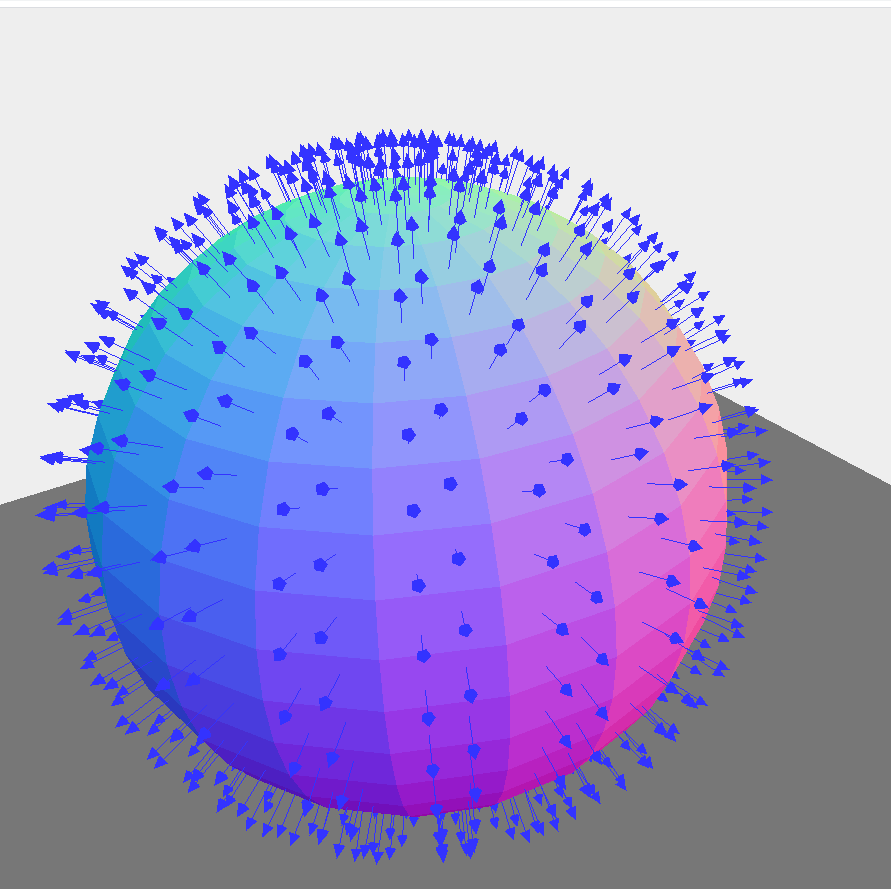
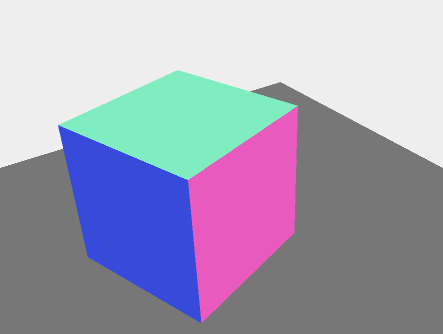</p>

正如你所看到的，网格上的每一面在渲染时颜色都稍有不同，而且几遍在球体旋转时，这些颜色也基本上保持在原来的位置。之所以是这样，是因为每个面的颜色是从该面向外指的法向量计算得到的。

所谓的法向量是与面垂直的向量。法向量在Three.js库有很广泛的应用。它可以用来决定光的反射方向，在三维物体上映射材质时起辅助作用，还可以在计算光照、阴影时提供信息，为物体表面像素上色。但是幸运的是，Three.js库会处理这些向量的计算，而且在库内部使用。

法向量所指的方向决定每个面从MeshNormalMaterial材质获取的颜色。由于球体各面的法向量都不相同，所以在这个例子里我们看到的是一个色彩斑斓的球。

要添加这些表示法向量的箭头，可以使用THREE.ArrowHelper对象，如以下代码片段所示：
```js
// 这段代码在球体的每个面上添加一个长度为2，颜色为0x3333ff的箭头，表示该面的法向量。
for (var f = 0, fl = sphere.gemmetry.faces.length; f < fl; f++) {
  var face = spere.geometry.faces[f];
  // var centroid = new THREE.Vector3(0, 0, 0);
  // centroid.add(sphere.geometry.vertices[face.a]);
  // centroid.add(sphere.geometry.vertices[face.b]);
  // centroid.add(sphere.geometry.vertices[face.c]);
  // centroid.divideScalar(3);
  var arrow = new THREE.ArrowHelper(face.normal, face.centroid, 2, 0x3333FF);
  sphere.add(arrow);
}
```

MeshNormalMaterial对象还有几个属性可以设置：
|  名称  | 描述  |
|  ----  | ----  |
|  wireframe  | 该属性指定是否显示线框  |
|  wireframeLinewidth  | 指定线框线的宽度  |
|  shading  | 该属性用来设置着色方法：THREE.FlatShading表示平面着色，THREE.SmoothShading表示平滑着色  |

通过shading属性，我们可以告诉Three.js库如何渲染物体。如果使用THREE.FlatShading对象，那么每个面是什么颜色就会渲染成什么颜色（正如你在前面那个截图中看到的那样），或者你也可以使用THREE.SmoothShading对象，这样就可以使物体的表面变得光滑些（比如，用于sphere球）。

#### 4.2.5 为每个面指定材质的MeshFaceMaterial
这种基础材质并不是真正的材质，更像是一种材质容器。通过MeshFaceMaterial可以为几何体的每一个面指定不同的材质。假如你有一个方块，上面有6个面，你可以用这种材质来为每个面指定一种材质（例如不同的颜色）。这种材质使用起来很简单，如：
```js
var matArray = []; // 用于保存各个材质
matArray.push(new THREE.MeshBasicMaterial({ color: 0x009e60 })); // 为每个面创建一种不同颜色的材质
matArray.push(new THREE.MeshBasicMaterial({ color: 0x0051ba }));
matArray.push(new THREE.MeshBasicMaterial({ color: 0xffd500 }));
matArray.push(new THREE.MeshBasicMaterial({ color: 0xff5800 }));
matArray.push(new THREE.MeshBasicMaterial({ color: 0xC41E3A }));
matArray.push(new THREE.MeshBasicMaterial({ color: 0xffffff }));

var faceMaterial = new THREE.MeshFaceMaterial(matArray);

var cubeGeom = new THREE.CubeGeometry(3, 3, 3);
var cube = new THREE.Mesh(cubeGeom, faceMaterial);
```

<p align="center">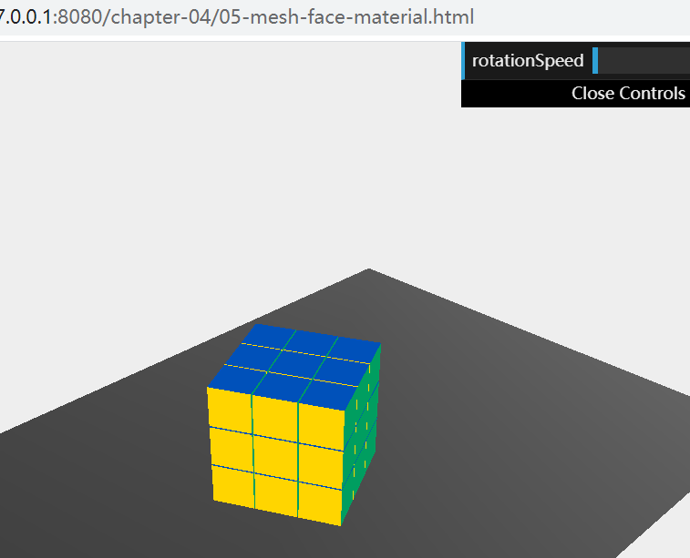</p>

上图中的模方由一些小方块组组成：沿x轴3个，沿y轴3个，沿z轴3个，代码如下：
```js
/**
 * 在这段代码里先创建了一个MeshFaceMaterial，接着会创建三个循环，以保证创建出正确数目的方块。
 * 在循环里会创建每一个方块，赋予材质、定位，并把它们添加到一组group中。
 * 你应该记住的是，方块的位置是与这个组之间的相对位置。如果移动或旋转这个组，所有方块都会随着它移动和旋转
 * （有关如何使用组的更多信息，请参考第8章）
*/
var group = new THREE.Mesh();
var mats = [
  new THREE.MeshBasicMaterial({ color: 0x009e60 }),
  new THREE.MeshBasicMaterial({ color: 0x0051ba }),
  new THREE.MeshBasicMaterial({ color: 0xffd500 }),
  new THREE.MeshBasicMaterial({ color: 0xff5800 }),
  new THREE.MeshBasicMaterial({ color: 0xC41E3A }),
  new THREE.MeshBasicMaterial({ color: 0xffffff })
];
var faceMaterial = new THREE.MeshFaceMaterial(mats);
for (var x = 0; x < 3; x++) {
  for (var y = 0; y < 3; y++) {
    for (var z = 0; z < 3; z++) {
      var cubeGeom = new THREE.CubeGeometry(2.9, 2.9, 2.9);
      var cube = new THREE.Mesh(cubeGeom, faceMaterial);
      cube.position = new THREE.Vector3(x * 3 - 3, y * 3, z * 3 -3); // -3这个偏置是为了让整个组绕着它的中心(0,0,0)旋转
      group.add(cube);
    }
  }
}
// ....
// 控制每个render中旋转的代码
group.rotation.y = step += controls.rotationSpeed;
```


### 4.3 学习高级材质
MeshPhongMaterial和MeshLabmertMaterial这两种材质会对光源做出反应，可以分别用来创建光亮的材质和暗淡的材质。ShaderMaterial是一种最通用也最难用的材质，通过它，你可以创建自己的着色程序，定义材质和物体如何显示。

#### 4.3.1 用于暗淡、不光亮表面的MeshLambertMaterial
<p align="center">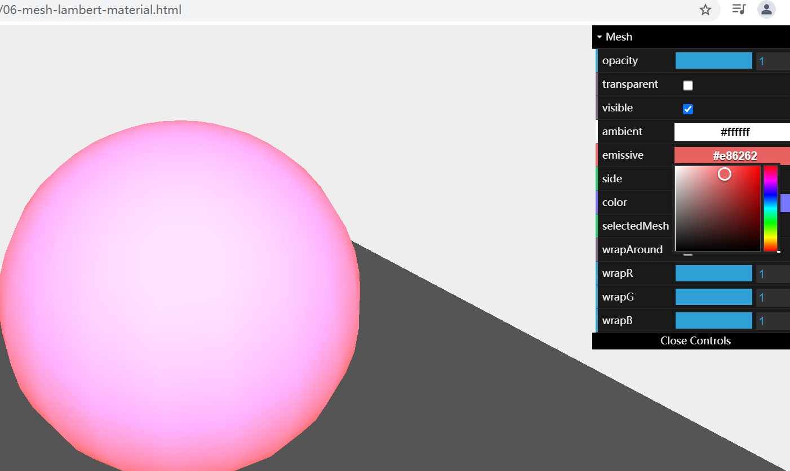</p>

这种材质可以用来创建看上去暗淡的并不光亮的表面。该材质非常易用，而且会对场景中的光源产生反应。可以在这个材质上配置前面提到的几个属性：color、opacity、shading、blending、depthTest、depthWrite、wireframe、wireframeLinewidth、wireframeLinecap、wireframeLinejoin、vertexColors以及fog。我们不会解释这些属性的细节，但是会重点讨论这种材质独有的一些属性。剩下的属性就只有下面两个了：
|  名称  | 描述  |
|  ----  | ----  |
|  ambient  | 这是该材质的环境色。跟上一章讲过的AmbientLight光源一起使用。这个颜色会与AmbientLight光源的颜色相乘。默认值是白色  |
|  emissive  | 这是该材质发射的颜色。它其实并不像一个光源，只是一种纯粹的、不受其他光照影响的颜色。默认值是黑色  |

#### 4.3.2 用于光亮表面的MeshPhongMaterial
<p align="center">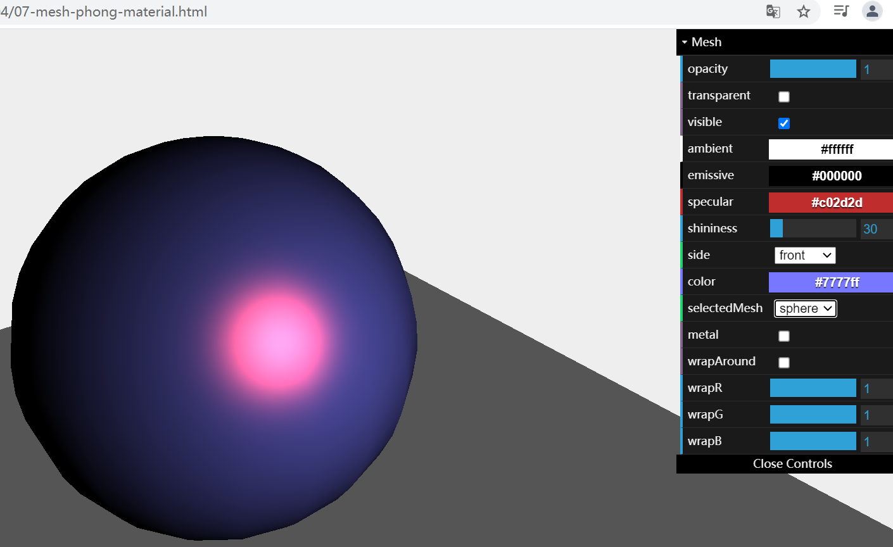</p>
通过MeshPhongMerial，可以创建一种光亮的材质。可以使用的属性跟创建暗淡材质的MeshLambertMaterial基本一样。我么照样略过哪些基础的、已经讨论过的属性：color、opacity、shading、blending、depthTest、depthWrite、wireframe、wireframeLinewidth、wireframeLinecap、wireframeLinejoin和vertexColors。

对于这种材质我们感兴趣的属性列在下表中：
|  名称  | 描述  |
|  ----  | ----  |
|  ambient  | 这是该材质的环境色。跟上一章讲过的AmbientLight光源一起使用。这个颜色会与AmbientLight光源的颜色相乘。默认是白色  |
|  emissive  | 这是该材质发射的颜色。它其实并不像一个光源，只是一种纯粹的、不受其他光照影响的颜色。默认是黑色  |
|  specular（镜面的）  | 该属性指定该材质的光亮程度及其高光部分的颜色。如果将它设置成跟color属性相同的颜色，将会得到一种更加类似金属的材质。如果设置成grey（灰色），材质将变得更像塑料  |
|  shininess  | 该属性指定高光部分的亮度。默认值是30  |

#### 4.3.3 用ShaderMaterial创建自己的着色器
THREE.ShaderMaterial是Three.js库中功能最丰富、最复杂的一种材质。通过它，可以使用自己定制的着色器，直接在WebGL环境中运行。着色器可以将Three.js中的JS对象转换为屏幕上的像素。通过这些自定义的着色器，你可以明确指定你的对象如何渲染和覆盖，或者修改Three.js库中的默认值。（本节不会涉及如何定制着色器的细节，更多信息可以参考第11章。）

ShaderMaterial有几个属性可以设置：
|  名称  | 描述  |
|  ----  | ----  |
|  wireframe  | 设置这个属性可以将材质渲染成线框。对调试非常有利。  |
|  wireframeLineWidth（线框线宽）  | 如果已经打开了wireframe属性，这个属性可以定义线框中线的宽度  |
|  shading  | 该属性定义如何着色。可选值为THREE.SmoothShading和THREE.FlatShading。该属性在这个材质的例子里没有设置  |
|  vetexColors  | 可以通过这个属性为每一个顶点定义不同的颜色。该属性在使用CanvasRenderer时不起作用，但可以在使用WebGLRenderer时起作用。  |
| fog | 该属性指定当前材质是否会受全局雾化效果设置的影响。 |

除了前面章节映讨论过的这些属性之外，ShaderMaterial还有几个特别属性，使用它们你可以传入数据，定制你的着色器。（更多细节可以参考第9章）
|  名称  | 描述  |
|  ----  | ----  |
|  fragmentShader（像素着色器）  | 这个着色器定义的是每个传入的像素的颜色  |
|  vertexShader（顶点着色器）  | 这个着色器允许你修改每一个传入的顶点的位置  |
|  uniforms（统一值）  | 通过这个属性可以向你的着色器发信息。同样的信息会发到每一个顶点和片段  |
|  defines  | 这个属性的值可以转换成vertexShader和fragmentShader里#define代码。该属性可以用来设置着色器程序的一些全局变量  |
|  attributes  | 该属性可以修改每个顶点和片段。通常用来传递位置数据和与法向量相关的数据。如果要用这个属性，那么你要为几何体中的所有顶点提供信息  |
|  lights  | 该属性定义光照数据是否传递给着色器。默认值是false  |

在我们看例子之前，我们先简要解释一下ShaderMaterial里最重要的部分：要使用这个材质，必须要传入两个不同的着色器。
- vertexShader：vertexShader会在几何体的每一个顶点上执行。可以用这个着色器通过改变顶点的位置来对几何体进行变换。
- fragmentShader：fragmentShader会在几何体的每一个像素上执行。在fragmentShader里，我们会返回这个特定像素应该显示的颜色。

### 4.4 线段几何体的材质
我们将要看的最后两种材质只能用于特定的几何体：THREE.Line（线段）。线段上只有顶点，不包含任何面。Three.js库提供了两个用于线段的不同材质，如下所示：
- LineBasicMaterial：通过线段基础材质可以设置线段的颜色、宽度、端点和连接点属性。
- LineDashedMaterial：跟LineBasicMaterial的属性一样，但是通过指定短划线和空格的长度，可以创建出虚线效果

#### 4.4.1 LineBasicMaterial

|  名称  | 描述  |
|  ----  | ----  |
|  color  | 指定线的颜色。如果指定vertexColors，这个属性就会被忽略  |
| lineWidth |  该属性定义线的宽度 |
|  LineCap  | 该属性定义顶点间的线段端点如何显示。可选值包括butt（平）、round（圆）和square（方）。默认值是round。 |
|  LineJoin  | 该属性定义的是线段连接点如何显示。可选值包括round（圆）、bevel（斜切）和miter（尖角）。默认值是round。  |
|  vertexColors  | 将这个属性设置成THREE.VertexColors值，就可以为每个顶点指定一种颜色  |
|  fog  | 该属性指定当前物体是否受全局雾化效果的影响  |

在看LineBasicMaterial的示例之前，我们先来快速浏览一下如何从顶点集合中创建出一些线段，并为它们赋予LineBasicMaterial材质，构成一个网络。代码如下所示：
```js
var points = gosper(4, 60); // 这个函数返回的是一个Gosper曲线，这是一种填充二维空间简单地算法
var lines = new THREE.Geometry();
var colors = [];
var i = 0;
points.forEach(function(e) {
  lines.vertices.push(new THREE.Vector3(e.x, e.z, e.y));
  colors[i] = new THREE.Color(0xffffff);
  colors[i].setHSL(e.x . 100 + 0.5, (e.y * 20) / 300, 0.8); // 使用HSL设置颜色，要提供色调hue、饱和度saturation和亮度lightness。用HSL和RGB更加直观，而且也更容易创建出匹配的颜色集合。
  i++;
})
lines.colors = colors;
var material = new THREE.LineBasicMaterial({
  opacity: 1.0,
  lineWidth: 1,
  vertexColors: THREE.VertexColors
});
var line = new THREE.Line(lines, material)

```

<p align="center">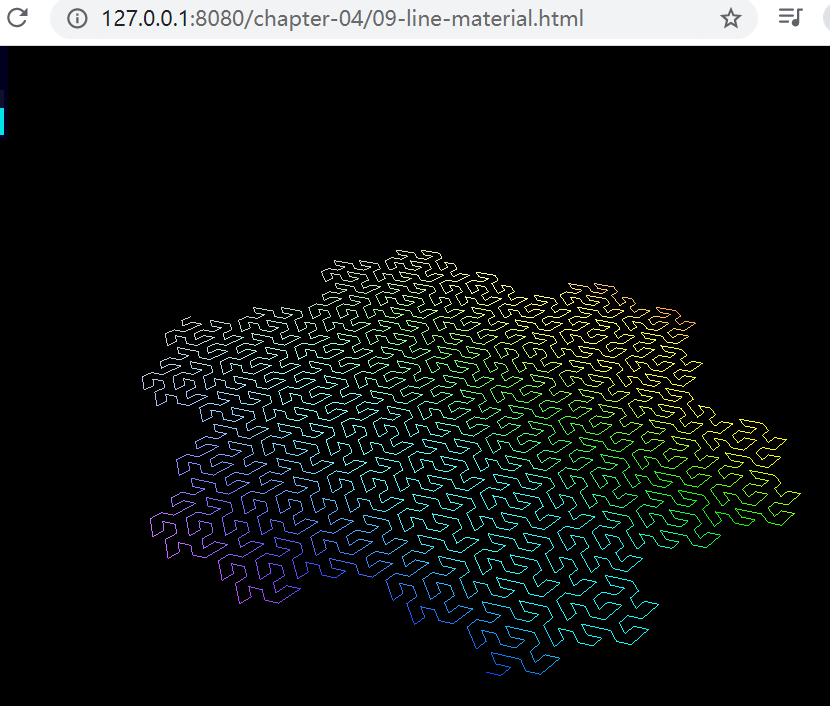</p>

#### 4.4.2 LineDashedMaterial
这种材质有跟LineBasicMaterial一样的属性，以及几个额外的、可以用来定义端划线长度和短划线中间空格长度的属性，如下所示：

|  名称  | 描述  |
|  ----  | ----  |
|  scale（缩放比例）  | 缩放dashSize和gapSize。如果scale小于1，dashSize和gapSize就会增大；如果scale大于1，dashSize和gapSize就会缩小  |
|  dashSize  | 短划线的长度  |
|  gapSize  | 间隔的长度  |

```js
lines.computeLineDistances(); // 如果不调用，间隔就不会显示出来
var material = new THREE.LineDashedMaterial({ vertexColors: true, color: 0xffffff, dashSize: 10, gapSize: 1, scale: 0.1 })
```

<p align="center">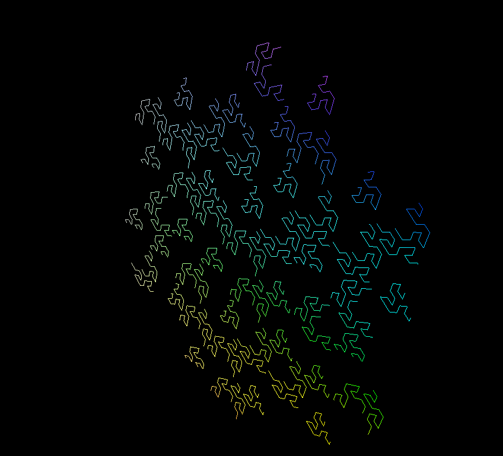</p>

### 4.5 总结
Three.js库提供了很多可以用来覆盖几何体的材质，从简单地MeshBasicMaterial到复杂的ShaderMaterial。
- 各种材质有很多共同的属性。如果你知道如何使用某种材质，你也应该知道如何使用其他材质。
- 并不是所有材质都会对场景中的光源做出反应。如果你希望一种介质计算光照的影响，你应该使用MeshPhongMaterial或者MeshLambertMaterial
- 如果要创建一种透明的材质，仅仅设置opacity属性是不够的，还需要将transparent属性设为true
- 材质的大部分睡醒都可以在运行时修改，但是有一些睡醒例如side不可以在运行时修改。若你要修改这些属性的值，应该将needsUpdate属性设为true。要了解运行时哪些属性可以修改，哪些不可以，可以参考[网页](https://github.com/mrdoob/three.js/wiki/Updates)
- **可以为一个几何体赋予多种材质。但是要记住，这么做会复制几何体，从而创建出多个网格**
- THREE.Line不可以用普通材质覆盖。因此只能使用THREE.LineBasicMaterial或THREE.LineDashedMaterial
- 如果要一个光亮的物体，可以使用MeshPhongMaterial；如果想要一个暗淡的物体，可以使用MeshLambertMaterial
- 使用dat.GUI来试验各种材质属性。在开发过程中猜测正确的材质属性值是非常困难的。

## 第五章 学习使用几何体
本章将展示Three.js提供的各种几何体，包括：
- PlaneGeometry（平面）
- CircleGeometry（圆形）
- ShapeGeometry（塑形）
- CubeGeometry（立方体）
- SphereGeometry（球体）
- CylinderGeometry（圆柱）
- TorusGeometry（圆环）
- TorusKnotGeometry（环面纽结）
- PolyhedronGeometry（多面体）
- IcosahedronGeometry（二十面体）
- OctahedronGeometry（八面体）
- TetraHedronGeometry（四面体）

### 5.1 Three.js提供的基础几何体
Three.js中有几种几何体可以创建二维网络，但是大部分还是用来创建三维网络。本节先介绍一些二维几何体：CircleGeometry、PlaneGeometry和ShapeGeometry。然后再介绍所有可用的基础三维几何体。

#### 5.1.1 二维几何体
二维几何体看上去是扁平的，顾名思义，它们只有两个维度。

> 在此之前，我们先对创建二维图形时所用的方向做一个简要说明。Three.js创建这些对象时只使用x轴和y轴，所以他们都是“直立”的。这很符合逻辑，因为它们是二维对象，<br/>
> 但是一般来讲，特别是用PlaneGeometry时，你会希望这些几何体“躺”下来，以便构建一种地面，好把其他对象放在上面。创建一个水平放置而不是竖直的二维对象最简单的方法就是：将这个网格沿x轴向后旋转1/4圈（-Math.PI/2） `mesh.rotation.x = -Math.PI / 2`


##### 5.1.1.1 [PlaneGeometry](https://xsometimes.github.io/learning-threejs/chapter-05/01-basic-2d-geometries-plane.html)
PlaneGeometry可以用来创建非常简单的二维矩形。创建这种几何体非常简单，如下所示:
```js
new THREE.PlaneGeometry(width, height, widthSegments, heightSegments);
```

|  名称  | 是否必须  | 描述  |
|  ----  | ----  | ----  |
|  width（宽度）  | 是  | 指定矩形的宽度  |
|  height（高度）  | 是  | 指定矩形的高度  |
|  widthSegments（宽度段数）  | 否  | 指定矩形的宽度应该划分成几段  |
|  heightSegments（高度段数）  | 否  | 指定矩形的高度应该划分成几段  |

如上，这并不是一个复杂的几何体。你只要指定尺寸就可以了。若你想创建更多的面（比如，一种拥有多个方格的样式），你可以使用widthSegments属性和heightSegments属性，将这个矩形分成多个平面。

```js
function createMesh(geometry) {
  // assign two materials
  var meshMaterial = new THREE.MeshNormalMaterial(); // 第一个材质是基于物体表面的法向量来计算颜色
  meshMaterial.side = THREE.DoubleSide; // 将第一个材质设置成双面的。如果我们不这么做，那么当物体的背面朝向相机的时候，就会看不到它。
  var wireFrameMaterial = new THREE.MeshBasicMaterial();
  wireFrameMaterial.wireframe = true; // 通过第二个材质来打开线框的效果

  // create a multimaterial
  var mesh = THREE.SceneUtils.createMultiMaterialObject(
    geometry,
    [meshMaterial, wireFrameMaterial]
  );
  return mesh;
}
```

##### 5.1.1.2 [CircleGeometry](https://xsometimes.github.io/learning-threejs/chapter-05/02-basic-2d-geometries-circle.html)
通过这个几何体你可以创建出简单的二维圆（或部分圆）：

|  名称  | 是否必须  | 描述  |
|  ----  | ----  | ----  |
|  radius（半径）  | 是  | 定义圆的半径，从而决定圆的大小。所谓半径指的是从圆心到圆弧的距离  |
|  segments（分段）  | 否  |  定义创建圆所用面的数量。最少3个，如果没有指定则默认8个。值越大，创建出的圆越光滑 |
|  thetaStart（起始角）  | 否  | 定义从哪儿开始画圆。取值范围是0到2*Math.PI  |
|  thetaLength（角度）  | 否  | 定义圆要画多大。默认2*Math.PI（整圆）。  |

##### 5.1.1.3 [ShapeGeometry](https://xsometimes.github.io/learning-threejs/chapter-05/03-basic-2d-geometries-shape.html)
前两个二维几何体PlaneGeometry、CircleGeometry只有有限的方法来定制它们的外观。如果你想创建一个自定义的二维图形，你可以使用ShapeGeometry。通过ShapeGeometry你可以调用几个函数来创建你自己的图形。你可以将功能与HTML画布和SVG中的path功能相比较。

<p align="center">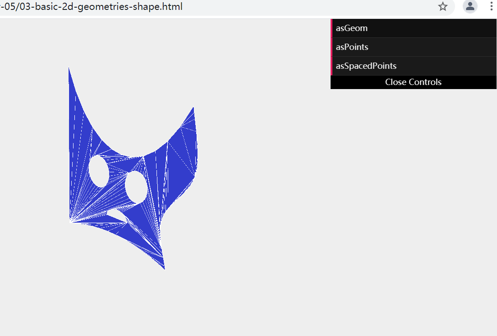</p>

在上面这个例子你可以看到一个定制的二维图形，先不必描述该几何体的属性，让我们来看看用来创建该图形的代码：

```js
function drawShape () {
  // create a basic shape
  var shape = new THREE.Shape();
  // startpoint
  shape.moveTo(10, 10);
  // straight line upwards
  shape.lineTo(10, 40);
  // the top of the figure，curve to the right
  shape.bezierCurveTo(15, 25, 25, 25, 30, 40);
  // spline back down
  shape.splineThru([
    new THREE.Vector2(32, 30),
    new THREE.Vector2(28, 20),
    new THREE.Vector2(30, 10)
  ])

  // curve at the bottom
  shape.quadraticCurveTo(20, 15, 10, 10);
  // add 'eye' hole one
  var hole1 = new THREE.Path();
  hole1.abselllipse(16, 24, 2, 3, 0, Math.PI * 2, true)；
  shape.holes.push(hole1);

  // add 'eye' hole '2'
  var hole2 = new THREE.Path();
  hole2.absellipse(23, 24, 2, 3, 0, Math.PI * 2, true);
  shape.holes.push(hole2);

  // add 'mouth'
  var hole3 = new THREE.Path();
  hole3.absarc(20, 16, 2, 0, Math.PI, true);
  shape.holes.push(hole3);

  // return the shape
  return shape;
}
```
在这段代码drawShape()里，我们用线段（line）、曲线（curve）和样条（spline）创建出图形的轮廓。然后用THREE.Shape类的holes（洞）属性在这个图形上打了几个洞。下面让我们来看看这个创建图形Shape的绘图函数：

|  名称  | 描述  |
|  ----  | ----  |
|  moveTo(x, y)  | 该函数将绘图点移动到指定的x、y坐标处 |
|  lineTo(x, y)  | 该函数从当前位置（例如由moveTo设定的位置）画一条线到指定的x、y坐标处  |
|  quadricCurveTo(aCPx, aCPy, x, y)（二次曲线）  | 你可以用两种方法来定义曲线。你可以用quadraticCurveTo函数，或者用bezierCurveTo函数（下一项）。这两个函数的不同在于它们指定曲线曲率的方法。 |

下图是quadraticCurveTo、bezierCurveTo这两种方法的示意图：

|  名称  | 描述  |
|  ----  | ----  |
|  quadricCurveTo(aCPx, aCPy, x, y)二次曲线  | 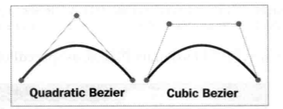 对于二次曲线，我们要额外指定一个点（使用aCPx和aCPy参数），当然还要指定端点（x和y参数）。对于三次曲线（由bezierCurveTo函数绘制），你徐亚多指定两个点才能定义曲线。起始点是路径的当前点 |
|  bezierCurveTo(aCPx1, aCPy1, aCPx2, aCPy2, x, y)贝塞尔曲线  | 根据提供的参数画一条曲线。相关说明可以参考前一行的内容。该曲线的绘制是基于两个定义曲线的坐标（aCPx1、aCPy1、aCPx2和aCPy2）  |
|  splineThru(pts)  | 该函数沿着提供的坐标（点）集合绘制一条光滑曲线。这个参数应该是一个THREE.Vector2对象数组。起始点是路径的当前位置  |
|  arc(ax, ay, aRadius, aStartAngle, aEndAngle, aClockwise)  | 画圆（或者一段圆弧）。圆弧起始于路径的当前位置。ax和ay用来指定圆心与当前位置之间的偏移量。aRadius设置圆的大小，而aStartAngle和aEndAngle则用来定义圆弧要画多长。布尔属性aClockwise决定这段圆弧是顺时针画还是逆时针画  |
| absArc(ax, ay, aRadius, aStartAngle, aEndAngle, aClockwise) | 参考arc的描述。其位置是绝对位置，而不是相对当前位置 |
|  ellipse(aX, aY, xRadius, yRadius, aStartAngle, aEndAngle, aClockwise)  | 参考arc的描述。作为补充，通过ellipse函数我们可以分别指定x轴半径和y轴半径  |
|  absEllipse(aX, aY, xRadius, yRadius, aStartAngle, aEndAngle, aClockwise)  | 参考ellipse的描述。其位置是绝对位置，而不是相对当前位置  |

最后一个我们需要说明的Shape对象属性是holes（孔洞）属性。通过往这个属性中添加THREE.Shape对象，你可以在图形中打几个洞（例如本例中的eye对象）。

但是本节要讨论的是THREE.ShapeGeometry对象，而不是THREE.Shape对象。要从Shape对象创建出一个几何体ShapeGeometry，我们需要编写如下代码：

```js
new THREE.ShapeGeometry(drawShape()); // 这个函数的调用结果是一个用来创建网格的几何体。
```

shape对象本身也有几个辅助函数，你可以用来创建几何体：

|  名称  | 描述  |
|  ----  | ----  |
|  makeGeometry  | 该函数从Shape对象返回一个ShapeGeometry对象  |
|  createPointsGeometry(divisions)  | 该函数将图形转换成一个点集。属性divisions（分段数）定义返回点的数目。这个值越高，返回的点越多，最终的曲线也就越平滑。这个divisions会分别应用到路径中的每一部分。  |
|  createSpacePointsGeometry(divisions)  | 该函数也是将图形转换成一个点集，但是这一次，分段数是一次性地应用到整个路径上  |

若你用createPointsGeometry函数或createSpacePointsGeometry函数构建一个点集，你可以用这些点来构建线段：
```js
new THREE.Line(shape.createPointsGeometry(10), new THREE.LineBasicMaterial({ color: 0xff3333, lineWidth: 2 }))
```

#### 5.1.2 三维几何体
##### 5.1.2.1 CubeGeometry
CubeGeometry是一种非常简单的三维几何体，你只要指定宽度、高度和深度即可创建出一个方块。

```js
new THREE.CubeGeometry(10, 10, 10);
```

下表是方块的所有属性的说明：
|  名称  | 是否必须  | 描述  |
|  ----  | ----  | ----  |
|  width  | 是  | 定义方块的宽度。所谓宽度是方块沿x轴方向的长度  |
|  height  | 是  | 定义方块的高度。所谓宽度是方块沿y轴方向的长度  |
|  depth  | 是  | 定义方块的深度。所谓宽度是方块沿z轴方向的长度  |
|  widthSegments  | 否  | 定义的是沿方块的x轴方向，将面分成多少份。默认值是1  |
|  heightSegments  | 否  | 定义的是沿方块的y轴方向，将面分成多少份。默认值是1  |
|  depthSegments  | 否  | 定义的是沿方块的z轴方向，将面分成多少份。默认值是1  |

通过增加各个分段（segment）属性，你可以将方块的6个大面分成很多小面。这在你用MeshFaceMaterial为方块的不同部分设置特定材质属性时比较有用。

##### 5.1.2.2 [SphereGeometry](https://xsometimes.github.io/learning-threejs/chapter-05/05-basic-3d-geometries-sphere.html)

一个基础的SphereGeometry可以简单地通过`new THREE.SphereGeometry`来创建。下表中的属性可以用来调节结果网络的外观：

|  名称  | 是否必须  | 描述  |
|  ----  | ----  | ----  |
|  radius  | 否  | 设置球体的半径。决定最终网络有多大，默认是50  |
|  widthSegments  | 否  | 指定竖直方向上的分段数。段数越多，球体的表现越光滑。默认值是8，最小值是3  |
|  heightSegments  | 否  | 指定水平方向上的分段数。段数越多，球体的表面越光滑。默认值是6，最小值是2  |
|  phiStart  | 否  | 指定从x轴的什么地方开始绘制。取值范围从0到Math.PI。默认是0  |
|  phiLength  | 否  | 指定从phiStart开始画多少。2*Math.PI是整球，0.5*Math.PI画的是一个打开的1/4球  |
|  thetaStart  | 否  | 指定从y轴的什么地方开始绘制。取值范围从0到Math.PI。默认是0  |
|  thetaLength  | 否  | 指定从thetaStart开始画多少。Math.PI是整球，0.5*Math.PI只会绘制上半球  |

##### 5.1.2.3 [CylinderGeometry](https://xsometimes.github.io/learning-threejs/chapter-05/06-basic-3d-geometries-cylinder.htmll)
通过这个几何体我们可以创建圆柱和类似圆柱的物体，只需调用`new THREE.CylinderGeometry()`。以下是属性：

|  属性  | 是否必须  | 描述  |
|  ----  | ----  | ----  |
|  radiusTop  | 否  | 设置圆柱顶部的尺寸，默认是20  |
|  radiusBottom  | 否  | 设置圆柱底部的尺寸，默认是20  |
|  height  | 否  | 设置圆柱的高度，默认是100  |
|  segmentsX  | 否  | 设置沿x轴分成多少段，默认是8。这个数字越大，圆柱越光滑  |
|  segmentsY  | 否  | 设置沿y轴分成多少段 ，默认是1 。分段越多，意味着面越多|
|  openEnded  | 否  | 指定网络的顶部和底部是否封闭。默认是封闭false  |

这些都是配置圆柱体的基础属性。但有趣的事你可以在顶部（或底部）使用值为负数的半径。若这么设置，你就可以用这个几何体创建一个类似沙漏的图形，如下图所示。需要注意的是，正如你从颜色中所看出的，圆柱的上半部分内外翻转了。如果你用的材质不是设置成THREE.DoubleSide，你就看不到上半部分。

<p align="center">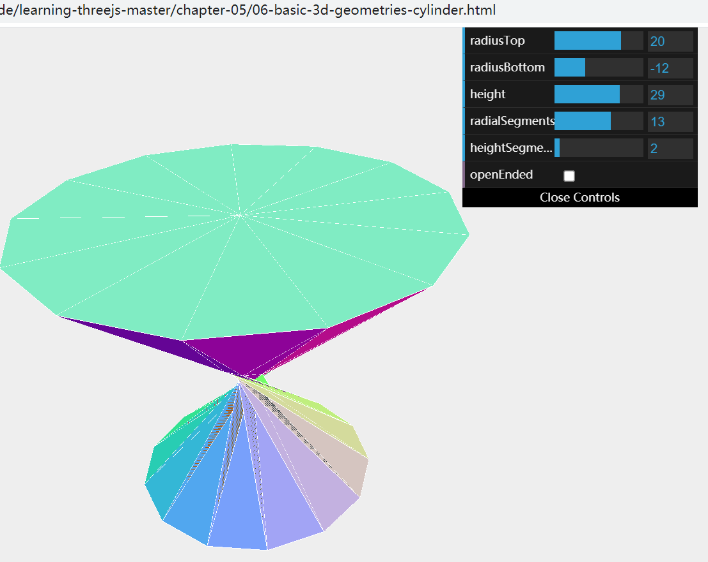</p>

##### 5.1.2.4 [TorusGeometry](https://xsometimes.github.io/learning-threejs/chapter-05/07-basic-3d-geometries-torus.html)
Torus（圆环）是一种简单的图形，看上去像是甜甜圈。下表列出的是创建这个几何体可以指定的参数：

|  属性  | 是否必须  | 描述  |
|  ----  | ----  | ----  |
|  radius  | 否  | 设置的是完整圆环的尺寸，默认值是100  |
|  tube  | 否  | 设置的是管子（真正的甜甜圈）的半径，默认值是40  |
|  radialSegments  | 否  | 设置的是沿圆环长度方向分成的段数。默认是8  |
|  tubularSegments  | 否  | 设置的是沿圆环宽度方向分成的段数。默认是6  |
|  arc  | 否  | 通过该属性的值，你可以控制是否绘制一个完整的圆环。默认值Math.PI * 2  |

##### 5.1.2.5 [TokusKnotGeometry](https://xsometimes.github.io/learning-threejs/chapter-05/08-basic-3d-geometries-torus-knot.html)
通过TorusKnotGeometry你可以创建一个换面扭结。环面扭结是一种比较特别的结，看上去就像是一根管子绕着它自己转了几圈。

如果你打开这个例子，修改属性p和q，你就可以创建出各种各样漂亮的几何体。p属性定义该结**绕其轴**多久旋转一次，q属性定义该结**绕其内部**旋转多少次。（若对细节感兴趣，有篇很不错的[文章](http://en.wikipedia.org/wiki/Torus_knot)）

|  属性  | 是否必须  | 描述  |
|  ----  | ----  | ----  |
|  radius  | 否  | 设置的是完整圆环的尺寸，默认值是100  |
|  tube  | 否  | 设置的是管子的半径 ，该属性的默认值是40 |
|  radialSegments  | 否  | 设置的是沿圆环长度方向分成的段数，默认是8  |
|  tubularSegments  | 否  | 设置的是沿圆环宽度方向分成的段数，默认是6  |
|  p  | 否  | 定义结的形状，默认是2  |
|  q  | 否  | 定义结的形状，默认值是3  |
|  heightScale  | 否  | 通过这个属性你可以拉伸这个环面扭结。默认是1  |

##### 5.1.2.6 [PolyhedronGeometry](https://xsometimes.github.io/learning-threejs/chapter-05/09-basic-3d-geometries-polyhedron.html)
使用这个几何体，可以很容易地创建多面体。多面体是只有平面和直边的几何体。但是多数情况下，你不会直接使用这种几何体。Three.js提供了几种特定的多面体，你可以直接使用，不必直接设置PolyhedronGeometry的顶点和面。我们会在下面几节里继续讨论这些多面体。如果你的确想要直接使用PolyhedronGeometry，那么你不得不指定各个顶点和面。例如，我们要创建一个类似金字塔的多面体：

```js
var vertices = [
  [1, 0, 1],
  [1, 0, -1],
  [-1, 0, -1],
  [-1, 0, 1],
  [0, 1, 0]
];

var faces = [
  [0, 1, 2, 3],
  [0, 1, 4],
  [1, 2, 4],
  [2, 3, 4],
  [3, 0, 4]
];
polyhedron = createMesh(new THREE.PolyhedronGeometry(vertices, faces, controls.radius, controls.detail))
```

当你创建多面体时，可以传入下面的四个属性：
|  属性  | 是否必须  | 描述  |
|  ----  | ----  | ----  |
|  vertices  | 否  | 设置构成多面体的顶点  |
|  faces  | 否  | 指定多面的大小，默认值是1  |
|  radius  | 否  | 指定多面的大小，默认值是1  |
|  detail  | 否  | 通过这个属性你可以给这个多面体添加额外的细节。若设为1，这个多面体上的每个三角形都会分成4个小三角形。如果设为2，那么那些4个小三角形中的每一个都会继续分成4个小三角形，依次类推  |

在本节的开始，我们提到过Three.js提供了几个开箱即用的多面体。在下面的几个小节里，我们将会快速浏览一下这些多面体。

1. IcosahedronGeometry
通过IcosahedronGeometry（正20面体）可以创建出一个有20个相同三角形面的多面体，这些三角形面是从12个顶点创建出来的。

2. TetrahedGeometry
Tetrahedron（正四面体）是简单的多面体。这个多面体只有4个三角形面，而这些面是从4个顶点创建出来的。

3. Octahedron
Octahedron（正八面体）有8个面，这些面是从6个顶点中创建出来。

### 5.2 总结
本章聚焦在简单、易懂的网格，需要记住的最重要的主题如下：
- 试验几何体是可能的。使用本章的示例来了解那些可以用来定制Three.hs提供的标准几何体的属性。
- 开始创建几何体时选择一种合适的材质。不要直接使用那些复杂的材质，可以从简单地MeshBasicMaterial材质开始，并将wireframe属性设为true，或者MashNormalMaterial材质也可以。那样你就可以对几何体的真实形状有一个更好的了解。
- 记住，创建二维几何体时，z轴没有考虑。如果你想拥有一个水平的二维图形，那么你必须将这个网络绕x轴旋转-0.5*Math.PI。
- 如果您要旋转一个二维图形，或者一个开放的三维图形（例如圆柱或者管子），记住要将材质设置成THREE.DoubleSide。如果你不这么做，那么该几何体的内侧或背面将会不可见。


## 第六章 使用高级几何体和二元操作
除了上一章的基础几何体，Three.js还提供了一些比较高级而且特别的对象： ExtrudeGemometry（拉伸几何体）、、ParametricGeometry（参数几何体）、TextGeometry（文本几何体）

- 你将会学习如何使用高级几何体，例如ConvexGeometry（凸面体）、LatheGeometry（扫描面）和TubeGeometry（管状体）。
- 我们会展示如何使用 ExtrudeGemometry（拉伸几何体）从二维图形变成三维图形。画这个二维图形我们用的是Three.js提供的功能。我们还会基于一个从外部加载的SVG图片创建出一个三维图形。
- 如果你想自己创建一些可以定制的图形，可以使用本章或前一章讨论的方法。不过Three.js库也提供了一个ParamtericGeometry对象，通过这个对象你可以基于一组公式来创建几何体。
- 最后，我们来看看如何使用TextGeometry来创建三维文字。
- 另外我们还会展示一下如何使用二元操作从已有的几何体中创建出新几何体。二元操作是由Three.js的扩展THREEBSP提供功能。

### 6.1 [ConvexGeometry](https://xsometimes.github.io/learning-threejs/chapter-06/01-advanced-3d-geometries-convex.html)
通过ConvexGeometry我们可以在一组点的外面建立一个凸包。所谓凸包就是包围这组点的最小图形。

<p align="center">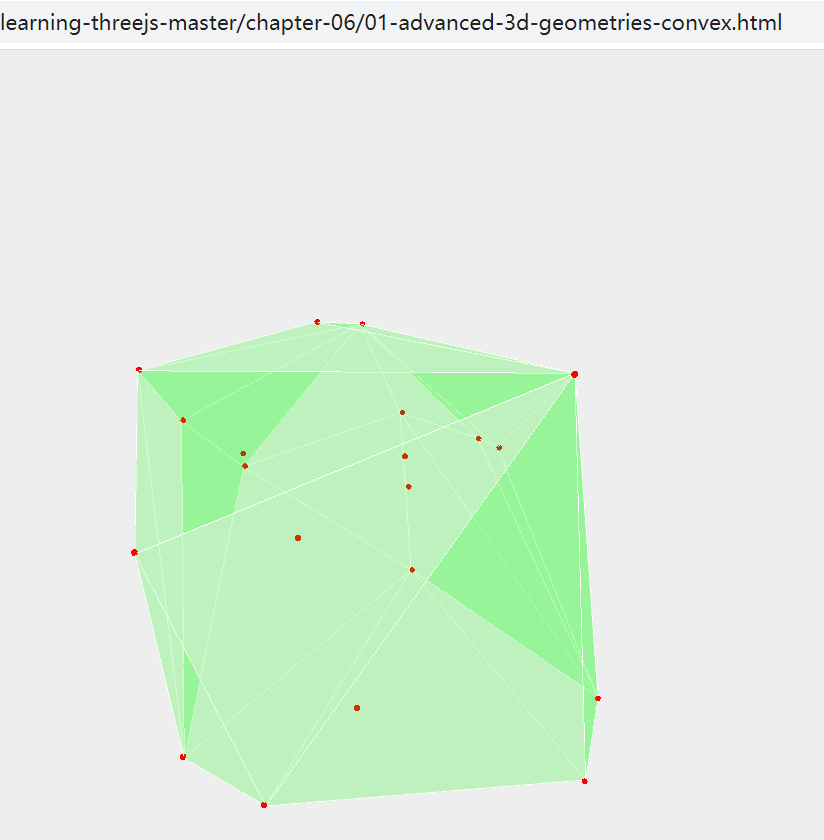</p>

我们在这个例子里随机生成了一组点，然后在这组点的基础上创建了一个ConvexGeometry。你可以点击retraw按钮，生成20个新点，并绘制凸包。我们还为每个点添加了一个小的SpereGeometry（球体），这样可以更高地观察凸包是如何工作的。

```js
function generatePoints () {
  // add 10 random spheres
  var points = [];
  for (var i = 0; i < 20; i++) {
    var randomX = -15 + Math.round(Math.random() * 30);
    var randomY = -15 + Math.round(Math.random() * 30);
    var randomZ = -15 + Math.round(Math.random() * 30);
    points.push(new THREE.Vector3(randomX, randomY, randomZ))
  }

  spGroup = new THREE.Object3D();
  var material = new THREE.MeshBasicMaterial({ color: 0xff0000, transparent: false });
  points.forEach(function(point) { // 遍历随机点的数组，
    var spGeom = new THREE.SphereGeometry(0.2);
    var spMesh = new THREE.Mesh(spGeom, material);
    spMesh.position = point; // 创建SpereGeometry，并把它们定位到这些点上
    spGroup.add(spMesh); // 把这些点都添到一个组中，这样我们就可以很容易地旋转它们。
  });

  // add the points as group to the scene
  scene.add(spGroup)
}

// ...

// use the same points to create a convexgeometry
var convexGeometry = new THREE.ConvexGeometry(points);
convexMesh = createMesh(convexGeometry);
scene.add(convexMesh)
```

### 6.2 [LatheGeometry](https://xsometimes.github.io/learning-threejs/chapter-06/02-advanced-3d-geometries-lathe.html)
通过LatheGeometry你可以从一条光滑曲线开始创建图形。这条曲线是通过指定一些点（也叫节点）来定义的，而这条曲线通常也被称作样条曲线。当这条样条曲线绕一个固定点旋转时就构成了一个类似花瓶或铃铛的图形。

<p align="center">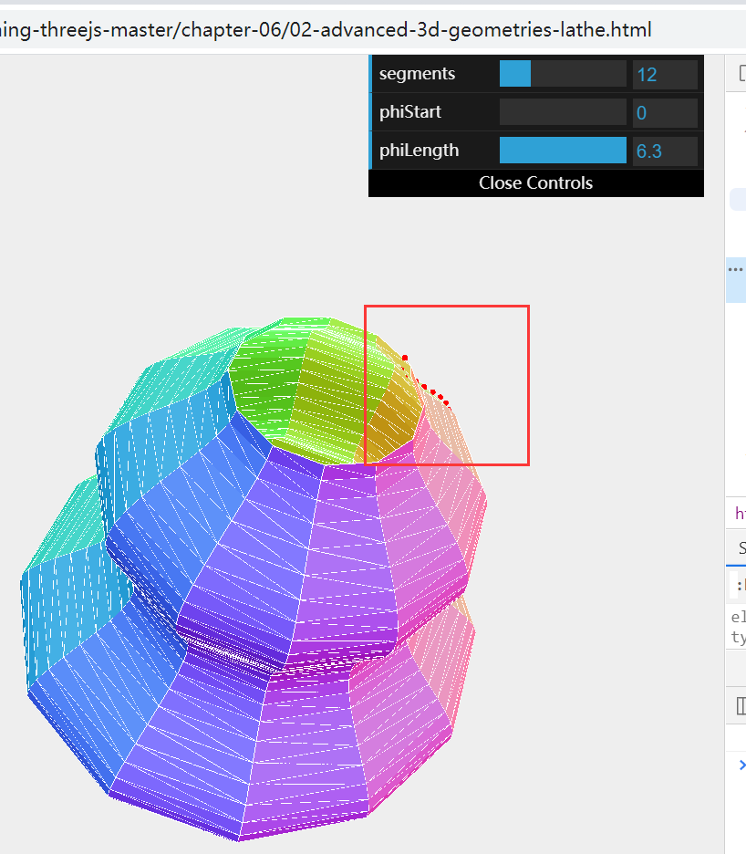</p>

```js
function generatePoints(segments, phiStart, phiLength) {
  // add 10 random spheres
  var points = [];
  var height = 5;
  var count = 30;
  for (var i = 0; i < count; i++) {
    points.push(new THREE.Vector3(
      Math.sin(i * 0.2) + Math.cos(i * 0.3)) * height + 12, 
      0, 
      (i - count) + count / 2);
  }

  // ...

  // use the same points to create a convexgeometry
  var latheGeometry = new THREE.LatheGeometry(points, segments, phiStart, phiLength);
  latheMesh = createMesh(latheGeometry);
  scene.add(latheMesh)
}
```

在这段js代码里你可以看到我们生成了30个点，这些点的x坐标是正弦函数和余弦函数结果的组合，z坐标则是基于变量i和count。通过这些点即可创建出样条曲线，而这些点则用一些红点显示在上面的屏幕截图上。

|  属性  | 是否必须  | 描述  |
|  ----  | ----  | ----  |
|  points  | 是  | 该属性指定构成样条曲线的点，然后基于这条样条曲线生成类似铃铛或花瓶的图形  |
|  segments  | 否  | 该属性指定创建图形时所用的分段数目。这个数字越高，最终的图形越光滑。默认值是12  |
|  phiStart  | 否  | 该属性指定创建图形从圆的何处开始。取值范围从0到2*Math.PI。默认值是0  |
|  phiLength  | 否  | 该属性指定创建出的图形有多完整。例如四分之一图形就是0.5*Math.PI。默认值是完整的360度或2*Math.PI  |

### 6.3 通过拉伸创建几何体
Three.js提供了几个方法让我们可以把一个二维图形拉伸成三维图形。所谓拉伸指的是先画一个图形的二维轮廓，然后沿着z轴将它转换成三维图形。例如，我们拉伸一个THREE.CircleGeometry对象，我们就会得到一个类似圆柱体的图形；我们拉伸一个THREE.PlanceGeometry对象，我们就会得到一个类似方块的图形。

最通用的拉伸图形的方法是使用THREE.ExtrudeGeometry对象。

#### 6.3.1 ExtrudeGeometry
通过ExtrudeGeometry你可以从一个二维图形创建出一个三维图形。

```js
var options = {
  amount: 10,
  bevelThickness: 2,
  bevelSize: 1,
  bevelSements: 3,
  bevelEnabled: true,
  curveSegments: 12,
  steps: 1
};
shape = createMesh(new THREE.ExtrudeGeometry(drawShape(), options));
```

在这段示例代码里，使用drawShape()函数创建图形。然后将这个图形连同options（选项）对象一起传递给THREE.ExtrudeGeometry的构造函数。通过options你可以明确定义图形应该怎样拉伸。下表是对可以传递给THREE.ExtrudeGeometry的各个选项的解释：


|  属性  | 是否必须  | 描述  |
|  ----  | ----  | ----  |
|  amount（数量）  | 否  | 指定图形可以拉多高。默认值是100  |
|  bevelThickness（斜角厚度）  | 否  | 指定斜角的深度。斜角是前后面和拉伸体之间的倒角。默认值是6  |
|  bevelSize（斜角尺寸）  | 否  | 指定斜角的高度。默认值是bevelThickness-2  |
|  bevelSegments（斜角分段数）  | 否  | 定义的是斜角的分段数。段数越多，斜角越光滑。默认值是3  |
|  bevelEnabled（是否用斜角）  | 否  | 如果设为true，就会有斜角。默认值是true  |
|  curveSegments（曲线分段数）  | 否  | 指定拉伸图形时曲线分成多少段。段数越多，曲线越光滑。默认值是12  |
|  steps（拉伸体段数）  | 否  | 定义拉伸体被分成多少段。默认值是1  |
|  extrudePath（拉伸路径）  | 否  | 指定图形沿着什么路径拉伸。如果没有指定，图形就会沿着z轴拉伸  |
|  material（材质）  | 否  | 定义的是前后面所用材质的索引。用函数THREE.SceneUtils.createMultiMaterialObject创建网络  |
|  extrudeMaterial（拉伸材质）  | 否  | 指定斜角和拉伸体所用材质的索引。用函数THREE.SceneUtils.createMultiMaterialObject创建网络  |


#### 6.3.2 [TubeGeometry](https://xsometimes.github.io/learning-threejs/chapter-06/04-extrude-tube.html)
TubeGeometry沿着一条三维样条曲线拉伸出一根管子。你可以通过指定顶点来定义路径，然后TubeGeometry就可以创建这根管子，然后TubeGeometry就可以创建这根管子。

<p align="center">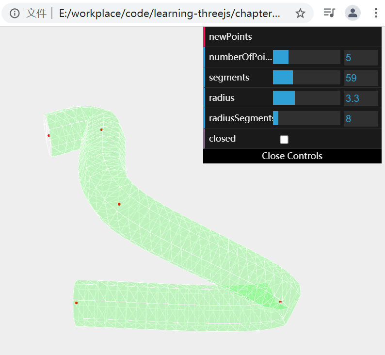</p>

在这个例子里你可以看到，我们随机生成一些点，然后用这些点来画管道。管理管道的代码很简单：

```js
var points = [];
for (var i = 0; i < controls.numberOfPoints; i++) {
  var randomX = -20 + Math.round(Math.random() * 50);
  var randomY = -15 + Math.round(Math.random() * 40);
  var randomZ = -20 + Math.round(Math.random() * 40);

  points.push(new THREE.Vector3(randomX, randomY, randomZ));
}

var tubeGeometry = new THREE.TubeGeometry(new THREE.SplineCurve3(points), segments, radius, radiusSegments, closed);
var tubeMesh = createMesh(tubeGeometry);
scene.add(tubeMesh);

```

我们首先要做的是获取一组顶顶啊，类型是THREE.Vector3。在使用这些点创建管道之前，我们先要把这些点转换成THREE.SplineCurve3类。换言之，我们需要用这些点来定义一条光滑曲线。做法很简单，只要把顶点数组传递给THREE.SplineCurve3构造函数即可。有了样条曲线，我们就可以创建管道，并添加到场景中。

下表列出的是TubeGeometry的所有参数：
|  属性  | 是否必须  | 描述  |
|  ----  | ----  | ----  |
|  path  | 是  | 用一个THREE.SplineCurve对象来指定管道应当遵循的路径  |
|  segments  | 否  | 指定构建这个管道所用的分段数。默认值是64。路径越长，指定的分段数应该越多  |
|  radius  | 否  | 指定管道的半径。默认值是1  |
|  radiusSegments  | 否  | 指定管道圆周的分段数。默认是8。分段数越多，管道看上去越圆滑  |
|  closed  | 否  | 若设为true，管道的头和尾会连起来。默认是false  |
|  debug  | 否  | 若设为true，额外的调试信息会添加到管道上  |

#### 6.3.3 [从SVG拉伸](https://xsometimes.github.io/learning-threejs/chapter-06/05-extrude-svg.html)
我们在讨论ShapeGeometry时曾经提到过SVG和曲线创建图形的方式基本相同。特别是SVG有一个跟Three.js处理图形相同的方式。本节我们将来看看如何使用来自https://github.com/asutherland/d3-threeD的小型库，将SVG路径转换成Three.js图形。

作为一个例子，我们使用ExtrudeGeometry将一个蝙蝠侠标识符的SVG图案转换成
三维图形。

<p align="center">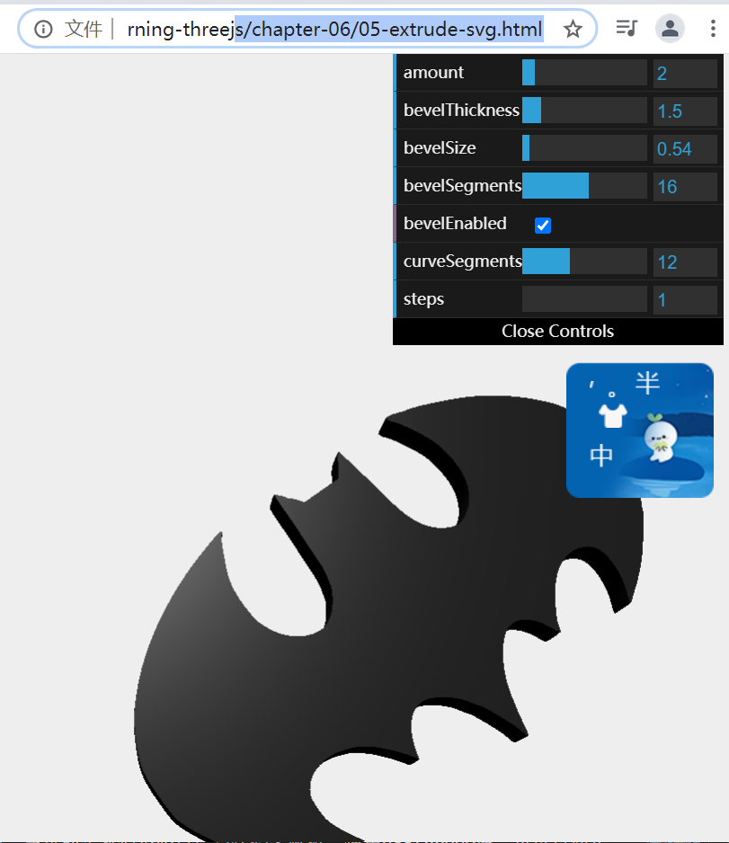</p>

除非你是SVG专家，否则这对你来说就毫无意义。但是基本上你看到的是一组绘图指令。例如， C 277.987 119.348 279.673 116.786 279.673 115.867是告诉浏览器画一条三条Bezier曲线，而L 489.242 111.787则是告诉我们应该在指定位置画一条线。幸运的是我们不必自己写代码来解析。**使用d3-threeD库，可以自动转换这些SVG指令**。该库原是跟优秀的D3.js库一同开发、使用的，但是做了一点儿小小的调整，以便我们能够单独使用其中部分功能。

> SVG的含义是Scalabel Vector Graphics（可缩放矢量图）。这是一个基于XML的标准，用来在网页上创建二维矢量图。该标准是一个开放的标准，大部分现代浏览器都支持。但是直接使用SVG，通过js来操纵它并不直观。幸运的是有好几个开源js库使得使用SVG时简单很多。D3.js和Raphael.js就是其中最好的两个。

```js
function drawShape() {
  var svgString = $('#batman-path').attr('d');
  var shape = transformSVGPathExposed(svgString);
  return shape;
}

var options = {
  amount: 10,
  bevelThickness: 2,
  bevelSize: 1,
  bevelSegments: 3,
  bevelEnabled: true,
  curveSegments: 12,
  steps: 1
};

shape = createMesh(new THREE.ExtrudeGeometry(drawShape(), options))
```

在这段代码里你会看到有一个transformSVGPathExposed函数的调用。该函数式d3-ThreeD库提供的，接受一个SVG字符串作为参数。我们使用表达式

#### 6.3.4 [ParametricGeometry](https://xsometimes.github.io/learning-threejs/chapter-06/06-parametric-geometries.html)
通过ParametricGeometry，你可以创建基于等式的几何体。在你下载的Three.js发布包里，有这样的文件：learning-threejs/libs/ParametricGeometries.js。你可以在这个文件里找到几个公式的例子，并在ParametricGeometry中使用它们。

```js
function plane(u, v) {
  var x = u * width；
  var y = 0;
  var z = v * depth;
  return new THREE.Vector3(x, y, z);
}
```

ParametricGeometry会调用这个函数。u和v的取值范围是0到1，而且针对0到1之间的所有值该函数还会被调用很多次。在这个例子里，u值用来确定向量的x坐标，v值用来确定z坐标。当这个函数被调用，你就会调用一个宽为width，深为depth的基础平面。

我们的例子所做的事情跟这差不多，但创建的不是一个平面，而是一个类似波浪的东西，如下：

<p align="center">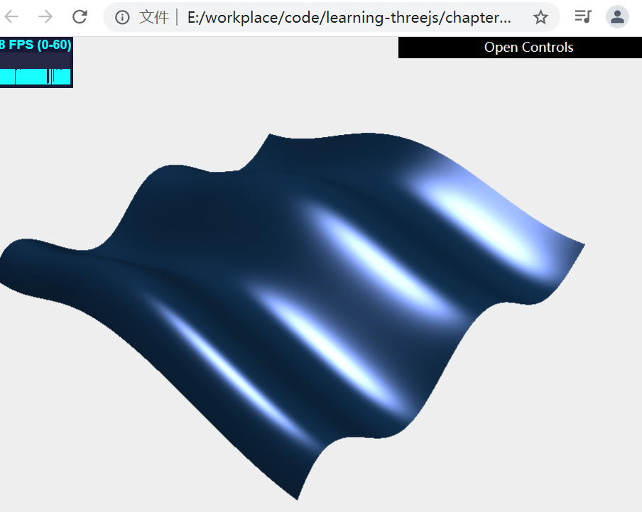</p>

要创建这样的图形，我们要将如下的函数传递给ParametricGeometry：
```js
radialWave = function (u, v) {
  var r = 50;
  var x = Math.sin(u) * r;
  var z = Math.sin(v / 2) * 2 * r;
  var y = (Math.sin(u * 4 * Math.PI) + Math.cos(v * 2 * Math.PI)) * 2.8;
  return new THREE.Vector3(x, y, z);
}

var mesh = createMesh(new THREE.ParametricGeometry(radialWave, 120, 120, false))
```
下表是ParametricGeometry参数的解释：

|  属性  | 是否必须  | 描述  |
|  ----  | ----  | ----  |
|  function  | 是  | 该参数是一个函数，以u、v值（0到1）作为参数，返回值是一个Vector3类型的对象，作为图形上点的坐标  |
|  slices  | 是  | 定义u值应该分成多少份  |
|  stackd  | 是  | 定义v值应该分成多少份  |
|  useTris  | 否  | 默认是false。若设为true，那么该几何体创建时将会使用三角面片。若为false，使用的是四边形  |

最后对slices和stacks属性的使用做一下说明。我们曾经提到过u、v属性会传递给由function属性指定的函数，而且这两个属性的取值范围是0到1。通过slices和stacks属性，我们可以指定function函数会被调用多少次。假如我们将slices设为5，stacks设为4，那么在调用这个函数时将会使用如下参数：

```js
u:0/5, v:0/4
u:1/5, v:0/4
u:2/5, v:0/4
u:3/5, v:0/4
y:4/5, v:0/4
u:5/5, v:0/4
y:0/5, v:1/4
u:1/5, v:1/4
...
u:5/5, v:3/4
y:5/5, v:4/4
```

这两个值越大，那么生成的向量就越多，创建出来的图形看上去就越光滑。

更多例子，可以参考learning-threejs/libs/ParametricGeometries.js。该文件包含的函数可以创建如下的图形：
- 克莱因瓶
- 平面
- 二维莫比乌斯带
- 三维莫比乌斯带
- 管道
- 环面扭结
- 球体

### 6.4 创建三维文本
本节我们来快速看一下如何创建出三维文本效果。首先，我们将会学习如何使用Three.js提供的字体渲染文本，然后学习如何使用你自己定义的字体。

#### 6.4.1 渲染文本

在Three.js中渲染文本非常简单。你所要做的只是指定想用的字体，以及基本的拉伸属性（就是我们在讨论ExtrudeGeometry时见过的那些属性）。

<p align="center">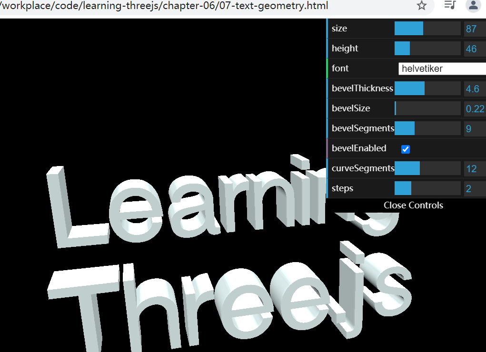</p>

显示这几行文本的代码如下显示：
```js
var options = {
  size: 90,
  height: 90,
  weight: 'normal',
  font: 'helvetiker',
  style: 'normal',
  bevelThickness: 2,
  bevelSize: 4,
  bevelSegments: 3,
  bevelEnabled: true,
  curveSegments: 12,
  steps: 1
};

text1 = createMesh(new THREE.TextGeometry('Learning', options));
text1.position.z = -100;
text1.position.y = -100;
scene.add(text1);

text2 = createMesh(new THREE.TextGeometry('Three.js', options));
scene.add(text2);
```

下表是在TextGeometry里指定的属性：
|  属性  | 是否必须  | 描述  |
|  ----  | ----  | ----  |
|  size  | 否  | 指定文本的大小。默认是100  |
|  height  | 否  | 指定拉伸的长度。默认是50  |
|  weight  | 否  | 指定字体的权重。可选的值是normal和bold。默认是normal  |
|  font  | 否  | 指定要用的字体名。默认是helvetiker  |
|  style  | 否  | 指定字体的样式。可选值包括normal和italic。默认是normal  |
|  bevelThickness（斜角厚度）  | 否  | 指定斜角的深度。斜角是前后面和拉身体之间的倒角。默认值是0  |
|  bevelSize（斜角尺寸）  | 否  | 指定斜角的高度。默认值是8  |
|  bevelSegments（曲线分段数）  | 否  | 定义的是斜角的分段数。段数越多，斜角越光滑。默认值是3  |
|  bevelEnabled（是否用斜角）  | 否  | 若设为true，就会有斜角。默认值是false  |
|  curveSegments（曲线分段数）  | 否  | 指定拉伸图形时曲线分成多少段。段数越多，曲线越光滑。默认值是4  |
|  steps（拉伸体段数）  | 否  | 定义拉伸体被分成多少段。默认值是1  |
|  extrudePath（拉伸路径）  | 否  | 指定图形沿着什么路径拉伸。如果没有指定，图形就会沿着z轴拉伸  |
|  material（材质）  | 否  | 定义的是前后面所用材质的索引。用函数THREE.SceneUtils.createMultiMaterialObject创建网格  |
|  extrudeMaterial（拉伸材质）  | 否  | 指定斜角和拉伸体所用材质的索引。用函数THREE.SceneUtils.createMultiMaterialObject创建网络  |

Three.js所包含的字体也被添加到本书的源码中了。你可以在文件夹assets/fonts中找到它们。

> 如果你想渲染一组二维文字，例如用作材质的纹理，那么你不应该使用TextGeometry。TextGeometry和js字体引入了很多操作。对于简单的二维字体渲染，最好使用HTML5画布。通过context.font属性，你可以设置要用的字体，通过context.fillText属性你可以将文本输出在画布上。

在这个几何体中也可以使用其他字体，不过你首先要把它们转换成JS，如果转换下节将会说明。

#### 6.4.2 添加自定义字体
Three.js提供了几种可以在场景中使用的字体。这些字体的基础是由[typeface.js](http://typeface.neocracy.org)提供的字体。typeface.js是一个可以将TrueType和OpenType字体转换成JS的库。转换出来的JS文件可以包含在你的页面中，然后即可在Three.js中使用。

要转换已有的OpenType或TrueType字体，可以使用[网页](http://typeface.neocracy.org/fonts.html)。你可以在这个网页上上传一个字体，然后它就会帮你把该字体转换JS。要包含这个字体，如果在你的HTML页面顶部加上如下几行代码即可：
```js
<script type="text/javascript" src="../assete/fonts/bitstream_vera_sans_mono_roman.typeface.js"></script>
```

这样即可加载该字体，并在Three.js中使用。如果你想知道字体的名字（用在font属性上），你可以使用如下的JS代码，将字体缓存输出到控制台上：
```js
console.log(THREE.FontUtils.faces)
```

<p align="center">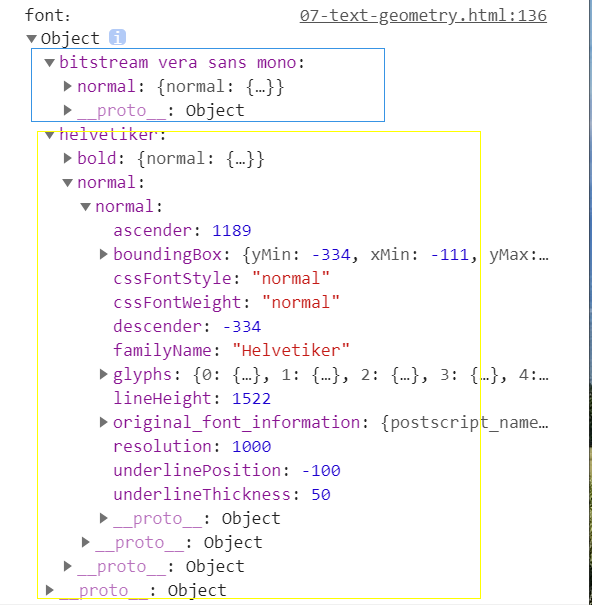</p>
从上图可以看出字体helvetiker能够使用权重bold和normal。字体bitstream verasans mono能够使用权重normal。

另外一种查看字体名的方法是看该字体的JS源码。在这个文件的结尾你会找到一个名为familyName的属性。

### 6.5 [使用二元操作组合网络](https://xsometimes.github.io/learning-threejs/chapter-06/08-binary-operations.html)
本节我们将会看到一种特别的创建几何体的方法。在本章之前的小节，以及前一章里，我们一直使用Three.js默认提供的几何体来创建几何体。通过默认的属性几何，你可以创建出漂亮的模型，但是你所能做的也会受制于Three.js所提供的内容。在本节，我们将向你展示如何将各种标准几何体组合在一起创建出新的几何体。为此，我们将使用Three.js的扩展库[THREEBSP](https://github.com/skalnik/ThreeBSP)。这个扩展库提供如下三个函数：
|  名称  | 描述  |
|  ----  | ----  |
|  intersect（相交）  | 使用该函数可以在两个几何体的交集上创建出新的几何体。两个几何体相互交叠的地方就是新的几何体  |
|  union（联合）  | union函数可以将两个几何体联合在一起创建出新的几何体。你可以将这个函数与我们将会在第8章讨论的mergeGeometry函数相比较  |
|  subtract（相减）  | substract函数与union函数相反。通过这个函数你可以在第一个几何体中减去两个几何体交叠的部分，从而创建出新的几何体  |

上面所示的例子是依次使用union和subtract功能所可能创建出来的几何体。使用这个库需要把它包含在我们的网页中。该库是用coffee-script（咖啡脚本）写的，这是一种对用户更加友好的JS脚本的变体。要使用这个库我们有两个选择。我们可以添加coffeescript文件，并在运行时编译，或者将它预先变异成JS文件，然后直接包含编译后的文件。对于第一种方法，我们需要做的是：
```js
<script type="text/javascript" src="../libs/coffee-script.js"></script>
<script type="text/javascript" src="../libs/ThreeBSP.coffee"></script>
```

ThreeBSP.coffee文件中包含我们所需的功能，而coffee-script.js文件则可以解析ThreeBSP所用的coffee语言。最后一步是要保证在我们使用ThreeBSP功能之前，ThreeBSP.coffee文件已经解析完毕。为此我们要在页面文件底部添加如下代码：
```js
<script type="text/coffeescript">
onReady();

// 将我们原先的匿名函数改名为onReady
function onReady() {
  // Three.js code
}

</script>
```

如果我们使用coffee-script的命令行工具预先将coffee-script编译成JS，我们就可以在网页中直接包含编译好的JS文件。要将它编译成JS代码可以使用如下的命令行：
```js
coffee --compile ThreeBSP.coffee
```

该命令可以创建出一个ThreeBSP.js文件，我们可以将它包含在示例文件中，就像我们使用其他JS文件一样。在我们的示例里使用的是第二种方法，因为相比在加载网页时再编译coffee-script文件，这种方式加载起来比较快。

#### 6.5.1 subtract函数
在我们讲解subtract函数之前，有一个重要的步骤你需要记住。**这三个函数在计算时使用的是网络的绝对位置**。所以如果你在应用这些函数之前将网络组合在一起或者使用多种材质，你可能会得到一些奇怪的结果。为了得到最好的、可预测的结果，应当确保**使用未经组合的网络**。

我们先来看看subtract功能。

<p align="center">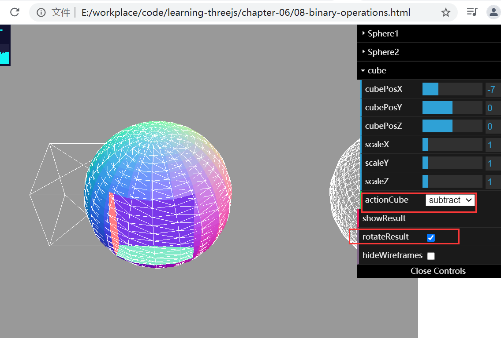</p>

该场景中有三个线框，一个方块和两个球体。Sphere1是中间那个球，所有操作都会在这个对象上执行；Sphere2是右边那个球，cube是右边的方块。在Sphere2和Cube上可以指定四种操作中的一种：subtract、union和intersect和none（无操作）。这些操作都是基于Sphere1的。如果把Sphere2的操作设为subtract，并选择showResult，（隐藏线宽）其结果就是从Sphere1和Sphere2交叠的区域。需要说明的是，点击showResult按钮后要过几秒钟这些操作才能完成。

<p align="center">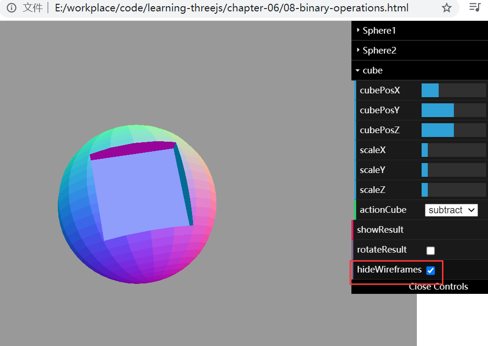</p>

```js
function redrawResult() {
  scene.remove(result);
  var sphere1BSP = new ThreeBSP(sphere1);
  var sphere2BSP = new ThreeBSP(sphere2);
  var cube2BSP = new ThreeBSP(cube);

  var resultBSP;

  // first do the sphere
  switch(controls.actionSphere) {
    case 'subtract':
      resultBSP = sphere1BSP.subtract(sphere2BSP);
      break;
    case 'intersect':
      resultBSP = sphere1BSP.intersect(sphere2BSP);
      break;
    case 'union':
      resultBSP = sphere1BSP.union(sphere2BSP);
      break;
    case 'none': // noop;
  }

  // next do the cube
  if (!resultBSP) resultBSP = sphere1BSP;

  switch (controls.actionCube) {
    case 'subtract':
      resultBSP = resultBSP.subtract(cube2BSP);
      break;
    case 'intersect':
      resultBSP = resultBSP.intersect(cube2BSP);
      break;
    case 'union':
      resultBSP = resultBSP.union(cube2BSP);
      break;
    case 'none': // noop;
  }

  if (controls.actionCube === 'none' && controls.actionSphere === 'none') {
    // do nothing
  } else {
    result = resultBSP.toMesh();
    result.geometry.computeFaceNormals();
    result.geometry.computeVertexNormals();
    scene.add(result);
  }
}
```

在代码中我们首先将网络（也就是那些线框）包装成一个ThreeBSP对象。只有这样才能在这些对象上调用subtract、intersect和union函数。现在我们只在中间那个球的ThreeBSP对象（sphere1BSP）上调用指定的函数，该函数的结果包含了所有创建网格所需的信息。要创建该网络，我们只需调用toMesh()函数，并通过调用computeFaceNormals()和computeVertexNormals()函数确保所有的法向量可以正确计算出来。之所以要调用这两个函数，是因为**在执行二元操作之后，几何体纵顶点和面的法向量可能会改变**。Three.js在着色时会用到面法向量和顶点法向量。明确地重新计算面和顶点的法向量，可以保证新生成的对象着色光滑（在材质的着色方法设置成THREE.SmoothShading时）、渲染正确，并且可以将结果添加到场景中。

#### 6.5.2 intersect函数
调用该函数，只要网格交叠的部分可以保留下来。
<p align="center">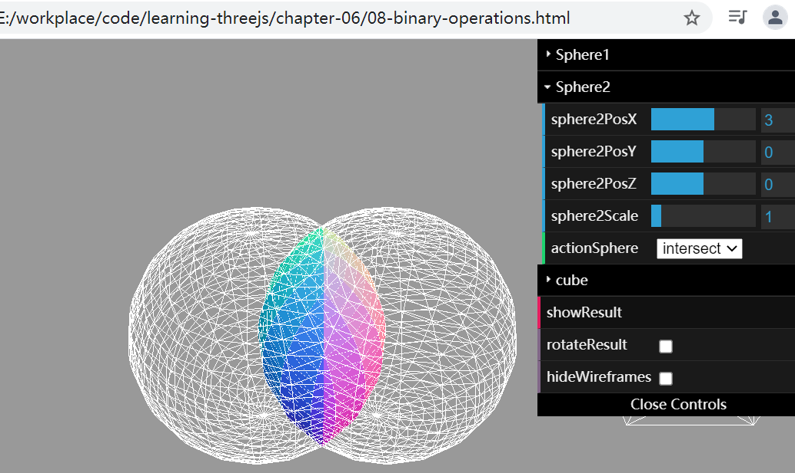</p>

#### 6.5.3 union函数
通过这个函数我们可以将两个网络连成一体，从而创建出新的几何体。
<p align="center">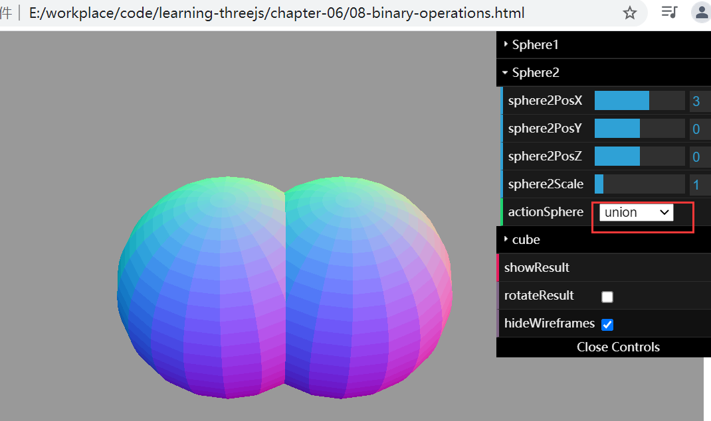</p>

### 6.6 总结
在本章我们介绍了几种高级几何体，并且介绍了如何使用简单的二元操作创造出看上去很有趣的几何体。本章需要记住的最重要的东西是：
- 使用诸如ConvexGeometry、TubeGeometry和LatheGeometry你可以创建出相当有趣的几何体。
- 将已有的SVG路径转换成Three.js路径是可能的。你可能需要使用诸如Inkscape的工具微调一下这个路径。
- 通过extrudeGeometry，你可以轻松地将二维几何体转换成三维几何体。一般你可以沿着z轴进行拉伸，但也可以沿着自定义路径进行拉伸。
- 使用文本时需要指定字体。Three.js提供了几种字体。你也可以创建自定义的字体，不过复杂字体往往不能正确地转换。
- 通过ThreeBSP，你可以在网格上应用三种二元操作：union、subtract和intersect。通过union你可以将两个网格联合在一起；通过subtract，你可以从一个网格中移除它跟其他网络交叠的部分；通过intersect，你可以只保留网格交叠的部分。

到目前为止我们看到的几何体都是固体（或线框），我们的顶点彼此相连构成物体表面。下一章我们将会看到另外一种展示几何体的方法，即所谓的粒子。使用粒子时我们不必渲染整个几何体，只要将顶点渲染成空间中的点即可。这样你就可以创建出漂亮的、高性能的三维效果。

## 第七章 粒子和粒子系统
使用粒子可以很容易地创建出很多细小的物体，可以用来模拟雨滴和雪花。你也可以用粒子来创建有趣的三维效果。例如，你可以将某个单一几何体渲染成一组粒子，并分别对他们进行控制。本章我们将来探索以下Three.js提供的各种粒子功能：
- 使用ParticleBasicMaterial（基础粒子材质）创建和设计粒子。
- 使用ParticleSystem（粒子系统）创建一个粒子几何。
- 使用已有的几何体创建一个例子系统。
- 让粒子和粒子系统动起来。
- 用纹理为粒子造型。
- 使用ParticleCanvasMaterial在画布上为粒子造型

### 7.1 理解粒子
<p align="center">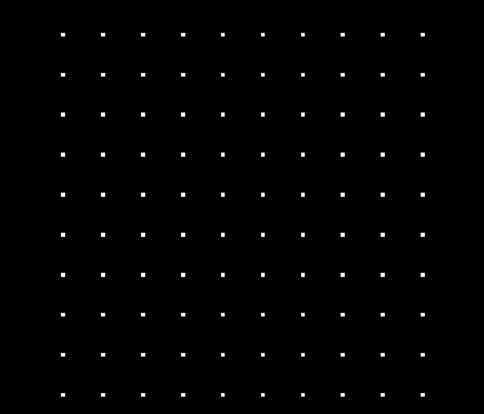</p>
在这个截图里你所看到的是100个粒子。若在创建粒子的时候没有指定任何属性，那么例子就会被渲染成二维的白色小方块。创建这些例子的代码如下所示：

```js
// 使用THREE.Particle(material)构造函数手工创建粒子。
function createParticles () {
  var material = new THREE.ParticleBasicMaterial();
  for (var x = -5; x < 5; x++) {
    for (var y = -5; y < 5; y++) {
      var particle = new THREE.Particle(material);
      particle.position.set(x * 10, y * 10, 0);
      scene.add(particle);
    }
  }
}
```

跟THREE.Mesh一样，THREE.Particle也是THREE.Object3D对象的拓展。这也就是说THREE.Mesh大部分的属性和函数都可以用于THREE.Particle。你可以用Position属性来定位，用scale属性来缩放，用translate属性来做相对位移。

对于这种创建粒子的方法，最后需要说明的是，如果你看过本示例的完整代码，你可能会发现我们使用的渲染器是CanvasRenderer，而不是我们在大多数示例中使用的WebGLRenderer。原因是**创建粒子并直接添加到场景中，只对CanvasRenderer有效**。如果是WebGLRenderer，我们首先要创建一个THREE.ParticleSystem对象，然后通过这个对象来创建粒子。使用WebGLRenderer要获得前面截图所示的效果，我们需要使用如下的代码：

```js
function createParticles () {
  var geom = new THREE.Geometry();
  var material = new THREE.ParticleBasicMaterial({
    size: 4,
    vertexColors: true,
    color: 0xffffff
  });

  for (var x = -5; x < 5; x++) {
    for (var y = -5; y < 5; y++) {
      var particle = new THREE.Vector3(x * 10, y * 10, 0);
      geom.vertices.push(particle);
      geom.colors.push(new THREE.Color(Math.random() * 0x00ffff));
    }
  }
  
  var system = new THREE.ParticleSystem(geom, material);
  scene.add(system);
}
```

正如你所看到的，我们需要为每个例子创建一个顶点（用Vector3表示），并添加到一个几何体中，然后创建一个ParticleSystem对象，再把这ParticleSystem对象添加到场景中。

### 7.2 [粒子、粒子系统和BasicParticleMaterial](https://xsometimes.github.io/learning-threejs/chapter-07/03-basic-point-cloud.html)
在上节末尾我们简单介绍了一下粒子系统（ParticleSystem）。除非使用CanvasRender类，否则你就需要使用ParticleSystem类来显示粒子。ParticleSystem类的构造函数接受两个参数：一个几何体和一个材质。材质用来给粒子上色和添加纹理，而几何体则是用来指定将粒子放在哪里。每个顶点，即定义几何体的各个点，将会以粒子的形态展示出来。若我们基于一个CubeGeometry对象创建ParticleSystem对象，我们将会得到8个粒子，方块上的每个角一个。

<p align="center">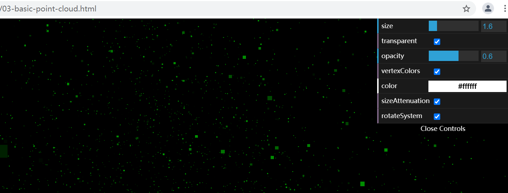</p>

但是一般来讲，我们不会使用标准的Three.js几何体来创建ParticleSystem，而是从零开始手工将顶点添加到几何体上，就像我们在上一章末尾所做的那样。本节我们将进一步来看看这种方法，还要看看如何使用BasicParticleMaterial来格式化粒子。

```JS
function createParticles (size, transparent, opacity, vertexColors, sizeAttenuation, color) {
  var geom = new THREE.ParticleBasicMaterial({ // 或THREE.PointCloudMaterial
    size: size,
    transparent: transparent,
    opacity: opacity,
    vertexColors: vertexColors,
    sizeAttenuation: sizeAttenuation,
    color: color
  });
  var range = 500;
  for (var i = 0; i < 15000; i++) {
    var particle = new THREE.Vector3(
      Math.random() * range - range / 2,
      Math.random() * range - range / 2,
      Math.random() * range - range / 2
    );

    geom.vertices.push(particle);
    var color = new THREE.Color(0x00ff00);
    color.setHSL(color.getHSL().h, color.getHSL().s, Math.random() * color.getHSL().l);
    geom.colors.push(color)
  }

  system = new THREE.ParticleSystem(geom, material);
  scene.add(system);
}
```

在上面列出的代码里，我们先创建了一个THREE.Geometry对象。然后我们会把用THREE.Vector3对象表示的粒子添加到这个几何体中。为此我们使用了一个简单的循环，在这个循环中我们在随机的位置上创建THREE.Vector3，并把它添加到几何体中。在同一个循环中我们还定义了一个颜色数组，geom.colors。该数组只有在ParticleBasicMaterial的vertexColors属性设为true时才会用到。最后要做的是使用指定的属性创建ParticleBasicMaterial对象，创建ParticleSystem，并添加到场景中。下表是ParticleBasicMaterial对象中所有可设置属性的说明：

|  名称  | 描述  |
|  ----  | ----  |
|  color  | ParticleSystem对象中所有粒子的颜色。如果vertexColors属性值为true，而且也指定了几何体的colors属性，那么该属性就会被忽略。默认值是0xFFFFFF  |
|  map  | 通过这个属性可以在粒子上应用某种材质。例如可以让粒子看起来像雪花。  |
|  size  | 指定粒子的大小。默认是1  |
|  sizeAnnutation  | 若设为false，那么所有例子都将拥有相同的尺寸，无论他们距离相机有多远。若设为true，粒子的大小决定于其距离相机的远近。默认是true  |
|  vetexColors  | 通常情况下ParticleSystem里的所有粒子都具有相同的颜色。若属性设为true，而且几何体的colors数组也有值，那就使用颜色数组中的值。默认是false  |
|  opacity  | 跟transparent属性一起使用，用来设置粒子的透明度。默认是1（不透明）  |
|  transparent  | 若设为true，那么粒子在渲染时会根据opacity属性的值来确定其透明度。默认是false  |
|  blending  | 渲染粒子时的融合模式。（有关融合模式的更多内容请参考第9章）  |
|  fog  | 粒子是否受场景的雾化效果影响。默认是true  |

到目前为止，我们还只是把粒子渲染成一些小方块，默认即是如此。但是，Three.js还提供了两种可以用来格式化粒子的方法。我们可以应用ParticleCanvasMaterial对象，将HTML5画布上绘制的内容作为粒子的纹理；或者使用ParticleBasicMaterial的map（贴图）属性，加载外部的照片。

### 7.3 使用HTML5画布格式化粒子
Three.js提供了两种使用HTML5画布格式化粒子的方法。若你使用的是CanvasRenderer类，那么你可以在ParticleCanvasMaterial对象里直接引用HTML5画布。如果你用的是WebGLRenderer类，那么需要采取一些额外的步骤，才能在格式化粒子时使用HTML5画布。

#### 7.3.1 [在CanvasRenderer类里使用HTML5画布](https://xsometimes.github.io/learning-threejs/chapter-07/04-program-based-sprites.html)
使用ParticleCanvasMaterial，你可以将HTML5画布的输出结果作为粒子的纹理。该纹理是特别为CanvasRenderer创建的，而且只能用于这种渲染器。下表是该材质可以设置的属性：

|  名称  | 描述  |
|  ----  | ----  |
|  color  | 粒子的颜色。根据特定的融合模式，可以影响画布的颜色  |
|  program  | 这是一个以画布上下文为参数的函数。该函数在渲染粒子时调用。调用该函数将在画布上下文中产生一个输出，该输出将会以粒子的形态显示出来  |
|  opacity  | 粒子的透明度。默认是1，不透明  |
|  transparent  | 粒子是否透明。同opacity属性一起使用  |
|  blending  | 融合模式。更多细节参考第9章  |

<p align="center">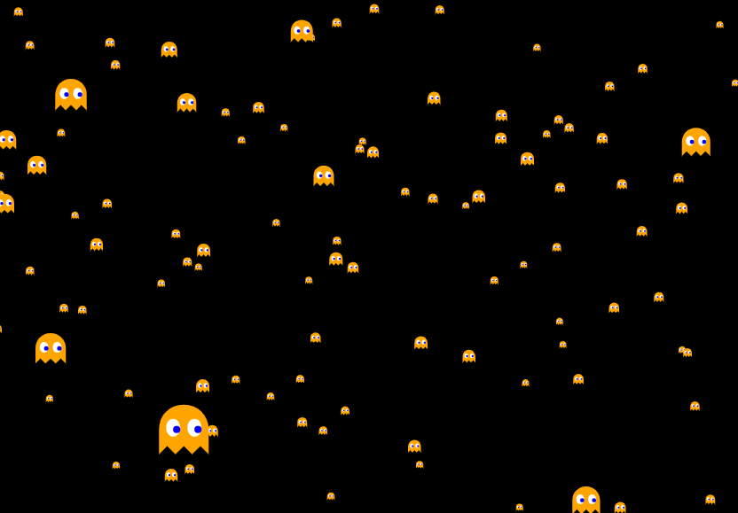</p>

在这个例子里，粒子时通过createParticles函数创建的：

```js
function createParticles () {
  var material = new THREE.ParticleCanvasMaterial({
    program: draw,
    color: 0xffffff
  });

  var range = 500;
  for (var i = 0; i < 1000; i++) {
    var particle = new THREE.Particle(material);
    particle.position = new THREE.Vector3(
      Math.random() * range - range / 2,
      Math.random() * range - range / 2,
      Math.random() * range - range / 2);
    particle.scale = 0.1;
    particle.rotation.z = Math.PI;
    scene.add(particle);
  }
}
```

这段代码跟前一节的那段代码很像。主要的不同是，因为我们用的是CanvasRenderer，所以我们可以直接创建THREE.Particle对象，而不必使用ParticleSystem。在这段代码里，我们还定义了一个ParticleCanvasMaterial对象，该对象的program属性指向一个draw函数。draw函数定义粒子的外观（Pac-Man中的精灵）：

```js
var draw = function (ctx) {
  ctx..fillStyle = 'orange';
  // ...
  // lots of other ctx drawing calls
  // ...
  ctx.beginPath();
  ctx.fill();
}
```

我们不会详细讲解绘制粒子外形的画布代码。重要的是我们定义了一个函数，接受二维画布上下文作为参数。在这个上下文中绘制的结果将会作为粒子（THREE.Particle）的外形。

#### 7.3.2 [在WebGLRenderer中使用HTML5画布](https://xsometimes.github.io/learning-threejs/chapter-07/05a-program-based-point-cloud-webgl.html)
如果要使用WebGLRenderer类做同样的事情，我们不得不采用另外的方式。ParticleCanvasMaterial在这里不能用，只能用ParticleBasicMaterial有一个map（贴图）属性。通过map属性我们可以为粒子加载纹理。该纹理在Three.js中也可以是HTML5画布的输出。

让我们来看看实现该效果的代码。大部分代码跟之前按个WebGL的例子一样，所以我们不会解释太多细节。这个例子中最重要的改变时下面这段代码：
```js
var getTexture = function () {
  var canvas = document.createElement('canvas');
  canvas.width = 32;
  canvas.height = 32;
  var ctx = canvas.getContext('2d');
  // ...
  // draw the ghost
  // ...
  ctx.fill();
  var texture = new THREE.Texture(canvas);
  texture.needsUpdate = true;
  return texture;
}

function createParticles(size, transparent, opacity, sizeAttenuation, color) {
  var geom = new THREE.Geometry();
  var material = new THREE.ParticleBasicMaterial({
    size: size,
    transparent: transparent,
    opacity: opacity,
    map: getTexture(),
    sizeAttenuation: sizeAttenuation,
    color: color
  });

  var range = 500;
  for (var i = 0; i < 5000; i++) {
    var particle = new THREE.Vector3(
      Math.random() * range - range / 2,
      Math.random() * range - range / 2,
      Math.random() * range - range / 2);
    geom.vertices.push(particle);
  }

  system = new THREE.ParticleSystem(geom, material);
  system.sortParticles = true;
  system.name = 'particles';
  scene.add(system);
}
```

在这两个JS函数中的第一个函数（getTexture）里面，我们基于HTML5画布创建了一个了THREE.Texture对象。在第二个函数（createParticles）里面，我们将这个纹理赋予map属性。在这个函数里面你还可以看到我们将ParticleSystem对象的sortParticles属性设成了true。这样可以保证粒子在渲染之前沿着屏幕上的z轴排好序。如果你发现有部分交叠的粒子或者透明度不正确，那么将这个属性设为true通常可以纠正类似的错误。在我们讨论ParticleSystem的属性时，有一个我们可以设置的属性叫做**ParticleSystem: FrustrumCulled。如果该属性设为true，意味着落在相机可见范围外的粒子不会被渲染**。必要时，使用该设置可以提高频率和帧频。


### 7.4 使用纹理格式化粒子
在前面的例子里我们看了如何使用HTML5的画布来格式化一个粒子系统。因为你可以画任何你想画的，甚至是加载外部的图片，所以你可以用该方法为粒子系统添加所有格式。但是还有一种更加直接的、使用图片格式化粒子的方法。在Three.js中可以使用THREE.ImageUtils.loadTexture()方法加载外部的图片。

1. THREE.ImageUtils.loadTexture()

<p align="center">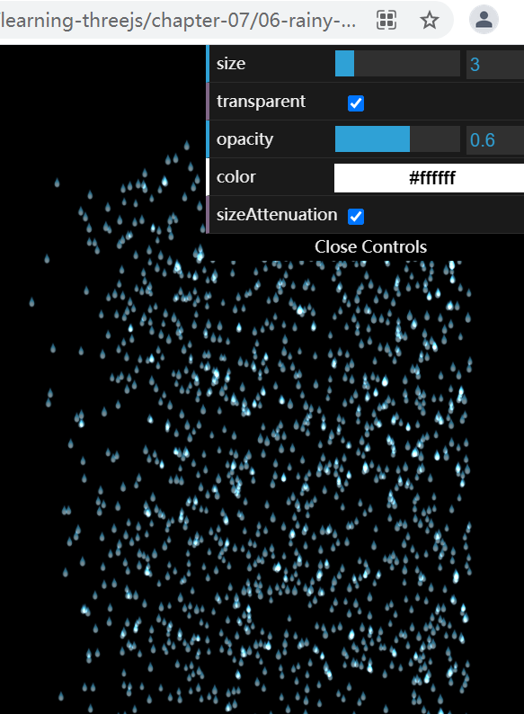</p>

我们首先要做的是获取表示雨滴的纹理。你可以在assets/textures/particles文件夹下找到几个例子。（我们将在第9章讲解使用纹理的所有细节和要求）。现在你只需知道纹理应该是正方形的，尺寸是2的倍数（例如64*64、128*128、256*256）。在本例中我们使用如下的纹理：

<p align="center">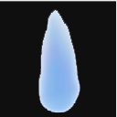</p>

该图片使用了黑色的背景（为了能够正确地融合），展示了一个雨滴的形状和颜色。在ParticleBasicMaterial里使用该纹理之前，我们首先要加载它，可以用下面的代码来完成：
```js
var texture = THREE.ImageUtils.loadTexture('../assete/particles/raindrop-2.png');
```

这行Three.js代码可以加载纹理，这样我们就可以在材质中使用它。在本例中我们使用如下的代码片段来定义材质：
```js
var material = new THREE.ParticleBasicMaterial({
  size: 3,
  transparent: true,
  opacity: true,
  map: texture,
  blending: THREE.AdditiveBlending,
  sizeAttenuation: true,
  color: 0xffffff
})
```

这里主要需要理解的是：map属性指向我们用THREE.ImageUtils.loadTexture()函数加载的纹理，而且我们还将blending（融合）模式设成了THREE.AdditiveBlending。这个融合模式的含义是在画新像素时，背景像素的颜色会被添加到新像素上。对于我们的雨滴纹理来首，这意味着黑色背景不会显示出来。另外一种方式是**将纹理中的黑色定义成透明的，但是这种组合在粒子和WebGL中不起作用**。

这样粒子系统就格式好了。当你打开这个示例时，你还会发现这些粒子都在移动。在前面的例子我们移动的是整个粒子系统，这次我们设置的是粒子系统中每个单独粒子的位置。每个粒子都是构成ParticleSystem对象几何体的顶点。

```js
var range = 40;
for (var i = 0; i < 1500; i++) {
  var particle = new THREE.Vector3(
    Math.random() * range - range / 2,
    Math.random() * range * 1.5,
    Math.random() * range - range / 2);
  particle.velocityY = 0.1 + Math.random() / 5;
  particle.velocityY = (Math.random() - 0.5) / 3;
  geom2.vertices.push(particle);
}
```

这跟我们前面看的例子没有太大差别。唯一改变的是每个粒子（THREE.Vector3对象）上都增加了两个属性：velocityX和velocityY。每个属性定义的是粒子（水滴）以多快的速度横向移动，第二个属性定义的是粒子以多快的速度下降。横向运动速度的范围是-0.16到+0.16，纵向运动速度的范围是0.1到0.3。现在每个雨滴都有自己的速度，我们可以在渲染循环体中移动每一个粒子，代码如下所示：

```js
var vertices = system2.geometry.vertices;
vertices.forEach(function(v){
  v.y = v.y - (v.velocityY);
  v.x = v.x - (v.velocityX);

  if (v.y <= 0) v.y = 60;
  if (v.x <= -20 || v.x >= 20) v.velocityX = v.velocityX * -1; 
})
```

在这段代码中我们从几何体中获取用来创建ParticleSystem对象的所有顶点（vertices，即粒子）。对于每个粒子我们用velocityX和velocityY来改变它们的当前位置。最后两行用来保证粒子处在我们定义的范围内。如果y方向的位置低于0，我们就把雨滴放回顶部；如果x方向的位置超过了任何一条边界，我们就把横向运动速度取反，让雨滴反弹。

2. 使用多个材质————使用多个粒子系统

这次我们模拟的不是雨，而是雪。另外我们也不会使用单一纹理，而是使用五个不同的照片。

<p align="center">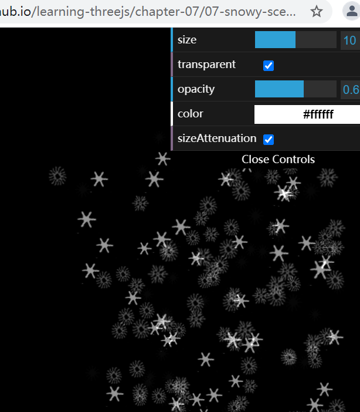</p>

在上面的截图里你可以看到我们用多张图片作为纹理，而不是一张。**ParticleSystem只能有一张材质，若要用多个材质，那么只能使用多个粒子系统**：

```js
// 对纹理分别进行加载，然后将所有信息传递给创建ParticleSystem的createSystem函数
function createParticles(size, transparent, opacity, sizeAttenuation, color) {
  var texture1 = THREE.ImageUtils.loadTexture('../assets/textures/particles/snowflake1.png');
  var texture2 = THREE.ImageUtils.loadTexture('../assets/textures/particles/snowflake2.png');
  var texture3 = THREE.ImageUtils.loadTexture('../assets/textures/particles/snowflake3.png');
  var texture4 = THREE.ImageUtils.loadTexture('../assets/textures/particles/snowflake5.png');

  scene.add(createSystem('system', texture1, size, transparent, opacity, sizeAttenuation, color));
  scene.add(createSystem('system', texture2, size, transparent, opacity, sizeAttenuation, color));
  scene.add(createSystem('system', texture3, size, transparent, opacity, sizeAttenuation, color));
  scene.add(createSystem('system', texture4, size, transparent, opacity, sizeAttenuation, color));
}

function createSystem(name, texture, size, transparent, opacity, sizeAttenuation, color) {
  var geom = new THREE.Geometry();
  var color = new THREE.Color(color);
  color.setHSL(color.getHSL().h, color.getHSL().s, (Math.random()) * color.getHSL.l);

  var material = new THREE.ParticleBasicMaterial({
    size: size,
    transparent: transparent,
    opacity: opacity,
    map: texture,
    blending: THREE.AdditiveBlending,
    depthWrite: false,
    sizeAttenuation: sizeAttenuation,
    color: color
  });

  var range = 40;
  for (var i = 0; i < 50; i ++) {
    var particle = new THREE.Vector3(
      Math.random() * range - range / 2,
      Math.random() * range  * 1.5,
      Math.random() * range - range / 2);
    particle.velocityY = 0.1 + Math.random() / 5;
    particle.velocityX = (Math.random() - 0.5) / 3;
    particle.velocityZ = (Math.random() - 0.5) / 3;
    geom.vertices.push(particle);
  }

  var system = new THREE.ParticleSystem(geom, material);
  system.name = name;
  system.sortParticles = true;
  return system;
}
```
在createSystem这个函数里，我们首先做的是为要渲染的例子材质指定颜色。做法是随机改变传入的颜色的“亮度”。接下来是跟以前一样创建材质。这里唯一不同的是**将depthWrite属性设置为false。该属性决定这个对象是否影响WebGL的深度缓存。将它设成false，可以保证各个粒子系统之间不会互相影响**。如果不是如此设置，那么当一个粒子处在另外一个粒子的前面，而后者来自于别的粒子系统，有时候你会看到纹理的黑色背景。这段代码的最后一步是随机放置粒子，并随机设定每个粒子的速度。现在我们可以在渲染循环里刷新每个粒子系统中的粒子，代码如下所示：

```js
scene.children.forEach(function(child) {
  if (child instanceof THREE.ParticleSystem) {
    var vertices = child.geometry.vertices;
    vertices.forEach(function(v) {
      v.y = v.y - (v.velocityY);
      v.x = v.x - (v.velocityX);
      v.z = v.z - (v.velocityZ);

      if (v.y <= 0) v.y = 60;
      if (v.x <= -20 || v.x >= 20) v.velocityX = v.velocityX * -1;
      if (v.z <= -20 || v.z >= 20) v.velocityZ = v.velocityZ * -1;
    })
  }
})

```

这样我们就可以为每个粒子赋予不同的纹理。但是该方法有一些限制。我们想要的纹理种类越多，那么需要创建和管理的例子系统也就越多。如果能够使用单个粒子并格式化（就像我们在本章开头所展示的CanvasRenderer），就会简单很多。但是如果使用CanvasRenderer，我们很快就会遇到性能问题。而使用单一的THREE.Particle类，又不能跟WebGLRenderer一块儿用。但还有一种方式，就是我们曾经提到过的————THREE.Sprite（精灵）。

3. 使用精灵

THREE.Sprite类可以用于如下两种目的：
- 创建一个可以基于屏幕坐标移动、定位和缩放的对象。你可以用它来创建一个平视显示器（Head-Up display，简称HUD），就像在三维场景下蒙了一层。
- 创建一个类似粒子的、可以在三维空间移动的对象，类似使用CanvasRenderer的THREE.Particle。三维场景中的精灵有时也称作广告牌。所谓广告牌指的精灵总是面向镜头，就像高速路上的广告牌总是面向司机。

这两种情形我们都会看一下，先从第一个开始。在[这个例子](https://xsometimes.github.io/learning-threejs/chapter-07/08-sprites.html)里我们会创建一个简单地THREE.Sprite对象，从左到右划过屏幕。作为背景，我们会渲染一个带有移动相机的三维场景，用来说明精灵的移动是独立的。

<p align="center">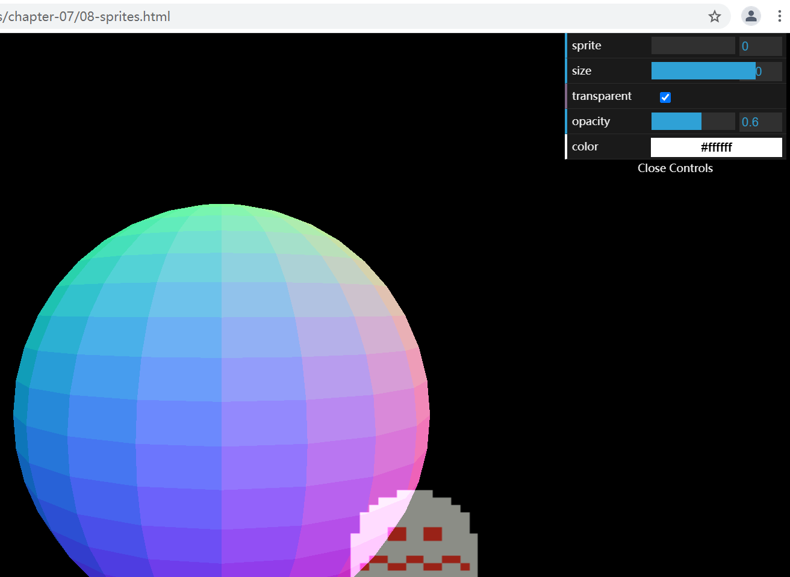</p>

这个例子中你会看到一个类似Pac-Man（吃豆人）的精灵绕着屏幕移动，并在碰到右侧边框时改变颜色和外形。

```js
function getTexture() {
  var texture = new THREE.ImageUtils.loadTexture('../assets/textures/particles/sprite-sheet.png');
  return texture;
}

function createSprite(size, transparent, opacity, color, spriteNumber) {
  var spriteMaterial = new THREE.SpriteMaterial({
    opacity: opacity,
    color: color,
    transparent: transparent,
    useScreenCoordinates: true,
    map: getTexture()
  });

  // we have 1 row, with five sprites
  spriteMaterial.uvOffset.set(1 / 5 * spriteNumber, 0);
  spriteMaterial.uvScale.set(1 / 5, 1);
  spriteMaterial.alignment = THREE.SpriteAlignment.bottomCenter;
  spriteMaterial.sceleByViewport = true;
  spriteMateria.blending = THREE.AdditiveBlending;

  var sprite = new THREE.Sprite(spriteMaterial);
  sprite.scale.set(size, size, size);
  sprite.position.set(200, window.innerHeight - 2, 0);
  sprite.velocityX = 5;

  scene.add(sprite);
}
```

我们在getTexture()函数里加载纹理。我们加载的是一张包含所有精灵图形的图片，而不是为每个精灵格子加载一张（总共5张），如下图所示：

<p align="center">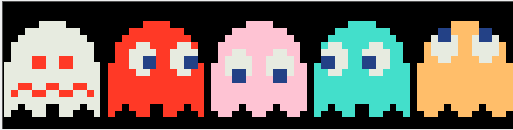</p>

通过uvOffset（偏移）和uvScale（缩放）属性，我们可以正确地选择要显示的精灵图形。通过uvOffset属性可以决定纹理在x轴（u）和y轴（v）上的偏移量。缩放比例的取值范围是0到1。在我们的例子里，如果要选择第3个精灵，需要将u偏移（x轴）设为0.4.由于只有一行图片，所以不必改变v偏移（y轴）。如果我们值设置该属性，那么显示出来的纹理是第3、4、5个图形压缩在一起。要想只显示其中一个，我们还需要放大。为此我们可以把uvScale属性中的u值设为1/5。这意味着我们会放大（只针对x轴）纹理，只显示其中的20%，也就是一个精灵。

另外一个需要解释的属性是useScreenCoordinates。如果该属性设为true，那么你可以只使用相对于窗口左上角的x和y坐标来定位精灵。当该属性为true时，场景中的相机就会被完全忽略。其他属性如下表所示：

|  名称  | 描述  |
|  ----  | ----  |
|  Color  | 粒子的颜色  |
|  Map  | 精灵所用纹理  |
|  sizeAnnutation  | 若设为false，那么距离镜头的远近不会影响精灵的大小。默认是true  |
|  opacity  | 设置精灵的透明度，默认是1（不透明）  |
|  blending  | 渲染精灵时所用的融合模式。（更多信息请参考第9章）  |
|  fog  | 精灵是否受场景中的雾化效果影响。默认是true  |
|  useScreenCoordinates  | 若设为true，精灵的位置就是绝对位置。原点是屏幕的左上角  |
|  scaleByViewport  | 精灵的大小取决于视图窗口的尺寸。若设为true，那么精灵的尺寸=图片的宽度/视图窗口高度。若设为false，那么精灵的尺寸=图片宽度/1.0  |
|  alignment  | 当精灵被缩放的时候（使用scale属性），该属性指定精灵从哪里开始缩放。若将该属性设为THREE.SpriteAlignment.topLeft，那么当增加或减少精灵的缩放比例时，精灵的左上角保持不放  |
|  uvOffset  | 结合uvOffset属性，选择精灵所用的纹理。  |
|  uvScale  | 结合uvScale属性，选择精灵所用的纹理。  |

你还可以在这个材质上设置depthTest属性和depthWrite属性，有关这些属性的更多信息，可以参考第4章。

在进入粒子的最后一节前，我们来看一看THREE.Sprite的第二个用途：可以在三维空间中定位的粒子。如下[示例](https://xsometimes.github.io/learning-threejs/chapter-07/09-sprites-3D.html)：

<p align="center">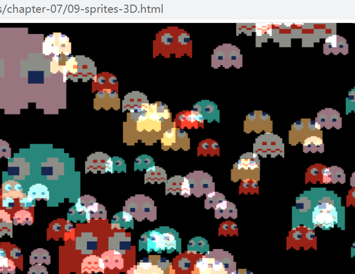</p>

```js
function createSprite (size, transparent, opacity, color, spriteNumber, range) {
  var spriteMaterial = new THREE.SpriteMaterial({
    opacity: opacity,
    color: color,
    transparent: transparent,
    useScreenCoordinates: false,
    sizeAttenuation: true,
    map: getTexture()
  });

  // we have one row, with five sprites
  spriteMaterial.uvOffset.set(1 / 5 * spriteNumber, 0);
  spriteMaterial.uvScale.set(1 / 5, 1);
  spriteMaterial.alignment = THREE.SpriteAlignment.bottomCenter;
  spriteMaterial.blending = THREE.AdditiveBlending;

  var sprite = new THREE.Sprite(spriteMaterial);
  sprite.scale.set(size, size, size);
  sprite.position = new THREE.Vector3(
    Math.random() * range - range / 2,
    Math.random() * range - range / 2,
    Math.random() * range - range / 2);
  sprite.velocityX = 5;
  return sprite
}
```

在这段代码中我们是用之前所示的图片创建了400个精灵。若要在三维空间中使用精灵，那么主要应记住的是将useScreenCoordinates属性设为false。若将这个属性设为false，那么精灵的行为就会跟我们在本章其他部分所讨论的粒子一样。由于所有粒子已经添加到了一个组中，所以旋转的这些粒子非常简单，代码如下所示：

```js
group.rotation.x += 0.1;
```

到目前为止本章主要探讨的是如何从零开始创建粒子、精灵和粒子系统。但还有一个有趣的事情是从已有的几何体中创建粒子系统。

### 7.5 [从高级几何体重创建粒子系统](https://xsometimes.github.io/learning-threejs/chapter-07/10-create-particle-system-from-model.html)

正如你所记得的，粒子系统所渲染的例子来自于几何体的顶点。这也就是说若我们提供一个复杂几何体，诸如环面扭结或者管道，我们就可以基于这个几何体的顶点创建出一个例子系统。

<p align="center">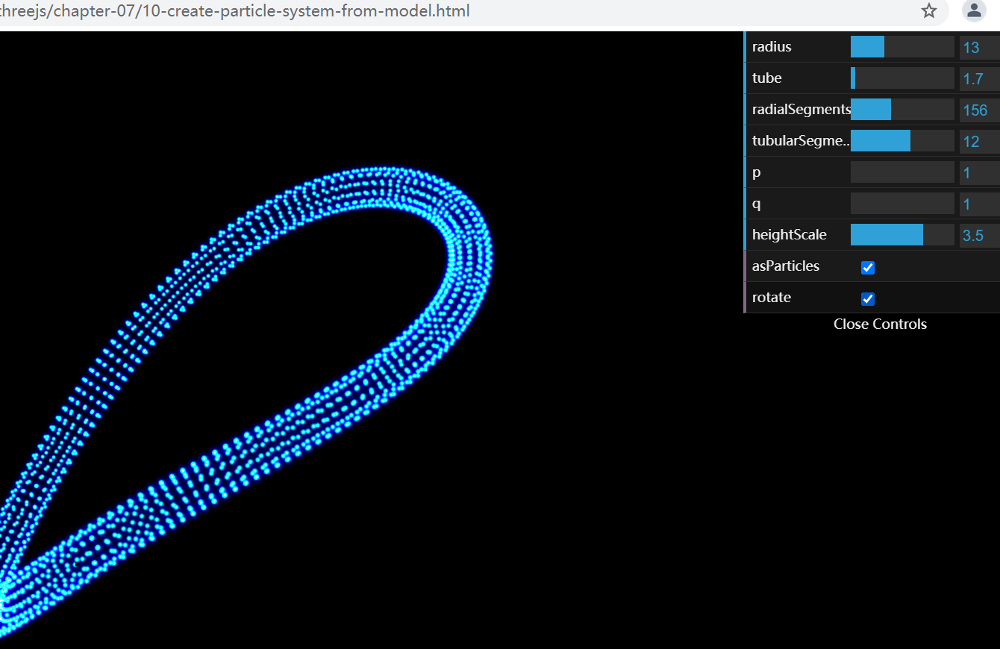</p>

在前一章已经描述过环面扭结，这里使用的代码跟前一章的完全相同，我们还添加了一个菜单选项，你可以用它转换成粒子系统

```js
function generateSprite() {
  var canvas = document.createElement('canvas');
  canvas.width = 16;
  canvas.height = 16;
  var context = canvas.getContext('2d');
  var gradient = context.createRadialGradient(
    canvas.width / 2, canvas.height / 2,
    0,
    canvas.width / 2, canvas.height / 2,
    canvas.width / 2);
  
  gradient.addColorStop(0, 'rgba(255, 255, 255, 1)');
  gradient.addColorStop(0.2, 'rgba(0, 255, 255, 1)');
  gradient.addColorStop(0.4, 'rgba(0, 0, 64, 1)');
  gradient.addColorStop(1, 'rgba(0, 0, 0, 1)');

  context.fillStyle = gradient;
  context.fillRect(0, 0, canvas.width, canvas.height);

  var texture = new THREE.Texture(canvas);
  texture.needsUpdate = true;
  return texture;
}

function createParticleSystem(geom) {
  var material = new THREE.ParticleBasicMaterial({
    color: 0xffffff,
    size: 3,
    transparent: true,
    blending: THREE.AdditiveBlending,
    map: generateSprite()
  });

  var system = new THREE.ParticleSystem(geom, material);
  system.sortParticles = true;
  return system;
}

// use it like this
var geom = new THREE.TorusKnotGeometry(...);
var knot = createParticleSystem(geom);

```

在这段代码里你会看到两个函数：createParticleSystem()和generateSprite()。在第一个函数里，我们直接从指定的几何体中创建了一个简单的粒子系统，然后**通过generateSprite()函数将粒子的纹理（map属性）设置成发光点（在HTML5的画布元素上生成）**。

### 7.6 总结
本章我们解释了什么是粒子、精灵和粒子系统，以及如何使用相应的材质格式化这些对象。需要记住的重要内容如下所示：
- 如果使用CanvasRenderer类，那么你可以直接使用THREE.Particle对象。
- 若要使用WebGLRenderer类，则不能使用THREE.Particle对象，但你可以用THREE.Sprite对象来创建一个粒子。
- 若你想创建大量粒子，并共享同一个材质，那么你应该使用THREE.ParticleSystem对象。这样几何体中的每个顶点都会被渲染成粒子，并使用指定的材质。
- 你可以很容易地让粒子动起来，只要改变它们的位置即可。THREE.Particle、THREE.Sprite，以及用来创建粒子系统的几何体中的顶点都可以如此使用。
- 通过map属性，你可以使用图片或者HTML5的画布来格式化粒子。
- 你也可以使用THREE.Sprite类来为三维场景创建一种贴图对象。将该对象的useScreenCoordinates属性设为true，那么该对象就会按照屏幕上绝对位置来定位。

一直到本章，我们都是用Three.js提供的几何体来创建网络。这对简单的几何体（例如球和方块）来说足够用了，但当你想要创建复杂的三维模型时就不太好用了。通常情况下你可以用三维建模工具（如Blender和3D Studio Max）来创建复杂几何体。下一章，你将学习如何加载和展示这些三维建模工具所创建的模型。


## 第八章 创建、加载高级网络和几何体

在这一章里我们会看一下创建高级、复杂几何体和网络的几种方法。我们曾经在第5章向你展示了如何使用Three.js自带的对象来创建高级几何体。在本章我们将使用下面两种方法来创建高级几何体和网络：
- 组合和合并：首先要讲解的是使用Three.js自带功能来组合和合并已有的几何体。从已有的几何体中创建出新的几何体。
- 从外部加载：在本章我们还会讲解如何从外部资源中加载网络和几何体。我们将会向你展示如何使用Blender导出Three.js支持的网格格式。

我们将从“组合和合并”方法开始。通过这种方法，我们使用标准的Three.js组合函数和GeometryUtils.merge()函数来创建新对象。

### 8.1 几何体组合和合并
我们将会在本节介绍Three.js的两个基本功能：将对象组合在一起，以及将多个网络合并成一个网络。

#### 8.1.1 对象组合
在前面某些章节时使用多种材质时，你已经见过对象组合。但**从一个几何体创建网络，并且使用多种材质时，Three.js就会创建一个组。该几何体的多份副本会添加到这个组里，每份副本都有自己特定的材质**。而这个组就是我们得到的结果，看上去就像是一个网络拥有多份材质。但是实际上它是一个包含多个网格的组。

创建一个组非常简单。每个你创建的网络都可以包含子元素，子元素可以使用add函数来添加。在组中添加子元素的效果是：你可以移动、缩放、旋转和变形父对象，而所有的子对象都会受到影响。

<p align="center">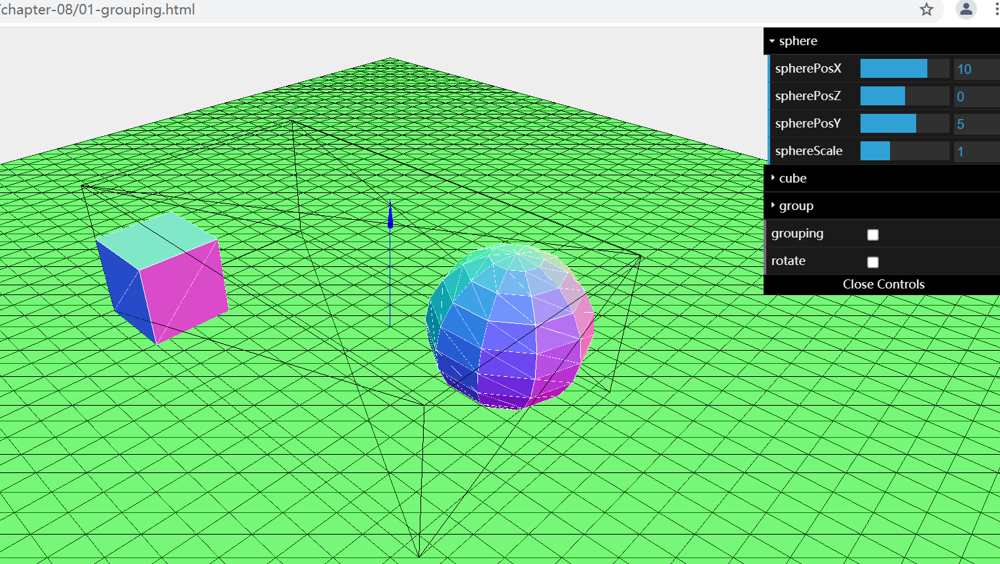</p>

在这个例子里你可以使用控制菜单来移动球和方块。如果选中了rotate选项，你会看到这两个网络会绕着它们的中心旋转。这两个网络并不是被直接添加到场景中的，而是添加到一个组中：

```js
sphere = createMesh(new THREE.SphereGeometry(5, 10, 10));
cube = createMesh(new THREE.CubeGeometry(6, 6, 6));
group = new THREE.Object3D();
group.add(sphere);
group.add(cube);
scene.add(group);
```

在这段代码里你可以看到我们创建了一个THREE.Object3D对象。这是THREE.Mesh对象和THREE.Scene对象的基类，但是它本身并不包含什么东西，也不会渲染任何东西。在这个例子里，我们使用add函数将sphere和cube添加到该对象中，并把它添加到scene实例。如果再看看这个例子，你会发现你依然可以移动球和方块，也可以对他们进行缩放和旋转。你也可以对这些对象所在的组做这些操作。如果看一下组菜单，你还会看到position和scale菜单项。你可以用这些菜单项来缩放、移动整个组。组中对象则会随着组的缩放和移动而缩放和移动。

缩放和移动很直观。但是要记住的是，当你旋转一个组时，并不是分别旋转组中的每一个对象，而是绕中心旋转整个组。在这个例子里，我在组的中心放置了一个箭头：

```js
var arrow = new THREE.ArrowHelper(new THREE.Vector3(0, 1, 0), group.position, 10, 0x0000ff);
scene.add(arrow);
```
如果你选中了grouping和rotate选项，那么这个组就会开始旋转。而且你会看到球和方块一起绕着组的中心（箭头所指）旋转。

使用组的时候你依然可以引用、修改每一个单独的几何体。下一节我们将看以下合并，合并的结果是一个单独的新几何体。

#### 8.1.2 将多个网络合并成一个网络
多数情况下使用组可以很容易操作和管理大量网络。但是当对象的数量非常多时，性能就会成为一个瓶颈。在组里每个对象都是独立的，需要对它们分别进行处理和渲染。通过THREE.GeometryUtils.merge函数你可以将多个几何体合并起来，创建一个联合体。在下面的例子你将会看到如何使用该函数，以及它对性能的影响。你会看到一个随机分布着很多半透明方块的场景。通过菜单中的滑块，你可以设置场景中的方块数目，点击redraw按钮可以重新绘制场景。根据你所使用的硬件，当方块的数目达到一定量时，性能就开始下降。你可以从下图中看到，在我的环境中，性能在4000个对象左右时开始下降。刷新速度从通常的60fps下降到了40fps。

正如你所看到的，场景中能够添加的网格数目有一个上限。一般来讲你并不需要那么多的网格，但是在创建某些游戏（例如Minecraft）或者高级显示效果时，你可能会遇到这样的性能问题。而使用THREE.GeometryUtils.merge则可以帮你解决这个问题。

```js
var geometry = new THREE.Geometry();
for (var i = 0; i < controld.numberOfObjects; i++) {
  THREE.GeometryUtils.merge(geometry, addCube());
}
scene.add(new THREE.Mesh(geometry, cubeMaterial));
```

在这段代码里，函数addCube()返回的是一个THREE.CubeGeometry()对象。通过执行THREE.GeometryUtils.merge(geometry, addCube());语句我们可以加个方块几何体合并到THREE.Geometry对象，该对象一开始是空的。如此做2000次，我们得到的将是一个几何体，然后可以将它添加到场景中国。如果看过代码，你会发现这个方法有几个缺陷。由于我们得到的只是一个几何体，所以你不能为每个几何体添加材质。但是，这个问题可以用THREE.MeshFaceMaterial对象来解决。最大的缺陷是失去了对每个对象的单独控制。想要移动、旋转或者缩放某个方块是不可能的（除非你能搜索到相应的面和顶点，并分别对它们进行操作）。

通过组合和合并，你可以使用Three.js提供的基本几何体来创建大型的、复杂几何体。若你想创建更加高级的几何体，那么使用Three.js所提供的编程方式就不是最好、最简单的方法。幸运的是Three.js提供了其他创建几何体的方法。下一节，我们将会学习如何从外部资源中创建、加载几何体和网络。


### 8.2 从外部资源中加载几何体
Three.js可以读取几种三维文件格式，并从中导入结合体和网格。下表所列的就是Three.js支持的以及我们将要在本节讲解的文件格式：


|  格式  | 描述  |
|  ----  | ----  |
|  JSON  | Three.js有它自己的JSON文件格式，你可以用它以声明的方式定义几何体和场景。但它并不是一种正式的格式。它很容易使用，当你想要复用复杂的几何体或场景时非常有用。  |
|  OBJ和MTL  | OBJ是一种简单的三维文件格式，由Wavefront科技公司创立。它是使用最广泛的三维文件格式，用来定义对象的几何体。MTL文件常同OBJ文件一起使用，在一个MTL文件中，对象的材质定义在OBJ文件中  |
|  Collada  | Collada是一种用来定义XML类文件中数字内容的格式。这也是一种被广泛使用的格式，差不多所有的三维软件和渲染引擎都支持这种格式  |
|  STL  | STL是STereoLithography（立体成型术）的缩写，广泛用于快速成型。例如三维打印机的模型文件都是STL文件。<br />Three.js有一个可定制的STL导出工具，STLExporter.js。你可以用它将Three.js中的模型导出到一个STL文件。  |
|  CTM  | CTM是由openCTM创建的文件格式。可以用来压缩存储表示三维网格的三角形面片。  |
|  VTK  | VTK是由Visualization Toolkit定义的文件格式，用来指定顶点和面。VTK有两种格式，Three.js支持旧的，即ASCII格式  |
|  PDB  | 这是一种非常特别的格式，由Protein Databank（蛋白质数据银行）创建，用来定义蛋白质的形状。Three.js可以加载并显示用这种格式描述的蛋白质  |
|  PLY  |  该格式全称是多边形（polygon）文件格式。通常用来保存三维扫描仪的数据  |

我们将在下一章讲解动画时再来看看这个列表中的某些格式（以及另外一种格式MD2）。

### 8.3 以Three.js的JSON格式保存和加载

#### 8.3.1 保存和加载几何体
你可以在两种情形下使用Three.js的JSON文件格式。你可以用它来保存和加载某个几何体，或者用它来保存和加载整个场景。

如[示例](https://xsometimes.github.io/learning-threejs/chapter-08/03-load-save-json-object.html)，创建一个环面扭结，然后使用save & load菜单中的save按钮保存当前的几何体。在这个例子里，我们使用了HTML5的本地存储API。通过这个API可以很容易地将持久化信息保存在客户端浏览器里，以后还可以读取（即使在浏览器关闭，重启之后）。

要让该示例能够工作，首先要经Three.js发布包里的GeometryExporter.js包含在你的网页里。

```js
<script type="text/javascript" src="../libs/GeometryExporter.js"></script>
```

现在你可以用下面的JS代码将几何体保存在浏览器的本地存储中：
```js
var exporter = new THREE.GeometryExporter();
var result = exporter.parse(knot.geometry);
localStorage.setItem('json', JSON.stringify(result));
```

在保存之前，我们先要用JSON.stringify函数将GeometryExporter对象解析的结果，从一个js对象转换成一个字符换。JSON字符串格式的结果如下所示（大部分顶点和面没有列出）：

<p align="center">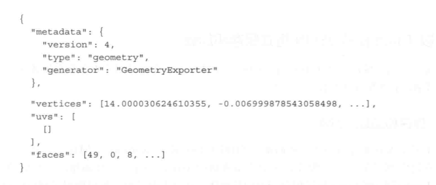</p>

正如你所看到的，Three.js保存的是原始的几何体。它将原有的顶点和面都保存了下来。将这个几何体加载到Three.js只需要几行代码：
```js
var json = localStorage.getItem('json');
if (json) {
  var loadedGeometry = JSON.parse(json);
  var loader = new THREE.JSONLoader();
  var geom = loader.parse(loadedGeometry);
  loadedMesh = createMesh(geom.geometry);
  loadedMesh.position.x = -35;
  loadedMesh.position.z = -5;
  scene.add(loadedMesh);
}
```

正如你在这里所看到的，我们只保存了几何体，其他信息都丢失了。若你想保存整个场景，包括材质、光源、位置等，可以使用SceneExporter对象。

#### 8.3.2 保存和加载场景
如果你想保存这个场景，同样可以使用前一节我们所看到的保存几何体的方法，如示例

在这个例子里，你有三个选项可以选择：exportScene（导出场景）、clearScene（清空场景）和importScene（导入场景）。通过exportScene，场景的当前状态就会被保存在浏览器的本地存储中。要测试场景的导入功能，你可以点击clearScene按钮将场景移除，然后点击importScene按钮从本地存储中加载场景。实现这些功能的代码很简单，但是在使用之前，你先要从Three.js发布包里引入所需的导出器（可以在examples/js/exporters目录中找到。）

```JS
<script type="text/javascript" src="../libs/SceneExporter.js"></script>
```

通过页面中的导出器，你可以用下面的JS代码将场景导出：
```js
var exporter = new THREE.SceneExporter();
var sceneJson = JSON.stringify(exporter.parse(scene));
localStorage.setItem('scene', sceneJson);
```

<p align="center">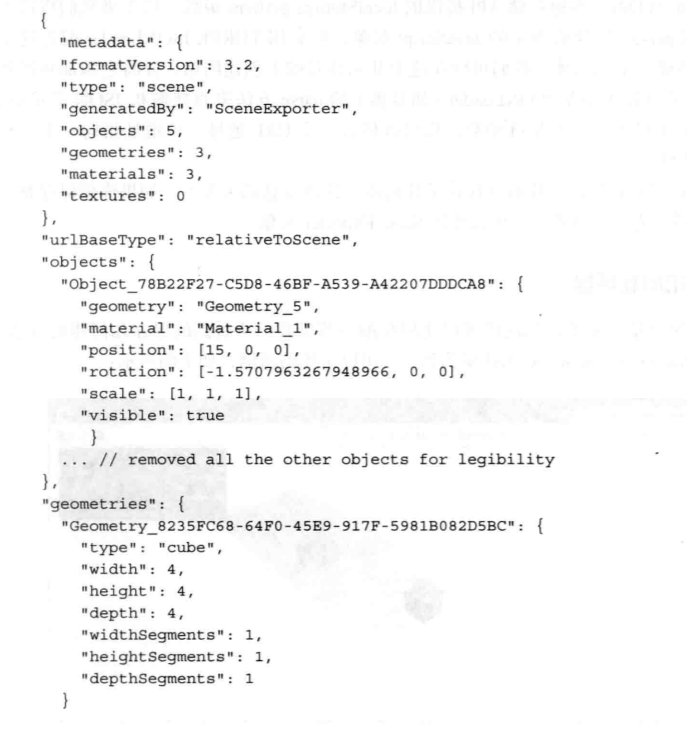</p>

这次使用的是THREE.SceneExporter()，生成的JSON字符串稍有不同。主要的却别是：这个导出器创建的JSON文件明确描述了物体、光源、材质，以及场景中的其他数据，而不是对象的原始信息。在加载的时候，Three.js只是按照其导出时的定义重新创建而已。加载场景的代码如下所示：
```js
var json = (localStorage.getItem('scene'));
var sceneLoader = new THREE.SceneLoader();
sceneLoader.parse(JSON.parse(json), function(e) {
  scene = e.scene;
}, '.'); // 传递给loader（加载器）的最后一个参数（'.'）是一个URL相对地址，如，在材质中使用的纹理（如外部图片）就可以从这个相对地址中获取。
```

有很多三维软件工具可以用来创建复杂的网络。其中有一个流行的开源软件叫做[Blender](www.blender.org)。它有（Maya和3D Studio Max也都有）一个导出器可以直接价格文件导出成Three.js的JSON格式。下一届，我们将会带领你配置Blender，以便能够使用这个导出器，并向你展示如何在Blender里导出一个复杂模型，以便在Three.js里展示处理。

### 8.4 使用Blender
[示例](https://xsometimes.github.io/learning-threejs/chapter-08/05-blender-from-json.html)你会看到一个简单的Blender模型，我们将用一个Three.js插件将它导出，并在Threejs中用JSONLoader类将它导入：

#### 8.4.1 在Blender中安装Three.js导出器
<p align="center">
  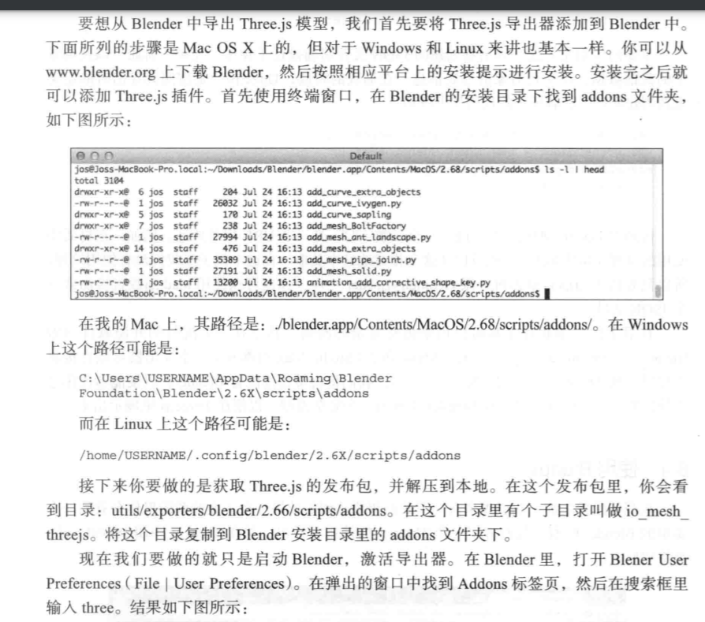
  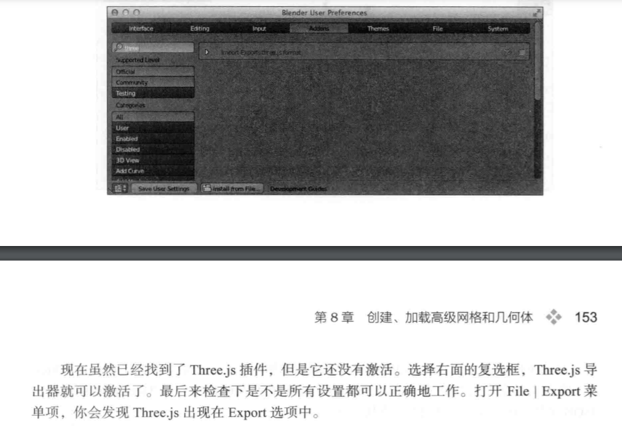
  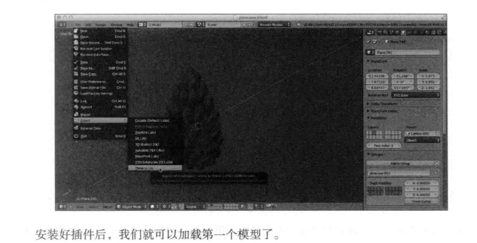
</p>

#### 8.4.2 在Blender里加载和导出模型

[示例](https://xsometimes.github.io/learning-threejs/chapter-08/05-blender-from-json.html)


### 8.5 导入三维格式文件
#### 8.5.1 OBJ和MTL格式
[示例1](https://xsometimes.github.io/learning-threejs/chapter-08/06-load-obj.html)

[示例2](https://xsometimes.github.io/learning-threejs/chapter-08/07-load-obj-mtl.html)

#### 8.5.2 加载Collada模型
[示例](https://xsometimes.github.io/learning-threejs/chapter-08/08-load-collada.html)

#### 8.5.3 加载STL、CTM和VIK模型
[STL示例](https://xsometimes.github.io/learning-threejs/chapter-08/09-load-stl.html)

[CTM示例](https://xsometimes.github.io/learning-threejs/chapter-08/10-load-ctm.html)

[VTK示例](https://xsometimes.github.io/learning-threejs/chapter-08/11-load-vtk.html)

我们已经展示了几乎所有的格式。在接下来的两节里，我们要看一些不一样的加载模型的方法。首先我们会看一线如何从蛋白质数据银行（PDB格式）中加载并渲染蛋白质，最后我们会使用在PLY格式文件里定义的模型来创建一个粒子系统。

#### 8.5.4 展示蛋白质数据银行中的蛋白质

[蛋白质数据银行](www.rcsb.org)手机了很多分子、蛋白质的详细信息。除了提供蛋白质的信息，还可以以PDB格式下载这些分子的结构数据。在Three.js中有一种可以加载PDB格式的文件。

[示例](https://xsometimes.github.io/learning-threejs/chapter-08/12-load-pdb.html)

#### 8.5.5 从PLY模型中创建粒子系统
PLY格式的使用跟其他格式并没有很大的不同。你只要包含加载器、提供一个回调函数、渲染模型即可。但是，在最后一个[示例](https://xsometimes.github.io/learning-threejs/chapter-08/13-load-PLY.html)中，我郁闷要做一些不一样的事情，我们将会使用模型中的信息来创建一个粒子系统，而不是将模型渲染成一个网络。

```js
var loader = new THREE.PLYLoader();
var group = new THREE.Object3D();
loadr.load('../assets/models/test.ply', function(geometry) {
  var material = new THREE.ParticleBasicMaterial({
    color: 0xffffff,
    size: 0.4,
    opacity:0.6,
    transparent: true,
    blending: THREE.AdditiveBlending,
    map: generateSprite()
  });

  group = new THREE.ParticleSystem(geometry, material);
  group.sortParticles = true;

  console.log(group);
  scene.add(group);
})
```

正如你所看到的，我们使用PLYLoader对象加载模型。回调模型接收geometry作为参数，然后我们用这个geometry作为ParticleSystem对象的输入。我们所用的材质，跟上一章最后那个例子所用的材质一样。正如你所看到的，使用Three.js可以很容易地加载各种源文件中的模型，并用不同的方法将它们渲染出来，而这些只需要几行代码就可以完成。


### 8.6 总结
在Three.js中使用外部源文件中的模型并不难。特别是那些简单的模型，你只要区区几步就可以完成。在使用外部的模型，或者对模型进行组合和合并时，最好记住下面的事情：
- 组合对象的时候，每个对象依然可以单独进行操作。对父对象进行操作可以影响子对象。
- 若将对象合并在一起，你就失去了对每个对象的控制，你所得到的是一个新几何体。当你要渲染成千上万的几何体，而性能成为瓶颈的时候，这么做特别有用。
- 请记住，Three.js的GeometryExporter还在开发中，SceneExporter类和SceneLoader类也一样。
- 使用Three.js提供的各种格式的加载器时，在回调函数中输出其接收到的信息，这将帮你理解正确获取模型网格所需的步骤，并设置正确的位置和缩放比例。
- 若模型不能正确显示，一般是材质导致的。可能是用了不兼容的纹理格式，透明度不正确，或者是该格式文件中指向纹理的连接有误。可以用测试性的材质来检测这种错误，也可以在js控制台中输出材质信息，看看有没有比较奇怪的值。
- 使用Blender时，你可以用多种方法导出模型。你可以使用Three.js的插件。Blender可以很好地支持和理解OBJ和MTL格式。

本章以及前面章节所用的模型大都是静态模型。没有动画，不会四处移动，也不会变形。下一章你将学习如何让你的模型动起来，赋予它们生命。除了动画，下一章海湖讲解Three.js中各种控制相机的方法，通过控制相机，你可以在场景中移动、平移、旋转相机。

## 第九章 创建动画和移动相机
到本章为止，我们已经看到过一些简单的动画，它们都不太复杂。我们在第1章就引入了一个基础的渲染循环，在随后的各章里我们使用这个循环简单地旋转对象，还展示了其他几个基础的动画概念。本章我们将进一步介绍Three.js是如何支持动画操作的。我们将会详细讨论下面这四个主题：
- 基础动画：Three.js里所有动画的基础，修改对象的三个属性：位置、旋转和缩放。在这一部分，我们将快速回顾一下在第1章引入的那个循环里如何处理那些操作。
- 移动相机：动画中一个很重要的部分是在场景中移动相机能力。本节我们将带领你领略Three.js各种控制相机的方法。
- 变形和蒙皮：制作复杂模型的动画主要有两种方式。使用变形技术，定义几何体之间的过度；以及使用骨骼和蒙皮技术处理这种过渡。我们将会在本章探讨这两种方式。
- 加载外部动画：在前面的章节里，我们已经见过Three.js可以支持几种外部的文件格式。本章我们将会对此作进一步的探讨，看看如何从外部文件中加载动画。

我们将从动画背后的基础概念开始。

### 9.1 基础动画

先快速回顾一下第1章中的render（渲染）循环。为了支持动画，我么需要告诉Three.js多久渲染一次场景。为此，我们要使用由HTML5提供的标准的requestAnimationFrame函数：
```js
render();

function render() {
  // render the scene
  renderer.render(scene, carema);

  // schedule the next rendering using requestAnimationFrame
  requestAnimationFrame(render);
}
```

在这段代码里，我们只要在初始化场景时调用一次render()函数。在render()函数中，我们用requestAnimationFrame来安排下一次渲染。这样，浏览器就可以保证以正确的时间间隔（通常是60次每秒）调用render()函数。在requestAnimationFrame函数添加到浏览器之前，一般会使用setInterval(function, interval)或者setTimeout(function, interval)。它们会按照设置的时间间隔调用指定的函数。问题是它们并没有考虑其他正在发生的事情。即使动画没有显示或者隐藏在某个标签页下，这两个函数依然会被调用，而且会耗费某些资源。这些函数还有另外一个问题，那就是它们一旦被调用就会刷新屏幕，不管这时对浏览器来说不是恰当的时机。这也就意味着较高的CPU使用率。通过requestAnimationFrame，我们不必告诉浏览器什么需要刷新屏幕，而是请求浏览器在最适合的时候执行我们提供的函数。通常情况下其结果是60fps（帧频）。使用requestAnimationFrame会让你的动画运行得更平缓，而且对CPU和GPU更友好，你也不必再担心渲染时机方面的问题。

#### 9.1.1 简单动画
使用这种方法，我们通过改变对象的旋转、缩放、位置、材质、顶点、面，以及其他你想得到的东西，可以很容易地制作出动画。在下一次的render循环中，Three.js就可以渲染这些修改后的属性。

```js
function render () {
  cube.rotation.x += controls.rotationSpeed;
  cube.rotation.y += controls.rotationSpeed;
  cube.rotation.z += controls.rotationSpeed;

  step += controls.bouncingSpeed;
  sphere.position.x = 20 + (10 * Math.cos(step));
  sphere.position.y = 2 + (10 * Math.abs(Math.sin(step)));

  scalingStep += controls.scalingStep;

  var scaleX = Math.abs(Math.sin(scalingStep / 4));
  var scaleY = Math.abs(Math.cos(scalingStep / 5));
  var scaleZ = Math.abs(Math.sin(scalingStep / 57));
  cylinder.scale.set(scaleX, scaleY, scaleZ);

  renderer.render(scene, camera);
  requestAnimationFrame(render);
}
```

下一节，我们将会快速浏览一下跟动画有关的内容。当你使用Three.js处理复杂场景时，除了动画，一个很重要的方面是使用鼠标在屏幕上选择对象的能力。

#### 9.1.2 选择对象
我们在本章探讨的是相机和动画，尽管跟动画没有直接的联系，但是在这里讨论一下对象的选择也是对本章主题的有益补充。我们在这里展示的是如何使用鼠标在场景中选择一个对象。

<p align="center">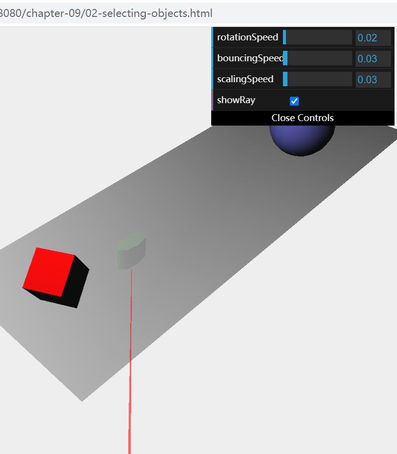</p>

```js
var projector = new THREE.Projector();

function onDocumentMouseDown(event) {
  event.preventDefault();
  var vector = new THREE.Vector3(
    (event.clientX / window.innerWidth) * 2 - 1,
    - (event.clientY / window.innerHeight) * 2 + 1,
    0.5);
  
  var raycaster = new THREE.Raycaster(camera.position, vector.sub(camera.position).noramlize());
  var intersects = raycaster.intersectObjects([sphere, cylinder, cube]);

  if (intersects.length > 0) {
    intersects[0].object.material.transparent = true;
    intersects[0].object.material.opacity = 0.1;
  }
}
```

在这段代码里，我们使用THREE.Projector类和THREE.Raycaster类，来检测我们是否点在了一个对象上。我们在屏幕上点击时，会发生如下的事情：

1）首先，基于我们在屏幕上点击的位置创建出一个向量。

2）接着，用unprojectVector函数，将屏幕上的点击位置转换成Three.js场景中的坐标。

3）然后，我们用THREE.Raycaster对象（projector.pickingRay函数的返回值）从屏幕上的点击位置向场景中发射一束光线。

4）最后，我们用raycaster.intersectObjects函数来判断指定的对象中有没有被这束光线击中的。

上述步骤中最后一步的结果包含了所有被光线击中的对象的信息。这些信息包括：
```js
distance: 49.9047088522448
face: Three.Face4
faceIndex: 4
object: THREE.Mes
point: THREE.Vector3
```

其中object属性就是我们点解的网络，face和faceIndex指的是该网络中被选中的面。distance属性是从相机到被点物体间的距离，而point则是被选中物体网络上的点。可以在[示例](https://xsometimes.github.io/learning-threejs/chapter-09/02-selecting-objects.html)中测试该功能。任何你所选中的对象都会变得透明，相关的信息会输出到控制台。若你想看看光线的投射路径，你可以在菜单上打开showRay属性。

现在我们已经在渲染循环中修改了各种属性。下一节，我们将会看一个小型库，使用它可以让动画的定义简单很多。

#### 9.1.2 用Tween.js做动画
[Tween.js](https://github.com/sole/tween.js)是一个小型的JS库，这个库可以用来定义某个属性在两个值之间的过渡，自动计算出起始值和结束值。这个过程叫做tweening（补间）。

```js
// 例如，你可以用这个库将一个网络x轴上的位置，在10秒内从10递减到3
var tween = new THREE.Tween({ x: 10 }).to({ x: 3 }, 10000).easing(TWEEN.Easing.Elastic.InOut).onUpdate(function() {
  // update the mesh
})
```

在这个例子里我们创建了一个TWEEN.Tween对象。这个对象可以保证x属性在10000毫秒内，从10变化到3。通过Tween.js你还可以指定在指定时间内属性如何变化，是线性的、指数型，还是[其他任何可能的方式](http://sole.github.io/tween.js/examples/03_graphs.html)。属性值在指定时间内的变化称为easing（缓动）。在Tween.js中，你可以用easing()函数来配置缓动效果。

<p align="center">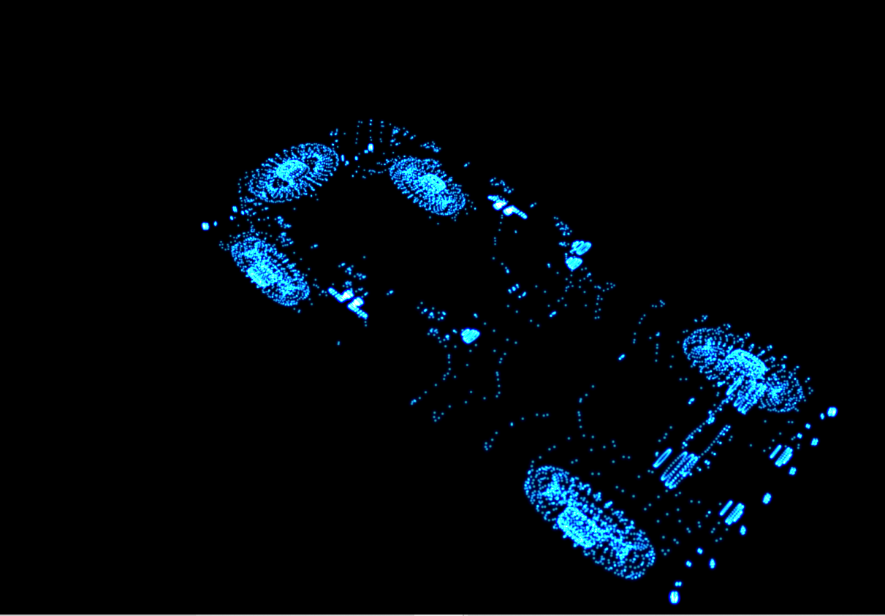</p>

我们在[这个例子](https://xsometimes.github.io/learning-threejs/chapter-09/03-animation-tween.html)里使用了第7章中创建的粒子系统，例子中所有的粒子正在落向地面。而这些粒子的位置是由Tween.js库创建出的中间值：

```js
// first create the tweens
var posSrc = { pos: 1 };
var tween = new TWEEN.Tween(posSrc).to({ pos: 0 }, 5000);
tween.easing(TWEEN.Easing.Sinusoidal.InOut);

var tweenBack = new THREE.Tween(posSrc).to({ pos: 1 }, 5000);
tweenBack.easing(TWEEN.Easing.Sinusoidal.InOut);

tween.chain(tweenBack);
tweenBack.chain(tween);

var onUpdate = function () {
  var count = 0;
  var pos = this.pos;
  loadedGeometry.vertices.forEach(function(e) {
    var newY = ((e.y + 3.22544) * pos) - 3.22544;
    particleSystem.geometry.vertices[count++].set(e.x, newY, e.z);
  });

  particleSystem.sortParticles = true;
};

tween.onUpdate(onUpdate);
tweenBack.onUpdate(onUpdate);
```

在这段代码里我们创建了两个补间：tween和tweenBack。第一个补间定义的是属性position如何从1过渡到0，第二个正好相反。通过chain()函数，我们可以让这两个补间首尾相连。这样在启动动画之后，程序就会在这两个补间间循环。最后我们定义了一个onUpdate方法。在这个方法里我们会遍历粒子系统的所有顶点，并用补间（this.pos）提供的位置更新顶点的位置。

补间动画在模型加载完毕时启动，所以我们在下面函数的末尾调用tween.start()函数：
```js
var loader = new THREE.PLYLoader();
loader.load('../assets/models/test.ply', function(geometry) {
  // ...
  tween.start();
  // ...
});
```

开启补间之后，我们需要告知的Three.js库什么时候应该刷新已知的所有补间。为此可以调用TWEEN.update()函数：
```js
function render() {
  TWEEN.update();
  webGLRenderer.render(scene, carema);
  requestAnimationFrame(render);
}
```

这些都做好之后，tween库就会负责计算粒子系统中每个粒子的位置。正如你所看到的，使用这个库比自己管理属性值之间的过渡要简单得多。

除了让对象动起来，或者改变其外观，我们还可以通过移动相机，让整个场景动起来。在前面几章里，我们已经这么做了，当时我们是手工更新相机的位置。Three.js还提供了其他几种方法来更新相机。

### 9.2 使用相机
Three.js提供了几个相机控件，可以用来控制场景中的相机。这些控件在Three.js发布包中，你可以在examples/js/controls目录下找到它们。在本节中我们将会找到如下的控件：

|  控件名称  | 描述  |
|  ----  | ----  |
|  FirstPersonControls（第一人称控件）  | 该控件的行为类似第一人称射击游戏中的相机，用键盘移动，用鼠标转动  |
|  FlyControls（飞行控件）  | 飞行模拟器控件，用键盘和鼠标来控制相机的移动和转动  |
|  RollControls（翻滚控件）  | 该控件是FlyControl的简化版，让你可以绕着z轴旋转  |
|  TrackballControls（轨迹球控件）  | 最常用的控件，你可以用鼠标（或轨迹球）来轻松地移动、平移和缩放场景  |
|  OrbitControls（轨道控件）  | 用于特定的场景，模拟轨道中的卫星，你可以用鼠标和键盘在场景中游走  |
|  PathControls（路径控件）  | 使用这个控件，相机可以沿着预定义的路径移动。你可以将它跟过山车相比较，在过山车上你可以朝四周看，但不能改变自身的位置  |

当然，除了使用这些相机控件，你还可以通过设置相机的position属性，调用lookAt()函数改变相机指向的位置，来移动相机。

#### 9.2.1 轨迹球控件

[示例](https://xsometimes.github.io/learning-threejs/chapter-09/04-trackball-controls-camera.html):
<p align="center">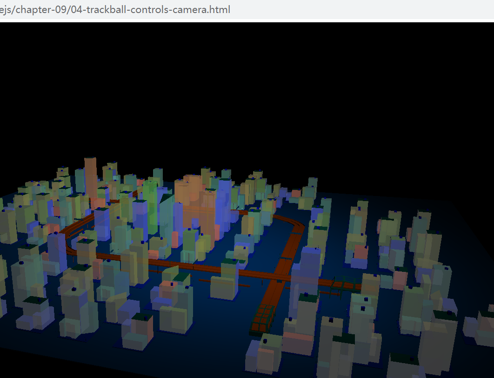</p>


首先要在网页中包含正确的JS文件：
```js
<script type="text/javascript" src="../libs/TrackballControls.js"></script>
```

包含了这个文件之后，我们就可以创建控件，并将它绑定到相机上：
```js
var trackballControls = new THREE.TrackballControls(camera);
trackballControls.rotateSpeed = 1.0;
trackballControls.zoomSpeed = 1.0;
trackballControls.panSpeed = 1.0;
```

更新相机的位置可以在render循环中完成：
```js
var clock = new THREE.Clock();
function render() {
  var delta = clock.getDelta();
  trackballControls.update(delta);
  requestAnimationFrame(render);
  webGLRendeer.render(scene, camera);
}
```
在前面这段代码里，我们会看到一个新的Three.js对象：THREE.Clock。THREE.Clock可以用来精确地计算出上次调用后经过的时间，或者一个渲染循环耗费的时间。你只要调用clock.getDelta()函数即可。这个函数会返回此次调用和上次调用之间经过的时间。要更新相机的位置，我们可以调用trackballControls.update()函数。在这个函数里我们需要提供自上次update()函数调用以来经过的时间。为此我们要使用THREE.Clock对象的getDelta()函数。你或许会奇怪为什么我们不直接把帧频（1/60秒）传递给update函数。原因是当我们请求动画帧时，我们期待的帧频是60fps，但这并不能得到保证。受外部因素的影响，帧频可能会有不同，。为了保证相机能够平缓地移动和旋转，我们需要传入精确的时间差。

你可以用下面的方式来操控相机：
|  操控  | 动作  |
|  ----  | ----  |
|  按住左键，拖动  | 在场景中旋转、翻滚相机  |
|  按住滚轮  | 方法和缩小  |
|  按住中键，拖动  | 放大和缩小  |
|  按住右键，拖动  | 在场景中平移  |

有几个属性可以用来对相机进行微调。例如，你可以通过rotateSpeed属性来控制相机的旋转速度，将noZoom设为true可以禁止缩放。要想全面了解这些属性，可以参考这些属性所在的TrackballControls.js文件。

#### 9.2.2 飞行控件
通过FlyControls你可以使用类似飞行模拟器操纵杆的控件，在场景中飞行。[示例](https://xsometimes.github.io/learning-threejs/chapter-09/05-fly-controls-camera.html)

FlyControls的使用跟TrackballControls一样，首先要加载正确的js文件：
```js
<script type="text/javascript" src="../libs/FlyControls.js"></script>
```
然后我们可以配置控件，并将它绑定到相机上：

```js
var flyControls = new THREE.FlyControls(camera);
flyControls.movementSpeed = 25;
flyControls.domElement = document.querySelector('#WebGL-output');
flyControls.rollSpeed = Math.PI / 24;
flyControls.autoForward = true;
flyControls.dragToLook = false;
```

细节可以参看FlyControls.js文件。我们只挑几个需要配置的、保证该控件能够正常工作的属性来讲。需要正确配置的属性是domElement。该属性应该指向场景所在的dom元素。使用该控件可以用如下的方式操控相机：

|  操控  | 动作  |
|  ----  | ----  |
|  按住左键和中键  | 往前移动  |
|  按住右键  | 往后移动  |
|  移动鼠标  | 往四周看  |
|  W  | 往前移动  |
|  S  | 往后移动  |
|  A  | 左移  |
|  D  | 右移  |
|  R  | 上移  |
|  F  | 下移  |
|  上、下、左、右方向键  | 向上、下、左、右看  |
|  G  | 向左翻滚  |
|  E  | 向右翻滚  |

#### 9.2.3 翻滚控件
RollControls的行为跟FlyControls基本一致。
```js
var rollControls = new THREE.RollControls(camere);
rollControls.movementSpeed = 25;
rollControls.lookSpeed = 3;
```

[示例]()中，如果你只能看到黑色的屏幕，请把鼠标移动到浏览器的地步。一幅城市景观即可出现在视图中。可以用以下方式来控制相机：
|  操控  | 动作  |
|  ----  | ----  |
|  按住左键  | 往前移动  |
|  按住右键  | 往后移动  |
|  上、下、左、右方向键  | 前、后、左、右移动  |
|  W  | 前移  |
|  A  | 左移  |
|  S  | 后移  |
|  D  | 右移  |
|  Q  | 向左翻滚  |
|  E  | 向右翻滚  |
|  R  | 上移  |
|  F  | 下移  |


#### 9.2.4 第一人称控件
顾名思义，通过FirstPersonControls你可以像第一人称射击游戏中的抢手一样控制相机。用鼠标控制视角，用键盘来移动角色。如[示例](https://xsometimes.github.io/learning-threejs/chapter-09/07-first-person-camera.html)

该控件的创建跟我们之前跟我们之前看到的控件一样。
```js
var camControls = new THREE.FirstPersonControls(camera);
camControls.lookSpeed = 0.4;
camControls.movementSpeed = 20;
camControls.onFly = true;
camControls.lookVertical = true;
camControls.verticalMin = 1.0;
camControls.verticalMax = 2.0;
camControls.lon = -150;
camControls.lat = 120;
```

使用该控件时，只有最后两个属性（lon和lat）需要小心对待。这两个属性定义的是场景初次渲染时相机指向的位置。

该控件的控制方法非常直白：

|  操控  | 动作  |
|  ----  | ----  |
|  移动鼠标  | 往四周看  |
|  上、下、左、右方向键  | 前、后、左、右移动  |
|  W  | 前移  |
|  A  | 左移  |
|  S  | 后移  |
|  D  | 右移  |
|  R  | 上移  |
|  F  | 下移  |
|  Q  | 停止  |


#### 9.2.5 轨道控件
透视视角：OrbitControl（轨道控件）是在场景中绕某个对象旋转、平移的好方法。

该控件使用起来和其他控件一样简单。

```html
<script src="text/javascript" src="../libs/OrbitControls.js"></script>

<script src="text/javascript">
// ...
var orbitControls = new THREE.OrbitControls(camera);
orbitControls.autoRotate = true;
var clock = new THREE.Clock();
// ...
var delta = clock.getDelta();
orbitControls.update(delta);
</script>

```

操控轨道控件主要使用鼠标:
|  操控  | 动作  |
|  ----  | ----  |
|  移动左键，并移动  | 绕场景中心旋转相机  |
|  转动滚轮或按住中键，并移动  |  放大缩小  |
|  移动右键，并移动  | 在场景中移动  |
|  上、下、左、右方向键键  |  在场景中移动  |

#### 9.2.6 路径控件
PathControl路径控件是相当酷的控件。通过这个控件你可以设定一个路径，然后相机会沿着该路径移动，用户则可以控制相机向四周看。如[示例]()中我们加载了一个自由女神模型，并使用PathControl缓慢地螺旋式向上爬升。

使用该控件要多几个步骤才能运行起来。首先我们要创建一个路径，让相机沿着它移动：
```html
<script src="text/javascript" src="../libs/PathControls.js"></script>

<script src="text/javascript">
// ...
function getPath() {
  var points = [];
  var r = 20;
  var cX = 0;
  var cY = 0;

  for (var i = 0; i < 1440; i+= 5) {
    var x = r * Math.cos(i * (Math.PI / 180)) + cX;
    var z = r * Math.sin(i * (Math.PI / 180)) + cY;

    var y = i / 30;
    points.push(new THREE.Vector3(x, y, z));
  }

  return points;
}
// ...
```
getPath这个函数的返回结果是一组构成螺旋线的点。该螺旋线的半径是20，从底部开始慢慢上升。这些点可以用来构成路径，所以现在我们可以开始设置PathControls。

加载pathControls控件之前你要保证没有手工设定相机位置，或者使用过相机的lookAt()函数，因为这可能会跟特定的控件相抵触。现在我们可以配置pathControls对象，并把它添加到场景中:
```js
var pathControls = new THREE.PathControls(camera);

// configure the controller
pathControls.duration = 70;
pathControls.useConstantSpeed = true;
pathControls.lookSpeed = 0.1;
pathControls.lookVertical = true;
pathControls.lookHorizontal = true;
pathControls.verticalAngleMap = {
  srcRange: [0, 2 * Math.PI],
  dstRange: [1.1, 3.8]
};
pathControls.horizontalAngleMap = {
  srcRange: [0, 2 * Math.PI],
  dstRange: [0.3, Math.PI - 0.3]
};
pathControls.lon = 300;
pathControls.lat = 40;

// add the path
controls.points.forEach(function(e) {
  pathControls.waypoints.push([e.x, e.y, e.z])
});

// when done configuring init the control
pathControls.init();

// add the animationParent to the scene and start the animation
scene.add(pathControls.animationParent);
pathControls.animation.play(true, 0);
```
相比其他控件，对于这个控件我们要多做几件事。开始部分跟我们之前已经做过的一样。我们可以设置某些特定的属性，对控件进行微调。接下来我们可以**把之前定义的点添加到waypoints属性。这样即可构成相机的移动路径**。现在所有东西都配置好了，我们可以调用init()来结束该控件的初始化。

上述代码片段中的最后一步是必须的，以保证动画能够运转，相机可以自动移动。现在只剩下最后一步。在我们的render循环里，我们要添加如下代码：
```js
var delta = clock.getDelta();
THREE.AnimationHandler.update(delta);
pathControls.update(delta);
```
这将使得相机自动沿着轨道移动。

这就是有关相机移动的所有内容。在这一部分我们看到了很多控件，可以用来创建出有趣的相机动作。下一级，我们将会学习高级动画：变形动画和蒙皮动画。

### 9.3 变形动画和骨骼动画
当你用外部的软件（例如Blender）创建动画时，你通常会有两种主要的定义动画的方式：
- 变形动画：通过变形目标，你可以定义网格经过变形之后的版本，或者说**关键位置**。对于这个变形目标，其所有顶点位置都会被存储下来。要让目标动起来，你所要做的只是将所有顶点从一个位置，移动到另外一个关键位置，并重复该过程。
- 骨骼动画：另外一种方式就是骨骼动画。通过骨骼动画你可以定义骨骼，即网格的骨头，并把顶点绑定到绑定的骨头上。现在，当你移动一块骨头时，任何相连的骨头都会做相应的移动，骨头上绑定的顶点也会随之移动。网络的变形**基于骨头的位置、移动和缩放比例**。

这两种模式Three.js都支持，不过一般来讲使用变形目标可以得到更好的效果。骨骼动画的主要问题是如何从Blender等三维程序中比较好地导出数据，从而在Three.js中制作动画。用变形目标比用模型和皮肤更容易获取一个良好的工作模型。

本节会介绍这两种模型，同时还会讲解几个Three.js支持的可以定义动画的外部格式。

#### 9.3.1 用变形目标制作动画
变形目标是制作动画最直接的方法。你可以为所有顶点指定每一个关键位置，然后让Three.js将这些顶点从一个关键位置移动到另一个。但这种方法有一个不足，那就是对于大型网格和大型动画，模型文件会变得非常大。原因是在每个关键位置上，所有顶点的位置都要重复一遍。

我们将用两个例子来向您展示如何使用变形目标。在第一个例子我们会让Three.js处理各个关键帧（或者变形目标，此后我们将会如此称呼它）之间的变化；在第二个例子里我们会手工处理这种变化。

##### 9.3.1.1 用MorphAnimMesh制作动画
在我们[第一个变形动画示例](https://xsometimes.github.io/learning-threejs/chapter-09/10-morph-targets.html)中，我们将会使用Three.js发布包里的模型：一匹马。在该示例中，右侧的那匹马栩栩如生，正在奔跑，而左侧的那匹马则静静地站着。第二匹马是从基础模型（原有的顶点集合）渲染而来的。通过右上角的菜单，你可以看到所有变形目标，以及右侧那匹马所有可能的位置。

Three.js提供了一种方法使得模型可以从一个位置迁移到另一个位置，但是这也意味着我们可能不得不手工记录当前所处的位置，以及下一个变形目标的位置。一旦到达目标位置，我们就得重复这个过程已达到下一个位置。幸运的是，Three.js提供了一个特别的网络，MorphAnimMesh（变形动画网格），该网格可以帮我们处理所有的细节。

在继续之前，我们简单提一下Three.js提供的另外一个跟动画相关的网格，MorphBlendMesh。若你浏览过Three.js提供的所有对象，你可能会注意到这个对象。MorphAnimMesh能做的，该网格差不多也可以做。如果你看过他们的代码，你甚至会发现这两个对象之间有很多东西是相同的。但是MorphBlendMesh好像已经不再推荐使用了，而且在所有Three.js官方提供的示例例也不再使用。所有你可以用MorphBlendMesh完成的事情可以用MorphAnimMesh来做。因此对于这些功能应当使用MorphAnimMesh。下面这段代码展示的就是如何加载模型，并根据这个模型创建一个MorphAnimMesh对象：

```js
var loader = new THREE.JSONLoader();
loader.load('../assets/models/horse.js', function(geometry, mat) {
  var mat = new THREE.MeshLambertMaterial({
    color: 0xffffff,
    morphNormals: false,
    morphTargets: true,
    vertexColors: THREE.FaceColors
  });

  morphColorsToFaceColors(geometry);
  geometry.computeMorphNormals();
  meshAnim = new THREE.MorphAnimMesh(geometry, mat);
  scene.add(meshAnim);
}, '../assets/models');

function morphColorsToFaceColors(geometry) {
  if (geometry.morphColors && geometry.morphColors.length) {
    var colorMap = geometry.morphColors[0];
    for (var i = 0; i < colorMap.colors.length; i++) {
      geometry.faces[i].color = colorMap.colors[i];
      geometry.faces[i].color.offsetHSL(0, 0.3, 0);
    }
  }
}

```

该方法我们在加载其他模型时已经见过了。但这次我们创建的是一个MorphAnimMesh对象，而不是普通的网格。加载动画时，有几种事情需要注意：
- 保证你所使用的材质morphTargets属性设为true，否则网格不会动。
- 创建MorphAnimMesh对象之前，一定要对几何体调用computeMorphNormals，以确保变形目标的所有法向量都会被计算。这对于正确的光照和阴影是必须的。
- 在某个特定的变形目标上为某些面指定颜色是可能的。通过辅助函数morphColorsToFaceColors，我们可以保证动画过程中使用正确的颜色。
- 默认情况下，整个动画会一次放完。若同一个几何体上定义了多个动画，那么你可以同时使用parseAnimations()函数和playAnimation(name, fps)函数，播放这种动画中的一个。在本章最后一节从MD2模型中加载动画时，我们会使用该方法。

现在剩下要做的就只是在render循环中更新动画。为此，我们可以再次使用THREE.Clock对象来计算位置的变化，并用它更新动画：

```js
function render() {
  var delta = clock.getDelta();
  webGLRenderer.clear();
  if (meshAnim) {
    meshAnim.updateAnimation(delta * 1000);
    meshAnim.rotation.y += 0.01;
  }

  // render using requestAnimationFrame
  requestAnimationFrame(render);
  webGLRenderer.render(scene, carema);
}
```
这种方法最简法，通过它你可以快速地从一个带有变形目标的模型中建立好动画。另外一种方法是手工建立动画。

##### 9.3.1.2 通过设置morphTargetInfluence属性创建动画
我们要创建一个非常简单的示例，在这个示例例一个方块将从一种图形变换到另一种图形。但是这次我们要手工控制变形到哪一个目标。

```js
// create a cube
var cubeGeometry = new THREE.CubeGeometry(4, 4, 4);
var cubeMaterial = new THREE.MeshLambertMaterial({
  morphTargets: true,
  color: 0xff0000
});

// define morphtargets, we'll use the vertices from these geometries
var cubeTarget1 = new THREE.CubeGeometry(2, 10, 2);
var cubeTarget2 = new THREE.CubeGeometry(8, 2, 8);

// define morphtargets and compute the morphnormal
cubeGeometry.morphTargets[0] = { name: 't1', vertices: cubeTarget2.vertices };
cubeGeometry.morphTargets[1] = { name: 't2', vertices: cubeTarget1.vertices };
cubeGeometry.computeMorphNormals();

var cube = new THREE.Mesh(cubeGeometry, cubeMaterial);
```

当你打开这个[示例](https://xsometimes.github.io/learning-threejs/chapter-09/11-morph-targets-manually.html)的时候，你会看到一个简单地方块。通过右上角的滑块，你可以设置morphTargetInfluences属性。也就是说你可以决定这个初始的方块如何变换到指定的方块mtl，以及如何变换到方块mt2。你可以通过网络的morphTargetInfluences属性来设置这个影响：

```js
var controls = new function () {
  this.influence1 = 0.01;
  this.influence2 = 0.01;
  this.update = function () {
    cube.morphTargetInfluences[0] = controls.influence1;
    cube.morphTargetInfluences[1] = controls.influence2;
  }
}
```

这两个例子展示了变形动画背后最重要的概念。

#### 9.3.2 用骨骼和蒙皮制作动画
变形动画非常直白。Three.js知道所有目标顶点的位置，它所要做的只是将每个顶点从一个位置迁移到下一个位置。而骨骼和蒙皮则要复杂些。当你用骨骼来做动画时，你移动一下骨骼，而Three.js必须决定如何响应地迁移附着在骨骼上的皮肤。为了展示这个概念，我们使用了一个从Blender导出成Three.js格式的模型（即models文件夹下的hand-1.js）这是一只手的模型，上面带有几块骨头。通过移动这几块骨头，我们就可以让整个模型动起来。先来看看如何加载这个模型；

```js
var loader = new THREE.JSONLoader();
loader.load('../assets/models/hand-1.js', function (geometry, mat) {
  var mat = new THREE.MeshLambertMaterial({ color: 0xF0C8C9, skinning: true });

  mesh = new THREE.SkinnedMesh(geometry, mat);

  // rotate the complete hand
  mesh.rotation.x = 0.5 * Math.PI;
  mesh.rotation.z = 0.7 * Math.PI;

  // make sure  to set quaternation to false for easy rotation
  mesh.bones.forEach(function(e) {
    e.useQuaternion = false;
  })

  // add the mesh
  scene.add(mesh);

  // add start the animation
  tween.start();
}, '../assets/models');
```

我们要指定模型文件加载，该文件中带有骨骼的定义，然后基于几何体创建网络。Three.js也提供了一个带有蒙皮的网格对象，THREE.SkinnedMesh。你需要保证的是将模型所用材质的skinning属性设为true。最后我们要做的是将所有骨头的useQuaternion属性设为false。若不这么做，我就不得不用四元数来定义骨头的旋转；若设为false，我们就可以用一般方式来设置这个旋转。

打开这个[示例](https://xsometimes.github.io/learning-threejs/chapter-09/12-bones-manually.html)你会看到一只手正在做抓握的动作。我们通过设置指部骨头绕z轴的旋转来达到这个效果：

```js
var onUpdate = function () {
  var pos = this.pos;

  // rotate the fingers
  mesh.bones[5].rotation.set(0, 0, pos);
  mesh.bones[6].rotation.set(0, 0, pos);
  mesh.bones[10].rotation.set(0, 0, pos);
  mesh.bones[11].rotation.set(0, 0, pos);
  mesh.bones[15].rotation.set(0, 0, pos);
  mesh.bones[16].rotation.set(0, 0, pos);
  mesh.bones[20].rotation.set(0, 0, pos);
  mesh.bones[21].rotation.set(0, 0, pos);

  // rotate the wrist
  mesh.bones[1].rotation.set(pos, 0, 0);
}
```

每当update方法被调用的时候，相关的骨头都会被设置到pos所指定的位置。这里缺少的是如何以固定的时间间隔调用update方法。为此，我们会使用Tween.js库（更多细节可以参考源代码）。

正如你所看到的，使用骨骼动画需要做更多事情，但是比使用固定的变形目标更加灵活。在这个示例里我们改变的只是骨头的旋转角度，你还可以改变其位置或缩放比例。下一节，我们要看一看如何从外部模型中加载动画。我们还要用到该示例，不过这次运行的是模型中预定义好的动画，不需要手工移动这些骨头。

### 9.4 使用外部模型创建动画
在第8章我们已经见过了几个Three.js支持的三维文件格式。这些格式中有几个也支持动画。本节我们会看如下的几个例子：
- 带有JSON导出器的Blender：我们先在Blender里创建一个动画，然后将它以Three.js的JSON格式导出。
- Collada模型：Collada模型也支持动画。在这个例子里我们从一个collada文件中加载动画，然后用Three.js渲染。
- MD2模型：MD2模型时老式雷神引擎所使用的简单格式。尽管这种格式有些老了，但它依然是一种非常好的保存角色动画的文件格式。

#### 9.4.1 用Blender创建骨骼动画

在在models文件夹下的模型中，找到一个名为hand.blend的文件，并把它加载到Blender中，如[示例]()。

限于篇幅，本书不能在这里涉及太多在Blender中如何创建动画的细节，但是你可以记住下面这几件事：
- 模型中的顶点至少要在一个顶点组中。
- Blender中顶点组的名字必须跟控制这个顶点组的骨头的名字相对应。只有这样，当骨头被移动时Three.js才能找到需要修改的顶点。
- 只有第一个action（动作）可以导出，所以要保证你想要导出的动画是第一个action。
- 创建keyframes（关键帧名）时，最好选择所有骨头，即便它们没有变化。
- 导出模型时，要保证模型处于静止状态。若不是这样，那么你看到的动画将会非常混乱，

有关在Blender里创建和导出动画的更多信息，以及上述各点的原因，[这本书籍推荐的资源网站](https://devmatrix.wordpress.com/2013/02/27/creating-skeletal-animation-in-blender-and-exporting-it-to-three-js/)作者已经不再维护，需要另找。

在Blender里创建好动画之后，你可以用我们在上一章用过的Three.js导出器将动画导出文件。当导出文件时，需要保证选中下面所有的选项：

<p align="center">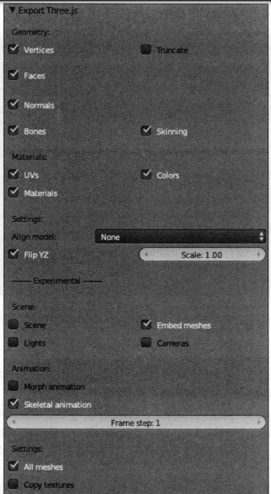</p>

这样你就可以将Blender中定义的动画以骨骼动画的方式导出，而不是变形动画。通过骨骼动画可以导出骨骼的移动，然后可以在Three.js中重新播放这个移动。

在Three.js里加载这个模型跟前面的例子一样。但是，当模型加载好之后，动画也创建好了：

```js
var loader = new THREE.JSONLoader();
loader.load('../assets/models/hand-2.js', fcuntion(geometry, mat){

  // register the animation
  THREE.AnimationHandler.add(geometry.animation);

  // create a material
  var mat = new THREE.MeshLambertMaterial({
    color: 0xF0C8C9,
    skinning: true
  });

  // create and position the mesh
  mesh = new THREE.SkinnedMesh(geometry, mat);
  mesh.rotation.x = 0.5 * Math.PI;
  mesh.rotation.Z = 0.7 * Math.PI;
  scene.add(mesh);

  // create the animation
  var animation = new THREE.Animation(mesh, 'wave');

  // start the animation
  animation.play();

}, '../assets/models');
```

跟之前示例区别的是：我们先用Three.js的AnimationHandler注册动画，即调用AnimationHandler.add函数。这样我么就可以使用新的THREE.Animation(mesh,'wave')语句来创建动画。这个动画的名词必须跟Blender中的名字一致。最后设置动画开始播放。

正如你所猜到的，我们仍然要做一些事情才能真正开始运行动画。在我们的render循环里调用THREE.AnimationHandler.update(clock.getDelta())函数来更新动画，然后Three.js就会用这些骨头将模型移动到正确位置。这个[示例](https://xsometimes.github.io/learning-threejs/chapter-09/13-animation-from-blender.html)的结果是一直简单地正在挥动的手。

#### 9.4.1 从Collada模型中加载动画
```html
<script type="text/javascript" src="../libs/ColladaLoader.js"></script>

<script type="text/javascript">
var loader = new THREE.ColladaLoader();
loader.load('../assets/models/monstaer.dae', function(collada) {
  var geom = collada.skins[0].geometry;
  var mat = collada.skins[0].material;

  // create a smooth skin
  geom.computeMorphNormals();
  mat.morphNormals = true;

  // create the animation
  meshAnim = new THREE.MorphAnimMesh(geom, mat);

  // position the mesh
  meshAnim.scale.set(0.15, 0.15, 0.15);
  meshAnim.rotation.x = -0.5 * Math.PI;
  meshAnim.position.x = -100;
  meshAnim.position.y = -60;

  scene.add(meshAnim);
  meshAnim.duration = 5000;
})
</script>

```

一个Collada文件不仅可以包含模型，还可以保存整个场景，包括相机、光源、动画等。使用Collada模型最好的方式是将loader.load函数的调用结果输出到控制台，然后再决定使用哪些组件。在本例的Collada文件中只有一个用带有蒙皮的网络制作的变形动画。若你回去看看本章前面所讲的变形目标，你会发现本例所用的方法跟它完全你一样。获取几何体、材质，然后创建MorphAnimMesh对象。甚至渲染循环也一样：
```js
function render() {
  // ...
  meshAnim.updateAnimation(delta * 1000);
  // ...
}
```

#### 9.4.3 从雷神之锤模型中加载动画
MD2格式是设计用来构建雷神之锤中的角色模型。尽管新一代引擎使用了不同的格式，但是你依然可以找到很多MD2格式的模型。为了使用这种格式的文件，我们首先要把它们转换成Three.js的js模式。你可以在[网址](http://oos.moxiecode.com/js_webgl/md2_converter/)完成这个转换。

转换好之后，你会得到一个Three.js格式的js文件，你可以用MorphAnimMesh类来加载和渲染。加载的代码跟以前一样，但是有一个值得关注的是：我们会自定需要播放的动画的名字，而不是播放整个动画;
```js
mesh.playAnimation('crattack', 10);
```

原因是MD2文件中通常会保存几个角色动画。但是幸运的是Three.js提供了一种功能可以用来选择动画，并调用playAnimation函数进行播放。首先我们要做的就是让Three.js来解析动画：
```js
mesh.parseAnimations();
```

其返回结果是一组动画的名称，这组动画可以用playAnimation函数播放。在我们的[示例](https://xsometimes.github.io/learning-threejs/chapter-09/15-animation-from-md2.html)中，你可以从右上角的菜单中选择要播放的动画的名称，乐意用如下方法决定哪些动画可以播放：
```js
mesh.parseAnimations();

var animLabels = [];
for (var key in mesh.geometry.animations) {
  if (key === 'length' || !mesh.geometry.animations.hasOwnProperty(key)) {
    continue;
  }
  animLabels.push(key);
}

gui.add(controls, 'animations', animLabels).onChange(function(e) {
  mesh.playAnimation(controls.animations, controls.fps);
})
```

一旦在菜单中选好一个动画，mesh.playAnimation函数就会被调用，其参数所选动画的名称。

### 9.5 总结

本章我们看了几种不同的让场景动起来的方法。我们从基础的动画技巧开始，然后是相机的移动和控制，最后是用变形目标和骨骼/骨头来制作动画。本章最重要的内容包括：
- 只要有了render循环，那么添加动画就很简单。只要修改网络的属性即可，Three.js会在下次渲染时更新网络。
- Three.js提供了很多相机控件。尽管它们的功能有些类似，不过也有它们各自适用的地方。如果你找不到一个能够切实满足你要求的控件，你可以研究一下代码，看看如何配置，或者基于该控件自己开发一个。
- 如果你想要一个相机控件，让你在场景中移动时只能朝四周看，那么你可以使用PathControl。
- 让模型动起来主要有两种方法，使用变形目标或者骨骼动画。使用变形目标时，你可以让你的模型从一个关键帧变换到另一个关键帧，从而创建出动画。使用骨骼动画时，你只要移动骨头就可以让模型动起来。根据这些骨头的移动，Three.js会更新那些绑定到骨头上的顶点。
- 加载模型时，刚开始最好先将模型输出到控制台。使用编辑器手工创建新模型、更新材质或修正一些小问题。
- 使用变形目标和骨骼时，Three.js有两个很好的辅助类。对于变形目标，可以使用MorphAnimMesh类；对于骨骼动画，可以使用SkinnedMesh类。

在前面的章节里，我们已经见过了各种用来覆盖对象的材质。我们见过如何修改材质的颜色、光泽和透明度。但是我们还没有详细讨论的是如何在材质中使用外部图片（也叫纹理）。使用纹理你可以很容易地创建一些对象，看上去像是用木料、金属、石头等做出来的。下一章，我们将会探索纹理的各个方面，以及如何在Three.js中使用它们。

## 第十章 加载和使用纹理
我们将会在本章讨论“如何将纹理应用到网络上”这个主题，具体来说，我们将会涉及以下内容：

- 在Three.js里加载纹理并应用到网络上
- 使用凹凸贴图和法线贴图为网络添加深度和细节
- 使用光照贴图创建假阴影
- 使用环境贴图在材质上添加反光细节
- 使用高光贴图，让网格的某些部分变得“闪亮”
- 通过修改网格的UV贴图，对贴图进行微调
- 将HTML5画布和视频元素作为纹理输入

前面这些主图都需要加载、展示纹理。另外，我们还会快速看一下如何通过顶点着色器和片段着色器来定制你自己的着色器。但是我们将会从最基本的例子开始，展示如何加载和应用纹理。

### 10.1 在材质中使用纹理
在Three.js中纹理有几种不同的用法。你可以用它们来定义网格的颜色，也可以用它们来定义高光、凹凸和反光。但是我们首先要看的是最基础的方法，用纹理为网络上的每个像素指定颜色。

#### 10.1.1 加载纹理并应用到网络
纹理最基础的用法是在材质上设置贴图。当你使用这个材质时（和几何体一起构建网格），网格就会拥有颜色，而这个颜色则来源于纹理。

可以用如下的方式来加载纹理并应用于网格：

```js
function createMesh(geom, imageFile) {
  var texture = three.ImageUtils.loadTexture('../assets/textures/general' + imageFile);
  var mat = new THREE.MeshPhongMaterial();
  mat.map = texture;

  var mesh =  new THREE.Mesh(geom, mat);
  return mesh;
}
```
在这段代码中我们用THREE.ImageUtils.loadTexture函数从指定的位置加载图片文件，你可以用PNG、GIF、JPEG文件作为纹理的输入格式。注意，纹理的加载是异步的。这对我们来说不是问题，因为我们有一个render循环，大约每秒钟渲染场景60次。如果你想在纹裂加载完之前一直等待，可以用如下的方法：

```js
texture = THREE.ImageUtils.loadTexture('texture.png', {}, function() {
  renderer.render(scene);
})
```

在这个例子里我们为loadTexture提供了一个回到函数，纹理加载完时调用。我们的示例没有使用回调函数，而是依赖render循环在纹理加载完时显示纹理。

几乎所有图片都可以当作纹理来使用。但是为了达到最佳效果，最好使用正方形的图片，其长宽大小是2的次方。例如大小为256*256、512*512、1024*1024的图片最合适。

由于纹理需要放大和缩小，纹理上的像素（也称作是texel）通常不会一对一地映射成面上的像素。因此，WebGL和Three.js提供了几种选择。你可以设置magFilter属性，指定纹理如何放大；设置minFilter属性，指定纹理如何缩小。这些属性可以设置成下面的两个基础值：

|  名称  | 描述  |
|  ----  | ----  |
|  THREE.NearestFilter（最近过滤器）  | 这个过滤器使用能够找到的最近texel（纹理上的像素）的颜色。用于放大时，这会导致方块化；用于缩小时，这会丢失很多细节  |
|  THREE.LinearFilter（线性过滤器）  | 这个过滤器使用能够找到的最近texel的颜色值来确定颜色。这样虽然在缩小时仍然会丢失很多细节，但在放大时会平滑很多，方块化也比较小  |

除了这些基础值，我们还可以使用mipmap。一个mipmap是一组纹理图片，每个图片的尺寸都是前一张图片的一半。这些图片是在加载纹理时创建的，可以生成比较光滑的过滤效果。若你有一个正方形的纹理（尺寸为2的次方），只需要稍稍几步就可以达到更好的过滤效果。这些属性可以设置成下面这些值：

|  名称  | 描述  |
|  ----  | ----  |
|  THREE.NearestMipMapNearestFilter  | 这个过滤器会选择最贴近目标解析度的mipmap，然后应用前表中所讲的最近过滤原则。放大时仍然会有方块化，但是缩小时会好很多。  |
|  THREE.NearestMipMapLinearFilter  | 这个过滤器选择的不是一个mipmap，而是层次最近的两个mipmap。然后再这两层上应用最近过滤原则获取两个中间值，这两个中间值会传递给一个线性过滤器，以获取最终结果  |
|  THREE.LinearMipMapNearestFilter  | 这个过滤器会选择最贴近目标解析度的mipmap，然后应用前表中所讲的线性过滤原则  |
|  THREE.LinearMipMapLinearFilter  | 这个过滤器选择的不是一个mipmap，而是层次最近的两个mipmap。然后再这两层上应用线性过滤原则获取两个中间值。这两个中间值会传递给一个线性过滤器，以获取最终结果。  |

如果你没有明确指定magFilter和minFilter属性的值，Three.js默认的magFilter值为THREE.LinearFilter，默认的minFilter值是TREE.LinearMipLinearFilter。基础纹理的[示例](https://xsometimes.github.io/learning-threejs/chapter-10/01-basic-texture.html)

这个示例里我们加载了几个纹理，并把它们应用到不同的图形上。在这个示例中你可以看到，纹理很好地贴合在图形上。在Three.js里创建几何体时任何纹理都能保证正确贴合。这是通过所谓的UV贴图（稍后进一步讨论）来完成的。通过UV贴图，我们可以告诉渲染器将纹理的某一部分应用到指定的面上。最简单的例子是给方块贴图。方块上某一面的UV贴图时这样：(0, 1)，(0,1)，(1,0)，(1,1)。其含义是将整个纹理（UV值的范围是0到1）应用到这个面上。

我们在这个示例里用纹理指定网络像素的颜色。我们还可以将纹理用作其他目的。下面的两个例子展示材质是如何着色的。你可以用这种功能结束在网络表面上创建出凹凸不平、皱皱巴巴的效果。

#### 10.1.2 使用凹凸贴图创建皱纹

凹凸贴图的目的是为材质增加厚度。参见[示例](https://xsometimes.github.io/learning-threejs/chapter-10/02-bump-map.html)

<p align="center">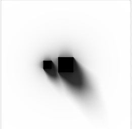</p>

在这个示例里你可以看到：跟右面那面墙比较，左边的墙细节更多，而且看上去也更厚。这是通过为材质设置额外的纹理（凹凸贴图）来实现的：

```js
function createMesh(geom, imageFile, bump) {
  var texture = THREE.ImageFile.loadTexture('../assets/textures/general/' + imageFile);
  var mat = new THREE.MeshPhiongMaterial();
  mat.map = texture;

  // 设置细节，凹凸图
  var bump = THREE.ImageUtils.loadTexture('../assets/textures/general/' + bump);
  mat.bumpMap = bump;
  mat.bumpScale = 0.2;

  var mesh = new THREE.Mesh(geom, mat);
  return mesh;
}
```

在这段代码中你可以看到，除了设置map属性，我们还设置了纹理的bumpMap属性。另外，通过bumpScale属性，我们还可以还设置凹凸的高度（如果是负数，则指的是深度）。

本例中的凹凸贴图是一张灰度图，但你也可以用彩色图。像素的密集度定义的是凹凸的高度。凹凸贴图中只有像素的相对高度，没有任何坡度的方向性信息。所以**用凹凸贴图所能达到的厚度和细节程度是有限的。要想实现更多细节可以使用法向贴图**。

#### 10.1.3 使用法向贴图创建更加细致的凹凸和皱纹

法向贴图中保存的不是每个像素的高度，而是像素的法向向量。简单来讲，使用法向贴图你只需用很少的顶点和面，就可以创建出细节非常丰富的模型。如[示例](https://xsometimes.github.io/learning-threejs/chapter-10/03-normal-map.html):

<p align="center">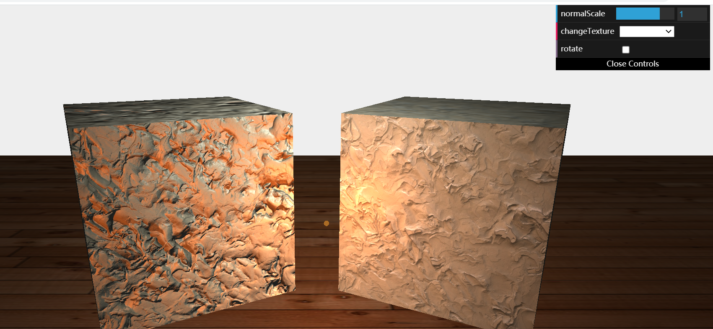</p>

例子中左边你会看到一个细节丰富的、皱皱巴巴的方块。光源绕着方块移动，而且你也会看到纹理会对光源做出非常自然的反应。这样的结果就是一个看上去很真实的模型，而且只需要一个非常简单的模型，以及几个纹理。下面的代码展示的就是如何在Three.js里使用法向贴图：

```js
function createMesh(geom, imageFile, normal) {
  var t = THREE.ImageUtils.loadTexture('../assets/textures/general' + imageFile);

  var m = THREE.ImageUtils.loadTexture('../assets/textures/general' + normal);
  var mat2 = new THREE.MeshPhongMaterial({
    map: t, 
    normalMap: m
  });
  var mesh = new THREE.Mesh(geom, mat2);
  return mesh;
}
```

这里所用的方法跟凹凸贴图一样。只是这次我们将normalMap属性设置为一个法向纹理。我们还可以指定凹凸的程度，方法是设置normalScale属性：mat.normalScale.set(1, 1)。通过这两个属性，你可以沿着x轴和y轴进行缩放。但是最好的方法是将它们的值设成一样的，以达到最佳效果。

但是法向贴图的问题是不容易创建。你要用特殊的工具，例如Blender和photoshop。它们可以将高解析度的渲染结果或图片作为输入，从中创建出法向贴图。

在构建模型时，使用法向贴图时一个好方法，可以在低阶多边形上添加丰富的细节。下面的例子将会展示这是如何做到的。

#### 10.1.4 使用光照贴图创建假阴影

在前面的示例中，我们使用特定的贴图创建出了看上去比较真实的阴影，而且会对空间中的光照做出反应。还有一种方法可以用来创建虚假阴影。在本节我们用的是光照贴图。光照贴图是预先渲染好的阴影，你可以用它来模拟真实的阴影。如[示例](04-light-map.html)：

<p align="center">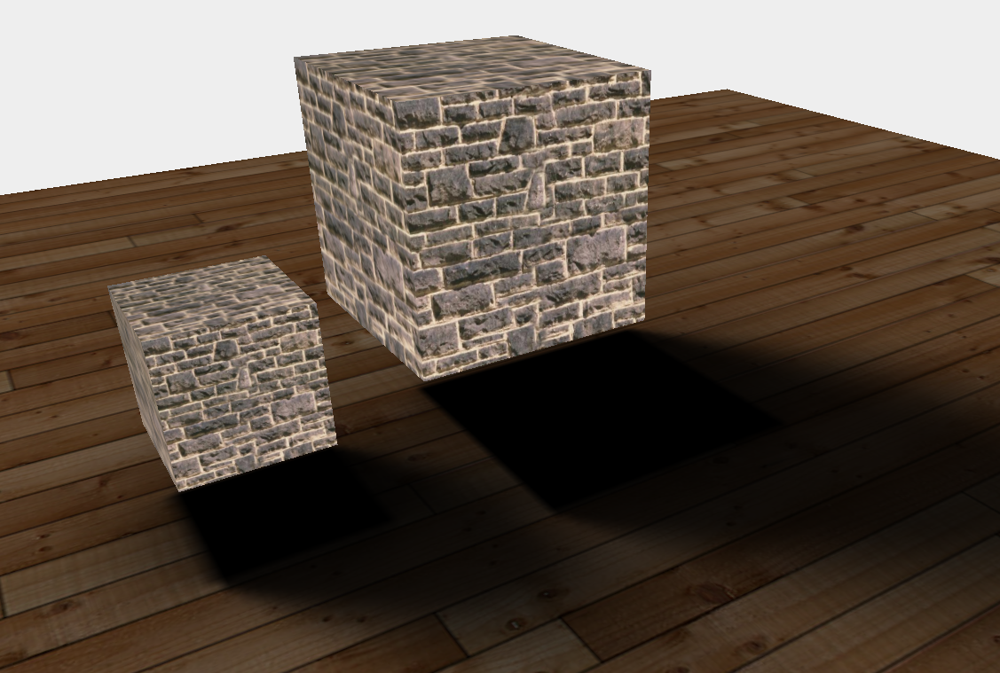</p>

在这个例子中你会两个非常真实的阴影，看上去就像是这两个方块的投影。但是，这两个阴影来源于一个光照贴图，如下图所示：

<p align="center"></p>

正如你所看到的，光照贴图中的阴影将会显示成地面上的阴影，从而模拟出真实阴影的效果。你可以用这种技术创建出解析度很高的阴影，而且不会损害渲染的性能。当然这只对静态渲染场景有效。光照贴图的使用跟其他纹理基本一样，只有几处小小的不同：

```js
var lm = THREE.ImageUtils.loadTexture('../assets/textures/lightmap/lm-1.png');
var wood = THREE.ImageUtils.loadTexture('../assets/textures/general/floor-wood.jpg');
var groundMaterial = new THREE.MeshBasicMaterial({
  lightMap: lm,
  map: wood
});
groundGeom.facevertexUvs[1] = groundGeom.faceVertexUvs[0];
```

应用光照贴图时，我们只要将材质的lightMap属性设置成刚才所示的纹理即可。但是要将光照贴图显示出来我们还需要额外的几个步骤。我们需要为光照贴图明确指定UV映射（将纹理的哪一部分应用到表面）。只有这样你才能将光照贴图与其他纹理独立开来。在我们的例子中，只用基础的UV贴图，这是在创建地面时由Three.js自动创建。有关为什么要明确指定UV贴图的更多信息和背景知识可以参考[网址](http://stackoverflow.com/questions/15137695/three-js-lightmap-causes-an-error-webglrenderingcontext-gl-error-gl-invalid-op)

（避免后期网页内容404，将该网址回答者的观点存在下面引用：）

> he point of lightmaps is that they can live independently of other textures, thus giving other textures chance to be much higher detail. Lightmaps use their own set of UV coordinates (usually auto-generated by some light baking solution, as opposed to artist-created primary UV set).<br /> Using lightmaps with the same UVs as everything else doesn't make much sense, as then you could achieve basically the same result for less texture cost simply by baking light map together with color map (this is e.g. what Rage uses, it looks fantastic but needs boatload of textures).<br /> Also lightmaps should be multiplicative, not additive. Big use case for lightmaps are pre-baked shadows and ambient occlusion, so you need to be able to darken things.

放置好阴影的贴图之后，我们要把方块放在正确的位置，然后即可得到上述例子的效果。

Three.js还提供了一种纹理，可以用来创建虚假的、高级的三维效果。下一节我们将会学习用华宁贴图创建虚假的反光效果。

#### 10.1.5 用环境贴图创建虚假的反光效果
计算环境反光非常耗费CPU，而且通常会使用光线追踪算法。如果你想在Three.js里使用反光，你可以做，但是你不得不做一个假的。你可以**通过创建一个对象所处环境的纹理来伪装反光，并将它应用到指定的对象上**。见[示例](https://xsometimes.github.io/learning-threejs/chapter-10/05-env-map-static.html)：

<p align="center">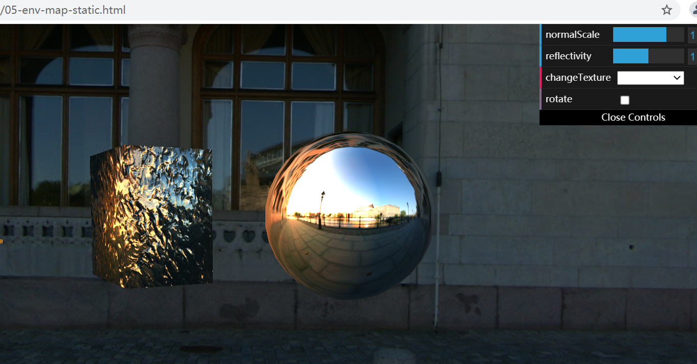</p>

在这个屏幕截图里你可以看到球和方块反射着周围环境。如果移动鼠标，你还可以看到这个反光是跟相机角度和你所看到的城市环境相关联的。要创建这样一个例子，我们要执行以下步骤：

1) 创建一个CubeMap对象：我们首先要做的是创建一个CubeMap对象。一个CubeMap是有6个纹理的集合，而这些纹理可以应用到方块的每一个面上。

2）创建一个带有这个CubeMap对象的方块：带有CubeMap对象的方块就是移动相机时你所看到的环境。它可以在你向四周看时制造出一种幻象，好像你站在某个环境中一样。**实际上你是处在一个方块中，而这个方块内侧渲染出来的纹理让你感觉好像处在某个空间中**。

3）将CubeMap作为纹理：我们用来模拟环境的CubeMap对象也可以用作网络的纹理。Three.js会让它看上去是环境的反光。

只要有制作材质的原材料，创建CubeMap对象就会非常简单。你所需要的的是6张用来构建整个场景的图片。所以你需要如下的图片：超前的（posz）、朝后的（negz）、朝上的（posy）、朝下的（negy）、朝右的（posx）、朝左的（negx）。Three.js会将它们缝合在一起，创建出一个无缝的环境贴图。互联网上有几个网站可以下载这样的图片，本例所用的图片来自[humus](http://www.humus.name/index.php?page=Textures)。

一旦拿到了这些图片，你就可以用如下的代码来加载它们：

```js
function createCubeMap() {
  var path = '../assets/textures/cubemap/parliament';
  var format = '.jpg';
  var urls = [
    path + 'posx' + format, path + 'negx' + format,
    path + 'posy' + format, path + 'negy' + format,
    path + 'posz' + format, path + 'negz' + format
  ];

  var textureCube = THREE.ImageUtils.loadTextureCube(urls);
  return textureCube;
}
```

我们又一次用到了THREE.ImageUtils这个js对象，但是这次我们会传入一个纹理数组，用来创建CubeMap对象，并使用loadTextureCube函数。有了这个CubeMap对象之后，我首先要创建一个方块：

```js
var textureCube = createCubeMap();
var shader = THREE.ShaderLib['cube'];
shader.uniforms['tCube'].value = textureCube;
var marterial = new THREE.ShaderMaterial({
  fragmentShader: shader.fragmentShader,
  vertexShader: shader.vertexShader,
  uniforms: shader.uniforms, // 重定义uniforms
  depthWrite: false,
  side: THREE.BackSide
});
cubeMesh = new THREE.Mesh(new THREE.CubeGeometry(100, 100, 100), material);
```

Three.js提供了一个特别的着色器（var shader = THREE.ShaderLib['cube'];），结合THREE.ShaderMaterial类，我们可以基于CubeMap对象创建出一个环境。我们用CubeMap对象配置这个着色器，创建一个网络，并将它添加到场景中。若从里面看，这个网格代表的就是我们所处的那个虚假的环境。

同一个CubeMap对象可以应用到某个网格上，用来创建虚假的反光：

```js
var sphere1 = createMesh(new THREE.SphereGeometry(10, 15, 15), 'plaster.jpg');
sphere1.material.envMap = textureCube;
sphere1.rotation.y = -0.5;
sphere1.position.x = -12;
sphere1.position.y = 5;
scene.add(sphere1);

var sphere2 = createMesh(new THREE.SphereGeometry(10, 15, 15), 'plaster.jpg', 'plaster-normal.jpg');
sphere2.material.envMap = textureCube;
sphere2.rotation.y = 0.5;
sphere2.position.x = -12;
sphere2.position.y = 5;
scene.add(sphere2);
```

正如你所看到的，我们将材质的envMap属性设成我们创建的cubeMap对象，结果看上去好像我们站在一个宽阔的室外环境中，而这些网格上则会映射环境。如果使用滑块，你就可以设置材质的reflectivity属性。正如这个名字所暗示的那样，这个属性可以决定材质能够反射多少场景。除了反射，Three.js还可以将CubeMap对象用于折射（类似玻璃的对象）

要达到这个效果，我们只要修改纹理的加载方法即可：

```js
var textureCube = THREE.ImageUtils.loadTextureCube(urls, new THREE.CubeRefractionMapping());
```

与refelectivity属性类似，通过材质的refraction（折射）属性可以控制折射率。在这个示例例，我们在网格上应用的是静态环境贴图。也就是说我们只能看到环境的反光，看不到其他网格。在下面的例子里，我们将会向你展示如何创建一个能够映射场景中其他物体的反光。

#### 10.1.6 高光贴图
通过高光贴图你可以为材质指定一个闪亮的、色彩明快的贴图。例如，下面的地球仪就是用高光贴图和法线贴图渲染出来的。见[示例](https://xsometimes.github.io/learning-threejs/chapter-10/06-specular-map.html)。

在这个例子中你可以看到海洋的色彩比较明亮，而且还反光。但是陆地的色彩比较暗淡，也不反光（反射较少）。为达到该效果，我们并没有使用什么特殊的法向贴图。海洋的高亮显示用的是下面这个高光贴图：

<p align="center">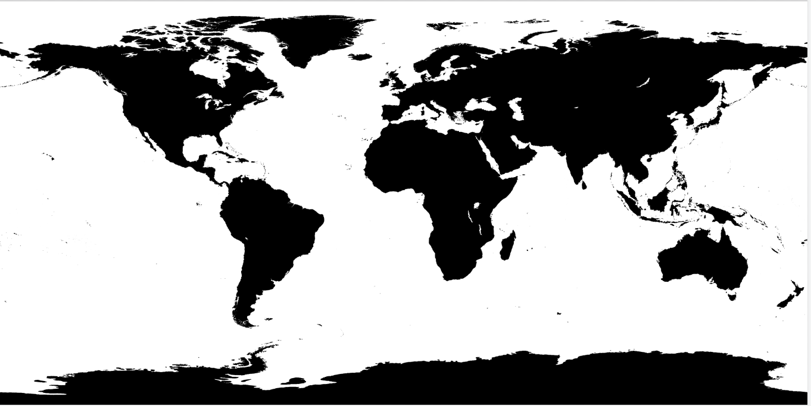</p>

一般来讲，像素的值越高（从黑到白），物体表面就越闪亮。通常高光贴图会与specular属性一起使用，该属性可以用来决定反光的颜色。在本例中这个颜色是红色：

```js
var specularTexture = THREE.ImageUtils.loadTexture('../assets/textures/planets/EarthSpec.png');  // 类似镜面的材质
var normalTexture = THREE.ImageUtils.loadTexture('../assets/planets/EarthNormal.png');

var planetMaterial =  new THREE.MeshPhongMaterial();
planetMaterial.specularMap = specularTexture;
planetMaterial.shininess = 1;

planetMaterial.normalMap = normalTexture;
```

同时还要注意，最好的效果往往是用低光亮度实现的，但高光贴图还会受到光照的影响。所以你需要试验才能确定所需的效果。

### 10.2 纹理的高级用途
在前面的小节里我们看了一些纹理的基础用法。在Three.js里，纹理还有一些更高级的用途。本节我们就来看看这些用途。

#### 10.2.1 定制UV映射
我们将从UV映射的深入观察开始。前面我们已经解释过，通过UV映射你可以指定纹理的哪一部分显示在物体表面上。当你在Three.js里创建一个几何体时，根据几何体的类型这些映射也一并自动创建。多数情况下，你不必修改默认的UV映射。要理解UV映射是如何工作的，最好的方法就是看一下Blender里的例子：

<p align="center">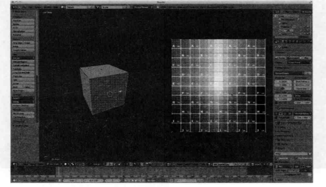</p>

在这个例子里你可以看到两个窗口。左边窗口中有一个方块，右边窗口中是UV映射，这是我们加载的纹理示例，用来展示什么是映射。在这个示例里，我们在左边窗口中选了一个面，并在右边窗口中指定了这个面的UV映射。正如你所看到的，这个面上的每一个顶点都在右边UV映射的一个角上（用小圆圈标识）。这意味着整个纹理都会映射到那个面上。这个方块的其他各面也是如此处理的，这样我们就会得到一个展示所有纹理的方块。参考[示例](https://xsometimes.github.io/learning-threejs/chapter-10/07-uv-mapping-manual.html)

这是Blender（也是Three.js）中在方块上贴图的默认行为。我们来改一下uv映射，看看映射后的纹理如何应用到物体表面上。这次我们在方块的每个面上都只显示部分纹理，而不是整个纹理。

如果用Three.js显示，你会看到纹理的应用方式已经不一样了。见[示例](https://xsometimes.github.io/learning-threejs/chapter-10/07-uv-mapping.html)

UV映射的定制一般是在诸如Blender这样的软件中完成的，特别是当模型变得复杂时。这里需要记住的是UV映射有两个维度，U和V，取值范围是0到1。定制UV映射时，你需要为物体的每个面指定其要显示纹理的哪一部分。为此你要为构成面的每一个顶点指定u坐标和v坐标。

接下来我们要看看如何复制纹理，可以使用UV映射内部的一些技巧。

#### 10.2.2 重复映射

当你在Three.js创建的几何体上应用纹理的时候，Three.js会尽量做到最优。例如，对于方块，Three.js会在每一个面上显示完整的纹理；对于球体，Three.js会用整个纹理包裹它。但是有一些情形，你可能不想将纹理遍布真个面或整个几何体，而是让纹理自己修复。Three.js提供了一些功能可以实现这种控制。如[示例](https://xsometimes.github.io/learning-threejs/chapter-10/08-repeat-wrapping.html)，可试验一下纹理的重复属性：

在这个例子里，你可以设置这个属性，控制属性如何复制它自己。

在用这个属性达到所需的效果之前，你需要保证将纹理的包裹实行设置为THREE.RepeatWrapping，如下代码片段所示：

```js
cube.material.map.wrapS = THREE.RepeatWrapping;
cube.material.map.wrapT = THREE.RepeatWrapping;
```

wrapS属性定义的是纹理沿x轴方向的行为，而wrapT属性定义的是纹理沿y轴方向的行为。Three.js为此提供了如下两个选项：
- THREE.RepeatWrapping 允许纹理重复自己
- THREE.ClampToEdgeWrapping是默认设置。若是THREE.ClampToEdgeWrapping，那么纹理边缘的像素会被拉伸，以填满剩下的空间。

如果取消了菜单项repeatWrapping，那么就会用THREE.ClampToEdgeWrapping选项。

若使用THREE.RepeatWrapping，我们可以用下面的代码来设置repeat属性：

```js
cube.material.map.repeat.set(repeatX, repeatY);
```

变量repeatX用来指定纹理在x轴方向多久重复一次，而变量repeatY则是用来指定纹理在y轴方向多久重复一次。若这些值设的是，则纹理不会重复；若设成大一点的值，你就会看到纹理开始重复。也可以将此值设成小于1，若是这样，你就会看到纹理被放大了。若将这个值设成负数，那么会产生一个纹理的镜像。

当你修改repeat属性的时候，Three.js会自动更新纹理，并用新的设置进行渲染。若你从THREE.RepeatWrapping改成THREE.ClampToEdgeWrapping，你要更新纹理：

```js
cube.material.map.needsUpdate = true;
```

到目前为止我们一直是将静态图片作为纹理。但是Three.js也支持将HTML5的画布作为纹理。

#### 10.2.3 在画布上绘制图案并作为纹理
本节我们将会来看一下两个不同的例子。首先我们会看一下如何在画布上创建简单的纹理，并应用到网格。然后我们会更进一步，创建一个画布，将随机生成的图形作为凹凸贴图。

##### 10.2.3.1 用画布做纹理
在[第一个例子里](https://xsometimes.github.io/learning-threejs/chapter-10/09-canvas-texture.html)，我们用到[literally库](http://litearllycanvas.html)创建一个交互式的画布，你可以在上面绘图。

你画的任何东西都会作为纹理直接渲染到方块上。在Three.js中药达到这种效果非常简单，只需要几行代码。首先我们要创建一个画布元素，然后配置该画布使用literally库（只针对这个例子）：

```html
<div class="fs-container">
  <div id="canvas-ouput" style="float:left"></div>
</div>

<!-- ... -->

<script type="text/javascript">
var canvas = document.createElement('canvas');
$('#canvas-output')[0].appendChild(canvas);

$('#canvas-output').literallycanvas({
  imageURLPrefix: '../libs/literally/img' // literally绘图工具所需的静态图片资源
})
</script>
```

这并没有什么特殊。我们只是用js创建了一个canvas元素，并将它添加到指定的div元素中。通过调用literallycanvas我们可以创建一个绘图工具，你可以用它直接画在画布上。接下来我们要将画布上的绘制结果作为输入创建一个纹理：
```js
function createMesh(geom) {
  var canvasMap = new THREE.Texture(canvas);
  var mat = new THREE.MeshPhongMaterial();
  mat.map = canvasMap;
  var mesh = new THREE.Mesh(geom, mat);

  return mesh;
}
```
正如代码所揭示的，你唯一要做的在创建新纹理时，将画布元素以引用的方式传递给纹理对象的构造函数：new THREE.Texture(canvas)。这样就可以创建出一个以画布为来源的纹理。剩下要做的就是在渲染时更新材质，这样画布上最新的内容才会显示在方块上：
```js
function render () {
  stats.update();

  cube.rotation.y += 0.01;
  cube.rotation.x += 0.01;

  cube.material.map.needsUpdate = true;
  requestAnimationFrame(render);
  webGLRenderer.render(scene, camera);
}
```

若要告知Three.js我们需要更新材质，只要将纹理的needsUpdate属性设为true即可。在这个例子里我们将画布作为最简单的纹理的输入。当然我们也可以将这种方法应用于目前我们所看到的所有类型的贴图中。在这个例子中，我们将用它来生成凹凸贴图。

##### 10.2.3.2 用画布做凹凸贴图

正如我们在本证前面所看到的，我们可以用凹凸贴图创建简单的有皱纹的纹理。贴图中像素的密集程度越高，贴图看上去越皱。由于凹凸贴图只是简单的黑白图片，所以没有道理不可以在画布上创建这个贴图，并将这个画布作为凹凸贴图的输入。

如[例子](https://xsometimes.github.io/learning-threejs/chapter-10/10-canvas-texture-bumpmap.html)，我们在画布上随机生成了一副灰度图，并将改图作为方块上凹凸贴图的输入。

完成该功能的js代码跟前面例子里的没有什么大的不同。我们要创建一个画布元素，然后用一些随机噪音填充该画布。至于噪音，我们可以使用Perlin噪音。~~[Perlin噪音 （书籍中记载的网址打不开）](https://en.wikipedia.org/wiki/Perlin_noise)~~ [Perlin噪音（网上自找的网址）](http://en.wiki.sxisa.org/wiki/Perlin_noise)可以产生看上去非常自然的随机纹理，如上图所示。我们可以使用[perlin](http://github.com/wwwtyro/perlin.js)中的Perlin噪音函数，如下所示：

```js
var ctx = canvas.getContext('2d');
function fillWithPerlin(perlin, ctx) {
  for (var x = 0;  x < 512; x++) {
    for (var y = 0;  y < 512; y++) {
      var base = new THREE.Color(0xffffff);
      var value = perlin.noise(x / 10, y / 10, 0);
      base.multiplyScalar(value);
      ctx.fillStyle = '#' + base.getHexString();
      ctx.fillRect(x, y, 1, 1);

    }
  }
}
```

我们用perlin.noise函数在画布x坐标和y坐标的基础上生成一个0到1之间的值。该值可以用来在画布上画一个像素点。可以用这个方法生成所有的像素点，其结果就是上图左下角的那个随机贴图。那个贴图即可作为凹凸贴图：

```js
var bumpMap = new THREE.Texture(canvas);

var mat = new THREE.MeshPhongMaterial();
mat.color = new THREE.Color(0x77ff77);
mat.bumpMap = bumpMap;
bumpMap.needsUpdate = true;

var mesh = new THREE.Mesh(geom, mat);
return mesh;
```

最后我们要讨论的纹理输入是另一个HTML元素：HTML5视频元素。

##### 10.2.3.3 用视频输出作为纹理

若你看过前面有关用画布坐纹理的段落，你可能也会想到将视频输出到画布，然后将画布作为为例的输入。这是一种方法，但是Three.js（通过WebGL）已经直接支持HTML5视频元素，见[示例]()。

将视频作为纹理的输入跟用画布一样，都很简单。首先，我们要有一个视频元素可以播放。接下来我们可以配置Three.js使用该视频作为纹理的输入：

```html
<video id="video" style="display: none; position: absolute; left: 15px; top: 75px;" src="../assets/movies/Big_Buck_Bunny_small.ogv" controls="true" autoplay="true"></video>

<script type="text/javascript">
var video = document.getElementById('video');
texture = new THREE.Texture(video);
texture.minFilter = THREE.LinearFilter;
texture.magFilter = THREE.LinearFilter;
texture.generateMipmaps = false;
</script>
```

由于我们的视频不是正方形，所以要保证材质不会生成mipmap。**由于材质变化得很频繁，所以我们还需要设置简单高效的过滤器**（参见10.1.1节）。在本例中，我们用的是MeshFaceMaterial和MeshBasicMaterial：

```js
var materialArray = [];
materialArray.push(new THREE.MeshBasicMaterial({ color: 0x0051ba }));
materialArray.push(new THREE.MeshBasicMaterial({ color: 0x0051ba }));
materialArray.push(new THREE.MeshBasicMaterial({ color: 0x0051ba }));
materialArray.push(new THREE.MeshBasicMaterial({ color: 0x0051ba }));
materialArray.push(new THREE.MeshBasicMaterial({ map: texture }));
materialArray.push(new THREE.MeshBasicMaterial({ color: 0x0051ba }));

var faceMaterial = new THREE.MeshFaceMaterial(materialArray);
var mesh = new THREE.Mesh(geom, faceMaterial);
```

剩下要做的是保证在render循环中更新材质

```js
if (video.readyState === video.HAVE_ENOUGH_DATA) {
  if (texture) texture.needsUpdate = true;
}
```

在这个例子里，我们只是将视频渲染到方块的一个面上。由于它只是一种普通的纹理，我们可以任意处理它。例如我们可以通过定制UV映射，沿着方块的面将它分成几部分。我们还可以将视频作为凹凸贴图的输入。

### 10.3 总结
关于纹理的内容至此就结束了。正如你所看到的，Three.js里有各种各样的纹理，每种都有独特的用途。使用纹理时最需要记住的是如下内容：
- 你可以使用任何一章PNG、JPG或GIF的图片作为纹理。**图片的加载是异步的，所以请记住要么使用渲染循环，要么在加载纹理时提供一个回调函数**。
- 使用正方形的纹理（其尺寸是2的次方，例如256*256、512*512和1024*1024）可以达到最佳效果。
- 你可以在低阶模型上使用纹理创建出非常好看的图形，使用凹凸贴图和法向贴图可以创建出虚假的细节丰富，凹凸感很强的，带有阴影的简单模型。
- 标准情况下，Three.js并不支持反光。但是你可以用环境贴图很容易地创建出虚假的反光。
- 你想直接控制物体表面的光亮程度，你可以使用高光贴图。
- 你可以设置纹理的repeat属性，从而让纹理可以自我复制。还要记住将材质的包裹属性从ClampToEdgeWrapping改为RepeatWrapping。
- 在Three.js里，可以用HTML5的画布元素或视频元素创建动态纹理。你只需要将这些元素作为纹理的输入，并在更新纹理时，将needUpdate属性设为true。

到本章为止，我们差不多已经涵盖了Three.js中所有重要的概念。但是我们还没有涉及Three.js中一个有趣的功能，即所谓的后期处理。通过后期处理，你可以在场景渲染完毕后添加一些效果。例如，你可以让场景变得模糊，或者变得色彩艳丽，或者使用扫描线添加一种类似电视的效果。下一章，我们就来介绍后期处理，以及如何将它应用于你的场景中。

## 第十一章 定制着色器和渲染后期处理
我们将在本章讨论——渲染后期处理。除了这个主题，我们还会向你介绍如何创建自定义的着色器。我们在本章讨论的内容包括如下几点：

- 配置Three.js库，用于后期处理
- Three.js提供的基本后期处理通道，例如BloomPass（泛光通道）和FilmPass（胶片通道）
- 使用掩码，将效果应用到部分场景
- 使用TexturePass（纹理通道）保存渲染结果
- 使用ShaderPass（着色器通道）添加更基础的后期处理效果，例如褐色滤镜、景象效果，以及颜色调整
- 使用ShaderPass产生模糊结果，以及更高级的滤镜
- 通过开发一个简单的着色器，来创建自定义的后期处理效果

我们在第1章创建了一个render循环，并在本书中一直使用该循环来渲染场景、制作动画。**对于后期处理，我们需要修改这个循环，好让Three.js库对最终的渲染结果进行后期处理**（我们将会在11.1节介绍如何修改）。

### 11.1 设置后期处理
设置Threejs库为后期处理做准备，我们需要通过以下步骤对当前的配资进行修改：

1）创建一个EffectComposer（效果组合器）对象，然后在该对象上添加后期处理通道。

2）配置该对象，使它可以渲染我们的场景，并应用额外的后期处理步骤。

3）在render循环中，使用EffectComposer渲染场景、应用通道，并输出结果。

你可以在[示例](https://xsometimes.github.io/learning-threejs/chapter-11/01-basic-effect-composer.html)上试验，或者根据需要进行调整，可以使用右上角的菜单调整本例中用到的各个后期处理步骤的属性。

#### 11.1.1 创建EffectComposer对象
我们先来看看需要包含的js文件。这些文件可以在Three.js的发布包里找到，路径是examples/js/postprocessing和examples/shaders。至少包含下面的文件：

```html
<script type="text/javascript" src="../libs/postprocessing/EffectComposer.js"></script>
<script type="text/javascript" src="../libs/postprocessing/MaskPass.js"></script>
<script type="text/javascript" src="../libs/postprocessing/RenderPass.js"></script>
<script type="text/javascript" src="../libs/postprocessing/CopyShader.js"></script>
<script type="text/javascript" src="../libs/postprocessing/ShaderPass.js"></script>
```

EffectComposer.js文件提供EffectComposer对象，以便添加后期处理步骤。MaskPass.js、ShaderPass.js和CopyShader.js是EffectComposer内部使用的文件，RenderPass.js文件则可以用来在EffectComposer对象上添加渲染通过。若没有这些通道，我们的场景就不会被渲染。

在这个示例里，我们添加了两个js文件，用来在场景中添加一种胶片效果，如下所示：

```html
<script type="text/javascript" src="../libs/postprocessing/FilmPass.js"></script>
<script type="text/javascript" src="../libs/postprocessing/FilmShader.js"></script>
```

首先我们要创建一个EffectComposer对象，你可以在这个对象的构造函数里传入WebGLRenderer：

```js
var composer = new THREE.EffectComposer(webGLRenderer);
```

接下来我们要在这个组合器中添加各种通道。

##### 11.1.1.1 为后期处理配置EffectComposer对象
每个通道会按照其加入EffectComposer的顺序执行。第一个要加入的通道是RenderPass。下面这个通道会渲染场景，但不会将渲染结果输出到屏幕上：

```js
var renderPass = new THREE.RenderPass(scene, camera);
composer.addPass(renderPass);
```

创建RenderPass时要传入需要渲染的场景和所用的相机。调用addPass时要传入需要渲染的场景和所用的相机。调用addPass()函数，我们即可将这个RenderPass添加到EffectComposer对象中。接下来我们要添加一个可以将结果输出到屏幕的通道。不是所有的通道都可以做到这一点（稍后解释），但是本例中所用的FilmPass可以将其结果输出到屏幕。要添加FilmPass，我们先要创建该对象，然后添加到效果组合器中。最终的代码大致如下所示：

```js
var renderPass = new THREE.RenderPass(scene, camera);
var effectFilm = new THREE.FilmPass(0.8, 0.325, 256, false);
effectFilm.renderToScreen = true;

var composer = new THREE.EffectComposer(webGLRenderer);
composer.addPass(renderPass);
composer.addPass(effectFilm);
```

正如你所看到的，我们创建了一个FilmPass对象，并将它的renderToScreen属性设为true。这个通道是在RenderPass后面添加的，所以如果使用了这个效果组合器，我们就可以看到输出结果。

##### 11.1.1.2 修改渲染循环
现在我们需要稍稍修改一下渲染循环，用效果组合器来取代WebGLRenderer：
```js
var clock = new THREE.Clock();
function render() {
  stats.update();

  var delta = clock.getDelta();
  orbitControls.update(delta);

  sphere.rotation.y += 0.002;

  requestAnimationFrame(render);
  composer.render(delta);
}
```
在这段代码里我们移除了“webGLRenderer.render(scene, camera);”，用“composer.render(delta);”替代。这将调用EffectComposer的render()函数。由于我们已经将FilmPass的renderToScreen属性设置为ture，所以FilmPass的结果将会输出到屏幕上。

完成这些基础配置后，我们将在接下来的几节看看另外几个后期处理通道。

### 11.2 后期处理通道
Three.js库提供了几个后期处理通道，你可以直接将它们添加到EffectComposer对象中。下表是这些通道的概览。

|  通道  | 描述  |
|  ----  | ----  |
|  BloomPass  | 该通道会使明亮区域渗入较暗的区域。模拟相机照到过多亮光的情形  |
|  DotScreenPass  | 将一层黑点贴到代表原始图片的屏幕上  |
|  FilmPass  | 通过扫描线和失真模拟电视屏幕  |
|  MaskPass  | 在当前图片上贴一层掩膜，后续通道只会影响被贴的区域  |
|  RenderPass  | 该通道在指定的场景和相机的基础上渲染出一个新的场景  |
|  SavePass  | 执行该通道时，它会将当前渲染步骤的结果复制一份，方便后面使用。这个通道在实际应用中作用不大，所以也没有用在我们的示例中  |
|  ShaderPass  | 使用该通道你可以传入一个自定义的着色器，用来生成高级的、自定义的后期处理通道  |
|  TexturePass  | 该通道可以将效果组合器的当前状态保存为一个纹理，然后可以在其他EffectComposer对象中将该纹理作为输入参数  |

我们先从简单的通道开始。

#### 11.2.1 简单后期处理通道
对于简单的后期处理通道，我们可以看看FilmPass、BloomPass和DotScreenPass。对于这些通道，你可以看看[示例](https://xsometimes.github.io/learning-threejs/chapter-11/02-post-processing-simple-passes.html)，在这个示例里试验这些通道，看看他们如何影响原始的输出。

我们在这个示例里同时展示了四个不同的场景。右上角的是FilmPass，左上角的是BloomPass，左下角的是DotScreenPass，右下角的是原始渲染的结果。

在这个示例里，我们也使用了ShaderPass和TexturePass来重用原始渲染结果的输出，并将输出作为其他三个场景的输入。所以在看各个通道之前，我们先看看看这两个通道：

```js
var renderPass = new THREE.RenderPass(scene, carema);
var effectCopy = new THREE.ShaderPass(THREE.CopyShader);
effectCopy.renderToScreen = true;

var composer = new THREE.EffectComposer(webGLRenderer);
composer.addPass(renderPass);
composer.addPass(effectCopy);

var renderScene = new THREE.TexturePass(composer.renderTarget2);
```

在这段代码里我们设立了一个EffectComposer对象，该对象输出默认场景（右下角的那个）。这个组合器有两个通道：RenderPass（用来渲染场景）和ShaderPass。若用CopyShader来设置ShaderPass，那么它渲染的输出结果就不会有进一步的后期处理；若将renderToScreen属性设为true，那么渲染结果将会输出到屏幕。若你看过示例代码，那么你会发现相同的场景输出了4次，但是应用了不同的效果。我们可以使用RenderPass从零开始渲染场景，但是这样有点儿浪费，因为我们可以重用第一个效果组合器的输出。要做到这一点儿，我们要创建一个TexturePass，并传入composer.renderTarget2。现在再来看看FilmPass，以及如何将TexturePass作为输入。

##### 11.2.1.1 用FilmPass创建类似电视的效果
现在让我们来看看如何结合上一节的TexturePass来使用该效果：

```js
var effectFilm = new THREE.FilmPass(0.8, 0.325, 256, false);
effectFilm.renderToScreen = true;

var composer4 = new THREE.EffectComposer(webGLRenderer);
composer4.addPass(renderScene);
composer4.addPass(effectFilm);
```

**要使用TexturePass唯一要采取的步骤是将它作为效果组合器的第一个通道**。接下来我们可以添加FilmPass，应用效果。FilmPass本身接收如下4个参数;

|  属性  | 描述  |
|  ----  | ----  |
|  noiseIntensity  | 通过该属性你可以控制屏幕的颗粒程度  |
|  scanlinesIntensity  | FilmPass会在屏幕上添加一些扫描线。通过该属性，你可以指定扫描线的显著程度  |
|  scanlinesCount  | 该属性可以控制显示出来的扫描线数量  |
|  grayscale  | 若设为true，输出结果将会转换成灰度图  |

实际上有两种方法传递这些参数。在这个示例里，它是作为构造函数的参数传递的，但是你也可以直接设置它们，如下所示：

```js
efftectFilm.uniforms.grayscale.value = controls.grayscale;
efftectFilm.uniforms.nIntensity.value = controls.noiseIntensity;
efftectFilm.uniforms.sIntensity.value = controls.scanlinesIntensity;
efftectFilm.uniforms.sCount.value = controls.scanlinesCount;
```

在这段代码里我们使用了uniforms属性，该属性可以直接跟WebGL通信。在11.3节中，我们将会新一步讲解uniforms。现在你只要知道你可以直接更改后期处理通道和着色器的配置，而且可以立即看到结果。

##### 11.2.1.2 用BloomPass在场景中添加泛光效果
在左上角你所看到的效果称作泛光效果（bloom effect）。当你应用泛光效果时，场景中的明亮区域将会变得更加显著，而且会渗入到较暗的区域。创建BloomPass的代码如下所示：

```js
var bloomPass = new THREE.BloomPass(3, 25, 5, 256);
var composer3 = new THREE.EffectComposer(webGLRenderer);
composer3.addPass(renderScene);
composer3.addPass(bloomPass);
composer3.addPass(effectCopy);
```

若将这段代码与使用FilmPass的EffectComposer相比，你会发现我们在这里多添加了一个通道——effectCopy。这一步我们在普通输出中也曾用过，它不会增加任何特殊效果，只是将最后一个通道的结果复制到屏幕上。之所以要添加这一步，是因为BloomPass不能直接将渲染结果输出到屏幕。下表列出的是BloomPass的所有可以设置的属性：

|  属性  | 描述  |
|  ----  | ----  |
|  Strength  | 该属性定义的是泛光效果的强度。其值越高，则明亮的区域越明亮  |
|  kernelSize  | 该属性控制的是泛光效果的偏移量 |
|  sigma  | 通过sigma属性，你可以控制泛光效果的锐利程度。其值越高，泛光越模糊  |
|  Resolution  | 该属性定义的是泛光效果的解析图。若该值太低，那么结果的方块化会比较严重  |

##### 11.2.1.3 使用DotScreenPass将场景输出成点集

DotScreenPass的使用跟我们刚刚看到的BloomPass非常相似：

```js
var dotScreenPass = new THREE.DotScreenPass();
var composer1 = new THEE.EffectComposer(webGLRenderer);
composer1.addPass(renderScene);
composer1.addPass(dotScreenPass);
composer1.addPass(effectCopy);
```

要达到该效果，我们仍然需要添加effectCopy，以便将结果输出到屏幕。在DotScreenPass中可以配置如下属性：

|  属性  | 描述  |
|  ----  | ----  |
|  center  | 通过center属性，你可以微调点的偏移量  |
|  angle  | 这些点是按照某种方式对齐的。通过angle属性，你可以更改对齐方式  |
|  scale  | 该属性设置所用点的大小。scale越小，则点越大  |

##### 11.2.1.4 将多个渲染器的输出结果显示在同一屏幕上

本书不涉及如何使用后期处理效果的细节，而是解释如何将所有4个EffectComposer实例的输出结果显示在同一屏幕上。首先让我们来看看本例所用的render循环：

```js
function render () {
  stats.update();

  var delta = clock.getDelta();
  orbitControls.update(delta);

  sphere.rotation.y += 0.002;
  requestAnimationFrame(render);

  webGLRenderer.autoClear = false;
  webGLRenderer.clear();

  webGLRenderer.setViewport(0, 0, halfWidth, halfHeight);
  composer1.render(delta);
  webGLRenderer.setViewport(halfWidth, 0, halfWidth, halfHeight);
  composer2.render(delta);
}
```

这里首先**要注意的是我们将webGLRenderer.autoClear属性设为false，而且我们将明确调用clear()函数。如果不这么做，那么每次调用效果组合器的render()函数时，之前渲染的场景会被清掉。通过这种方法，我们只会在render循环开始时将所有东西清一遍**。

为了避免所有效果组合器在同一地方渲染，我们将效果组合器所用的webGLRenderer的视图区设置成屏幕上不同的部分。设置视图区的函数接受四个参数：x、y、width和height。正如你在代码中所看到的，我们用这个函数将屏幕分成4个区，每个效果组合器在各自的区域中渲染。

> 如果你愿意，你也可以将该方法用于多场景、多相机和多WebGLRenderer实例的情况下。

到目前为止，我们只是将多个简单通道串联起来。在下一个示例例，我们将会配置一个复杂的EffectComposer，并用掩膜在部分窗口上应用效果。

#### 11.2.2 使用掩膜的高级效果组合器

在前面的示例里，我们是在整个场景上应用后期处理通道。但是Three.js库也具有在特定区域上应用通道的能力。本节我们将会采取如下步骤：

1）创建一个作为背景图的场景。

2）创建一个场景，里面有一个看上去像地球的球体。

3）创建一个场景，里面有一个看上去像火星的球体。

4）创建一个EffectComposer对象，将这三个场景渲染到一个图片里。

5）在渲染成火星的球体上应用一个彩色效果。

6）在渲染成地球的球体上应用褐色效果。

参考[示例](https://xsometimes.github.io/learning-threejs/chapter-11/03-post-processing-masks.html)

首先我们要配置各个需要渲染的场景，

```js
var sceneEarch = new THREE.Scene();
var sceneMars = new THREE.Scene();
var sceneBG = new THREE.Scene();
```

要创建代表地球和火星的球体，我们只要创建好带有相应材质和纹理的球体，然后将它们添加到对应的场景中：

```js
var sphere = createEarthMesh(new THREE.SphereGeometry(10, 40, 40));
sphere.position.x = -10;

var sphere2 = createEarthMesh(new THREE.SphereGeometry(5, 40, 40));
sphere2.position.x = 10;

sceneEarth.add(sphere);
sceneMars.add(sphere2);
```

我们还要给它添加一些光源，这里不讨论。唯一要记住的是同一光源不能添加到不同场景中，所以你要为每个场景创建各自的光源。这些即使这两个场景要做的所有配置。

至于背景图，我们要创建一个OrthographicCamera对象。根据第2章，对象的正交投影尺寸不受相机距离的影响。

```js
var cameraBG = new THREE.OrthographicCamera(-window.innerWidth, window.innerWidth, window.innerHeight, -window.innerHeight, -10000, 10000);
cameraBG.position.z  = 50;

var materialColor = new THREE.MeshBasicMaterial({
  map: THREE.ImageUtils.loadText('../assets/textures/starry-deep-outer-space-galaxy.jpg'),
  depthTest: false
});
var bgPlane = new THREE.Mesh(new THREE.PlaneGeometry(1, 1), materialColor);
bgPlane.position.z = -100;
bgPlane.scale.set(window.innerWidth * 2, window.innerHeight * 2, 1);

sceneBG.add(bgPlane);

```
这部分我们不会解释太多细节，但是创建背景图我们要采取几个步骤。首先，我们要从背景图中创建一个材质，并应用到简单的plane（平面）上。然后将这个plane添加到场景中，并对它进行缩放以适应整个屏幕。所以当我们用这个相机渲染场景时，背景图会布满整个窗口。

现在我们有了三个场景，可以开始配置后期处理通道和EffectComposer对象。我们会从整个后期处理通道链开始，然后看看每个通道：

```js
var composer = new THREE.EffectComposer(webGLRenderer);
composer.renderTarget1.stencilBuffer = true;
composer.renderTarget2.stencilBuffer = true;

composer.addPass(bgPass);
composer.addPass(renderPass);
composer.addPass(renderPass2);

composer.addPass(marsMask);
composer.addPass(effectColorify1);
composer.addPass(clearMask);

composer.addPass(earthMask);
composer.addPass(effectSepia);
composer.addPass(clearMask);

composer.addPass(effectCopy);
```

要使用掩膜，我们需要用不同的方式创建EffectComposer对象。在本例中，我们要创建一个新的WebGLRenderTarget对象，然后将这个内部使用的渲染对象的stencilBuffer属性设成true。让我们来看一下先添加的三个通道。这三个通道会渲染背景场景、地球场景和火星场景，如下所示：

```js
var bgPass = new THREE.RenderPass(sceneBG, cameraBG);
var renderPass = new THREE.RenderPass(sceneEarth, camera);
renderPass.clear = false;
var renderPass2 = new THREE.RenderPass(sceneMars, camera);
renderPass2.clear = false;
```

这里并没有什么新东西，除了将两个通道的clear属性设为false。如果不这么做，我们将只会看到renderPass2的输出，因为它会在开始渲染时清除所有东西。若你回头看看EffectComposer的代码，你会发现接下来的三个通道是marsMask、effectColorify和clearMask。首先我们要看看这三个通道是怎么定义的：

```js
var marsMask = new THREE.MaskPass(sceneMars, camera);
var clearMask =  new THREE.ClearMaskPass();
var effectColorify = new THREE.ShaderPass(THREE.ColorifyShader);
effectColorify.uniforms['color'].value.setRGB(0.5, 0.5, 1);
```

这三个通道中的第一个是MaskPass。创建MaskPass时，跟创建RenderPass一样你要传入场景和相机。MaskPass会在内部渲染场景，但它不是将结果显示在屏幕上，而是用它来创建掩膜。若将MassPass添加到一个EffectComposer对象上，那么后续所有通道将只会应用到MaskPass定义的掩膜上，**直到遇到ClearMaskPass**。这也就意味着在本例中添加蓝色光芒的effectColorify通道只会应用到sceneMars中渲染的对象上。

我们也会在表示地球的那个对象上用同样的方法应用褐色滤镜。我们先基于地球场景创建一个掩膜，然后在EffectComposer中使用该掩膜。添加完MaskPass后我们再添加其他想要的效果（本例中是effectSpepia），然后添加ClearMaskPass移除掩膜。这个EffectComposer的最后一步我们曾经见过。我们需要将最终结果复制到屏幕，同样，我们用的是effectCopy通道。

在MaskPass中有一个有趣的属性，即inverse属性。若将该属性设为true，则掩膜会反转。也就是说，该效果会应用到所有对象上，除了传递给MaskPass的场景。

到目前为止，我们用的一直是Three.js提供的标准通道。Three.js还提供了一个ShaderPass（着色器通道），该通道可以用来定制效果，而且有大量的着色器可用或者试验。

#### 11.2.3 用ShaderPass定制效果

通过ShaderPas，我们可以传递一个自定义的着色器，将大量额外的效果应用到场景中。本节将分为三个部分。我们先来看看下面所列的简单着色器：

|  属性  | 描述  |
|  ----  | ----  |
|  MirrorShader  | 该着色器可以为部分屏幕创建镜面效果  |
|  HueStaturationShader  | 该着色器可以改变颜色的色调和饱和度  |
|  VignetteShader  | 该着色器可以添加晕映效果，该效果可以在图片中央的周围显示黑色的边框  |
|  ColorCorrectionShader  | 通过这个着色器，你可以调整颜色的分布  |
|  RGBShiftShader  | 该着色器可以将构成颜色的红、绿、蓝分开  |
|  BrightnessContrasShader  | 该着色器可以更改图片的亮度和对比度  |
|  ColorifyShader  | 该着色器可以在屏幕上蒙上一层颜色  |
|  SepiaShader  | 该着色器可以在屏幕上创建出类似乌贼墨的效果  |

接下来我们将会看一些提供模糊效果的着色器：

|  属性  | 描述  |
|  ----  | ----  |
|  HorizonBlurShader和VerticleBlurShader  | 这两个着色器在整个场景中应用模糊效果  |
|  HorizontalTiltShiftShader和VerticalTiltShiftShader  | 这两个着色器可以创建出移轴效果。在移轴效果中只有部分图片显示得比较锐利，从而创建出一个看上去像是微缩景观的场景  |
|  TriangleBlurShader  | 该着色器使用基于三角形的方法，在场景中应用模糊效果  |

最后我们会看几个提供高级效果的着色器：

|  属性  | 描述  |
|  ----  | ----  |
|  BleachByPassShader  | 该着色器可以创建一种漂白效果。在该效果下，图片上像是镀了一层银  |
|  EdgeShader  | 该着色器可以探测图片中锐利的边界，并突出显示这些边界  |
|  FXAAShader  | 该着色器可以在后期处理阶段应用抗锯齿效果，若在渲染时抗锯齿影响效率，那么就可以使用该着色器  |
|  FocursShader  | 这是一个简单的着色器，其结果是中央区域渲染得比较锐利，但周围比较模糊  |

只有知道其中一个是如何工作的，那么其他的着色器你也就了解了。下一节，我们会着重讲几个比较有意思的。你可以用各小节提供的交互式例子试验一下其他的着色器。

##### 11.2.3.1 简单的着色器

[示例](https://xsometimes.github.io/learning-threejs/chapter-11/04-shaderpass-simple.html)，当你更改着色器的某个属性时，场景会立即更新。在这个示例里，我们会直接将修改后的值设置到着色器上。例如，当RGBShiftShader的值改变时，我们会更新相应的着色器，

```js
this.changeRGBShifter = function () {
  rgbShift.uniforms.amount.value = controls.rgbAmount;
  rgbShift.uniforms.angle.value = controls.angle;
}
```

##### 11.2.3.2 模糊着色器
[示例](https://xsometimes.github.io/learning-threejs/chapter-11/05-shaderpass-blur.html)

#### 11.2.3.2 高级着色器
[示例](https://xsometimes.github.io/learning-threejs/chapter-11/06-shaderpass-advanced.html)

### 11.3 创建自定义的后期处理着色器
本节你将会学习如何创建一个可以在后期处理中使用的、自定义的着色器。我们会创建来两个着色器。第一个着色器可以将当前图片转换成灰度图，第二个着色器可以通过减少可用颜色的数目，将图片转换成8位图。

232

#### 11.3.1 定制灰度着色器
#### 11.3.2 定制位着色器
### 11.4 总结

本章我们讨论了很多后期处理的方法。正如你所看到的创建EffectComposer对象，然后将各种通道串联在一起非常简单。

- 不是所有通道的结果都会输出到屏幕。若想输出到屏幕，那么你可以使用带有参数CopyShader的ShaderPass。
- 在效果组合器中添加通道的顺序很重要。各种效果按照添加顺序起作用
- 若你想重用某个EffectComposer的结果，那么你需要将clear属性设为false。若不这么做，那么你只会看到最后一个RenderPass的输出。
- 若你只想在特定对象上应用某种效果，你可以使用MaskPass。用完后，可以调用clearMaskPass来清除掩膜。
- Three.js中除了提供很多标准的通道之外，还提供了大量的标准着色器。你可通过ShaderPass使用它们。
- 在Three.js库中使用标准方法，为后期处理创建自定义的着色器非常简单，你只需要创建一个fragmentShader。


## 第十二章 用Physijs在场景中添加物理效果
这一章，我们要看看另一个可以用来拓展Three.js功能的库——Physijs。通过这个库可以在场景中引入物理效果。所谓物理效果指的是对象会有重力，它们可以相互碰撞，施加力之后可以移动，而且通过铰链和滑块还可以在移动过程中在对象上施加约束。这个库利用的是另外一个著名的物理引擎ammo.js

本章我们将会看看Physijs的功能：
- 创建一个Physijs场景，在这个场景中对象具有重力，而且可以相互碰撞。
- 展示一下如何修改场景中对象的摩擦系数和复原性（弹性）。
- 讲解Physijs支持的各种图形，以及如何使用它们。
- 如何通过将简单图形联结在一起，创建组合图形。
- 通过添加点、铰链、螺钉和自由度约束来限制对象的移动，

### 12.1 创建可用Physijs的基本Three.js场景
Physijs的[github代码仓库](https://github.com/chandlerprall/Physijs)

模拟这样的场景非常耗费CPU。若我们在render线程中做的话，场景的帧频会受到严重的影响。为了弥补这一点，Physijs选择在后台线程中执行计算。这里的后台线程是由[Webworkers（网页线程）](http://www.whatwg.org/specs/web-apps/current-work/multipage/workers.html)规范定义的，现在大多数浏览器都实现了该功能。根据这个规范，你可以在一个单独的线程里执行CPU密集的任务，这样就不会影响渲染。

对Physijs来说这也就意味着我们必须要配置一个带有执行任务的js文件，并告诉Physijs在哪里可以找到用来模拟创建的ammo.js文件。之所以要包含ammo.js文件，原因是Physijs只是ammo.js的一个包装器，使得它更容易使用。[ammo.js](https://github.com/kripken/ammo.js)是一个实现物理引擎的库，Physijs只是在这个物理库的基础上提供了便于使用的接口。由于Physijs只是一个包装器，所以我们在Physijs也可以使用其他的物理引擎。在Physijs的代码仓库中你还可以找到一个使用Cannon.js（另一个物理引擎）的分支版本。

我们的做法是设置下面这两个属性：
```js
Physijs.scripts.worker = '../libs/physijs_worker.js';
Physijs.scripts.ammo = '../libs/ammo.js';
```

第一个属性指向我们想要执行的任务线程，第二个属性指向内部使用的是ammo.js库。接下来我们要创建一个场景。Physijs在Three.js的普通场景外又提供了一个包装器，所以在代码中你可以像这样创建场景：

```js
var scene = new Physijs.Scene();
scene.setGravity(new THREE.Vector3(0, -10, 0));
```

这样就可以创建出一个应用了物理效果的场景，而且我们还设置了重力。在本例中，我们将重力设置在y轴方向上，值为-10。也就是说，场景中的对象可以竖直下落。你可以在运行时，在各坐标轴方向上将重力设置或修改成你认为合适的值，然后场景就会做出相应的反应。

在开始模拟物理效果之前，我们需要在场景中添加一些对象。为此，我们可以用Three.js中的普通方法来定义对象，但必须用一个特定的Physijs对象将这些对象包裹起来。

```js
var stoneGeom = new THREE.CubeGeometry(0.6, 6, 2);
var stone = new Physijs.BoxMesh(stoneGeom, new THREE.MeshPhongMaterial({ color: 0xff0000 }));
scene.add(stone);
```

在这个例子里我们创建了一个简单的CubeGeometry，但接着我们创建了一个Physijs.BoxMesh对象，而不是THREE.Mesh对象。**BoxMesh可以告诉Physijs在模拟和检测碰撞时，将这个网格当做一个盒子**。Physijs提供了很多网格，你可以将它们用于各种图形上。

现在BoxMesh对象已经添加到了场景中，我们第一个Physijs场景中的各个部分都有了。剩下要做的就是告诉Physijs模拟物理效果，并更新场景中各对象的位置和角度。为此，我们可以调用刚创建的场景的simulate方法。修改基础render循环的代码如下所示：

```js
render = function () {
  requestAnimationFrame(render);
  renderer.render(scenem, camera);
  scene.simulate();
}
```
随着最后一步的完成，用于Physijs场景的基础配置也就完成了。但是运行这个例子，我们看不到多少不同。我们只会看到在场景渲染时，屏幕中央有个方块正在下落。所以让我们来看一个复杂一点儿的例子，模拟正在倒下的多米诺骨牌。

见[示例](https://xsometimes.github.io/learning-threejs/chapter-12/01-basic-scene.html)，在场景加载完之后你就会看到有一组多米诺骨牌正在倒下。这个场景中的物理效果都是由Physijs负责的。要让它们动起来，我们唯一要做的就是推倒第一块多米诺骨牌。创建这样一个场景非常简单，只要采取下面几步：

1）定义Physijs场景。

2）定义放置多米诺骨牌的地面。

3）放置骨牌

4）推倒第一块骨牌

略过第一步，直接看第二步，定义地面。表示地面（ground）的图形是由几个长方体组合起来的：

```js
function createGround() {
  var ground_material = Physijs.createMaterial(new THREE.MeshPhongMaterial({
    map: THREE.ImageUtils.loadTexture('../assets/textures/general/wood-2.jpg')
  }), 0.9, 0.3)

  var ground = new Physijs.BoxMesh(new THREE.CubeGeometry(60, 1, 60), ground_material, 0);

  var borderLeft = new Physijs.BoxMesh(new THREE.CubeGeometry(2, 3, 60), ground_material, 0);
  borderLeft.position.x = -31;
  borderLeft.position.y = 2;
  ground.add(borderLeft);

  var borderRight = new Physijs.BoxMesh(new THREE.CubeGeometry(2, 3, 60), ground_material, 0);
  borderRight.position.x = 31;
  borderRight.position.y = 2;
  ground.add(borderRight);

  var borderBottom = new Physijs.BoxMesh(new THREE.CubeGeometry(64, 3, 2), ground_material, 0);
  borderBottom.position.z = 30;
  borderBottom.position.y = 2;
  ground.add(borderBottom);

  var borderTop = new Physijs.BoxMesh(new THREE.CubeGeometry(64, 3, 2), ground_material, 0);
  borderTop.position.x = -30;
  borderTop.position.y = 2;
  ground.add(borderTop);

  scene.add(ground);
}
```

这段代码并不复杂。首先我们创建了一个作为地面的长方体，然后添加几条边界，放置对象掉到地面外。我们将这些边界添加到ground对象上，构建出一个复合对象。Phisijs将复合对象当做一个对象。这段代码中，我们调用Physijs.createMaterial函数创建这个材质。这个函数式对标准Three.js材质的包装，但是我们可以在上面设置属性friction（摩擦系数）和restitution（弹性系数）。另外，Physijs.BoxMesh构造函数的最后一个参数，可以设置对象的重力。我们创建的BoxMesh对象中，这个参数都是0，这么做可以避免地面受场景中的重力影响。

现在我们可以放置多米诺骨牌了。为此我们创建了一些简单的Three.CubeGeometry对象，将它们包装在BoxMesh对象中，然后放置在地面网格的各个指定点上。

```js
var stoneGeom = new THREE.CubeGeometry(0.6 6, 2);
var stone = new Physijs.BoxMesh(stoneGeom, Physijs.createMaterial(new THREE.MeshPhongMaterial({
  color: scale(Math.random()).hex(),
  transparent: true,
  opacity: 0.8
})));

stone.position = point.clone();
stone.lookAt(scene.position);
stone.__dirtyRotation = true;
stone.position.y = 3.5;
stone.add(stone);
```
这段代码展示的只是如何放置多米诺骨牌。这里你所看到的是我们又创建了一个包装CubeGeometry对象的BoxMesh对象。为了保证这些多米诺骨牌能够正确地对齐，我们调用了lookAt函数来设置它们的角度。若不这么做，那它们都将朝向同一方向，因此也就不会倒下。在手工更新了Physijs包装对象的角度（或位置）之后，我们必须要告诉Physijs有什么东西发生了改变。对于角度，我们可以将_dirtyRotation属性设成true；对于位置，我们可以将_dirtyPosition属性设为true。

现在剩下要做的就是推倒第一块多米诺骨牌。要推倒它，我们只要将其绕x轴的角度设置成0.2，即稍稍推一下。场景中的重力可以完成剩下的工作，并将第一块多米诺骨牌完全推翻。

```js
stones[0].rotaion.x = 0.2;
stones[0].__dirtyRotation = true;
```

可以通过示例场景右上角的菜单来修改它，修改好的重力值在你点击resetScene按钮时才起作用。

### 12.2 材质属性

见[示例](https://xsometimes.github.io/learning-threejs/chapter-12/02-material-properties.html)，有个盒子正在绕x轴上下移动，在菜单上有几个滑块可以用来修改Physijs的属性。你可以试验创建Physijs时设置的restitution和friction属性。如，若将cubeFriction设成1，后添加几个方块。你会看到地面在转动，但这些方块基本不动。若设成0，一旦地面不再水平，这些方块就开始滑动。另一个属性是restitution，可以定义一个对象在碰撞后复原时所具有的能量。即，一个高restitution值可以创建出一个富有弹性的对象，而低restitution值会使得一个对象碰到另一个对象时会立即停下来。展示这个概念时最好使用球体，将restitution设成1，点击addSphere按钮几次，就可创建出很多有弹性的球，到处弹跳。

```js
box = new Physijs.SphereMesh(
  new THREE.SphereGeometry(2, 20), 
  Physijs.createMaterial(
    new THREE.MeshPhongMaterial({ color: colorSphere opacity: 0.8, transparent: true }, 
    controls.sphereFriction,
    controls.sphereRestitution)
  )
);
box.position.set(Math.random() * 50 - 25, 20 + Math.random() * 5, Math.random() * 50 - 25);
scene.add(box);
```

这段代码会在将球添加到场景中时调用。这次我们使用了另外一种Physijs网格：SphereMesh。我么创建了一个SphereGeometry，在Physijs提供的网格集合中，从逻辑上来讲，跟这个几何体最吻合的就是SphereMesh。创建SphereMesh时，我们传入了这个几何体，并用Physijs.createMaterial创建了一个Physijs材质。我们这么做就是为了能够为该对象设置摩擦系数和弹性系数。

到目前为止，我们看到的Physijs网格只是BoxMesh和SphereMesh。下一节我们将讲解并展示Physijs提供的所有类型的网格，你可以用它们来包装各种对象。

### 12.3 基础图形
Physijs提供了一些可以用来包装几何体的图形类。记住使用这些几何体你唯一要做的就是将THREE.Mesh的构造函数替换成这些网格对象的构造函数。

|  名称  | 描述  |
|  ----  | ----  |
|  Physijs.PlaneMesh  | 这个网格可用来创建一个厚度为0的平面。这样的平面也可以用BoxMesh对象包装一个高度很低的THREE.CubeGeometry来表示  |
|  Physijs.BoxMesh  | 若是类似方块的几何体，你可使用这个网格。例如，它的属性跟THREE.CubeGeometry的属性很相配  |
|  Physijs.SphereMesh  | 对于球形可以使用这个网格。它跟THREE.SphereGeometry的属性很相配  |
|  Physijs.CylinderMesh  | 通过设置THREE.Cylinder的属性你可以创建出各种柱状图形。Physijs为各种柱形提供了不同网格。Physijs.CylinderMesh可以用于一般的、上下一致的圆柱形  |
|  Physijs.ConeMesh  | 若顶部的半径为0，底部的半径值大于0，那么你可以用THREE.Cylinder创建出一个圆锥体。若你想在这样一个对象应用物理效果，那么可以使用的、最相配的网格类就是ConeMesh  |
|  Physijs.CapsuleMesh（胶囊网格）  | 胶囊跟THREE.Cylinder属性相像，但其顶部和底部是圆的。  |
|  Physijs.ConvexMesh（凸包网格）  | Physijs.ConvexMesh是一种比较粗略的图形，可用于多数复杂图形。它可以创建一个模拟复杂图形的凸包（类似于THREE.ConvexGeometry属性）。  |
|  Physijs.ConcaveMesh  | ConvexMesh是一个比较粗略的图形，而ConcaveMesh则可以对复杂图形进行细致的表现。需要注意的是使用ConcaveMesh对效率的影响比较大。一般来讲比较好的方式是为每个几何体创建特定的Physijs网格，或者将它们组合在一起  |
|  Physijs.HeightfieldMesh（高度场网格）  | 这是一种非常特殊的网格。通过该网格你可以从一个THREE.PlaneGeometry对象创建出一个高度场。  |

见[示例](https://xsometimes.github.io/learning-threejs/chapter-12/03-shapes.html)，

PlaneMesh网格基于THREE.PlaneGeometry创建出一个简单的平面：

```js
var plane =  new Physijs.PlaneMesh(
  new THREE.PlaneGeometry(5, 5, 10, 10),
  material
);
scene.add(plane);
```
在这个函数里你可以看到我们只传入了一个THREE.PlaneGeometry即可创建网格。若你把这个网格添加到场景中你会发现一些奇怪的事情，你刚创建的这个网格对重力没有反应。原因是Physijs.PlaneMesh的重量固定为0，所以它不会受重力影响，或是在跟别的对象碰撞时移动。除了这个网格，其他所有网格都会像你所期待的那样受重力和碰撞的影响。

在这个示例里我们随机创建了一个高度场，通过右上角的菜单你可以放置各种图形的对象。若你在这个示例里做试验，你会发现各种图形是如何在高度场动作的，以及它们之间是如何碰撞的。

```js
new Physijs.SphereMesh(new THREE.SphereGeometry(3, 20), mat);
new Physijs.BoxMesh(new THREE.CubeGeometry(4, 2, 6), mat);
new Physijs.CylinderMesh(new THREE.CylinderGeometry(2, 2, 6), mat);
new Physijs.ConeMesh(new THREE.CylinderGeometry(0, 3, 7, 20, 10), mat);
```

这里并没有什么特殊的，我们创建出几何体，然后用Physijs中最贴合的网格创建那些添加到场景中的对象。但是若我们想用的网格是Physijs.CaspuleMesh该怎么办呢？Three.js中并没有类似胶囊的网格，所以我们必须自己创建一个：

```js
var cyl = new THREE.CylinderGeometry(2, 2, 6);
var top = new THREE.SphereGeometry(2);
var bot = new THREE.SphereGeometry(2);

// create normal meshes
var topMesh = new THREE.Mesh(top);
var botMesh = new THREE.Mesh(bot);
topMesh.position.y = 2;
botMesh.position.y = -3;

// merge to create a capsule
THREE.GeometryUtils.merge(cyl, topMesh);
THREE.GeometryUtils.merge(cyl, botMesh);

// create a physijs capsule
var capsule = new Physijs.CapsuleMesh(cyl, getMaterial());
```
Physijs.CapsuleMesh看上去像是圆柱体，但是它的顶部和底部是圆的。在Three.js里我们很容易就可以创建出这样的几何体，只要创建一个圆锥（cyl）和两个球体（top和bot），然后用THREE.GeometryUtils.merge()函数将它们融合在一块儿即可。

在高度场之前，我们先来看看最后一个可添加到这个示例的对象：Physijs.ConvexMesh（凸包网格）。凸包是包围某个几何体上所有顶点的最小图形。其结果是一个所有夹角都小于180度的图形。你可以在诸如环面扭结这样的复杂图形中使用这个网格：

```js
var convex = new Physijs.ConvexMesh(new THREE.TorusKotGeometry(0.5, 0.3, 64, 8, 2, 3, 10), material);
```

在本例中若要模拟物理效果和碰撞，可以使用环面扭结的凸包。这是一种模拟复杂对象物理效果和碰撞的非常好的方法，而且可以保证对效率的影响最小。

最后一个要讨论的网格是Physijs.HeightMap（高度场网格）。

通过高度场你很容易就可以创建出一个有凸起和洼地的地形。使用Physijs.HeightMap类我们可以保证所有对象能够对地形中的不同高度做出正确的反应：

```js
var date = new Date();
var pn = new Perlin('rnd' + date.getTime());

function createHeightMap(pn) {
  var ground_material = Physijs.createMaterial(
    new THREE.MeshLambertMaterial({ map: THREE.ImageUtils.loadTexture('../assets/textures/ground/grasslight-big.jpg') }),
    0.3 // high friction
    0.8 // low restitution
  );

  var ground_geometry = new THREE.PlaneGeometry(120, 100, 100, 100);
  for (var i = 0; i < ground_geometry.vertices.length; i++) {
    var vertex = ground_geometry.vertices[i];
    var value = pn.noise(vertex.x / 10, vertex.y / 10, 0);
    vertex.z = value * 10;
  }

  ground_geometry.computeFaceNormals();
  ground_geometry.computeVertexNormals();

  var ground = new Physis.HeightfieldMesh(
    ground_geometry,
    ground_material,
    0, // mass
    100,
    100
  );
  ground.rotation.x = Math.PI / -2;
  ground.rotation.y = 0.4;
  ground.receiveShadow = true;

  return ground;
}
```
在这段代码里我们要经过几个步骤才能创建出你在示例中所见的那个高度场。首先，我们创建了一个Physijs材质和一个简单的PlaneGeometry对象。要在PlaneGeometry对象上创建出凹凸不平的地形，我们需要遍历这个几何体的每个顶点，并随机设置顶点的z属性。为此我们使用了Perlin噪音生成器，就像我们在10.2.3.2中创建凹凸贴图一样。我们需要调用computeFaceNormals和computeVertexNormals函数，以保证能够正确地渲染纹理、光照和阴影。现在我们有了一个带有正确高度信息的PlaneGeometry对象。基于这个PlaneGeometry对象我们可以创建出一个Physijs.HeightFieldMesh对象。其构造函数的最后两个参数分别是PlaneGeometry对象水平和垂直方向的分段数，这两个参数应当跟PlaneGeometry对象构造函数的最后两个参数一致。最后我们要把HeightFieldMesh对象旋转到所需的位置，然后就可以添加到场景中了。现在其他Physijs对象可以跟高度场正确地互动了。


### 12.4 使用约束限制对象移动
Physijs还提供了一些高级对象，让你可以限制对象的移动。在Physijs里，这些对象称作约束。下表是Physijs中可用约束的概览：

|  约束  | 描述  |
|  ----  | ----  |
|  PointConstraint  | 通过这个约束，你可以将一个对象与另一个对象之间的位置固定下来。如果一个对象动了，另一个对象也会随之移动，它们之间的距离和方向保持不变  |
|  HingeConstraint  | 通过活页约束，你可以限制一个对象只能像活页一样移动，例如门  |
|  SliderConstraint  | 将对象的移动限制在一个轴上，例如移门  |
|  ConeTwistConstraint  | 通过这个约束，你可以用这个对象限制另一个对象的旋转的和移动。这个约束的功能类似一个球销式关节。例如，胳膊在肩关节中的活动  |
|  DOFConstraint  | 通过自由度约束，你可以限制对象在任意轴上的活动，你可以设置对象活动的最小、最大角度。这是最灵活的约束方式  |


见[示例](https://xsometimes.github.io/learning-threejs/chapter-12/04-constraints.html)，里面用到了所有约束。

#### 12.4.1 用PointConstraint限制两点间的移动
两个红色的球，用PointConstraint对象连在一起。当滑块碰到了其中一个红球时，你会看到他们以相同的方式移动，并保持距离不变，而且仍然遵从重力、摩擦、弹性，以及其他物理规律。

```js
function createPointToPoint() {
  var obj1 = new THREE.SphereGeometry(2);
  var obj2 = new THREE.SphereGeometry(2);

  var objectOne = new Physijs.SphereMesh(
    obj1,
    Physijs.createMaterial(new THREE.MeshPhongMaterial({ color: 0xff4444, transparent: true, opacity: 0.7 }), 0, 0)
  );
  objectOne.position.z = -18;
  objectOne.position.x = -10;
  objectOne.position.y = 2;
  scene.add(objectOne);

  var objectTwo = new Physijs.SphereMesh(
    obj2,
    Physijs.createMaterial(new THREE.MeshPhongMaterial({ color: 0xff4444, transparent: true, opacity: 0.7 }), 0, 0)
  );
  objectTwo.position.z = -5;
  objectTwo.position.x = -20;
  objectTwo.position.y = 2;
  scene.add(objectTwo);

  var constraint = new Physijs.PointContraint(objectOne, objectTwo, objectTwo.position);
  scene.addConstraint(constraint);
}
```

在这段代码可看到，我们使用特定的Physijs网格创建对象，然后将它们添加到场景中。我们使用了Physijs.PointContraint构造函数创建约束。这个约束有三个参数：
- 前两个参数指定要连接的两个对象。
- 第三个参数指定约束绑定的位置。如，若你要将第一个对象绑定到一个非常大的对象上，你可以将这个位置设置在那个对象的右边。一般来讲，如果你只想将两个对象连接在一起，那么你最好将这个位置设置在第二个对象的位置上。

若你不想将一个对象绑定到另一个对象，而是绑定到场景中某个固定的点，那么你可以忽略第二个参数。这样第一个对象就会跟你指定的位置保持固定距离，同时还可以遵从重力和其他物理规律。

约束创建好之后，我们可通过addConstraint函数将它添加到场景中，从而启用该约束。当你开始试验约束时，你有可能会遇到一些奇怪的问题。为了方便调试，你可以在addContraint函数中传递一个参数true。这样可帮助你获取约束的旋转角度和位置。

#### 12.4.2 用HingeConstraint创建类似门的约束

通过HingeConstraint你可创建一个行为类似活页的对象。它可以绕固定的轴旋转，并可以旋转在一定角度内。在示例中，HingeConstraint对象是通过场景中央的两块挡板显示出来的。这两块挡板被约束到两个褐色的小方块上，并绕它们旋转。若你想试验一下这两块挡板，可以在hinge菜单中选中enableMotor复选框。这样可将挡板速度提升到general菜单中指定的速度。若速度为负数，则挡板会向下转动；若为正数，那它们就会向上转动。

让我们看看如何创建一块挡板：

```js
var constraint = new Physijs.HingeConstraint(
  flipperLeft,
  flipperLeftivot,
  flipperLeftPivot.position,
  new THREE.Vector(0, 1, 0)
);
scene.addConstraint(constraint);
constraint.setLimits(-2.2, -0.6, 0.1, 0);
```
该约束接受4个参数，每个参数的含义如下：

|  参数  | 描述  |
|  ----  | ----  |
|  mesh_a  | 传递给该函数的第一个对象是将要被约束的对象。在本例中该对象是一个代表挡板的白色长方体  |
|  mesh_b  | 第二个对象指定mesh_a受哪个对象约束。本例中mesh_a受褐色方块约束。若我们在场景中移动这个褐色方块，那么mesh_a也会跟着它移动，而且HingeConstraint始终起作用。你会发现所有的约束都是这样。如，你可创建四处移动的汽车，而车门的打开必须受限制时使用这个约束。若忽略第二个参数，那么活页将会被约束到场景（也不能移动）  |
|  position  | 约束应用的点。在本例中这个点就是mesh_a绕着旋转的点。若你指定了mesh_b，那么这个点会随着mesh_b的位置和旋转而移动  |
|  axis  | 活页绕着旋转的轴。在本例中我们将活页设置在水平方向（0,1,0）  |

将HingeConstraint对象添加到场景中的方法，就是调用addConstraint方法，指定要添加的约束。可旋转添加true参数，用来显示约束的位置和方向。但是对于HingeConstraint对象，我们需要设置这个约束的属性。为此我们可以使用setLimits函数。该函数接受4个参数：

|  参数  | 描述  |
|  ----  | ----  |
|  low  | 指定旋转的最小弧度  |
|  high  | 指定玄幻的最大弧度  |
|  bias_factor  | 指定处于错误位置时，约束进行纠正的速度。例如，当某个活页被别的对象推得超出了约束范围，该活页可以被移动到正确的位置。这个值越高，则位置纠正得越快。最好将该值保持在0.5以下  |
|  relaxation_factor  | 指定约束以什么样的比率改变速度。若该属性的值很高，那么对象在达到最小或最大角度时会被弹回来  |

若需要，你可在运行时修改这些属性。若你在添加HingeConstraint时用到了这些属性，那么你并不会看到多少对象运动。这些网格只会在被别的对象碰到，或者受重力影响时才会移动。但是这个约束跟其他越苏一样，可以由内部的马达驱动。这就是你在示例找那个选中enableMotor复选框时所看到的景象。可以用下列代码激活马达：

```js
constraint.enableAngularMotor(controls.velocity, controls.acceleration);
```

这段代码可使用指定的加速度，将网格（本例中是挡板）加速到指定的速度。若想反向移动挡板，只要将速度设为负数即可。若我们不添加任何限制，那只要马达一直不停，这个挡板就会旋转起来。要关闭马达，我们可以调用：

```js
flipperLeftConstraint.disableMotor();
```

现在这个网格受到摩擦、碰撞、重力和其他物理因素的影响，逐渐慢下来。

#### 12.4.3 用SliderConstraint将移动限制到一个轴

通过这个约束，可将某个独享的移动先知道某个轴上。

示例中的滑块可通过子菜单的sliders进行控制：

```js
var constraint = new Physijs.SliderConstraint(
  sliderMesh,
  new THREE.Vector3(0, 2, 0),
  new THREE.Vector3(0, 1, 0),
);

scene.addConstraint(constraint);
constraint.setLimits(-10, 10, 0, 0);
constraint.setRestitution(0.1, 0.1);
```

这个约束接受3个参数（或是4个，若想将一个对象约束到另一个对象），参数如下表：

|  参数  | 描述  |
|  ----  | ----  |
|  mesh_a  | 传递给该函数的第一个对象是将要被约束的对象。在本例中该对象是一个表示滑块的绿色方块。这个对象的移动将受到限制  |
|  mesh_b  | 第二个对象指定mesh_a受哪个对象约束。这是一个可选的参数，本例没有提供。若不指定该参数，那么mesh_a将会受场景的约束。若指定了，那么当指定的网格移动或转动时，滑块也会跟着移动。|
|  position  | 约束应用的位置。该参数在将mesh_a约束到mesh_b时比较重要  |
|  axis  | 这个轴指的是mesh_a沿着移动的轴。注意，若指定了mesh_b，则这个轴是相对于mesh_b方向的。在Physijs的当前版本中，若想使用线性马达和线性上下限，那么轴的方向会有一点儿奇怪的偏移。故在当前版本中，若你想沿某轴移动，所编写的代码如下：<br />
x轴：new THREE.Vector3(0, 1, 0) <br />
y轴：new THREE.Vector3(0, 0, Math.PI / 2) <br />
z轴：new THREE.Vector3(Math.PI / 2, 0, 0) <br />  |

创建好约束，并添加到场景中后，可设置这个约束的限制，已指定滑块能滑多远：constraint.setLimits(-10, 10, 0, 0)：

|  参数  | 描述  |
|  ----  | ----  |
|  linear_lower  | 指定对象的线性下限  |
|  linear_upper  | 指定对象的线性上限  |
|  angular_lower  | 指定对象的角度下限  |
|  angular_upper  | 指定对象的角度上限  |

最后你可以设置达到限制时的弹性（反弹）。你可以使用函数constraint.setRestitution(res_linear, res_angular)。其中第一个参数设置的是达到线性限制时的弹性；第二个参数设置的是达到角度限制时的弹性。

现在约束配置好了，我们只要滑动滑块或使用马达，等待发生碰撞。对于SlideConstraint，我们可以使用两种马达：角度马达，绕指定轴加速旋转对象，并遵从角度约束，或者使用线性马达，沿指定轴加速移动对象，并遵从线性约束。

#### 12.4.4 用ConeTwistConstraint创建类似球销的约束
通过ConeTwistConstraint可以创建出一个移动受一系列角度限制的约束。我们可以指定一个对象绕另一个对象转动时在x、y、z轴上的最小角度和最大角度。

理解ConeTwistConstraint最好的方法是看看创建约束的代码：

```js
var baseMesh = new THREE.SphereGeometry(1);
var armMesh = new THREE.CubeGeometry(2, 12, 3);

var objectOne = new Physijs.BoxMesh(
  baseMesh,
  Physijs.createMaterial(
    new THREE.MeshPhongMaterial({ color: 0x4444ff, transparent: true, opacity: 0.7 }),
    0,
    0
  ),
  0
);
objectOne.position.z = 0;
objectOne.position.x = 20;
objectOne.position.y = 15.5;
objectOne.castShadow = true;
scene.add(objectOne);

var objectTwo = new Physijs.SphereMesh(
  baseMesh,
  Physijs.createMaterial(
    new THREE.MeshPhongMaterial({ color: 0x4444ff, transparent: true, opacity: 0.7 }),
    0,
    0
  ),
  0
);
objectTwo.position.z = 0;
objectTwo.position.x = 20;
objectTwo.position.y = 7.5;
objectTwo.castShadow = true;
scene.add(objectTwo);

var constraint = new Physijs.ConeTwistConstraint(objectOne, objectTwo, objectOne.position);
scene.addConstraint(constraint);
constraint.setLimit(0.5 * Math.PI, 0.5 * Math.PI, 0.5 * Math.PI);
constraint.setMaxMotorImpulse(1);
constraint.setMotorTarget(new THREE.Vector3(0, 0, 0));
```

在这段代码里，我们先创建出几个用约束连接起来的对象：objectOne和objectTwo。调整他们的位置，使得objectTwo处在objectOne的下面。之后我们创建ConeTwistConstraint，参数同其他约束。将约束添加到场景之后，我们就可以通过setLimits函数设置它的限制。该函数接受三个弧度值，表示对象绕每个轴旋转的最大角度。

另外，我们使用该约束提供的马达驱动objectOne。对于ConeTwistConstraint，我们可设置MaxMotroImpulse属性（即马达能够施加多大的力量），以及马达可以将objectOne转动到的角度。

#### 12.4.5 用DOFContraint实现细节的控制
通过DOFContraint，即自由度约束，你可以确切的控制对象线性和角度方向的移动。见[示例](https://xsometimes.github.io/learning-threejs/chapter-12/05-dof-constraint.html)，你可以驱动一个类似小车的图形。这个图形中有一个方块用来表示车身，四个圆柱表示车轮。我们先创建车轮：

```js
function createWheel(position) {
  var wheel_material = Physijs.createMaterial(
    new THREE.MeshLambertMaterial({
      color: 0x444444,
      opacity: 0.9,
      transparent: ture
    }),
    1.0, // high friction
    0.5 // medium restitution
  );

  var wheel_geometry = new THREE.CylinderGeometry(4, 4, 2, 10);
  var wheel = new Physijs.CylinderMesh(
    wheel_geometry,
    wheel_material,
    100
  );

  wheel.rotation.x = Math.PI / 2;
  wheel.castShadow = true;
  wheel.position = position;
  return wheel;
}
```
接下来我们要创建车身：

```js
var car = {};
var car_material = Physijs.createMaterial(
  new THREE.MeshLambertMaterial({
    color: 0x444444,
    opacity: 0.9,
    transparent: ture
  }),
  1.0, // high friction
  0.5 // medium restitution
);

var geom = new THREE.CubeGeometry(15, 4, 4);
var body = new Physijs.BoxMesh(
  geom,
  car_material,
  100
);

body.position.set(5, 5, 5);
body.castShadow = true;
scene.add(body);

var fr = createWheel(new THREE.Vector3(0, 4, 10));
var fl = createWheel(new THREE.Vector3(0, 4, 0));
var fl = createWheel(new THREE.Vector3(10, 4, 10));
var rl = createWheel(new THREE.Vector3(10, 4, 10));

scene.add(fr);
scene.add(fl);
scene.add(fl);
scene.add(rl);
```

到目前为止我们创建的只是组成汽车的各个单独的组件。要把它们连在一块，我们需要创建约束。每个车轮可以约束到车身上：

```js
var frConstraint = new Physijs.DOFConstraint(fr, body, new THREE.Vector3(0, 4, 8));
scene.addConstaint(frConstraint);
var flConstraint = new Physijs.DOFConstraint(fl, body, new THREE.Vector3(0, 4, 2));
scene.addConstaint(flConstraint);
var rrConstraint = new Physijs.DOFConstraint(rr, body, new THREE.Vector3(10, 4, 8));
scene.addConstaint(rrConstraint);
var rlConstraint = new Physijs.DOFConstraint(rl, body, new THREE.Vector3(10, 4, 2));
scene.addConstaint(rlConstraint);
```

每个车轮（第一个参数）都有它自己的约束，其中位置参数（第三个参数）指定车轮绑定到车身的什么地方。若这样设置好之后运行代码，我们就会看到车轮将车身托了起来。我们还要再做两件事才能让车动起来：设置车轮的约束（它们沿着移动的轴），并配置合适的马达。首先我们要为两个车轮设置约束，让它们只能绕z轴旋转，并拉动汽车。它们还不能沿其他轴运动：

```js
frConstraint.setAngularLowerLimit({ x: 0, y: 0, z: 0 });
frConstraint.setAngularUpperLimit({ x: 0, y: 0, z: 0 });
flConstraint.setAngularLowerLimit({ x: 0, y: 0, z: 0 });
flConstraint.setAngularUpperLimit({ x: 0, y: 0, z: 0 });
```

这一段代码第一眼看上去比较奇怪，**将上限和下限设置成一样，可以保证对象在指定方向上不会旋转。**这也就意味着车轮不会绕z轴旋转。我们之所以要这么指定，原因是当你在指定轴上启动马达时，这些限制将会被忽略。所以要在这里设置z轴上的限制不会对这两个前轮有什么影响。

现在我们要驱动后面的车轮。要保证它们不会被落下，我们得将x轴固定住。我们可以：固定住x轴（将上限和下限都设为0）；固定住y轴，就像轮子已经转过一样；取消z轴上的限制。

```js
rrConstraint.setAngularLowerLimit({ x: 0, y: 0.5, z: 0.1 });
rrConstraint.setAngularUpperLimit({ x: 0, y: 0.5, z: 0 });
rlConstraint.setAngularLowerLimit({ x: 0, y: 0.5, z: 0.1 });
rlConstraint.setAngularUpperLimit({ x: 0, y: 0.5, z: 0 });
```

要取消指定轴上的限制，我们必须把下限的值设得比上限的值稍微大一些。这样就可以绕这个轴自由地旋转。若z轴不这么设置，那么这两个车轮就只能被拖着往前走。在本例中，由于和地面之间的摩擦作用，它们将会和其他车轮一起转动。

现在剩下要做的就只是为前轮设置马达了：

```js
flConstraint.configAngularMotor(2, 0.1, 0, -2, 1500);
frConstraint.configAngularMotor(2, 0.1, 0, -2, 1500);
```

由于有三个轴，所以创建马达时我们要指定其工作的轴，0是x轴，1是y轴，2是轴。第二和第三个参数指定马达的角度限制。这里我们又将下限（0.1）设置得比上限（0）高一点儿，从而让它可以自由转动。第三个参数定义的是我们想要达到的速度。最后一个参数指的是这个马达可以施加的力。若最后这个参数太小，那么小车就不会移动；若太大，两个后轮将会脱离地面。

启动马达：

```js
flConstraint.enableAngularMotor(2);
frConstraint.enableAngularMotor(2);
```

### 12.5 总结
这一章，我们探索了一下如何通过添加物理效果来拓展Three.js基础的三维功能。为此，我们使用了Physijs库，通过它你可以添加重力、碰撞、约束等。使用这个库最需要记住的是：
- 要使用Physijs，你需要对已创建的场景进行修改，并指定重力加速度。你还要修改render循环，包含一个模拟步骤，以便告诉Physijs计算场景中所有对象的位置和角度。
- 只有那些被Physijs对于网格对象包装的几何体才能受物理效果的影响。多数情况下，你只要将THREE.Mesh换成Physijs中对应的网格即可。
- 通过Physijs材质你可以指定一个对象如何跟其他对象互动。在这个材质上你可以指定对象的摩擦系数和弹性系数。
- 在几何体创建网格时一定要用正确的Physijs网格。对象间的碰撞是结合Physijs网格和底下的几何体一起计算完成的，不仅仅是几何体。
- 当你在场景中添加好对象之后，Physijs就会负责计算这个对象的位置和角度。若对象的位置和角度是Physijs外部修改的，那么你要将__dirtyRotation属性或__dirtyPosition属性设为true。
- 若你的几何体比较复杂，尽量避免使用ConcaveMesh。它对场景的性能影响很大。
- 约束是在场景中增加交互和物理效果非常有效的一种方式。但是使用约束并不是那么简单明了。你可以通过在addConstraint函数中增加一个额外的true参数，查看约束的实际行为。
- 通常来讲使用约束最好的方法是先用一个可以工作的模型，通过配置和调整来达到你期待的结果。
