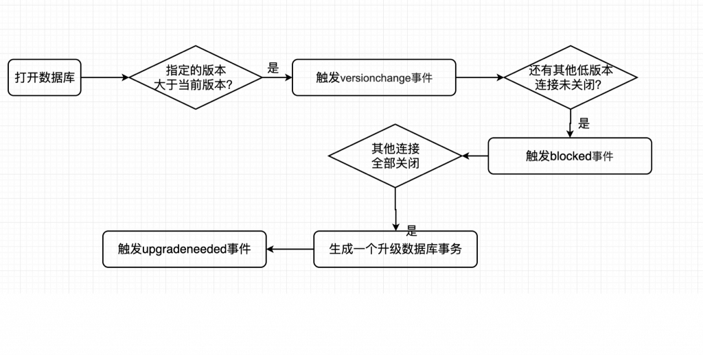
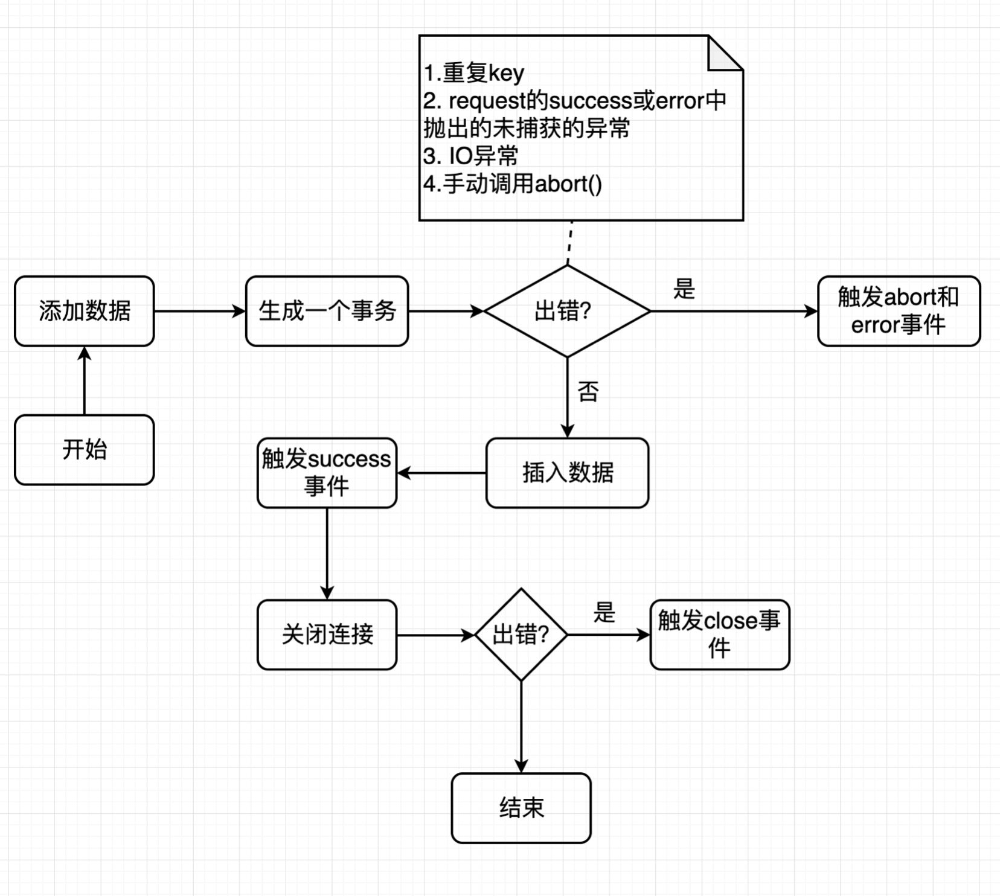

## IndexedDB 要点

- 由浏览器支持底层API，用来存储大量数据
- 对DB的所有操作都是异步的：异步设计是为了防止大量数据的读写，拖慢网页的表现；
- 基于事务
- 支持索引
- Key-Value存储，支持所有类型数据
- 同源限制：网页只能访问自身域名下的数据库，而不能访问跨域的数据库

## IndexedDB VS Web SQL

|     | IndexedDB | Web SQL |
|  ----  | ----  | ----  |
| 兼容性 | 高 |低（规范已经放弃，大部分浏览器不再支持）  |
| 入门门槛  | 低 | 高，需要额外学习SQL |
| 性能 | 高 | 低 |

对于我们前端开发者而言，IndexedDB更适合，它是一种存储在客户端本地的 NoSQL 数据库。

## IndexedDB 核心对象
1. IDBDatabase: 数据库对象
2. IDBObjectStore：对象仓库，类似关系型数据库的表
3. IDBRequest：操作请求
4. IDBIndex：索引，主要用来加快数据查询的效率，但同时会增加存储的占用，本质上是一种空间换时间的方式。数据库索引有聚焦索引（主键索引）、非聚集索引（给普通字段加上索引）、联合索引（由好几个字段组成的索引）。
5. IDBTransaction：事务，具有 ACID 四大特性，事务对象提供`error`、`abort`、`complete`三个事件，用来监听操作结果
6. IDBcursor：游标，主要用来遍历数据的指针
7. IDBKeyRange：索引范围，主要用来批量查询数据，或者批量删除数据的时候使用

## IndexedDB 基本操作
1. 创建数据库
2. 创建IDBObjectStore
3. 新增数据
4. 修改数据
5. 删除数据
6. 查询

## IndexedDB 事件介绍
1. success：请求成功
2. error: 请求失败
3. abort: 事务终止事件（提交事务失败时触发）
4. close: 数据库连接关闭（数据库不经常关闭时触发）
5. upgradeneeded: 数据库升级成功
6. blocked: 请求被阻塞的事件
7. versionchange: 版本变更事件

<p align="center"></p>

<p align="center"></p>

## IndexedDB 版本
IndexedDB有一个独特的scheme版本控制机制，同一时间统一数据只保留且最新的版本，低于此版本的标签页会触发upgradeneeded事件升级版本库。

## 查询数据的几种方式
以下通过实例展示查询数据的3种方式（仅展示部分代码）： 

```js
// 新建一个名为users的ObjectStore
db.createObjectStore('users', { keyPath : 'id' });
// 新增数据进users
const users = [
  { id : '001', name : '刘亦菲', age : 18},
  { id : '002', name : '杨幂', age : 19 }
]
const store = db.transaction('users', 'readwrite').objectStore('users');
let i = 0, len = users.length;
while(i < len){
  store.add(users[i++]);
}
```

- 键查询：检索单个对象
- 游标查询：检索多个对象。游标是指向结果集的指针，不提前收集结果。游标指针会先指向结果中的第一项，在接到查找下一项指令时，才会指向下一项。
- 索引查询：当需要使用其他（非主键）获取数据时，就要预先创建索引，然后使用索引获取数据。

```js
// 第一种查询方法：键查询
const req = store.get('001');
req.onsuccess = evt => {
  const res = evt.target.result;
  doSth(res)
}

// 第二种查询方法：游标查询
const req = store.openCursor(); // openCursor(键范围,方向)设置游标的键范围和方向
req.onsuccess = evt = > {
  const cursor = evt.target.result;
  if (cursor) { // cursor的非空校验是必要的
    const value = cursor.value
    doSth(value)

    cursor.continue(); // 调用continue才会移动到下一项
  }
}

// 第三种查询方法：索引查询 .createIndex(索引名字,索引属性的名字,options对象)
store.createIndex('name', 'name', { unique: false });

const index = store.index('name');
const req = index.get('杨幂');
req.onsuccess = evt => {
  doSth(evt.target.result);
}
```

## 一个简单封装的实例

```js
const indexedDB = window.indexedDB || window.webkitIndexedDB || window.mozIndexedDB;
class IndexedDB{
  constructor(dbName, storeName, version){
    this.storeName = storeName;
    const request = indexedDB.open(dbName, version);
    request.onsuccess = e => {
      this.db = e.target.result;
      console.log('Init indexedDB successfully');
    };
    request.onupgradeneeded = e => {
      this.db = e.target.result;
      if(!this.db.objectStoreNames.contains(storeName)){
          this.store = this.db.createObjectStore(storeName);
      }
      console.log('DB version changed, db version: ', this.db.version);
    };
    request.onerror = e => {console.info('Can not open indexedDB', e);};
  }
  get(key, callback){
    const transaction = this.db.transaction(this.storeName);
    const objectStore = transaction.objectStore(this.storeName);
    const request = objectStore.get(key);

    request.onerror = e => {console.info('Can not get value', e);};
    request.onsuccess = e => {callback(e.target.result);};
  }
  set(value, key){
    let oldValue;
    this.get(key, function(res){oldValue = res;});

    if(oldValue){
      console.info('You should use function update');
    } else {
      const transaction = this.db.transaction(this.storeName, 'readwrite');
      const objectStore = transaction.objectStore(this.storeName);
      const request = objectStore.add(value, key);

      request.onerror = e => {console.info('Can not add value', e);};
    }
  }
  update(newValue, key){
    const oldValue = this.get(key);

    if(!oldValue){
      console.info('You should use function set');
    } else {
      const transaction = this.db.transaction(this.storeName, 'readwrite');
      const objectStore = transaction.objectStore(this.storeName);
      const request = objectStore.put(newValue, key);

      request.onerror = e => {console.info('Can not update value', e);};
    }
  }
  remove(key){
    const request = this.db.transaction(this.storeName, 'readwrite')
            .objectStore(this.storeName)
            .delete(key);
    request.onerror = e => {console.info('Can not remove value', e);};
  }
  close(){
    this.db.close();
  }
}
```

这个class封装（来源于[网上](https://blog.csdn.net/qiqingjin/article/details/53435863)），对get方法异步处理的方式是传入一个回调，也可以换成返回一个promise。

## 相关概念
1. 数据库中的事务是指什么？

事务（transaction）是作为一个单元的一组有序的数据库操作。若所有操作都成功完成，则认为事务成功，事务则提交；若一个操作失败，则事务不成功，事务将回滚，该事务所有操作的影响都将取消。
事务特性：
- 原子性：即不可分割性，事务要么全部被执行，要么就全部不被执行
- 一致性或可串性：事务的执行使得数据库从一种正确状态转换成另一种正确状态
- 隔离性：在事务正确提交之前，不允许把该事务对数据的任何改变提供给任何其他事务
- 持久性：事务正确提交后，其结果将永久保存在数据库中，即使在事务提交后有了其他故障，事务的处理结果也会得到保存

或者这样理解：

事务就是被绑定在一起作为一个逻辑工作单元的 SQL 语句分组，如果任何一个语句操作失败那么整个操作就被失败，以后操作就会回滚到操作前状态，或者是上个节点。为了确保要么执行，要么不执行，就可以使用事务。

2. 部分浏览器不支持`.getAll`
github上找到了这个，[indexeddb-getall-shim](https://github.com/dumbmatter/indexeddb-getall-shim)

3. 对objectStore中数据的增删改查，需要openDB吗？有字段可以查到db的开关状态吗？

4. transaction.oncomplete 和 transaction.onsuccess的差别？

## 参考文档
- [什么是 indexedDB](https://www.cnblogs.com/eret9616/p/9186454.html)
- [Web数据持久化存储IndexedDB](https://www.cnblogs.com/lovesong/p/5055384.html)
- [use-indexeddb （react hooks from github）](https://github.com/harshzalavadiya/use-indexeddb)
