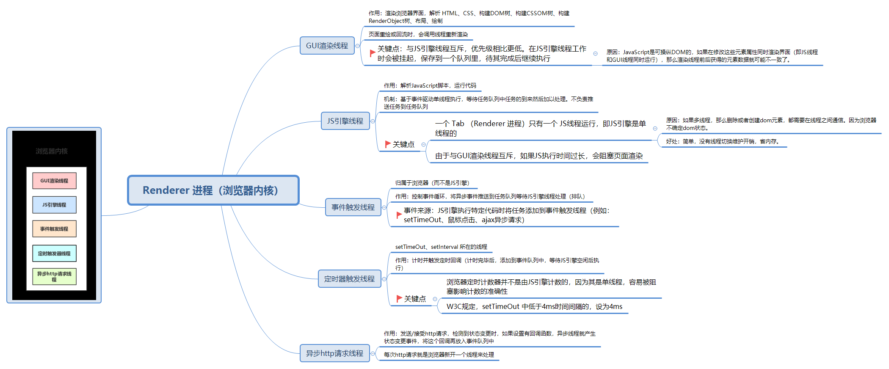
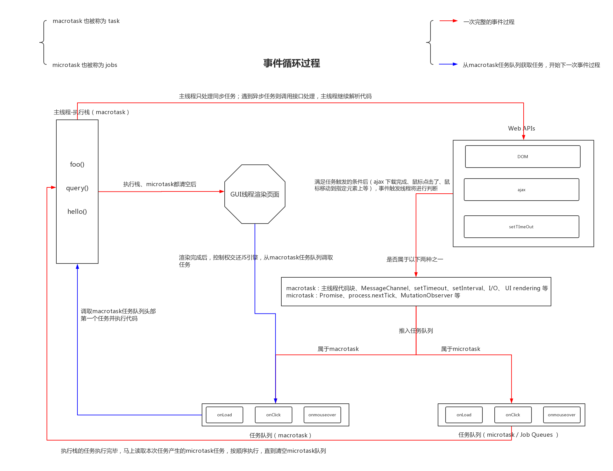
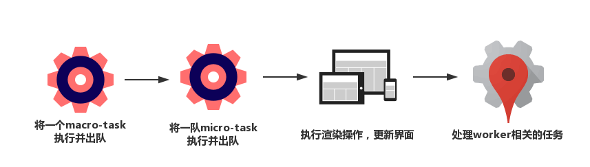

在coding的过程中，我发现很多思想是共通的、类似的、可互相借鉴的，仅以此文记录看到的一些设计：关于 解决页面阻塞渲染 而采取异步措施的 做法。

## eventLoop

### 1.1 背景
<p align="center"></p>
js是单线程的，所有任务都要排队等候处理，若有些任务非常耗时，将会一直占用着资源，而且CPU也未得到充分的利用。所以我们先将一些任务先挂起，等有返回结果再进行处理，这时候就要用到Event Loop了。

### 1.2 定义

Event Loop即事件循环，是指浏览器或Node的一种解决javaScript单线程运行时不会阻塞的一种机制，也就是我们经常使用异步的原理。

<p align="center"></p>

于是，所有任务可以分成两种：
- 同步任务（synchronous），指的是，在主线程上排队执行的任务，只有前一个任务执行完毕，才能执行后一个任务
- 异步任务（asynchronous），指的是，不进入主线程、而进入“任务队列”的任务，只有“任务队列”通知主线程，某个异步任务可以执行了，该任务的返回结果才会进入主线程执行。

> 几个概念：<br />主线程main thread。 <br />执行栈call-stack：存储函数调用的栈结构，先进后出，所有的任务都会被放到调用栈等待主线程执行。<br />任务队列task queue：先进先出，能解决同步任务和异步任务的场景，当遇到异步代码时，会被挂起在任务队列中，一旦执行栈为空，就从task中拿出对应的执行。

具体来说，异步执行的运行机制如下：
1. 同步任务会按照顺序等待主线程依次执行，形成一个执行栈（execution context stack）
2. 主线程之外，会存在一个任务队列，只要异步任务有了结果，就在任务队列中放置 注册的回调函数。
3. 当主线程空闲的时候（即，执行栈中所有同步任务执行完，调用栈被清空时），就会读取任务队列。那些对应的异步任务，会结束等待状态，进行执行栈，开始执行
4. 主线程不断重复第三步。

简单版：
<p align="center"></p>

复杂版：
<p align="center"></p>


### 1.3 宏任务、微任务

异步任务分为两种类型：macroTask宏任务和microTask微任务：

- macroTask：script(主程序代码),setTimeout, setInterval, setImmediate, I/O, UI rendering
- microTask：process.nextTick(node), Promises, Object.observe, MutationObserver

执行顺序：

首先执行主线程中的同步任务，当主线程中任务执行完毕后，再从event loop中读取任务

event loop读取任务的先后顺序，取决于任务队列job queue中对于不同任务读取规则的限定

假设：macroTask队列包含任务: a1、a2、a3，microTask队列包含任务: b1、 b2 、b3

执行顺序为：首先执行marcoTask队列开头的任务，也就是 a1 任务，执行完毕后，在执行microTask队列里的所有任务，也就是依次执行b1, b2 , b3，执行完后清空microTask中的任务，接着执行marcoTask中的第二个任务a2，依次循环。

简单来说，每一个循环都是一个这样的过程：
<p align="center"></p>

真实场景下的：script(主程序代码)—>process.nextTick—>Promises…——>setTimeout——>setInterval——>setImmediate——> I/O——>UI rendering

### 1.4 学习文档
- [从浏览器多进程到JS单线程，JS运行机制最全面的一次梳理](https://mp.weixin.qq.com/s?__biz=MjM5MTA1MjAxMQ==&mid=2651228065&idx=2&sn=0db2e69aa9344d4b086e9d98301aebad&scene=21#wechat_redirect)
- [浏览器是如何调度进程和线程的？](https://mp.weixin.qq.com/s?__biz=MzI0MzIyMDM5Ng==&mid=2649830221&idx=2&sn=80bb5cc0a17a73a2dca5f222bd1ba6ae&chksm=f175f98ec60270984f1507b5744a2302790889c5ce50dba54a98c62d4db11b1612c90e986239&mpshare=1&scene=23&srcid=101002qEoigfog338K3PNHRe&sharer_sharetime=1602305091677&sharer_shareid=240280dad34afa83333ba12be4c57ba8#rd)
- [强推：Event Loop](https://juejin.im/post/6844903764202094606)
- [从promise、process.nextTick、setTimeout出发，谈谈Event Loop中的Job queue](https://blog.csdn.net/liwusen/article/details/79509288)


## Vue的nextTick设计

vue中nextTick，官方文档的解释是：在下次DOM更新循环结束之后执行延迟回调。在修改数据之后立即使用这个方法，获取更新后的DOM。Vue 2版本它的实现原理就是：

1. 用异步队列的方式来控制DOM更新和nextTick回调先后执行
2. microTask因为其高优先级特性，能确保队列中的微任务在一次事件循环前被执行完毕
3. 因为兼容性问题，vue不得不做了microTask向macroTask的降级方案

我们在实际开发中，比如从服务端接口获取数据的时候，数据做了修改，如果我们的某些方法去依赖了数据修改后的DOM变化，我们就必须在nextTick后执行，如下：

```js
getData(res).then(()=>{  // 继清空 前面的microTask队列 之后，将挂在任务队列中的 macroTask之一ajax回调 放到执行栈，主线程继续执行这个ajax回调后的结果。若此时microTask、macroTask都已清空，UI渲染更新。即tick 1
  this.xxx = res.data
  this.$nextTick(() => {  // 此处我们是在下一个eventloop / tick 2中获取到的 变化后的dom元素了 
    // 这里我们可以获取变化后的 DOM
  })
})
```

### 学习文档
- [全面解析Vue.nextTick实现原理](https://juejin.cn/post/6844903590293684231)

## React的Fiber设计

Fiber主要是为了解决其DOM同步的更新过程所带来的界面卡顿问题而设计的。它的主要目标是实现虚拟DOM的增量渲染，能够将渲染工作拆分成块并将其分散到多个帧的能力。在新的更新到来时，能够暂停、中止和复用工作，能为不同类型的更新分配优先级顺序的能力。

### 学习文档
- [导入篇 && 背景篇：React Fiber是什么](https://zhuanlan.zhihu.com/p/26027085)
- [启迪篇 && 思路篇：漫谈 React Fiber](https://juejin.cn/post/6906676903302709262)
- [源码篇：React Fiber（v16 版本） 源码解析](https://juejin.cn/post/6859528127010471949)


- [Fiber架构的简单理解与实现](https://blog.csdn.net/snsHL9db69ccu1aIKl9r/article/details/109504928)


## echarts的scheduler

记着，待学习、研究


