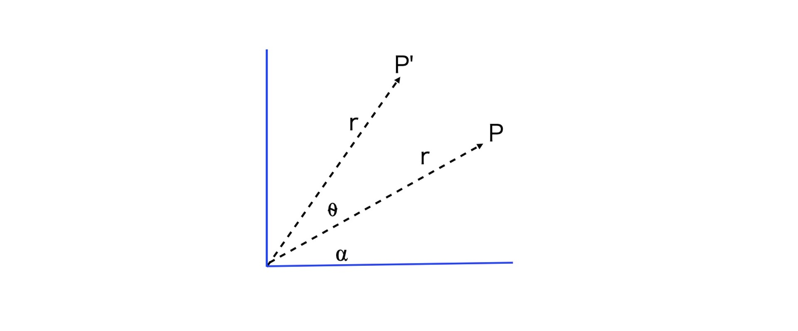
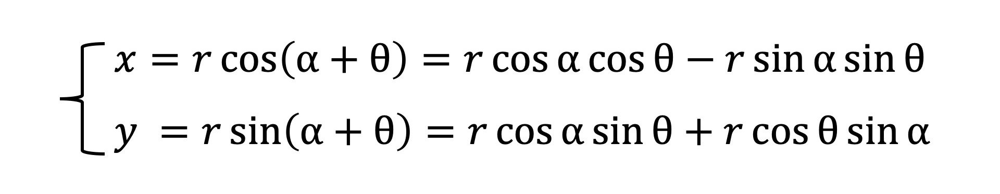
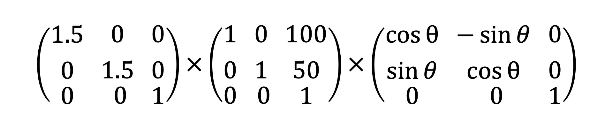

简单的笔记。详细可见月影大佬的[09 | 如何用仿射变换对几何图形进行坐标变换？（from 跟月影学可视化）](https://time.geekbang.org/column/article/259264)

仿射变换是拓扑学和图形学中一个非常重要的基础概念。利用它，我们才能在可视化应用中快速绘制出形态、位置、大小各异的众多几何图形。所以，这一节课，我们就来说一说仿射变换的数学基础和基本操作，它几乎会被应用到我们后面讲到的所有视觉呈现的案例中，所以你一定要掌握。

## 什么是仿射变换？

仿射变换简单来说就是“线性变换 + 平移”。实际上在平常的 Web 开发中，我们也经常会用到仿射变换，比如，对元素设置 CSS 的 transform 属性就是对元素应用仿射变换。

再说回到几何图形，针对它的仿射变换具有以下 2 个性质：
- 仿射变换前是直线段的，仿射变换后依然是直线段
- 对两条直线段 a 和 b 应用同样的仿射变换，变换前后线段长度比例保持不变

由于仿射变换具有这两个性质，因此对线性空间中的几何图形进行仿射变换，就相当于对它的每个顶点向量进行仿射变换。那具体怎么操作呢？下面，我们就来详细说说。

### 1.1 向量的平移、旋转与缩放

常见的仿射变换形式包括**平移、旋转、缩放**以及它们的组合。

1. **平移变换**是最简单的仿射变换。如果我们想让向量 P(x0, y0) 沿着向量 Q(x1, y1) 平移，只要将 P 和 Q 相加就可以了。

<p align="center"></p>

2. **旋转变换**。我们在第 5 课接触过，当时我们把向量的旋转定义成了如下的函数：

```js
class Vector2D {
  ...  
  rotate(rad) {
    const c = Math.cos(rad),
      s = Math.sin(rad);
    const [x, y] = this;

    this.x = x * c + y * -s;
    this.y = x * s + y * c;

    return this;
  }
}
```
但是，我们并没有讨论这个函数是怎么来的，那在这里我们通过三角函数来简单推导一下。

<p align="center"></p>

假设向量 P 的长度为 r，角度是⍺，现在我们要将它逆时针旋转⍬角，此时新的向量 P’的参数方程为：

<p align="center"></p>

然后，因为 rcos⍺、rsin⍺是向量 P 原始的坐标 x0、y0，所以，我们可以把坐标代入到上面的公式中，就会得到如下的公式：
<p align="center"></p>

最后，我们再将它写成矩阵形式，就会得到一个旋转矩阵。至于为什么要写成矩阵形式，我后面会讲，这里你先记住这个旋转矩阵的公式就可以了。

<p align="center"></p>

3. **缩放变换**。以直接让向量与标量（标量只有大小、没有方向）相乘。

<p align="center"></p>

对于得到的这个公式，我们也可以把它写成矩阵形式。结果如下：

<p align="center"></p>

现在，我们就得到了三个基本的仿射变换公式，其中旋转和缩放都可以写成矩阵与向量相乘的形式。这种能写成矩阵与向量相乘形式的变换，就叫做**线性变换**。线性变换除了可以满足仿射变换的 2 个性质之外，还有 2 个额外的性质：

- 线性变换不改变坐标原点（因为如果 x0、y0等于零，那么 x、y 肯定等于 0）；
- 线性变换可以叠加，多个线性变换的叠加结果就是将线性变换的矩阵依次相乘，再与原始向量相乘。

那根据线性变换的第 2 条性质，我们就能总结出一个通用的线性变换公式，即一个原始向量 P0经过 M1、M2、…Mn 次的线性变换之后得到最终的坐标 P。线性变化的叠加是一个非常重要的性质，它是我们对图形进行变换的基础，所以你一定要牢记线性变化的叠加性质。

<p align="center"></p>


好了，常见的仿射变换形式我们说完了。总的来说，向量的基本仿射变换分为平移、旋转与缩放，其中旋转与缩放属于线性变换，而平移不属于线性变换。基于此，我们可以得到仿射变换的一般表达式，如下图所示：

<p align="center"></p>


### 1.2 仿射变换的公式优化

上面这个公式我们还可以改写成矩阵的形式，在改写的公式里，我们实际上是给线性空间增加了一个维度。换句话说，我们用高维度的线性变换表示了低维度的仿射变换！

<p align="center"></p>

这样，我们就将原本 n 维的坐标转换为了 n+1 维的坐标。这种 n+1 维坐标被称为**齐次坐标**，对应的矩阵就被称为**齐次矩阵**。


齐次坐标和齐次矩阵是可视化中非常常用的数学工具，它能让我们用线性变换来表示仿射变换。这样一来，我们就能利用线性变换的叠加性质，来非常方便地进行各种复杂的仿射变换了。落实到共识上，就是把这些变换的矩阵相乘得到一个新的矩阵，再把它乘以原向量。我们在绘制几何图形的时候会经常用到它，所以你要记住这个公式。

## Css的仿射变换

既然我们讲了仿射变换，这里还是要再提一下 CSS 中我们常用的属性 transform。

```css
div.block {
  transform: rotate(30deg) translate(100px,50px) scale(1.5);
}
```

CSS 中的 transform 是一个很强大的属性，它的作用其实也是对元素进行仿射变换。它不仅支持 translate、rotate、scale 等值，还支持 matrix。CSS 的 matrix 是一个简写的齐次矩阵，因为它省略了 3 阶齐次矩阵第三行的 0, 0, 1 值，所以它 只有 6 个值。

<p align="center"></p>

这里我就不再自己写矩阵乘法的库了，我们用一个向量矩阵运算的数学库 math，它几乎包含了所有图形学需要用到的数学方法，我们在后面课程中也会经常用到它，你可以参考[GitHub仓库](https://github.com/akira-cn/graphics/tree/master/common/lib/math) 先了解一下它。

我们简单算一下三个矩阵相乘，代码如下：

```js

import {multiply} from 'common/lib/math/functions/mat3fun.js';

const rad = Math.PI / 6;
const a = [
  Math.cos(rad), -Math.sin(rad), 0,
  Math.sin(rad), Math.cos(rad), 0,
  0, 0, 1
];

const b = [
  1, 0, 100,
  0, 1, 50,
  0, 0, 1
];

const c = [
  1.5, 0, 0,
  0, 1.5, 0,
  0, 0, 1
];

const res = [a, b, c].reduce((a, b) => {
  return multiply([], b, a);
});

console.log(res);
/*
[1.299038105676658, -0.7499999999999999, 61.60254037844388, 
  0.7499999999999999, 1.299038105676658, 93.30127018922192,
  0, 0, 1]
*/
```

所以呢，我们最终就可以将上面的 transform 用一个矩阵表示：

```css

div.block {
  transform: matrix(1.3,0.75,-0.75,1.3,61.6,93.3)；
}
```

这样的 transform 效果和之前 rotate、translate 和 scale 分开写的效果是一样的，但是字符数更少，所以能减小 CSS 文件的大小。

