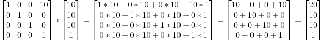
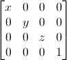

## 齐次坐标（Homogeneous coordinates）
目前为止，我们把三维顶点视为三元组(x,y,z)。现在引入一个新的分量w，得到向量(x,y,z,w)。请先记住以下两点：

- 若w === 1，则向量(x,y,z,1)为空间中的点
- 若w === 0，则向量(x,y,z,0)为方向

二者的差别：对于旋转无所谓，当你旋转点和方向时，结果是一样的。但对于平移（将点沿着某个方向移动），情况就不一样了。“平移一个方向”时毫无意义的。

齐次坐标使得我们可以用同一个公式对点和方向作运算。见[如何用仿射变换对几何图形进行坐标变换？](/pages/c378ed/)，这里最后总结了个仿射变换的公式：

<p align="center"></p>

以下的变换矩阵都运用了这个公式。


## 变换矩阵（Transformation matrices）

矩阵就是一个行列数固定的、纵横排列的数表。

三维图形学中我们只用到4×4矩阵，它能对顶点(x,y,z,w)做变换。这一变换是用矩阵左乘顶点来实现的：

矩阵 × 顶点 = 变换后的顶点  （顺序很重要，是矩阵 **左乘** 顶点，顶点用列向量表示）

<p align="center"></p>

### 2.1 平移矩阵（Translation Matrices）

平移矩阵是最简单的变换矩阵。其中，X、Y、Z是点的位偏移量。
<p align="center"></p>

例2.1.1 若想把向量(10, 10, 10, 1)沿X轴方向平移10个单位，可得：

<p align="center"></p>
这样就得到了齐次向量(20,10,10,1)！记住，末尾的1表示这是一个点，而不是方向。经过变换计算后，点仍然是点，这倒是挺合情合理的。

例2.1.2 对一个代表Z轴负方向的向量作上述平移变换会得到什么结果：
<p align="center"></p>

还是原来的(0,0,-1,0)方向，这也很合理，恰好印证了前面的结论：”平移一个方向是毫无意义的”。


### 2.2 单位矩阵（Identity Matrices）
单位矩阵很特殊，啥也不做。它的身份和自然数“1”一样基础而重要。
<p align="center"></p>


### 2.3 缩放矩阵（Scaling Matrices）
缩放矩阵也简单：
<p align="center"></p>

例如把一个向量（点或方向皆可）沿各方向放大2倍：

<p align="center"></p>

### 2.4 旋转矩阵（Rotation Matrices）
旋转矩阵比较复杂。此处就不展开证明过程了。待学习、完善

1. 轴转式

2. 四元数
<p align="center"></p>

3. 欧拉角

学习文档：
- (四元数与三维旋转)[https://krasjet.github.io/quaternion/quaternion.pdf]
- [The Matrix and Quaternions FAQ](http://www.opengl-tutorial.org/assets/faq_quaternions/index.html)
- [矩阵和四元组常见问题](http://www.opengl-tutorial.org/assets/faq_quaternions/index.html#Q11)
- [rotation](http://www.opengl-tutorial.org/intermediate-tutorials/tutorial-17-quaternions/)


### 2.5 累积变换
将前面学习的旋转、平移和缩放矩阵相乘起来，就能把它们组合起来。例：

```js
TransformedVector = TranslationMatrix * RotationMatrix * ScaleMatrix * OriginalVector;
```

注意，这行代码首先执行缩放，接着旋转，最后才是平移。**变换的顺序不同，得出的结果也不同**。


## 学习文档

- [tutorial-3-matrices](http://www.opengl-tutorial.org/cn/beginners-tutorials/tutorial-3-matrices/)
