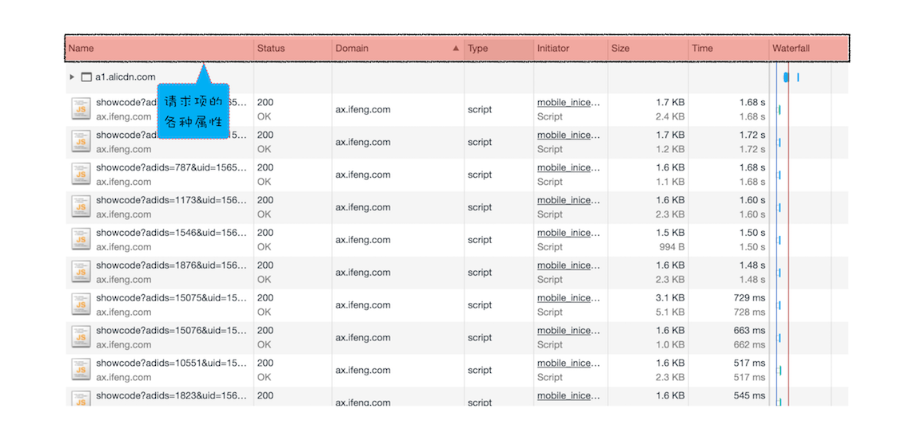
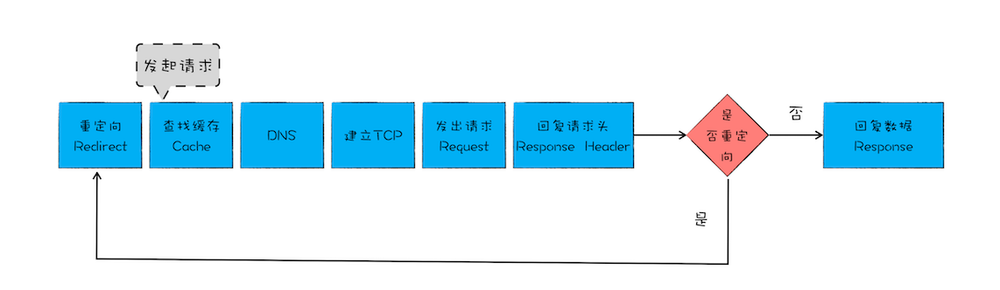

网络面板由控制器、过滤器、抓图信息、时间线、详细列表和下载信息概要这 6 个区域构成。详见- [Chrome开发者工具：利用网络面板做性能分析 （from 极客时间 浏览器工作原理与实践）](https://time.geekbang.org/column/article/138844)

## 控制器

控制器有 4 个比较重要的功能：

- 红色圆点的按钮，表示“开始 / 暂停抓包”
- 全局搜索”按钮，可以在所有下载资源中搜索相关内容，还可以快速定位到某几个你想要的文件上
- Disable cache，即“禁止从 Cache 中加载资源”的功能，它在调试 Web 应用的时候非常有用，因为开启了 Cache 会影响到网络性能测试的结果
- Online 按钮，是“模拟 2G/3G”功能，它可以限制带宽，模拟弱网情况下页面的展现情况，然后你就可以根据实际展示情况来动态调整策略，以便让 Web 应用更加适用于这些弱网

## 过滤器

网络面板中的过滤器，主要就是起过滤功能。

## 抓图信息

抓图信息区域，可以用来分析用户等待页面加载时间内所看到的内容，分析用户实际的体验情况。比如，如果页面加载 1 秒多之后屏幕截图还是白屏状态，这时候就需要分析是网络还是代码的问题了。（勾选面板上的“Capture screenshots”即可启用屏幕截图。）

## 时间线

时间线，主要用来展示 HTTP、HTTPS、WebSocket 加载的状态和时间的一个关系，用于直观感受页面的加载过程。如果是多条竖线堆叠在一起，那说明这些资源被同时被加载。至于具体到每个文件的加载信息，还需要用到下面要讲的详细列表。

## 详细列表

这个区域是最重要的，它详细记录了每个资源从发起请求到完成请求这中间所有过程的状态，以及最终请求完成的数据信息。通过该列表，你就能很容易地去诊断一些网络问题。

### 5.1 列表的属性

列表的属性比较多，你还可以通过点击右键的下拉菜单来添加其他属性。

默认情况下，列表是按请求发起的时间来排序的，最早发起请求的资源在顶部。当然也可以按照返回状态码、请求类型、请求时长、内容大小等基础属性排序，只需点击相应属性即可。

### 5.2 详细信息

### 5.3 单个资源的时间线
了解了每个资源的详细请求信息之后，我们再来分析单个资源请求时间线，这就涉及具体的 HTTP 请求流程了。

重点看下时间线面板：

面板中各项：

1. **Queuing**

排队的意思，当浏览器发起一个请求的时候，会有很多原因导致该请求不能被立即执行，而是需要排队等待。导致请求处于排队状态的原因有很多:

- 首先，页面中的资源是有优先级的，比如 CSS、HTML、JavaScript 等都是页面中的核心文件，所以优先级最高；而图片、视频、音频这类资源就不是核心资源，优先级就比较低。通常当后者遇到前者时，就需要“让路”，进入待排队状态
- 其次，我们前面也提到过，浏览器会为每个域名最多维护 6 个 TCP 连接，如果发起一个 HTTP 请求时，这 6 个 TCP 连接都处于忙碌状态，那么这个请求就会处于排队状态
- 最后，网络进程在为数据分配磁盘空间时，新的 HTTP 请求也需要短暂地等待磁盘分配结束

等待排队完成之后，就要进入发起连接的状态了。不过在发起连接之前，还有一些原因可能导致连接过程被推迟，这个推迟就表现在面板中的 Stalled上。

2. **Stalled**

表示停滞的意思。

3. **Initial connection/SSL**

即，和服务器建立连接的阶段，这包括了建立 TCP 连接所花费的时间；不过如果你使用了 HTTPS 协议，那么还需要一个额外的 SSL 握手时间，这个过程主要是用来协商一些加密信息的。

4. **Request sent**

和服务器建立好连接之后，网络进程会准备请求数据，并将其发送给网络，这就是 Request sent 阶段。通常这个阶段非常快，因为只需要把浏览器缓冲区的数据发送出去就结束了，并不需要判断服务器是否接收到了，所以这个时间通常不到 1 毫秒。

5. **Waiting (TTFB)**

数据发送出去了，接下来就是等待接收服务器第一个字节的数据，这个阶段称为 Waiting (TTFB)，通常也称为“第一字节时间”。 TTFB 是反映服务端响应速度的重要指标，对服务器来说，TTFB 时间越短，就说明服务器响应越快。

6. **Content Download**

接收到第一个字节之后，进入陆续接收完整数据的阶段，也就是 Content Download 阶段，这意味着从第一字节时间到接收到全部响应数据所用的时间。

### 5.4 优化时间线上耗时项

了解了时间线面板上的各项含义之后，我们就可以根据这个请求的时间线来实现相关的优化操作了。

1. 排队（Queuing）时间过久

排队时间过久，大概率是由浏览器为每个域名最多维护 6 个连接导致的。那么基于这个原因，你就可以让 1 个站点下面的资源放在多个域名下面，比如放到 3 个域名下面，这样就可以同时支持 18 个连接了，这种方案称为**域名分片**技术。除了域名分片技术外，我个人还建议你**把站点升级到 HTTP2**，因为 HTTP2 已经没有每个域名最多维护 6 个 TCP 连接的限制了。

2. 第一字节时间（TTFB）时间过久

这可能的原因有如下：

- **服务器生成页面数据的时间过久**。对于动态网页来说，服务器收到用户打开一个页面的请求时，首先要从数据库中读取该页面需要的数据，然后把这些数据传入到模板中，模板渲染后，再返回给用户。服务器在处理这个数据的过程中，可能某个环节会出问题。
- **网络的原因**。比如使用了低带宽的服务器，或者本来用的是电信的服务器，可联通的网络用户要来访问你的服务器，这样也会拖慢网速。
- **发送请求头时带上了多余的用户信息**。比如一些不必要的 Cookie 信息，服务器接收到这些 Cookie 信息之后可能需要对每一项都做处理，这样就加大了服务器的处理时长。

对于这三种问题，你要有针对性地出一些解决方案。面对第一种服务器的问题，你可以想办法去提高服务器的处理速度，比如通过增加各种缓存的技术；针对第二种网络问题，你可以使用 CDN 来缓存一些静态文件；至于第三种，你在发送请求时就去尽可能地减少一些不必要的 Cookie 数据信息。

3. Content Download 时间过久

如果单个请求的 Content Download 花费了大量时间，有可能是字节数太多的原因导致的。这时候你就需要减少文件大小，比如压缩、去掉源码中不必要的注释等方法。

## 下载信息概要

下载信息概要中，要重点关注下 DOMContentLoaded 和 Load 两个事件，以及这两个事件的完成时间：

- DOMContentLoaded，这个事件发生后，说明页面已经构建好 DOM 了，这意味着构建 DOM 所需要的 HTML 文件、JavaScript 文件、CSS 文件都已经下载完成了。
- Load，说明浏览器已经加载了所有的资源（图像、样式表等）。

