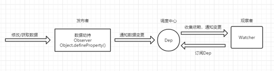
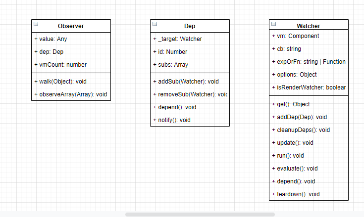
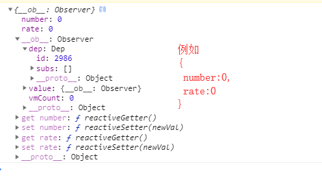

（版本：vue 2.6）

## [Object.defineProperty()](https://developer.mozilla.org/zh-CN/docs/Web/JavaScript/Reference/Global_Objects/Object/defineProperty)

## 数据劫持

定义：指的是在访问或者修改对象的某个属性时，通过一段代码拦截这个行为，进行额外的操作或者修改返回结果。e.g.Object.defineProperty()、Proxy对象

应用场景：e.g.双向绑定

## 发布订阅模式

- [发布订阅模式与观察者模式](https://segmentfault.com/a/1190000018706349)

> 发布订阅模式 相对 观察者模式，多了一个调度中心。可以达到让订阅者和发布者互不干扰，消除了发布者和订阅者间的依赖，一方面解耦，一方面可实现更细力度的控制（e.g.权限控制、节流操作等）

- [vue 2的发布订阅模式](https://segmentfault.com/a/1190000018795293)

> 在vue2的发布订阅模式中，
Observer是发布者的角色担当，通过defineProperty对数据进行劫持，在getter中向Dep调度中心添加订阅者（Watcher）`dep.depend()`, 在setter中通知订阅者更新`dep.notify()`。（核心函数：defineReactive）
Dep是调度中心的角色担当，主要负责订阅者Watcher和通知其更新。每个属性拥有自己的调度中心，用于存放所有订阅了该属性的的订阅者，当数据发生改变时，会遍历subs列表，通知所有订阅者`subs[i].update()`。
Watcher是订阅者的角色担当，当被观察的值发生变化时，会受到来自Dep的通知，从而触发回调函数。

## 重构的原因

- [不能完全检测数组和对象的变化](https://cn.vuejs.org/v2/guide/reactivity.html#%E6%A3%80%E6%B5%8B%E5%8F%98%E5%8C%96%E7%9A%84%E6%B3%A8%E6%84%8F%E4%BA%8B%E9%A1%B9)
- Object.defineProperty只能劫持对象的属性，从而需要对每个对象、每个属性进行遍历，若属性值是对象，还需要深度遍历

## 参考文章

- 除了其他对应链接，还有
- [数据劫持 OR 数据代理](https://zhuanlan.zhihu.com/p/47041290)
- [Vue为什么不能检测数组变动](https://segmentfault.com/a/1190000015783546)
- [EventEmitter3源码分析与学习](https://juejin.cn/post/6844903565287227399)
