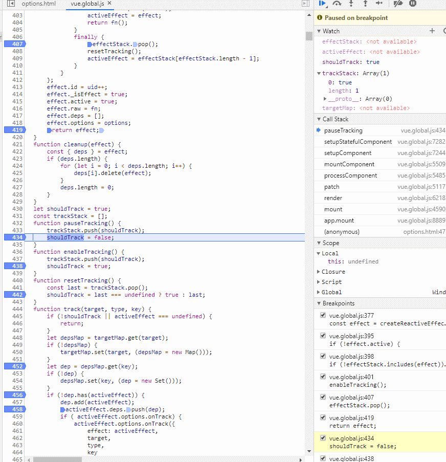
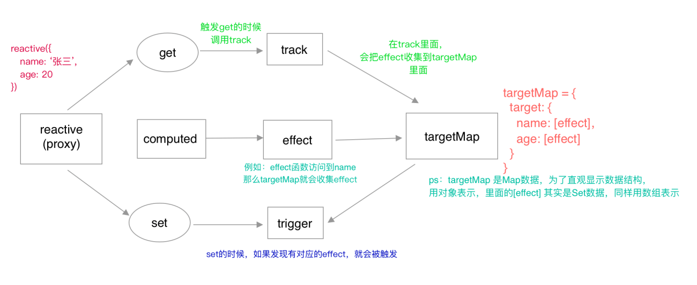

（版本：vue 3.0.0-rc.11）

## 代码调用记录

### 1.1 调用

```typescript
let dummy
const state = reactive({
    message: 0
})
effect(() => {
  dummy = state.message;
})
function click() {
  state.message += 1
}
```

### 1.2 源码追溯记录

```typescript
// ------------------------------------------------
/**
 * targetMap:全局WeakMap存储关系 {target -> key -> dep} 
 * 从概念上，将依赖项看做dep比较容易。dep是订阅者的set集合，但我们这里只是简单用以减少内存开销
 */
type Dep = Set<ReactiveEffect>
type KeyToDepMap = Map<any, Dep>
const targetMap = new WeakMap<any, KeyToDepMap>()

/**
 * effect栈（后进先出）
 */
const effectStack: ReactiveEffect[] = []
let activeEffect: ReactiveEffect | undefined

/**
 * shouldTrack：是否进行依赖收集的标志
 */
let shouldTrack = true
const trackStack: boolean[] = []

/**
 * ReactiveEffect: 函数类型
 * T: 函数类型，后文会多处用到它，用runner替代
 */
interface ReactiveEffect<T = any> {
  (): T;
  _isEffect: true;
  id: number; // uid++
  active: boolean; // 是否激活。true时，清除effect的deps数组，并执行onStop事件（比如在unmountComponent中触发）
  raw: () => T; // 创建时传入的fn
  deps: Array<Dep>; // dep数组，
  options: ReactiveEffectOptions;
}

interface ReactiveEffectOptions {
  lazy?: boolean; // 是否延迟触发effect? 是否默认执行一次
  scheduler?: (job: ReactiveEffect) => void; // 调度函数
  onTrack?: (event: DebuggerEvent) => void;
  onTrigger?: (event: DebuggerEvent) => void; 
  onStop?: () => void;
}

// ----------一、接收一个普通对象然后返回该普通对象的响应式代理-------------------
function reactive(target: object) {
  // ...
  return createReactiveObject(
    target,
    false,
    mutableHandlers,
    mutableCollectionHandlers
  )
}

function createReactiveObject(
  target: Target,
  isReadonly: boolean,
  baseHandlers: ProxyHandler<any>,
  collectionHandlers: ProxyHandler<any>
) {
  // ...
  const proxy = new Proxy(
    target,
    targetType === TargetType.COLLECTION ? collectionHandlers : baseHandlers
  )
  return proxy
}

// proxy代理行为改写
const mutableHandlers: ProxyHandler<object> = {
  get: createGetter(false, false),
  set,
  deleteProperty,
  has,
  ownKeys
}

function createGetter(isReadonly = false, shallow = false) {
  // ...
  const res = Reflect.get(target, key, receiver)
  if (!isReadonly) {
    track(target, TrackOpTypes.GET, key)
  }
  return res
}

/**
 * ----------二、 观察者/订阅者-------------------
 * target => effect的转换
 * effectStack.push(effect)和pop
 */

function effect<T = any>(
  fn: () => T,
  options: ReactiveEffectOptions = EMPTY_OBJ
): ReactiveEffect<T> {
  if (isEffect(fn)) {
    fn = fn.raw // effect每次会返回一个新的监控函数
  }
  const effect = createReactiveEffect(fn, options)
  if (!options.lazy) {
    effect()
  }
  return effect
}

function createReactiveEffect<T = any>(
  fn: () => T,
  options: ReactiveEffectOptions
): ReactiveEffect<T> {
  const effect = function reactiveEffect(): unknown {
    if (!effect.active) {
      return options.scheduler ? undefined : fn()
    }
    if (!effectStack.includes(effect)) {
      cleanup(effect)
      try {
        enableTracking()
        effectStack.push(effect)
        activeEffect = effect
        // 执行fn，进行触发内部监控数据对应的getter来收集该effect依赖
        // 此处指：触发代理行为的createGetter函数，进而触发track函数
        // 若数据更改，会调用handlers的set函数，进而触发trigger函数
        return fn()
      } finally {
        effectStack.pop()
        resetTracking()
        activeEffect = effectStack[effectStack.length - 1]
      }
    }
  } as ReactiveEffect
  effect.id = uid++
  effect._isEffect = true
  effect.active = true
  effect.raw = fn
  effect.deps = []
  effect.options = options
  return effect
}

function enableTracking() {
  trackStack.push(shouldTrack)
  shouldTrack = true
}

function resetTracking() {
  const last = trackStack.pop()
  shouldTrack = last === undefined ? true : last
}


/**
 * ----------三、track依赖收集、trigger派发更新 -------------------
 * targetMap: { // target map
 *    target: {  // desMap
 *      key: [activeEffect] // dep set
 *    }
 * }
 */
function track(target: object, type: TrackOpTypes, key: unknown) {
  if (!shouldTrack || activeEffect === undefined) {
    return
  }
  let depsMap = targetMap.get(target)
  if (!depsMap) {
    targetMap.set(target, (depsMap = new Map()))
  }
  let dep = depsMap.get(key)
  if (!dep) {
    depsMap.set(key, (dep = new Set()))
  }
  if (!dep.has(activeEffect)) {
    dep.add(activeEffect)
    activeEffect.deps.push(dep)
    if (__DEV__ && activeEffect.options.onTrack) {
      activeEffect.options.onTrack({
        effect: activeEffect,
        target,
        type,
        key
      })
    }
  }
}

function trigger(
  target: object,
  type: TriggerOpTypes,
  key?: unknown,
  newValue?: unknown,
  oldValue?: unknown,
  oldTarget?: Map<unknown, unknown> | Set<unknown>
) {
  const depsMap = targetMap.get(target)
  if (!depsMap) {
    // never been tracked
    return
  }

  const effects = new Set<ReactiveEffect>()
  const add = (effectsToAdd: Set<ReactiveEffect> | undefined) => {
    if (effectsToAdd) {
      effectsToAdd.forEach(effect => effects.add(effect))
    }
  }

  if (type === TriggerOpTypes.CLEAR) {
    // collection being cleared
    // trigger all effects for target
    depsMap.forEach(add)
  } else if (key === 'length' && isArray(target)) {
    depsMap.forEach((dep, key) => {
      if (key === 'length' || key >= (newValue as number)) {
        add(dep)
      }
    })
  } else {
    // schedule runs for SET | ADD | DELETE
    if (key !== void 0) {
      add(depsMap.get(key))
    }

    // also run for iteration key on ADD | DELETE | Map.SET
    switch (type) {
      case TriggerOpTypes.ADD:
        if (!isArray(target)) {
          add(depsMap.get(ITERATE_KEY))
          if (isMap(target)) {
            add(depsMap.get(MAP_KEY_ITERATE_KEY))
          }
        } else if (isIntegerKey(key)) {
          // new index added to array -> length changes
          add(depsMap.get('length'))
        }
        break
      case TriggerOpTypes.DELETE:
        if (!isArray(target)) {
          add(depsMap.get(ITERATE_KEY))
          if (isMap(target)) {
            add(depsMap.get(MAP_KEY_ITERATE_KEY))
          }
        }
        break
      case TriggerOpTypes.SET:
        if (isMap(target)) {
          add(depsMap.get(ITERATE_KEY))
        }
        break
    }
  }

  const run = (effect: ReactiveEffect) => {
    if (__DEV__ && effect.options.onTrigger) {
      effect.options.onTrigger({
        effect,
        target,
        key,
        type,
        newValue,
        oldValue,
        oldTarget
      })
    }
    if (effect.options.scheduler) {
      effect.options.scheduler(effect)
    } else {
      effect()
    }
  }

  effects.forEach(run)
}
```

截图如下：

<p align="center"></p>

<p align="center"></p>

## reactive

### 2.1 单元测试

```typescript
// 1、Proxy可拦截原型对象__proto__，通过Object.getPrototypeOf(proxy)、Object.setPrototypeOf(proxy, proto)
test('proto', () => {
  const obj = {}
  const reactiveObj = reactive(obj)
  // read prop of reactiveObject will cause reactiveObj[prop] to be reactive
  const prototype = reactiveObj['__proto__']
})

// 2、基础数据类型/markRaw(obj)/Object.freeze(obj)/带属性__v_skip: true的obj，不可reactive；promise、date、正则等直接返回原值
test('non-observable values', () => {
  const assertValue = (value: any) => {
    reactive(value)
    expect(
      `value cannot be made reactive: ${String(value)}`
    ).toHaveBeenWarnedLast()
  }

  // number
  assertValue(1)
  // string
  assertValue('foo')
  // boolean
  assertValue(false)
  // null
  assertValue(null)
  // undefined
  assertValue(undefined)
  // symbol
  const s = Symbol()
  assertValue(s)

  // built-ins should work and return same value
  const p = Promise.resolve()
  expect(reactive(p)).toBe(p)
  const r = new RegExp('')
  expect(reactive(r)).toBe(r)
  const d = new Date()
  expect(reactive(d)).toBe(d)
})

test('markRaw', () => {
  const obj = reactive({
    foo: { a: 1 },
    bar: markRaw({ b: 2 })
  })
  expect(isReactive(obj.foo)).toBe(true)
  expect(isReactive(obj.bar)).toBe(false)
})

test('should not observe frozen objects', () => {
  const obj = reactive({
    foo: Object.freeze({ a: 1 })
  })
  expect(isReactive(obj.foo)).toBe(false)
})

test('should not observe objects with __v_skip', () => {
  const original = {
    foo: 1,
    __v_skip: true
  }
  const observed = reactive(original)
  expect(isReactive(observed)).toBe(false)
})

// 3、设置简单的基本类型时，可通过ref，无需嵌套
test('should not unwrap Ref<T>', () => {
  const observedNumberRef = reactive(ref(1))
  const observedObjectRef = reactive(ref({ foo: 1 }))

  expect(isRef(observedNumberRef)).toBe(true)
  expect(isRef(observedObjectRef)).toBe(true)
})
```


总结：

- 1、Proxy可拦截原型对象**proto**，通过Object.getPrototypeOf(proxy)、Object.setPrototypeOf(proxy, proto)
- 2、基础数据类型/markRaw(obj)/Object.freeze(obj)/带属性__v_skip: true的obj，不可reactive；promise、date、正则等直接返回原值
- 3、设置简单的基本类型时，可通过ref，无需嵌套

### 2.2源码

#### 2.2.1 分类

创建reactiveObject的核心函数是createReactiveObject，源码中四类对象reactive、shallowReactive、readonly和shallowReadonly都通过这个函数返回对应的对象


```typescript
/**
 * @param target 
 * @param isReadonly 
 * @param baseHandlers [Object,Array]
 * @param collectionHandlers [Set, Map, WeakMap, WeakSet]
 */
function createReactiveObject(
  target: Target,
  isReadonly: boolean,
  baseHandlers: ProxyHandler<any>,
  collectionHandlers: ProxyHandler<any>
) {
  // 是否为!(val !== null && typeof val === 'object')
  if (!isObject(target)) {
    if (__DEV__) {
      console.warn(`value cannot be made reactive: ${String(target)}`)
    }
    return target
  }
  // target is already a Proxy, return it.
  // exception: calling readonly() on a reactive object
  // 是否为def后reactive object[isReadonly ? ReactiveFlags.READONLY : ReactiveFlags.REACTIVE]上的proxy/observed
  if (
    target[ReactiveFlags.RAW] &&
    !(isReadonly && target[ReactiveFlags.IS_REACTIVE])
  ) {
    return target
  }
  // target already has corresponding Proxy
  // 是否为已observed Object
  if (
    hasOwn(target, isReadonly ? ReactiveFlags.READONLY : ReactiveFlags.REACTIVE)
  ) {
    return isReadonly
      ? target[ReactiveFlags.READONLY]
      : target[ReactiveFlags.REACTIVE]
  }
  // only a whitelist of value types can be observed.
  if (!canObserve(target)) {
    return target
  }
  /**
   * A Proxy is created with two parameters:
   * target: the original object which you want to proxy
   * handler: an object that defines which operations will be intercepted and how to redefine intercepted operations.拦截并重定义的行为
   */
  const observed = new Proxy(
    target,
    collectionTypes.has(target.constructor) ? collectionHandlers : baseHandlers
  )
  def(
    target,
    isReadonly ? ReactiveFlags.READONLY : ReactiveFlags.REACTIVE,
    observed
  )
  return observed
}
```


##### target（普通object） => canObserve Object => observed Object => reactiveObject
| object | 处理 | 备注 |
| --- | --- | --- |
| target | ---- | ---- |
| canObserve | !target[ReactiveFlags.SKIP && ['Object,Array,Map,Set,WeakMap,WeakSet']之一 && !Object.isFrozen(target) | ---- |
| observed | new Proxy(target, handler) | ---- |
| reactiveObject | def | observed存储在target[isReadonly ? ReactiveFlags.READONLY : ReactiveFlags.REACTIVE] |


##### reactiveObject(proxy)分类
| reactiveObject | 区别：handler（定制Proxy的get、set行为） | 备注 |
| --- | --- | --- |
| reactive | mutableHandlers、mutableCollectionHandlers | ---- |
| shallowReactive | shallowReactiveHandlers、shallowCollectionHandlers | ---- |
| readonly | readonlyHandlers、readonlyCollectionHandlers | ---- |
| shallowReadonly | shallowReadonlyHandlers、readonlyCollectionHandlers | ---- |


- reactive：接收一个普通对象然后返回该普通对象的响应式代理。
- readonly：传入一个对象（响应式或普通）或 ref，返回一个原始对象的只读代理。一个只读的代理是“深层的”，对象内部任何嵌套的属性也都是只读的。
- shallowReactive：只为某个对象的私有（第一层）属性创建浅层的响应式代理，不会对“属性的属性”做深层次、递归地响应式代理，而只是保留原样。
- shallowReadonly：只为某个对象的自有（第一层）属性创建浅层的只读响应式代理，同样也不会做深层次、递归地代理，深层次的属性并不是只读的。


#### 2.2.2 ReactiveFlags 


```typescript
export const enum ReactiveFlags {
  SKIP = '__v_skip',
  IS_REACTIVE = '__v_isReactive',
  IS_READONLY = '__v_isReadonly',
  RAW = '__v_raw',
  REACTIVE = '__v_reactive',
  READONLY = '__v_readonly'
}

interface Target {
  [ReactiveFlags.SKIP]?: boolean // 为true时，“跳过”，不reactive代理；可用于进行创建component的时候，把options进行markRaw
  [ReactiveFlags.IS_REACTIVE]?: boolean // 由proxy劫持返回值，表示proxy的属性
  [ReactiveFlags.IS_READONLY]?: boolean // 由proxy劫持返回值，表示proxy的属性
  [ReactiveFlags.RAW]?: any // proxy 上的原始target
  [ReactiveFlags.REACTIVE]?: any // 挂载在target上的reactive proxy
  [ReactiveFlags.READONLY]?:  // 挂载在target上的readonly proxy
}
```

## handlers

- handler: an object that defines which operations will be intercepted and how to redefine intercepted operations.
- baseHandlers 是对进行基本类型的劫持，即 [Object,Array] ，collectionHandlers 是对collection类型的劫持, 即 [Set, Map, WeakMap, WeakSet]

```typescript
// reactive.ts
function targetTypeMap(rawType: string) {
  switch (rawType) {
    case 'Object':
    case 'Array':
      return TargetType.COMMON
    case 'Map':
    case 'Set':
    case 'WeakMap':
    case 'WeakSet':
      return TargetType.COLLECTION
    default:
      return TargetType.INVALID
  }
}

function createReactiveObject(
  target: Target,
  isReadonly: boolean,
  baseHandlers: ProxyHandler<any>,
  collectionHandlers: ProxyHandler<any>
) {
  // ...
  const proxy = new Proxy(
    target,
    targetType === TargetType.COLLECTION ? collectionHandlers : baseHandlers
  )
  // ...
}
```

### 3.1 baseHandlers

#### 3.1.1 handlers类型
| handlers类型 | operations | 使用场景(reactive.ts) |
| --- | --- | --- |
| mutableHandlers | get,set,deleteProperty,has,ownKeys | reactive() |
| readonlyHandlers | get | readonly() |
| shallowReactiveHandlers | get,set,deleteProperty,has,ownKeys | shallowReactive() |
| shallowReadonlyHandlers | get | shallowReadonly() |


#### 3.1.2 shadow与非shadow的区别

```typescript
/**
 * 浅复制：Object.assign(target, ...sources)
 * 若目标对象中的属性具有相同的键，则属性将被源对象中的属性覆盖。后面的源对象的属性将类似地覆盖前面的源对象的属性
 */
const extend = Object.assign

export const shallowReactiveHandlers: ProxyHandler<object> = extend(
  {},
  mutableHandlers,
  {
    get: shallowGet,
    set: shallowSet
  }
)
```

#### 3.1.3 handler各种intercepted operations的重定义

```typescript
const isSymbol = (val: unknown): val is symbol => typeof val === 'symbol'
const isString = (val: unknown): val is string => typeof val === 'string'
const isIntegerKey = (key: unknown) =>
  isString(key) &&
  key !== 'NaN' &&
  key[0] !== '-' &&
  '' + parseInt(key, 10) === key
const hasOwn = (
  val: object,
  key: string | symbol
): key is keyof typeof val => hasOwnProperty.call(val, key)

const builtInSymbols = new Set(
  Object.getOwnPropertyNames(Symbol)
    .map(key => (Symbol as any)[key])
    .filter(isSymbol)
) // Object内置属性

const reactiveMap = new WeakMap<Target, any>()
const readonlyMap = new WeakMap<Target, any>()

function createGetter(isReadonly = false, shallow = false) {
  return function get(target: Target, key: string | symbol, receiver: object) {
    if (key === ReactiveFlags.IS_REACTIVE) {
      return !isReadonly
    } else if (key === ReactiveFlags.IS_READONLY) {
      return isReadonly
    } else if (
      key === ReactiveFlags.RAW &&
      receiver === (isReadonly ? readonlyMap : reactiveMap).get(target)
    ) {
      return target
    }

    const targetIsArray = isArray(target)
    if (targetIsArray && hasOwn(arrayInstrumentations, key)) {
      return Reflect.get(arrayInstrumentations, key, receiver)
    }

    const res = Reflect.get(target, key, receiver)
    // -------------------对结果做处理并返回对应的值-------------------------
    const keyIsSymbol = isSymbol(key)
    if (
      keyIsSymbol
        ? builtInSymbols.has(key as symbol)
        : key === `__proto__` || key === `__v_isRef`
    ) {
      return res
    }

    if (!isReadonly) {
      track(target, TrackOpTypes.GET, key)
    }

    if (shallow) {
      return res
    }

    // 解套返回ref的值
    if (isRef(res)) {
      // ref unwrapping - does not apply for Array + integer key.
      // ref 不应用于数组 、{'1':xxxx}key值为string类型的数字
      const shouldUnwrap = !targetIsArray || !isIntegerKey(key)
      return shouldUnwrap ? res.value : res
    }

    if (isObject(res)) {
      // Convert returned value into a proxy as well. we do the isObject check
      // here to avoid invalid value warning. Also need to lazy access readonly
      // and reactive here to avoid circular dependency.
      return isReadonly ? readonly(res) : reactive(res)
    }

    return res
  }
}

function createSetter(shallow = false) {
  return function set(
    target: object,
    key: string | symbol,
    value: unknown,
    receiver: object
  ): boolean {
    const oldValue = (target as any)[key]
    if (!shallow) {
      value = toRaw(value)
      if (!isArray(target) && isRef(oldValue) && !isRef(value)) {
        oldValue.value = value
        return true
      }
    } else {
      // in shallow mode, objects are set as-is regardless of reactive or not
    }

    const hadKey =
      isArray(target) && isIntegerKey(key)
        ? Number(key) < target.length
        : hasOwn(target, key)
    const result = Reflect.set(target, key, value, receiver)
    // don't trigger if target is something up in the prototype chain of original
    if (target === toRaw(receiver)) {
      if (!hadKey) {
        trigger(target, TriggerOpTypes.ADD, key, value)
      } else if (hasChanged(value, oldValue)) {
        trigger(target, TriggerOpTypes.SET, key, value, oldValue)
      }
    }
    return result
  }
}

function deleteProperty(target: object, key: string | symbol): boolean {
  const hadKey = hasOwn(target, key)
  const oldValue = (target as any)[key]
  const result = Reflect.deleteProperty(target, key)
  if (result && hadKey) {
    trigger(target, TriggerOpTypes.DELETE, key, undefined, oldValue)
  }
  return result
}

function has(target: object, key: string | symbol): boolean {
  const result = Reflect.has(target, key)
  if (!isSymbol(key) || !builtInSymbols.has(key)) {
    track(target, TrackOpTypes.HAS, key)
  }
  return result
}

function ownKeys(target: object): (string | number | symbol)[] {
  track(target, TrackOpTypes.ITERATE, ITERATE_KEY)
  return Reflect.ownKeys(target)
}
```

### 3.2 collectionHandlers

todo （暂不做详细展开，延后）

### 3.3 其他

#### 3.3.1 附：Proxy handler 语法

```javascript
/**
 * target 目标对象
 * property 属性名
 * receiver Proxy或者继承Proxy的对象
 * descriptor 待定义或修改的属性的描述符
 * value 新属性值
 * prototype 对象新原型或为null
 * thisArg 被调用时的上下文对象
 * argumentsList 被调用时的参数数组
 * newTarget 最初被调用的构造函数
 */
const p = new Proxy(target, {
  get: function(target, property, receiver) {},
  set: function(target, property, value, receiver) {},
  has: function(target, property) {},
  deleteProperty: function(target, property) {},
  ownKeys: function(target) {},
  defineProperty: function(target, property, descriptor) {},
  apply: function(target, thisArg, argumentsList) {},
  construct: function(target, argumentsList, newTarget) {},
  getPrototypeOf(target) {},
  setPrototypeOf: function(target, prototype) {},
  isExtensible: function(target) {},
  preventExtensions: function(target) {}
})
```

#### 3.3.2 reflect

Reflect对象设计目的之一：将Object对象的一些明显属于语言内部的方法（比如Object.defineProperty），放到Reflect对象上。现阶段，某些方法同时在Object和Reflect对象上部署，未来的新方法将只部署在Reflect对象上。也就是说，从Reflect对象上可以拿到语言内部的方法

## effect

### 4.1 createReactiveEffect

#### 4.1.1 参数说明

```typescript
/**
 * targetMap:全局WeakMap存储 {target -> key -> dep} 
 * 从概念上，将依赖项看做dep比较容易。dep是订阅者的set集合，但我们这里只是简单用以减少内存开销
 */
type Dep = Set<ReactiveEffect>
type KeyToDepMap = Map<any, Dep>
const targetMap = new WeakMap<any, KeyToDepMap>()


/**
 * ReactiveEffect: 函数类型
 * T: 函数类型，后文会多处用到它，用runner替代
 */
interface ReactiveEffect<T = any> {
  (): T;
  _isEffect: true;
  id: number; // uid++
  active: boolean; // 是否激活
  raw: () => T; // 创建时传入的fn
  deps: Array<Dep>; // dep数组
  options: ReactiveEffectOptions;
}

interface ReactiveEffectOptions {
  lazy?: boolean; // 是否延迟触发effect
  scheduler?: (job: ReactiveEffect) => void; // 调度函数
  onTrack?: (event: DebuggerEvent) => void; // 追踪时触发
  onTrigger?: (event: DebuggerEvent) => void; // 
  onStop?: () => void;
}


// using literal strings instead of numbers so that it's easier to inspect
// debugger events
export const enum TrackOpTypes {
  GET = 'get',
  HAS = 'has',
  ITERATE = 'iterate'
}

export const enum TriggerOpTypes {
  SET = 'set',
  ADD = 'add',
  DELETE = 'delete',
  CLEAR = 'clear'
}
```

#### 4.1.2 effect

```typescript
const EMPTY_OBJ: { readonly [key: string]: any } = __DEV__ ? Object.freeze({}) : {}

export function effect<T = any>(
  fn: () => T,
  options: ReactiveEffectOptions = EMPTY_OBJ
): ReactiveEffect<T> {
  if (isEffect(fn)) { // fn && fn._isEffect === true，fn同上文提过的runner
    fn = fn.raw
  }
  const effect = createReactiveEffect(fn, options)
  /**
   * options.lazy ?
   */
  if (!options.lazy) {
    effect()
  }
  return effect
}
```

#### 4.1.3 createReactiveEffect

```typescript
const effectStack: ReactiveEffect[] = [] //  后进先出的栈
let activeEffect: ReactiveEffect | undefined // 当前effect，用于track()
let uid = 0

function createReactiveEffect<T = any>(
  fn: () => T,
  options: ReactiveEffectOptions
): ReactiveEffect<T> {
  const effect = function reactiveEffect(): unknown {
    if (!effect.active) {
      // a.这种情况发生在调用了effect中的stop()后，则return options.scheduler ? undefined : runner()
      return options.scheduler ? undefined : fn()
    }
    if (!effectStack.includes(effect)) {
      // c.清除依赖，清空effect.deps数组
      cleanup(effect)
      try {
        /**
         * d.开启收集依赖
         * effect是怎么收集依赖的？——通过reactive中执行track，见下文第2点 track和trigger
         */
        enableTracking()
        effectStack.push(effect)
        activeEffect = effect
        return fn()
      } finally {
        effectStack.pop()
        resetTracking()
        activeEffect = effectStack[effectStack.length - 1]
      }
    } else {
      // b.不处理，避免死循环，见测试用例1
    }
  } as ReactiveEffect
  effect.id = uid++
  effect._isEffect = true
  effect.active = true
  effect.raw = fn
  effect.deps = []
  effect.options = options
  return effect
}
```

```typescript
/**
 * 测试用例1
 * 若不加effectStack，会导致nums.num2改变，触发了spy1，spy1中的nums.num1改变，又处罚spy2，spy2又改变了nums.num2，死循环
 */
it('should avoid infinite loops with other effects', () => {
  const nums = reactive({ num1: 0, num2: 1 }) // 代理对象

  const spy1 = jest.fn(() => (nums.num1 = nums.num2)) // 模拟值的改变
  const spy2 = jest.fn(() => (nums.num2 = nums.num1))
  effect(spy1) 
  effect(spy2)
  expect(nums.num1).toBe(1)
  expect(nums.num2).toBe(1)
  expect(spy1).toHaveBeenCalledTimes(1)
  expect(spy2).toHaveBeenCalledTimes(1)
  nums.num2 = 4
  expect(nums.num1).toBe(4)
  expect(nums.num2).toBe(4)
  expect(spy1).toHaveBeenCalledTimes(2)
  expect(spy2).toHaveBeenCalledTimes(2)
  nums.num1 = 10
  expect(nums.num1).toBe(10)
  expect(nums.num2).toBe(10)
  expect(spy1).toHaveBeenCalledTimes(3)
  expect(spy2).toHaveBeenCalledTimes(3)
})
```

### 4.2 track和trigger

- track的应用场景：arrayInstrumentations、createGetter、has、ownKeys
- trigger的应用场景：createSetter、deleteProperty

#### 4.2.1 track 收集依赖

```typescript
/**
 * 主要是收集effect，targetMap[target][key]: dep
 * 该effect的deps也添加被观察属性值对应的dep，双映射
 */
export function track(target: object, type: TrackOpTypes, key: unknown) {
  if (!shouldTrack || activeEffect === undefined) {
    return
  }
  let depsMap = targetMap.get(target)
  if (!depsMap) {
    targetMap.set(target, (depsMap = new Map()))
  }
  let dep = depsMap.get(key)
  if (!dep) {
    depsMap.set(key, (dep = new Set()))
  }
  if (!dep.has(activeEffect)) {
    dep.add(activeEffect)
    activeEffect.deps.push(dep)
    if (__DEV__ && activeEffect.options.onTrack) {
      activeEffect.options.onTrack({
        effect: activeEffect,
        target,
        type,
        key
      })
    }
  }
}
```

#### 4.2.2 trigger 派发更新

```typescript
function trigger(
  target: object,
  type: TriggerOpTypes,
  key?: unknown,
  newValue?: unknown,
  oldValue?: unknown,
  oldTarget?: Map<unknown, unknown> | Set<unknown>
) {
  const depsMap = targetMap.get(target)
  if (!depsMap) {
    // never been tracked
    return
  }

  const effects = new Set<ReactiveEffect>()
  const add = (effectsToAdd: Set<ReactiveEffect> | undefined) => {
    if (effectsToAdd) {
      effectsToAdd.forEach(effect => effects.add(effect))
    }
  }

  if (type === TriggerOpTypes.CLEAR) {
    // collection being cleared
    // trigger all effects for target
    depsMap.forEach(add)
  } else if (key === 'length' && isArray(target)) {
    depsMap.forEach((dep, key) => {
      if (key === 'length' || key >= (newValue as number)) {
        add(dep)
      }
    })
  } else {
    // schedule runs for SET | ADD | DELETE
    if (key !== void 0) {
      add(depsMap.get(key))
    }

    // also run for iteration key on ADD | DELETE | Map.SET
    switch (type) {
      case TriggerOpTypes.ADD:
        if (!isArray(target)) {
          add(depsMap.get(ITERATE_KEY))
          if (isMap(target)) {
            add(depsMap.get(MAP_KEY_ITERATE_KEY))
          }
        } else if (isIntegerKey(key)) {
          // new index added to array -> length changes
          add(depsMap.get('length'))
        }
        break
      case TriggerOpTypes.DELETE:
        if (!isArray(target)) {
          add(depsMap.get(ITERATE_KEY))
          if (isMap(target)) {
            add(depsMap.get(MAP_KEY_ITERATE_KEY))
          }
        }
        break
      case TriggerOpTypes.SET:
        if (isMap(target)) {
          add(depsMap.get(ITERATE_KEY))
        }
        break
    }
  }

  const run = (effect: ReactiveEffect) => {
    if (__DEV__ && effect.options.onTrigger) {
      effect.options.onTrigger({
        effect,
        target,
        key,
        type,
        newValue,
        oldValue,
        oldTarget
      })
    }
    if (effect.options.scheduler) {
      effect.options.scheduler(effect)
    } else {
      effect()
    }
  }

  effects.forEach(run)
}
```

### 4.3 references

- [try...catch](https://developer.mozilla.org/zh-CN/docs/Web/JavaScript/Reference/Statements/try...catch)
- [构造函数与普通函数的区别](https://www.jianshu.com/p/85bb9d1ac86a)
- [js构造函数不使用New的问题](https://juejin.im/post/6844903860687863815)
- [尝鲜Vue3之一：浏览器中如何断点调试Vue3 源码](https://juejin.im/post/6844903966359207950#heading-2)
- [vue3的数据响应原理和实现](https://segmentfault.com/a/1190000020636103?utm_source=tag-newest)
- [1.1万字从零解读Vue3.0源码响应式系统](https://mp.weixin.qq.com/s?__biz=MzAwNzQ2ODEyMQ==&mid=2247486332&idx=2&sn=a588ec205c2bf7387862105f658e8934&chksm=9b7cee4aac0b675cccc8c8225b26b81999e10baac9211d7c9ddc3961dbbf035c59c595aa5407&mpshare=1&scene=23&srcid=0813u8PsJ7Q43oXxacySsUbc&sharer_sharetime=1597295408258&sharer_shareid=240280dad34afa83333ba12be4c57ba8#rd)
