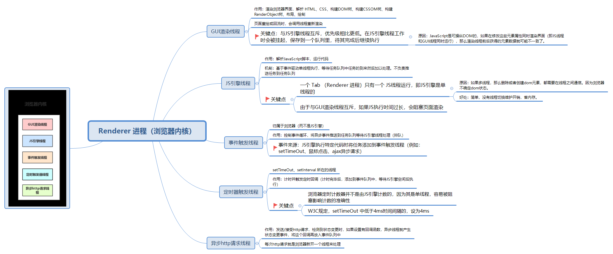
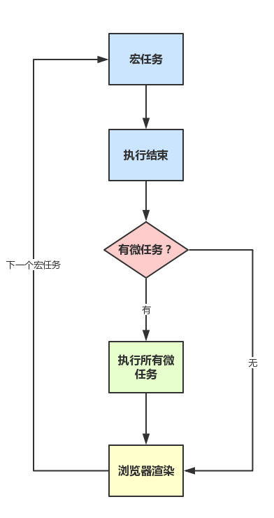
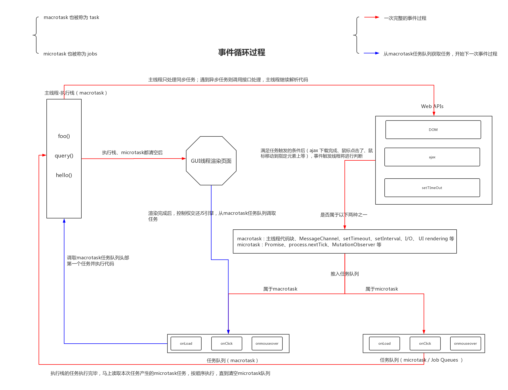
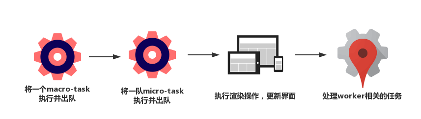

（版本：vue 3.0.0-rc.11）

## 温故
### 1.1 eventLoop

#### 1.1.1 背景
<p align="center"></p>
js是单线程的，所有任务都要排队等候处理，若有些任务非常耗时，将会一直占用着资源，而且CPU也未得到充分的利用。所以我们先将一些任务先挂起，等有返回结果再进行处理，这时候就要用到Event Loop了。

#### 1.1.2 定义

Event Loop即事件循环，是指浏览器或Node的一种解决javaScript单线程运行时不会阻塞的一种机制，也就是我们经常使用异步的原理。

<p align="center"></p>

于是，所有任务可以分成两种：
- 同步任务（synchronous），指的是，在主线程上排队执行的任务，只有前一个任务执行完毕，才能执行后一个任务
- 异步任务（asynchronous），指的是，不进入主线程、而进入“任务队列”的任务，只有“任务队列”通知主线程，某个异步任务可以执行了，该任务的返回结果才会进入主线程执行。

> 几个概念：<br />主线程main thread。 <br />执行栈call-stack：存储函数调用的栈结构，先进后出，所有的任务都会被放到调用栈等待主线程执行。<br />任务队列task queue：先进先出，能解决同步任务和异步任务的场景，当遇到异步代码时，会被挂起在任务队列中，一旦执行栈为空，就从task中拿出对应的执行。

具体来说，异步执行的运行机制如下：
1. 同步任务会按照顺序等待主线程依次执行，形成一个执行栈（execution context stack）
2. 主线程之外，会存在一个任务队列，只要异步任务有了结果，就在任务队列中放置 注册的回调函数。
3. 当主线程空闲的时候（即，执行栈中所有同步任务执行完，调用栈被清空时），就会读取任务队列。那些对应的异步任务，会结束等待状态，进行执行栈，开始执行
4. 主线程不断重复第三步。

简单版：
<p align="center"></p>

复杂版：
<p align="center"></p>


### 1.2 宏任务、微任务

异步任务分为两种类型：macroTask宏任务和microTask微任务：

- macroTask：script(主程序代码),setTimeout, setInterval, setImmediate, I/O, UI rendering
- microTask：process.nextTick(node), Promises, Object.observe, MutationObserver

执行顺序：

首先执行主线程中的同步任务，当主线程中任务执行完毕后，再从event loop中读取任务

event loop读取任务的先后顺序，取决于任务队列job queue中对于不同任务读取规则的限定

假设：macroTask队列包含任务: a1、a2、a3，microTask队列包含任务: b1、 b2 、b3

执行顺序为：首先执行marcoTask队列开头的任务，也就是 a1 任务，执行完毕后，在执行microTask队列里的所有任务，也就是依次执行b1, b2 , b3，执行完后清空microTask中的任务，接着执行marcoTask中的第二个任务a2，依次循环。

简单来说，每一个循环都是一个这样的过程：
<p align="center"></p>

真实场景下的：script(主程序代码)—>process.nextTick—>Promises…——>setTimeout——>setInterval——>setImmediate——> I/O——>UI rendering


## 知新

### 2.1 vue中的nextTick设计

vue中nextTick，官方文档的解释是：在下次DOM更新循环结束之后执行延迟回调。在修改数据之后立即使用这个方法，获取更新后的DOM。Vue 2版本它的实现原理就是：

1. 用异步队列的方式来控制DOM更新和nextTick回调先后执行
2. microTask因为其高优先级特性，能确保队列中的微任务在一次事件循环前被执行完毕
3. 因为兼容性问题，vue不得不做了microTask向macroTask的降级方案

我们在实际开发中，比如从服务端接口获取数据的时候，数据做了修改，如果我们的某些方法去依赖了数据修改后的DOM变化，我们就必须在nextTick后执行，如下：

```js
getData(res).then(()=>{  // 继清空 前面的microTask队列 之后，将挂在任务队列中的 macroTask之一ajax回调 放到执行栈，主线程继续执行这个ajax回调后的结果。若此时microTask、macroTask都已清空，UI渲染更新。即tick 1
  this.xxx = res.data
  this.$nextTick(() => {  // 此处我们是在下一个eventloop / tick 2中获取到的 变化后的dom元素了 
    // 这里我们可以获取变化后的 DOM
  })
})
```


### 2.2 vue3版本 queue相关

```typescript
export function nextTick(fn?: () => void): Promise<void> {
  const p = currentFlushPromise || resolvedPromise
  return fn ? p.then(fn) : p
}
```


1、文件中各函数的功能

| 函数名 | 功能 | 核心代码 |
| --- | --- | --- |
| queueJob | Job入队 |  |
| queueCb | cb入队 |  |
| queueFlush | flush（执行）队列 | `queueFlush(resolvedPromise.then(flushJobs))` |
| ———— | 分割线 | ———— |
| flushPreFlushCbs | flush（执行）PreFlushCbs | `activePreFlushCbs[preFlushIndex]()` |
| flushPostFlushCbs | flush（执行）PostFlushCbs | `activePostFlushCbs[postFlushIndex]()` |
| flushJobs | flush（执行）Jobs | `callWithErrorHandling(job, null, ErrorCodes.SCHEDULER)` |
| ———— | 分割线 | ———— |
| queuePreFlushCb |  |  |
| queuePostFlushCb |  |  |
| ———— | 分割线 | ———— |
| checkRecursiveUpdates | 存储cb、job在map上 |  |
| invalidateJob | invalidate queue中对应的job | `queue[i] = null` |
| callWithErrorHandling |  |  |


2、小结


- 执行顺序（按先后）：activePreFlushCbs中的cb、 queue中的job、activePostFlushCbs中的cb
- job.allowRecurse 是否允许job本身递归调用，目前只有update、watch中为true
- job、cb的执行需要根据id大小排序，父级组件的priority number比子级组件更小、更早渲染


## todo list


- queuePreFlushCb、queuePostFlushCb具体调用的场景 todo
- WatchOptions中的pre参数 -> queuePreFlushCb(job)是用于什么场景 (apiWatch.ts)


## 参考文档


- [浏览器是如何调度进程和线程的？](https://mp.weixin.qq.com/s?__biz=MzI0MzIyMDM5Ng==&mid=2649830221&idx=2&sn=80bb5cc0a17a73a2dca5f222bd1ba6ae&chksm=f175f98ec60270984f1507b5744a2302790889c5ce50dba54a98c62d4db11b1612c90e986239&mpshare=1&scene=23&srcid=101002qEoigfog338K3PNHRe&sharer_sharetime=1602305091677&sharer_shareid=240280dad34afa83333ba12be4c57ba8#rd)
- [强推：Event Loop](https://juejin.im/post/6844903764202094606)
- [全面解析Vue.nextTick实现原理](https://juejin.cn/post/6844903590293684231)
- [从promise、process.nextTick、setTimeout出发，谈谈Event Loop中的Job queue](https://blog.csdn.net/liwusen/article/details/79509288)


## 源码备份


```typescript
import { ErrorCodes, callWithErrorHandling } from './errorHandling'
import { isArray } from '@vue/shared'

export interface SchedulerJob {
  (): void
  /**
   *flushPreFlushCbs unique job id, only present on raw effects, e.g. component render effect
   */
  id?: number
  /**
   * Indicates whether the job is allowed to recursively trigger itself.
   * By default, a job cannot trigger itself because some built-in method calls,
   * e.g. Array.prototype.push actually performs reads as well (#1740) which
   * can lead to confusing infinite loops.
   * The allowed cases are component update functions and watch callbacks.
   * Component update functions may update child component props, which in turn
   * trigger flush: "pre" watch callbacks that mutates state that the parent
   * relies on (#1801). Watch callbacks doesn't track its dependencies so if it
   * triggers itself again, it's likely intentional and it is the user's
   * responsibility to perform recursive state mutation that eventually
   * stabilizes (#1727).
   */
  allowRecurse?: boolean // 是否允许job本身递归调用，目前只有update、watch中为true
}

export type SchedulerCb = Function & { id?: number }
export type SchedulerCbs = SchedulerCb | SchedulerCb[]

let isFlushing = false // 刷新中
let isFlushPending = false // 刷新挂起

const queue: (SchedulerJob | null)[] = []
let flushIndex = 0

const pendingPreFlushCbs: SchedulerCb[] = []
let activePreFlushCbs: SchedulerCb[] | null = null
let preFlushIndex = 0

const pendingPostFlushCbs: SchedulerCb[] = []
let activePostFlushCbs: SchedulerCb[] | null = null
let postFlushIndex = 0

const resolvedPromise: Promise<any> = Promise.resolve()
let currentFlushPromise: Promise<void> | null = null

let currentPreFlushParentJob: SchedulerJob | null = null

const RECURSION_LIMIT = 100
type CountMap = Map<SchedulerJob | SchedulerCb, number>

export function nextTick(fn?: () => void): Promise<void> {
  const p = currentFlushPromise || resolvedPromise
  return fn ? p.then(fn) : p
}

export function queueJob(job: SchedulerJob) {
  // the dedupe search uses the startIndex argument of Array.includes()
  // by default the search index includes the current job that is being run
  // so it cannot recursively trigger itself again.
  // if the job is a watch() callback, the search will start with a +1 index to
  // allow it recursively trigger itself - it is the user's responsibility to
  // ensure it doesn't end up in an infinite loop.

  // arr.includes(valueToFind[, fromIndex])
  if (
    (!queue.length ||
      !queue.includes(
        job,
        isFlushing && job.allowRecurse ? flushIndex + 1 : flushIndex
      )) &&
    job !== currentPreFlushParentJob
  ) {
    queue.push(job)
    queueFlush()
  }
}

function queueFlush() {
  if (!isFlushing && !isFlushPending) {
    isFlushPending = true
    currentFlushPromise = resolvedPromise.then(flushJobs)
  }
}

export function invalidateJob(job: SchedulerJob) {
  const i = queue.indexOf(job)
  if (i > -1) {
    queue[i] = null
  }
}

function queueCb(
  cb: SchedulerCbs,
  activeQueue: SchedulerCb[] | null, // 激活的
  pendingQueue: SchedulerCb[], // 等待的
  index: number
) {
  if (!isArray(cb)) {
    if (
      !activeQueue ||
      !activeQueue.includes(
        cb,
        (cb as SchedulerJob).allowRecurse ? index + 1 : index
      )
    ) {
      pendingQueue.push(cb)
    }
  } else {
    // if cb is an array, it is a component lifecycle hook which can only be
    // triggered by a job, which is already deduped in the main queue, so
    // we can skip duplicate check here to improve perf
    pendingQueue.push(...cb)
  }
  queueFlush()
}

export function queuePreFlushCb(cb: SchedulerCb) {
  queueCb(cb, activePreFlushCbs, pendingPreFlushCbs, preFlushIndex)
}

export function queuePostFlushCb(cb: SchedulerCbs) {
  queueCb(cb, activePostFlushCbs, pendingPostFlushCbs, postFlushIndex)
}

export function flushPreFlushCbs(
  seen?: CountMap,
  parentJob: SchedulerJob | null = null
) {
  if (pendingPreFlushCbs.length) {
    currentPreFlushParentJob = parentJob
    activePreFlushCbs = [...new Set(pendingPreFlushCbs)]
    pendingPreFlushCbs.length = 0
    if (__DEV__) {
      seen = seen || new Map()
    }
    for (
      preFlushIndex = 0;
      preFlushIndex < activePreFlushCbs.length;
      preFlushIndex++
    ) {
      if (__DEV__) {
        checkRecursiveUpdates(seen!, activePreFlushCbs[preFlushIndex])
      }
      activePreFlushCbs[preFlushIndex]()
    }
    activePreFlushCbs = null
    preFlushIndex = 0
    currentPreFlushParentJob = null
    // recursively flush until it drains
    flushPreFlushCbs(seen, parentJob)
  }
}

export function flushPostFlushCbs(seen?: CountMap) {
  if (pendingPostFlushCbs.length) {
    const deduped = [...new Set(pendingPostFlushCbs)]
    pendingPostFlushCbs.length = 0

    // #1947 already has active queue, nested flushPostFlushCbs call
    if (activePostFlushCbs) {
      activePostFlushCbs.push(...deduped)
      return
    }

    activePostFlushCbs = deduped
    if (__DEV__) {
      seen = seen || new Map()
    }

    activePostFlushCbs.sort((a, b) => getId(a) - getId(b))

    for (
      postFlushIndex = 0;
      postFlushIndex < activePostFlushCbs.length;
      postFlushIndex++
    ) {
      if (__DEV__) {
        checkRecursiveUpdates(seen!, activePostFlushCbs[postFlushIndex])
      }
      activePostFlushCbs[postFlushIndex]()
    }
    activePostFlushCbs = null
    postFlushIndex = 0
  }
}

const getId = (job: SchedulerJob | SchedulerCb) =>
  job.id == null ? Infinity : job.id

function flushJobs(seen?: CountMap) {
  isFlushPending = false
  isFlushing = true
  if (__DEV__) {
    seen = seen || new Map()
  }

  flushPreFlushCbs(seen)

  // Sort queue before flush.
  // This ensures that:
  // 1. Components are updated from parent to child. (because parent is always
  //    created before the child so its render effect will have smaller
  //    priority number)
  // 父级组件的priority number比子级组件更小、更早渲染
  // 2. If a component is unmounted during a parent component's update,
  //    its update can be skipped.
  // Jobs can never be null before flush starts, since they are only invalidated
  // during execution of another flushed job.
  queue.sort((a, b) => getId(a!) - getId(b!))

  try {
    for (flushIndex = 0; flushIndex < queue.length; flushIndex++) {
      const job = queue[flushIndex]
      if (job) {
        if (__DEV__) {
          checkRecursiveUpdates(seen!, job)
        }
        callWithErrorHandling(job, null, ErrorCodes.SCHEDULER)
      }
    }
  } finally {
    flushIndex = 0
    queue.length = 0

    flushPostFlushCbs(seen)

    isFlushing = false
    currentFlushPromise = null
    // some postFlushCb queued jobs!
    // keep flushing until it drains.
    if (queue.length || pendingPostFlushCbs.length) {
      flushJobs(seen)
    }
  }
}

function checkRecursiveUpdates(seen: CountMap, fn: SchedulerJob | SchedulerCb) {
  if (!seen.has(fn)) {
    seen.set(fn, 1)
  } else {
    const count = seen.get(fn)!
    if (count > RECURSION_LIMIT) {
      throw new Error(
        `Maximum recursive updates exceeded. ` +
          `This means you have a reactive effect that is mutating its own ` +
          `dependencies and thus recursively triggering itself. Possible sources ` +
          `include component template, render function, updated hook or ` +
          `watcher source function.`
      )
    } else {
      seen.set(fn, count + 1)
    }
  }
}
```

