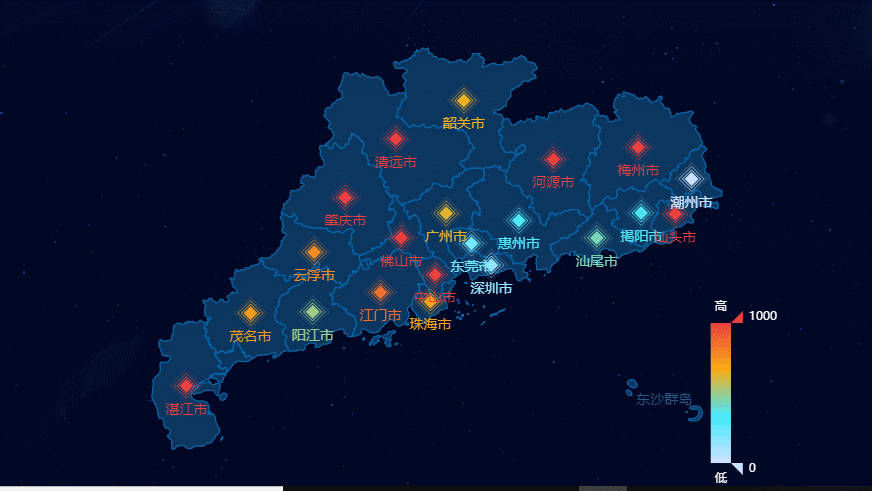
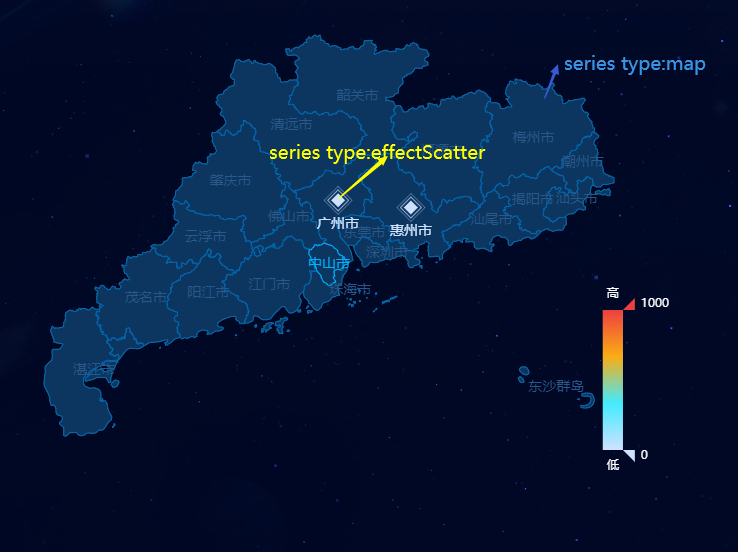
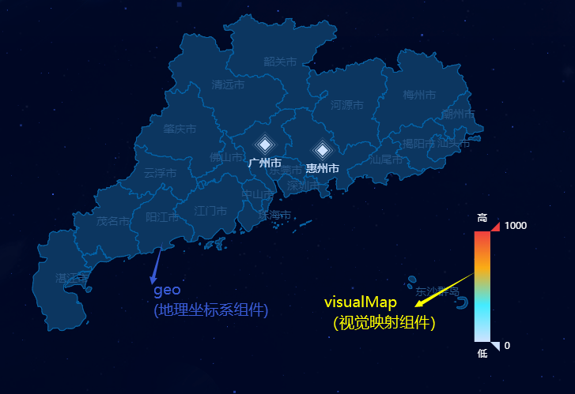

## 需求

- 地图可下钻，省->市->区县
- 有数据的地区上，有菱形图标

<p align="center"></p>

## 绘制过程

###  1.通过高德api，获取地图的geo数据

- [使用高德平台web端jsapi](https://lbs.amap.com/api/javascript-api/guide/abc/prepare)
- 在html中加载js文件

```html
<script type="text/javascript" src="https://webapi.amap.com/maps?v=1.4.11&key=你的key值&plugin=AMap.DistrictSearch"></script>
```

- [获取行政区划浏览数据，即绘制地图所需的geojson](https://lbs.amap.com/api/javascript-api/reference-amap-ui/geo/district-explorer)

```js
methods: {
  loadMapData (areaCode) {
    return new Promise((resolve, reject) => {
      AMapUI.loadUI(['geo/DistrictExplorer'], DistrictExplorer => {
        const districtExplorer = window.districtExplorer = new DistrictExplorer({
          eventSupport: true
        })
        districtExplorer.loadAreaNode(areaCode, (error, areaNode) => {
          if (error) {
            console.error(error)
            reject()
          }
          resolve(areaNode.getSubFeatures())
        })
      })
    })
  }
}
```

### 2.使用百度echarts绘制地图，实现可下钻、可返回上一级功能

<p align="center"></p>
<p align="center"></p>

- echarts options

```js
options = {
  geo: { // 地理坐标系组件，支持在地理坐标系上绘制散点图、线集等
    map: '440000'
  },
  series: [ // 系列列表——每个系列通过type决定自己的图表类型，包含的要素至少有：一组数值、图表类型、以及其他的关于这些数据如何映射成图的参数
    {
      type: 'map',
      map: '440000', // 对应的地图名称，此处我使用该地区的行政编码，例如440000（广东省）
      roam: false, // 是否开启鼠标缩放和平移漫游
      geoIndex: 0,
      // 默认情况下，map series会自己生成内部专用的geo组件，但是也可以用这个geoIndex指定一个geo组件。
      // 这样的话，map和其他series（例如散点图）就可以共享一个geo组件了；而且，geo组件的颜色也可以被这个map series控制，从而用visualMap来更改。
      // geo中样式配置itemStyle等相应属性优先级高于series-map中的
      data: [{ // 地图系列中的数据内容数组。
        value: [x, y, value] 
        // 针对原型需求data为剩下“市”数组，其中每个item{value:[该市地图图形的中心x坐标,该市地图图形的中心x坐标,值例如"案件量"] }
        // 此处有x，y坐标可方便后面绘制散点图series-effectScatter——为symbol定义职位
        // 此处的x,y坐标可见getDistributeCenter函数
      }]      
    }
  ]
}

/**
 * 场景，在广东省的geojson中，获取广州市地区几何形的中心坐标
 * @param areaCode - 例如广州市的行政编码 440100
 * @param level - 例如，广州市属于市级 city
 */
methods: {
  getDistributeCenter (areaCode, level) {
    const info = this.mapJson.features.find(item => String(item.properties.adcode) === String(areaCode))
    if (info) {
      return level === 'country' ? info.properties['cp'] : (info.properties['centroid'] || info.properties['center'])
    }
    return null
  },
}
```

- 绘制地图，实现可下钻

```js
/**
 * drawMap
 * @param mapName - 地图名称，在 geo 组件或者 map 图表类型中设置的 map 对应的就是该值
 * @param geoJson - GeoJson 格式的数据,来源loadMapData
 */
methods: {
  drawMap () {
    echarts.registerMap(mapName, geoJson)
    this.chart = echarts.init(dom)
    this.chart.setOption(options)
  }
}

// 地图下钻
this.chart.on('click', params => {
  // 从params中获取点击的该地区信息，比如行政编码
  // 执行drawMap
})

/**
 * 返回上一级
 * 定义一个全局变量，在下钻和返回上一级的交互操作中，都存储当前地区的父级信息(地区级别、名称、行政编码等)
 * 点击"返回上一级"按钮，重新绘制地图drawMap
 **/
```

### 3. 绘制散点图

- echarts options

```js
options = {
  series: [
    {
      type: 'map',
      ...
    },
    {
      type: 'effectScatter', // 带有涟漪特效动画的散点（气泡）图
      coordinateSystem: 'geo', // 该系列使用的坐标系
      geoIndex: 0,
      symbol: 'diamond', // 标记的图形
      data: [] // 同series-map中的数据
    }
  ],
  ...
}
```

### 4. 绘制路径图

- echarts options

```js
options = {
  series: [
    {
      type: 'map',
      ...
    },
    {
      type: 'lines', // 路劲图，用于带有起点和终点信息的线数据的绘制，主要用于地图上的航线、线图的可视化
      coordinateSystem: 'geo',
      geoIndex: 0,
      zlevel: 2,
      // 用于canvas分层，不同zlevel值的图形会放置在不同的canvas中
      // canvas分层是一种常见的优化手段，我们可以把一些图形变化频繁的组件单独设置成一个单独的zlevel
      // 需要注意的是过多的canvas会引起内存开销的增大，在手机端上需要谨慎使用以防奔溃
      // zlevel大的canvas会放在zlevel小的canvas的上面
      data: [ // 线数据集
        {
          coords: [
            [120, 66], // 起点
            [122, 67]  // 终点
            ...        // 如果 polyline 为 true 还可以设置更多的点
          ],
        }
      ]
    }
  ],
  ...
}
```

- 在地图的下钻交互中，发现了一[bug](https://github.com/apache/incubator-echarts/issues/10828)，无法清除上一级的路径图


```js
/**
 * 手动处理路径图的隐藏显示
 * 处理echarts的bug，无法清除路径图
 * 暂时如此解决，隐藏掉它
 * 猜测data-zr-dom-id是固定的，跟series中的zlevel: 2相关
 */
const linesCanvas = document.querySelector('canvas[data-zr-dom-id=zr_2]')
linesCanvas.style.display = 'none'
```

### 5. 视觉映射过滤

- echarts options

```js
options = {
  visualMap: { // 视觉映射组件，即，将数据映射到视觉元素
    type: 'continuous', // 连续型
    seriesIndex: [], // 指定取哪个系列的数据
  }
  ...
}
```
