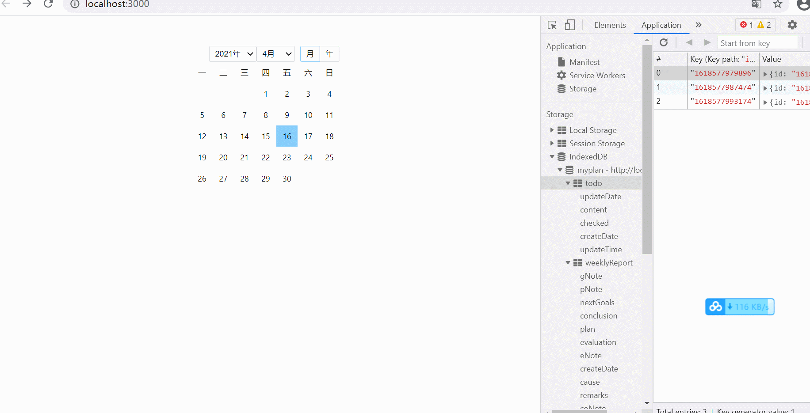

一个关于个人计划、记事、复盘的网页端程序（[my-plan github](https://github.com/xsometimes/my-plan)）。
<p align="center"></p>

## 功能设计
- 日历表
  - ~~月视图~~
  - todo???：年视图
- ~~日todolist~~
- ~~周报复盘~~
- todo???：月总结（A本月最关键的事B学习计划C旅行计划D健康剑圣计划E理财计划）
- todo???：任务进度记录

## 技术选型
在create-react-app单页面的基础上，选择了：
- react hooks实践；
- 事件处理：用发布订阅模式event bus（eventEmitter）代替 props传给子组件的回调；
- 数据存储：context+indexedDB结合，将数据储存在浏览器端；
- 主要组件：
  - editGrid：div[contentEditable=true]代替传统的input、textarea


## 开发问题记录
1. eventEmitter的缺陷：

可能存在多个组件正在监听`Bus.on`同个事件，如在父组件中监听到列表中每个子组件的事件，这时候需要判断具体是哪个子组件，可通过id鉴别。

对eventBus的选择，我是受到之前项目采用责任链设计模式的偏好影响，加之本项目比较简单。

2. 使用`div[contentEditable=true]`的注意事项：光标容易错位。

针对这个问题，应该避免减少组件的re-render。

在本项目中，editGrid同时支持edit和view的功能，没有将这两者分页面处理，所以我只赋予div初始值（即，非受控组件），将用户每次输入改变的值emit到父组件中，`useRef`保存，这样就不会触发re-render了。

```ts
// 父组件TodoItem
const Bus = React.bus

const TodoItem = React.memo((props: TodoEntity) => {

  const { id, content, checked: initialChecked } = props;

  const todoRef = useRef(props)

  useEffect(() => {
    const handleValueChange = payload => {
      const { value, editId } = payload
      if (editId === id) {
        // doSth()
        todoRef.current = {
          ...todoRef.current,
          content: value,
          id
        }
        Bus.emit(EventType.TODO_ITEM_CHANGE, todoRef.current)
      }
    }

    Bus.on(EventType.GRID_VALUE_CHANGE, handleValueChange)

    return () => {
      Bus.off(EventType.GRID_VALUE_CHANGE, handleValueChange)
    }
  })

  return <div className="todo-item">
    <EditGrid initialVal={content} editId={id} />
  </div>
})

export default TodoItem;
```

```ts
// 子组件EditGrid
const Bus = React.bus

const EditGrid: React.FC<GridProps> = props => {
  let { initialVal='', isLocked=false, editId='' } = props;

  const handleInput = useCallback<React.ChangeEventHandler<HTMLInputElement>>(e => {
    Bus.emit(EventType.GRID_VALUE_CHANGE, {
      value: e.target.innerText,
      editId
    })
  }, [editId])
  
  return <div
    className="grid"
    contentEditable={!isLocked}
    dangerouslySetInnerHTML={{__html: initialVal}}
    onInput={handleInput}></div>
}

export default EditGrid;
```

3. indexedDB版本不会自动更新问题：采取localStorage、或者objectStore存储version，当有新增objectStore时，version+=1

```ts
/**
 * 获取并自动更新数据库版本
 * @param storeNames 
 * @returns 
 */
function getVersion (storeNames: string[]): number {
  let v = 1;
  const s = storage.get(DB_VERSION);
  if (s) {
    const o: StorageDBVersion = JSON.parse(s)
    v = o.lastestVersion;
    const relationShip = getRelationShipBetweenArr(storeNames, o.storeNames)
    if (relationShip < 2) { // 有新store
      v += 1;
    }
    storage.set(DB_VERSION, JSON.stringify({
      lastestVersion: v,
      storeNames: Array.from(new Set([...o.storeNames, ...storeNames]))
    }))
    return v
  }
  storage.set(DB_VERSION, JSON.stringify({
    lastestVersion: v,
    storeNames
  }))
  return v
}

/**
 * 获取俩数组的关系
 * @param arr1 
 * @param arr2 
 * @returns - type: 0无关系、1交叉、2子集、3俩数组相等 
 */
export function getRelationShipBetweenArr (arr1: any[], arr2: any[]): number {
  let type = 0; // 无关系
  const newArr1 = dedupe(arr1);
  const newArr2 = dedupe(arr2);
  const unionArr = Array.from(new Set([...newArr1, ...newArr2]));
  const len1 = newArr1.length;
  const len2 = newArr2.length;
  const uLen = unionArr.length;
  if (len1 + len2 > uLen) {
    type = 1; // 交叉
    const maxLen = Math.max(len1, len2)
    if (maxLen === uLen) {
      type = 2; // 其中一个数组是另一个数组的子集
      if (len1 === len2) {
        type = 3; // 俩数组相等
      }
    }
  }
  return type;
}

/**
 * 去除数组中重复元素
 * @param arr 
 * @returns 
 */
export function dedupe<T>(arr: T[]) {
  return Array.from(new Set(arr));
}
```
