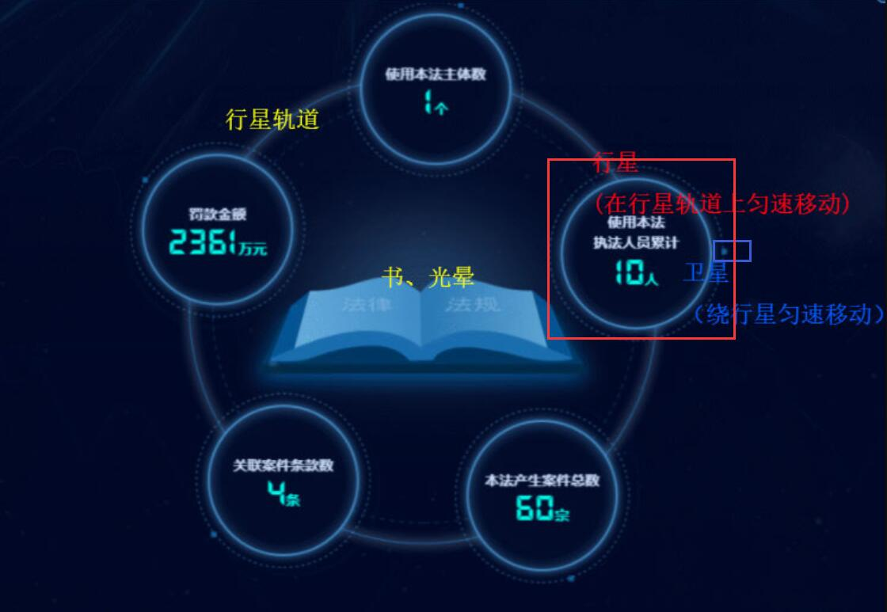
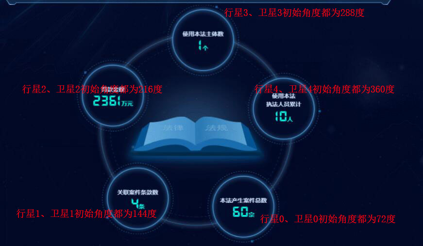

## 需求

<p align="center"></p>

之前实现了一个需求如上图，为方便描述，我们把它看成是一个星体运动模型：
- 画面中正中央的书、光晕为恒星（静止不动）；
- 最外围为行星运动轨道，上面有5个行星（红色圈出的圆）绕着“恒星”顺时针做匀速圆周运动；
- 每个行星上分别有一个卫星（蓝色圈出的很小很小的圆），绕着“行星”圆心顺时针做匀速圆周运动。

## 原代码实现思路

1. 通过window.requestAnimationFrame不断更新每一帧画面。

```js

methods: {
  loop () {
    this.update()
    this.animationFrameId = window.requestAnimationFrame(() => {
      this.loop()
    })
  },
  // 在每一帧中
  update () {
    this.clearFrame() // 擦除画面
    this.drawSunTrack() // 绘制静态的书、光晕和行星轨道（最大圆）
    for (let i = 0; i < this.planetList.length; i++) { // 改变5行星、5卫星的位置并绘制出来
      this.planetList[i].move()
      this.satelliteList[i].move(this.planetList[i].pos)
    }
  },
}
```

2. 用面向对象的思路实现各星球：

首先，创建一个公共的类BaseBody，

```js
// 一度数
const ONE_DEGREE = Math.PI / 180

export default class BaseBody {
  constructor (opt) {
    const { ctx, radius, pos, angle } = opt
    this.pos = Object.create(pos)
    opt.speed && (this.speed = opt.speed)
    this.opt = Object.create(opt)
    this.ctx = ctx
    // 当前圆心角、当前坐标系方向
    this.curAngle = angle || 0
    this.dir = { x: 1, y: 1 }
    // text sprite
    this.textSprite = TextSprite.getInstance()
  }
  /**
   * 绘制
   */
  paint () {}
  /**
   * 向下一个点移动
   * @param {Object} point - 下一个点
   */
  moveToPoint (point) {
    this.pos = point
  }
  /**
   * 做圆周运动，计算圆周运动上的每个点的位置
   * 圆周运动0度从x轴右向开始，顺时针旋转
   * @param Object trackCenterPoint 轨道圆心
   * @param Number trackRadius 轨道半径
   */
  doCircularMotion (trackCenterPoint, trackRadius) {
    this.curAngle += this.speed
    if (this.curAngle >= 360) {
      this.curAngle = 0
    }
    this.moveToPoint({
      x: trackCenterPoint.x + Math.cos(this.curAngle * ONE_DEGREE) * trackRadius,
      y: trackCenterPoint.y + Math.sin(this.curAngle * ONE_DEGREE) * trackRadius
    })
  }
}
```

其次，分别构建行星、卫星的类，继承BaseBody类。此处仅展示行星：

```js
export default class Planet extends BaseBody {
  move () {
    const { trackCenterPoint, trackRadius } = this.opt
    this.paint()
    this.doCircularMotion(trackCenterPoint, trackRadius)
  }
  paint () {
    // 具体绘制
  }
}
```

此外，别忘了构建一个TextSprite类，用于绘制文字，详细可参考[文章总结](/pages/1cfbaa/)

最后，想记录一个发现，当巧妙设置行星、卫星所在圆周的角度（此处可根据角度结合三角函数计算行星位置）后，一旦运动起来，会有很奇妙的效果：5个卫星聚拢到一起又散开。初始角度如下图：

<p align="center"></p>

（arc的StartAngle和EndAngle以弧度定义弧的起点和终点。起始和闭合角度是从水平方向x轴测量的）

## 优化思考

### 3.1 Canvas分层

有两个canvas，其中，
- 底层为静态的翻书背景+白色光晕+轨道（最大圆），z-index为1；
- 上层为10个旋转做动画的圆，z-index为2，每一帧擦除并绘制只针对上层。

### 3.2 离屏Canvas

只缓存一个小卫星，后通过克隆5个小卫星并transform定位、运动

### 3.3 工厂模式


工厂模式可以让构造函数和创建者分离，符合开放封闭原则。其适用场景：创建过程涉及到
- 对象缓存、对象共享或复用，
- 复杂逻辑或应用需要维护对象和类型，
- 对象需要和不同的资源设备打交道


具体的介绍可以参见[JavaScript设计模式与实践--工厂模式](https://juejin.cn/post/6844903653774458888)。此处，行星planet、卫星satellite有很多相似处，它们有相同的属性、行为，只不过“长相”不太一致。我们采用简单工厂模式：

```js
class Star {
  constructor(opt) {
    for (attr in opt) {
      this[attr] = opt[attr];
    }
    this.paint(this.type);
  }

  static getInstance({type, startAngle = 0}) {
    switch (type) {
      case 'planet':
        return new Star({ radius: 10, speend: 2, startAngle,  type });
      case 'satelite':
        return new Star({ radius: 2, speend: 1, startAngle,  type });
      default:
        throw new Error(`${type} doesnot exist.`)
    }
  }

  // 根据星星类型绘制
  private paint (type) {}

  // 星星移动
  public move () {}
}


// 创建行星、卫星实例
const planet = Star.getInstance({ type: 'planet'});
const satelite = Star.getInstance({type: 'satelite'});

```
